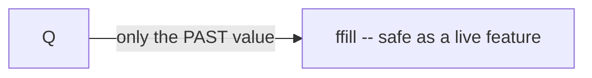
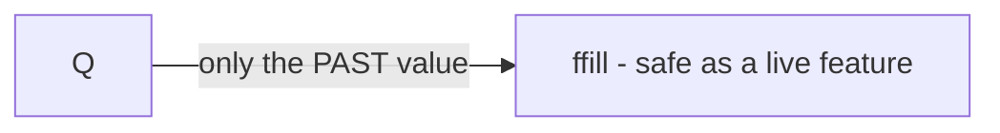

# Agent Guidelines

Rules and patterns for AI coding agents working in this repository.

---

## Brand colors

Dataslope's brand color palette. Use the primary colors as the default palette
for UI, illustrations, charts, and diagrams. Reach for the accent colors only
sparingly, to highlight or differentiate.

### Primary colors

| Color  | Hex       |
| ------ | --------- |
| Blue   | `#148CFF` |
| Green  | `#20C621` |
| Red    | `#FF4F59` |
| Yellow | `#FFDD6C` |

### Accent colors (use sparingly)

| Color  | Hex       |
| ------ | --------- |
| Teal   | `#00AEAA` |
| Purple | `#AB77FA` |
| Orange | `#E47600` |

### Tonal shades (100–900)

Each hue has a full tonal ramp exposed as CSS variables in `app/brand.css`
(`--ds-<hue>-<step>`) and previewable at `/dashboard/admin/color-palette`.
**Prefer the `500` shade** (the primary/base color); the other steps exist for
when a lighter or darker tone is required (backgrounds, borders, hover states,
AA-legible text on white, and telling chart/diagram series apart). `500` = the
brand color; the `ink` text anchors that clear WCAG AA body text on white are noted per hue.

**Primary hues**

| Step    | Blue        | Green       | Red         | Yellow      |
| ------- | ----------- | ----------- | ----------- | ----------- |
| 100     | `#D1E6FF`   | `#D4F3D1`   | `#FFDCDA`   | `#FDF5D9`   |
| 200     | `#AED3FF`   | `#B4EAAF`   | `#FFC2BF`   | `#FEF0C3`   |
| 300     | `#8ABFFF`   | `#93E08E`   | `#FFA6A3`   | `#FEEBAC`   |
| 400     | `#5BA7FF`   | `#66D361`   | `#FF807F`   | `#FFE48E`   |
| **500** | **`#148CFF`** | **`#20C621`** | **`#FF4F59`** | **`#FFDD6C`** |
| 600     | `#0878DD`   | `#0AA80F`   | `#DC3F49`   | `#D4B651`   |
| 700     | `#0064BD` ⬅ | `#008B03`   | `#BA303A` ⬅ | `#AB9137`   |
| 800     | `#00519C`   | `#006F01` ⬅ | `#99212C`   | `#836D1C` ⬅ |
| 900     | `#00407F`   | `#005600`   | `#7C141F`   | `#624F00`   |

⬅ = the `ink` shade for that hue (AA body text on white): Blue `700`,
Green `800`, Red `700`, Yellow/Amber `800`.

> Blue also has 50-unit half-steps (`--ds-blue-550/650/750/850/950`) plus a
> `950` extension, for cases (e.g. Mermaid mindmaps) that need several distinct
> white-text-legible blues.

**Accent hues (non-semantic; use sparingly)**

| Step    | Teal        | Purple      | Orange      |
| ------- | ----------- | ----------- | ----------- |
| 100     | `#CFEDEB`   | `#EAE0FD`   | `#FAE0D0`   |
| 200     | `#AAE0DD`   | `#DBCAFC`   | `#F6CAAD`   |
| 300     | `#80D3CF`   | `#CCB3FB`   | `#F1B288`   |
| 400     | `#3BC4BF`   | `#BB96FA`   | `#EB9558`   |
| **500** | **`#00AEAA`** | **`#AB77FA`** | **`#E47600`** |
| 600     | `#009491`   | `#9263D7`   | `#C36400`   |
| 700     | `#007B79` ⬅ | `#7A51B6` ⬅ | `#A35200` ⬅ |
| 800     | `#006361`   | `#634094`   | `#844200`   |
| 900     | `#004E4C`   | `#4E3177`   | `#693300`   |

⬅ = the `ink` shade (AA body text on white) for each accent hue: `700`.

Each hue also has a `50` step (lightest tint) in `brand.css` if an even lighter
background is needed. In code, reference these via the CSS variables
(`var(--ds-blue-500)`) rather than hard-coding hex values.

---

## Illustrations

How course and interview illustrations get made. Both API keys
(`OPENAI_API_KEY`, `KIE_API_KEY`) are already present as environment variables
in Claude Code sessions; do not ask for them and never write them into a file.

### The pipeline

> **Runbook:** `agent-outputs/20260730-1200-illustration-pipeline-handoff.md` is the
> operational companion to this section — measured costs, every gotcha that has cost
> real time, prompt-writing guidance, the course id-prefix registry, and copy-paste
> audits. Read it before a large run.

Five steps, four scripts. Candidates live in R2 until someone picks the
keepers; only the keepers reach git.

1. **Author** the prompt in `data/illustration-prompts.json` (one source of
   truth: the `/dashboard/admin/illustration-prompts` gallery, the in-lesson
   `<Figure>`, and every script read it). `lesson` must equal the MDX file stem.
2. **Generate** — `scripts/generate-illustrations.mjs`, OpenAI `gpt-image-2`,
   **quality `low`**, **size `1536x1024`**, always via the **Batch API**.
3. **Remove the background** — `scripts/remove-background-kie.mjs`, Recraft
   `remove-background` through Kie AI. Writes a `-cutout` beside each original.
   **Never skip this on a regeneration:** pages reference the `-cutout` slug, and
   promotion silently promotes only the original if no cut-out exists, leaving the
   page serving the old image.
4. **Promote** — `scripts/promote-illustrations.mjs` encodes the chosen
   candidates to WebP straight into `public/images/`, the files the site
   serves, and runs `build-images` to record their dimensions. **An id with a
   cut-out promotes the cut-out and nothing else.** Every surface asks for the
   `-cutout` slug, so the opaque `<id>.webp` beside it renders nowhere and is
   ~0.22 MB of git each; two promotions made before that was the default left
   1,351 of them, 151 MB, and `build-images` now warns if any come back. Pass
   `--with-original` only for art genuinely shown with its background, and
   check something asks for the bare slug first.
5. **Wire** — `scripts/wire-course-figures.mjs` places one `<Figure>` per page
   across a course, clears retired slugs, and is idempotent. Always `--dry-run`
   first. Pass `--collection interview` for an interview-prep track, which pairs
   pages with `interview-thumbnail` / `interview-illustration` prompts under
   `content/interview` instead of the `course-*` pair under `content/courses`.

```bash
# Bulk run: candidates land in R2 under one run id, promote only the keepers.
# Use submit/status/download, not `run` — a long batch can outlive the process.
node scripts/generate-illustrations.mjs dry-run --only "$IDS"   # cost, no API calls
node scripts/generate-illustrations.mjs submit  --only "$IDS" --sink r2 --run 2026-08-foo
node scripts/generate-illustrations.mjs status
node scripts/generate-illustrations.mjs download --sink r2 --run 2026-08-foo
node scripts/remove-background-kie.mjs --from r2 --run 2026-08-foo --concurrency 8
node scripts/promote-illustrations.mjs --all --from r2 --run 2026-08-foo
node scripts/wire-course-figures.mjs <course-dir> --dry-run && \
  node scripts/wire-course-figures.mjs <course-dir>
# …or, for an interview-prep track:
node scripts/wire-course-figures.mjs --collection interview <role-dir> --dry-run

# Local run: everything on disk, nothing touches R2. Fine for one or two images.
node scripts/generate-illustrations.mjs run
node scripts/remove-background-kie.mjs                 # adds <id>-cutout.png
node scripts/promote-illustrations.mjs python-basics-loops python-basics-sets
```

### Trimming the blank margins around the artwork

Background removal leaves the subject floating in the frame it was generated
in, so a promoted cut-out is 1536x1024 of *layout* carrying rather less than
that of drawing. `<Figure>` renders at the full content width with `height:
auto`, so every transparent row is vertical space a lesson pays for and nobody
sees — a median 11% of each image's height across the promoted set, over 30% on
41 of them.

**Promotion does this for you.** `promote-illustrations.mjs` crops every
cut-out before its single encode, which is what makes it free: the crop costs
no quality, where a pass over the promoted WebP afterwards would be a second
lossy generation. Nothing to remember and nothing to run — promote as usual and
the art arrives tight.

**How much of the frame goes depends on where the image is painted**, and
`trimAxesFor` in `scripts/lib/cutouts.mjs` is the single place that decides:

- **In-lesson figures are vertical only.** The left/right margins are
  deliberately kept: horizontal blank costs nothing in a page that scrolls, and
  cropping it would leave each figure a different width, so a run of lessons
  would stop sharing an edge.
- **Thumbnails lose all four margins.** A `course-thumbnail` or
  `interview-thumbnail` is painted ~100px wide inside a fixed box, and there the
  same reasoning runs the other way: a blank column is drawing surface the
  subject does not get, at exactly the size where it can least afford to be
  small. Nothing shares an edge with a thumbnail — each sits alone in its own
  box — so the ragged widths that rule out cropping a figure cost nothing.
  Across the 38 promoted thumbnails this took a further 10.8% of the layout box,
  over 30% on six of them, at flat bytes.

The category comes from `data/illustration-prompts.json`, so a **new course or
interview-prep thumbnail is trimmed on both axes automatically** — declaring the
prompt is the whole of it. (An id the corpus has never seen falls back to the
`-thumbnail` naming convention the corpus itself follows;
`__tests__/trimCutouts.test.ts` pins the two in agreement.)

`scripts/trim-cutouts.mjs` is the backfill that trimmed the 845 images promoted
before that existed, and re-trimmed the thumbnails when they moved to both axes.
It is still the tool for re-trimming at different settings (`--pad`, `--alpha`,
`--axes`), and the two share their geometry through `scripts/lib/cutouts.mjs`,
so they cannot drift — a re-promote and a re-trim of the same art produce
byte-identical files.

```bash
node scripts/trim-cutouts.mjs --prefix python-basics- --dry-run
node scripts/trim-cutouts.mjs --all
# --axes overrides the per-id default, for a one-off experiment:
node scripts/trim-cutouts.mjs python-basics-thumbnail --axes vertical --dry-run
```

It re-crops the **pristine `cutout.png` in R2**, so a trimmed image is still a
single lossy generation from the original rather than a second pass over the
served WebP. A prompt id usually exists in several runs (a redraw writes a new
run prefix and leaves the old one), so the right PNG is found by matching pixels
against the file the site currently serves: the true source scores ~44 dB and
every other run of the same id 6-11 dB. When no candidate matches — the run has
aged out of the bucket — it falls back to re-encoding the served WebP, measured
at 41-49 dB premultiplied PSNR, which is visually lossless but not free. **The
script only reads from R2**; it never puts and never deletes.

It is idempotent (an already-tight image is skipped, not re-encoded) and runs
`build-images` afterwards, which is what updates the manifest's `width`/`height`
so `<Figure>` keeps reserving the right box.

Re-trimming an image also invalidates its `servedSha` in
`data/illustration-sources.json`, and `prune-illustration-candidates.mjs`
refuses to delete anything against a map that no longer matches the files on
disk. Follow a sweep with the ids it touched:

```bash
node scripts/build-illustration-sources.mjs --only id-one,id-two
```

Trimming changes an image's aspect ratio, which every consumer that sizes a
cut-out by width (`<Figure>`, the course-card thumbnails) or letterboxes it
(`object-contain`: the auth-globe pins, the pricing icons, the
`InterviewCatalog` banners) absorbs for free. One does not, and wants checking
before a sweep reaches its slugs: `StatsBento` sizes the four `home-icon-*`
cut-outs `h-40 w-40` with no `object-fit`.

### Reviewing, and the regeneration queue

`/dashboard/admin/illustration-prompts` is the review surface and is
**admin-only**: the page is a static shell that fetches everything from `GET
/api/admin/illustration-prompts` behind `requireAdmin`, so a non-admin gets an
access-denied notice rather than the prompt corpus. Its sidebar entry is
reachable without a session on purpose; following it just shows the notice.

It renders a grid of the **background-removed WebP only** (the file the site
serves), each over the live page background so the theme pill is the judgement
tool, and a click opens the raw image in a new tab. Every card can be marked
"redraw this" with a one-line note, stored in D1 database
`dataslope-illustrations`, table `illustration_regen_marks` (binding
`ILLUSTRATIONS_DB`, schema in `migrations/illustrations/`). Typing in the note
marks the illustration by itself; marking with the note blank stores
`DEFAULT_REGEN_NOTE` ("redraw this from scratch as a solid 3D isometric scene
built from a few large objects, dropping the decorative dots…"), which is the
usual reason to redraw. It says "simplify by removing decoration, not by
flattening it" because the previous wording ("fewer, larger shapes") was read as
*flatten*, and the redraws it produced traded the isometric house style for flat
slabs and discs.

A card moves through three states: normal, red once queued, then **green with an
Approve button** once redrawn and not yet signed off. Approve is the human's
half of the loop and returns the card to normal.

> **Regenerating what is marked:**
> `agent-outputs/20260803-0900-illustration-regeneration-queue.md` is the
> runbook. Short version: read `WHERE marked = 1`, then for each id **read the
> note first and write that prompt's `subject` again from scratch** — the note
> is the brief for a new illustration, not a suffix on the built prompt and not
> an edit to the old subject (trimming clauses off the old one just brings the
> failed composition back). Carry over any creature the old subject had (marmot,
> elephant, panda, penguin, duck) and the idea the lesson needs; invent the rest.
> Then generate → remove background → promote as usual, and set `marked = 0` and
> stamp `regenerated_at` for exactly the ids you redrew, so they come back for
> approval. Never stamp `approved_at` yourself.

All four API keys are already environment variables in Claude Code sessions:
`OPENAI_API_KEY` and `KIE_API_KEY`. The R2 variables
(`R2_ACCOUNT_ID`, `R2_ACCESS_KEY_ID`, `R2_SECRET_ACCESS_KEY`,
`R2_BUCKET=dataslope-illustrations`) are only needed for `--sink r2` /
`--from r2`; without them, stick to the disk flow, which is fully functional.

### Illustrations are encoded once, into `public/images/`

`promote-illustrations.mjs` writes `public/images/<id>-cutout.webp` at quality
92 and that file **is** what browsers download. Do not commit PNG sources, and do not
put a copy under `assets/images/`: that directory is reserved for raster that
does *not* come from this pipeline (a photo, a screenshot, a scanned diagram),
which `build-images` re-encodes into a `.webp` plus a `.png`/`.jpg` fallback.
It currently holds no sources at all — every served image comes from the
pipeline.

Two reasons promotion skips `assets/images/`:

- **Quality.** Routing an illustration through both encoders is a double lossy
  pass. Measured: promote-q92 → build-q80 lands at **35.58 dB PSNR** against the
  PNG original, while a single q80 encode of the same image is **37.41 dB**. The
  second pass cost ~1.8 dB to save ~3 kB.
- **Size.** A source in `assets/` plus its two build outputs in `public/` means
  every illustration is in git roughly three times.

Illustrations therefore carry `formats: ["webp"]` in the manifest, so `<Figure>`
renders a bare `` — no `<source>`, no fallback file. WebP has been
universally supported since 2020. Every entry in the manifest is single-format
today; the two-format path only comes back if someone adds a raster source under
`assets/images/`. Measured on the Python Basics batch, a 1536x1024 illustration
is ~1.4 MB as PNG and ~130 kB as WebP.

Pristine PNGs stay in R2 for the retention window, so a run can be re-promoted
at a different quality without regenerating. Bump `ENCODER_VERSION` in
`build-images.mjs` when encoder settings change; it invalidates every cached
hash and forces a one-time re-encode.

**Never leave both `<id>.png` and `<id>.webp` in `assets/images/`** — they
slugify to the same manifest key and collide.

### R2 (candidate storage)

Bucket `dataslope-illustrations`, keys
`illustrations/<runId>/<promptId>/v<n>/{original,cutout}.png`. Run-scoped so a
whole run is one prefix delete, and so a lifecycle rule can expire candidates
without bookkeeping. Candidates stay PNG in R2 (pristine, re-processable);
only the promoted copy is WebP.

There is no D1 table and no Worker binding for this bucket by design: the
scripts are authoring tools that talk to the S3 API directly (SigV4 in
`scripts/lib/r2.mjs`, no AWS SDK), so content authoring stays decoupled from
deploying the app.

Candidates expire after **14 days**, applied by
`.github/workflows/r2-illustrations-lifecycle.yml` (run it via
workflow_dispatch, or it re-applies on push when the retention window is
edited). Cloudflare does the deleting server-side, so nothing polls. That is
the review window: generate, review in
`/dashboard/admin/illustration-prompts`, promote the keepers inside a
fortnight. Promotion writes its own encoded copy into
`public/images/`, so an expired candidate that was already promoted still
serves fine — what you lose is the pristine PNG, and with it the ability to
re-promote at a different quality without paying to regenerate.

**The rule is not applied until this workflow runs successfully at least
once.** Its first run (on #612 landing) failed: `AccessDenied` on
`PutBucketLifecycleConfiguration`. Nothing has expired yet and the bucket
still keeps every run.

**That failure is a token-tier problem, not a bug in the rule.** A lifecycle
rule is bucket *configuration*, and R2 lets only an **Admin Read & Write** API
token edit that; the **Object Read & Write** token the rest of the pipeline
shares can list, read and write objects — `head-bucket` even succeeds with it,
so the job looks healthy right up to the write — and is denied on the
configuration. See the [R2 token
permissions](https://developers.cloudflare.com/r2/api/tokens/#permissions)
table.

So this one workflow reads the repository secrets `R2_ADMIN_ACCESS_KEY_ID` /
`R2_ADMIN_SECRET_ACCESS_KEY`, holding the account's Admin Read & Write token.
**R2 admin tokens are account-wide** — they cannot be scoped to one bucket —
so they stay confined to this workflow. `r2-cache-cleanup.yml` keeps its own
object-scoped pair, `R2_INC_CACHE_ACCESS_KEY_ID` /
`R2_INC_CACHE_SECRET_ACCESS_KEY` (renamed 2026-07-30 from `R2_ACCESS_KEY_ID` /
`R2_SECRET_ACCESS_KEY` once a second credential made "the" R2 secrets
ambiguous). That job deletes objects unattended every six hours and has once
deleted more than intended; handing it bucket-delete rights over
`dataslope-workspaces` — live user work, bound to the app Worker — buys
nothing.

Two R2 credentials, then, and the names now say which is which:

| Where | Secret | Tier | Reaches |
| --- | --- | --- | --- |
| `r2-illustrations-lifecycle.yml` | `R2_ADMIN_*` | Admin Read & Write | every bucket, plus their configuration |
| `r2-cache-cleanup.yml` | `R2_INC_CACHE_*` | Object Read & Write | objects only |

**Local scripts are unaffected by that rename.** `scripts/lib/r2.mjs` reads
`R2_ACCOUNT_ID` / `R2_ACCESS_KEY_ID` / `R2_SECRET_ACCESS_KEY` from the *session
environment* — a separate Object Read & Write token that must cover
`dataslope-illustrations`. Same variable names, different credential, nothing
to do with repository secrets.

### Non-negotiables

**Quality `low`.** Image output tokens dominate the bill and the tiers are far
apart. Measured on `gpt-image-2`: a 1536x1024 image is **158 output tokens at
`low`** vs 1372 at `medium` and 5488 at `high`. At Batch pricing ($15 / 1M
output tokens) 1000 images is ~$2.37 at `low` and ~$82 at `high`. `low` is
visibly fine for this material. Never leave quality at `auto` — it picks its
own tier per prompt, costing ~2x `low` with no control.

**Size `1536x1024`** unless there is a specific reason otherwise. It is also
the cheaper option: 158 tokens vs 196 for `1024x1024` at the same quality.
Art painted into a *square* slot is that specific reason, and uses
`1024x1024`: the home bento icons (`home-icon`) and the auth globe pins
(`auth-globe-pin`). Size is per category in `meta.sizes`, so this is a JSON
value rather than a flag. Chrome art that only ever renders small should also
be promoted with `--max-width` — see the runbook's "Site chrome" section.

**Batch API, always.** Half price, and a 20-image job returns in well under a
minute in practice despite the 24h window. The generator chunks into
`--batch-size` jobs and streams each output file — do not "simplify" that away:
images come back as inline base64 (~3.6 MB per 1024px PNG), so a 1000-image
batch would build a ~3.6 GB string and blow V8's ~512 MB string cap.

### Style

**Isometric illustration is the house style.** It survived every test: clean
subject isolation, reads on both page backgrounds, and cuts out reliably.
Default to it — it is also the literal default (`DEFAULT_STYLE` in
`lib/illustrationPrompt.ts` and `meta.defaultStyle` in the JSON), so a prompt
that omits `style` gets it automatically.

**Nothing beyond the objects the subject names.** `buildIllustrationPrompt`
appends this to every prompt next to "No text.", because the rule it replaced
caused the failure it was meant to prevent: "draw dots, markers, and nodes as
flat 2D circles" named three things to draw in all 879 prompts, and the model
duly drew them into subjects that had none. A chest of drawers came back with a
colored dot on every corner; an elephant resting a foot on a cube came back
ringed by dot-and-line networks. **A named noun is content, even inside a
negative rule** — so the constraint now names only the *categories of debris* to
omit (speckled dots, confetti, stray connecting lines) and never a thing to draw.

**One piece, one color.** Every object is a single solid piece in one flat brand
color. The model cannot hold an assembly together: a cube built from cubelets, a
bin packed with blocks, or a tower of stacked cubes comes back fused and notched,
with colors bleeding into shades outside the palette. The failure is the
*assembly*, not the count — three large blocks render perfectly where forty
cubelets do not — so containers hold a few large items, never a heap.

**Solid 3D forms.** Isometric is the house style because it has volume, so the
constraints say so outright: real thickness, smooth matte shading, clean edges.
The old wording asked for "flat 2D circles" and flattened whole scenes with it.
Write subjects in volumetric language — "thick", "deep", "solid", "chunky",
"block", "cabinet", "column" — and avoid "flat circles", "slab", "plate",
"panel", "sheet", which read as 2D and render that way. A subject that asks for
"spheres", "balls", or "beads" still fights the glossy-marble guard; say "low
solid discs" when a scene genuinely needs repeated round elements.

**Every other style is retired.** Flat geometric vector, line art, blueprint
schematic and cut-paper collage were all tried and dropped: the monochrome ones
(line art, blueprint) only read against one page background once the background
is removed. Hand-authored inline `<svg>` graphics are retired in the same move
— the `/svg-gallery` page that catalogued them is gone.

Do not reintroduce a style "just for this one". A mixed set is what made the
first pass unusable. There is exactly one exception, and it is a **category**,
not a one-off: `course-inline`, below.

### The one other style: inline risograph figures

Everything above is about the art that *opens* a lesson. `course-inline` is a
different job: a band that sits *in the body*, next to the paragraph it
belongs to. Two kinds live there:

- **Something that happened** — the Ariane 5 flight, the Mars Climate Orbiter,
  Codd's 1970 paper. Editorial asides, and drawing them in the same isometric
  props as the lesson's own art made them read as another diagram.
- **Something that is** — a mechanism the lesson is explaining: the call stack
  as a column of trays, a hash table as a key going into a mixer and out as a
  bin number, a closure as a machine that left its workshop carrying its own
  toolbox.

The second kind is the larger half and needs the sharper eye: a concept figure
earns its place by carrying a *metaphor* the prose does not already draw, and
is worth nothing when it just restates the heading in shapes. Prefer one
concrete scene of objects over an abstract arrangement, and check the set for
repeats before adding one. Nine of the first hundred were cut for exactly that:
three separate courses had a sliding frame over a row of blocks, and the reader
meets all three.

Risograph is what holds the two registers apart on the page, which is the whole
reason the category exists.

Risograph was in the retired list above, for a real reason: a full-bleed riso
scene has no isolable subject, so background removal returns the whole
rectangle. Four constraints in `RISOGRAPH_CONSTRAINTS`
(`lib/illustrationPrompt.ts`) are what make it work this time, and none of them
is optional:

- **Blank paper.** No printed panel, no frame, no border, no ground shadow.
  This is what leaves a subject for the remover to lift, instead of a rectangle.
- **Brand inks, never black.** The transparency constraint again: risograph's
  usual black key line would read on the white page and vanish on the near-black
  one. Flat spot inks from the four primaries, overprinting into a third.
- **Flat, not solid.** The isometric block's volume clauses are dropped here.
  Asking one prompt for both gives a plastic 3D render with grain sprinkled on
  top, which is neither style.
- **No likenesses.** These passages name real people; the figures in them are
  deliberately anonymous.

Each is generated at **1536x768** (`meta.sizes["course-inline"]`), a 2:1 band
rather than the 3:2 the rest of the pipeline uses, because it sits *between*
two paragraphs and a lesson cannot spare a half-screen of art there. It is also
the cheapest frame the API sells: 102 output tokens against 158 at 1536x1024,
and 1024x512 is refused outright ("below the current minimum pixel budget").

Placement is one `<Figure>` after the paragraph it belongs to. An event figure
carries a `caption` naming the event and its date; a concept figure usually
does not, because a caption that restates the heading is filler and the prose
around it already says what the picture means.

`wire-course-figures.mjs` does not touch any of them — it keys on
`course-illustration` — so a re-wire will not move or clear them.

**Three placement rules worth knowing before scripting a batch.**

- Start *after* the lesson's own opening figure, or the two end up stacked.
- Never insert after a paragraph ending in a colon: the list, code block or
  diagram below it belongs to that sentence, and a figure dropped between them
  reads as the thing being introduced.
- **Put it past the first `## ` heading**, not in the opening section with the
  lesson's own art. "After the opening figure" is not enough on its own: 36 of
  the first hundred landed a paragraph below it, close enough to read as a
  second opinion on the same picture, and on `python-basics/lists` the two were
  the same idea twice (isometric carts of colored blocks, then a risograph
  rail of colored blocks). Moving each into the section that explains it fixed
  the crowding and improved every placement: the pointer band now sits under
  "What a pointer is", the context-window band under "The window is a hard
  boundary".

None of this is visible to `check:mdx`, which only knows about tag nesting, so
the audit after a batch is the check. Print each figure's preceding and
following line and read the list.

**Placing a batch of them: check where each one landed.** Inserting after "the
paragraph containing this phrase" is mechanical enough to script, and it is
wrong often enough to audit. Of fifty placed that way, two came to rest
directly against the lesson's *own* opening figure and one under a heading
rather than under its paragraph, none of which any check catches: `check:mdx`
only asserts that component tags sit at the top level. Print the preceding and
following line for every figure you place and read the list.

**Always render in the brand palette** (the four primaries above). This is not
only aesthetic: see the transparency constraint below.

### Background removal

Recraft `remove-background` via Kie AI. It beat both Replicate's
`851-labs/background-remover` and a local color-key: it isolates a subject out
of a full-bleed scene rather than dissolving the frame into a ghost matte.

Two API details that will otherwise cost an hour:

- **The model input takes a public URL only** — no base64, no data URI. Upload
  the PNG to Kie's own file endpoint first
  (`https://kieai.redpandaai.co/api/file-base64-upload`, free, auto-deleted
  after 24h) and pass the returned `downloadUrl`.
- **Both Kie hosts sit behind Cloudflare and reject a request with no browser
  `User-Agent`**, returning a bare 403 with `error code: 1010`. It reads like
  an auth failure and is not.

**Kie caps an account at 20 new generation requests per 10 seconds**, and
rejects the excess with 429 *without queueing it*. `remove-background-kie.mjs`
admits `createTask` through a shared sliding-window limiter at 18 per 10s, so
`--concurrency` can be raised freely; a 429 waits out a whole window rather
than backing off briefly, because the request was dropped, not held.

Flow: upload → `POST https://api.kie.ai/api/v1/jobs/createTask` with
`{"model": "recraft/remove-background", "input": {"image": "<url>"}}` → poll
`GET https://api.kie.ai/api/v1/jobs/recordInfo?taskId=…` until
`state` is `success`, then read `resultJson.resultUrls[0]`. ~1 credit, ~3s each.

**`gpt-image-2` cannot emit transparency itself.** The API rejects
`background: "transparent"`, and asking for it in the prompt makes the model
paint a fake checkerboard as real pixels. Removal is always a second step.

### The transparency constraint

Removing the background strips the white field that was making single-tone
artwork legible. A monochrome cut-out only reads against one of the two page
backgrounds — black linework is crisp on `#ffffff` and nearly invisible on
`#121212`. No background remover can fix this; the fix is upstream.

**So: any illustration meant to run transparent must be drawn in the brand
colors, never in black, white, or a single hue.** Polychrome subjects survive
both themes; monochrome ones do not.

Check both themes with the toggle on
`/dashboard/admin/illustration-prompts`, which renders each cut-out over the
live page background for exactly this reason. A cut-out
that fails one theme is what the "mark for regeneration" button is for.

---

## Charts

Data-driven figures in lessons (a normal density, a sampling distribution, a
power curve) are **Observable Plot specs rendered to SVG at build time**, not a
chart library shipped to the browser.

### The pipeline

1. **Author** a spec at `charts/<slug>.mjs`. It exports `title` (the figure's
   accessible name, required), an optional `caption`, an optional `sources`
   (see [Citations and sources](#citations-and-sources)), and `render()`
   returning `plot({...})` from `charts/_theme.mjs`.
2. **Build** — `npm run build:charts` renders every spec into
   `lib/generated/charts.js` (gitignored; its committed `.d.ts` types it). Runs
   from `dev`, `build`, and `postinstall`.
3. **Place** it in MDX: `<Chart slug="<slug>" />`. The component inlines the
   SVG; no import needed, it is registered globally in `mdx-components.tsx`.

### Why build-time

Course MDX compiles **at request time inside the Worker** (`dynamic: true` in
`source.config.ts`), against a gzipped 10 MiB ceiling. A chart library imported
by an MDX component would land in that bundle. Rendering here means Plot is a
devDependency that never ships: the app imports a string.

### Why the SVG is inlined, and never given a literal color

Dark mode is a `.dark` class toggled at runtime, not a `prefers-color-scheme`
match, so a generated file referenced as `` could never follow
it (an `` cannot see page CSS) and a `<picture media>` would desync from
the toggle. The SVG is therefore inlined and painted with:

- `currentColor` — Plot's own default for axis text, ticks and gridlines, left
  exactly as it emits them, so they follow the page foreground; and
- `var(--ds-chart-*)` — chart-scoped role tokens that
  `app/_components/mdx/Chart.module.css` maps to a different brand step per
  theme (the `600`s on white, the `400`s on the near-black page).

**Never write a hex into a spec.** Use `PRIMARY`, `SERIES`, `ACCENT`, `MUTED`
from `_theme.mjs`. The build fails on any literal `fill`/`stroke` color that
survives into the output, because that is the one defect review cannot catch:
it looks right in whichever theme the author had open.

### Clip anything that runs past the domain

Plot draws a mark whether or not it fits: a domain narrower than the data does
not clip it, it lets it leave the frame and the SVG both, over whatever the
page has beside the figure. `bonferroni-vs-fdr` built its threshold line for
all 100 ranks against an x domain of 30 and drew the other 70 across the
lesson's table of contents.

So a mark whose data can exceed the domain takes `clip: true` (the dots in
that same figure already did), and a mark that can *never* be inside it is
deleted rather than clipped, because clipping it only hides that it draws
nothing. `npm run check:charts` renders the set and fails on any unclipped
geometry outside the box; the tolerance is 2px, `<text>` is exempt, and
ancestor `translate()`s are accumulated so a faceted mark is judged where it
actually lands.

### Don't write a label at a round number

The band above a faceted frame is the crowded one, and a spec cannot see it.
Plot lays that band out for its own 10px type: the facet title's baseline 9px
above the frame, the topmost y tick label centred *on* the frame edge. The
theme renders at 13px, because an inline `font-size` on the root beats Plot's
presentation attribute, so both rows grow by a third and the air between them
goes to nothing. **A wider top margin cannot fix this**: Plot positions both
from the frame edge, so they move down together, still touching. `plot()`
therefore lifts the facet titles with `fx.tickPadding` when the topmost tick
lands on the edge, and grows the margin to follow.

The same hazard on a smaller scale is a label written at a round position that
happens to be a tick row: a note at `y: 3` on an axis whose ticks start at 0,
or a two-line block anchored *at* the domain maximum, which Plot centres on the
anchor so half of it straddles the frame. `npm run check:charts` fails on a
label printed on top of another one; `--rules` adds an advisory pass for labels
with a rule through them, which is what `HALO` is for.

### Determinism

The generated module is diffed on every build, so a spec that uses random data
**must** draw from the seeded `rng()` / `normalSamples()` helpers in
`_theme.mjs`. An unseeded `Math.random()` rewrites its chart on every run.

The build gate hashes `charts/`, the build script, and the Plot version into
one digest and exits before importing Plot when it matches. Rendering costs
~5 ms per chart, so there is no per-chart cache: any edit re-renders everything.

### Reviewing

`/dashboard/admin/charts` draws every chart on both page surfaces at once,
which is the only way to check the two-theme property while writing a spec.
Twenty per page, ordered A→Z by default, with the ordering in the route
(`/dashboard/admin/charts/newest`, `/…/oldest`, `/…/course`, each with its own
`/2`, `/3`, …) rather than in client state, because a chart is ~13 KB of inline
SVG and reordering on the client would ship the whole library to show twenty of
it. Each figure carries the date of the commit that added its spec, from
`scripts/build-created-at.mjs`.

### Where the creation dates come from

Both galleries date their cards from `lib/generated/created-at.js`, built by
`scripts/build-created-at.mjs`: the commit that *added* `charts/<slug>.mjs` or
`public/images/<id>-cutout.webp` is when that chart or illustration was made.

**Production cannot read that from git, and used to get it wrong.** Cloudflare
Workers Builds clones shallow. git presents a shallow clone's oldest commit as
parentless, so its diff is its entire tree and every file in it is reported as
*added there* — at depth 1, that is the commit being deployed. The whole
gallery came back stamped with the date of the last deploy, and moved every
time the site shipped. It is invisible locally, where the clone has the history
to answer properly.

Two things now stand between that and the gallery:

- Additions attributed to a **shallow-boundary commit are dropped**. That
  commit is where the clone's knowledge stops, not where anything was born, so
  it yields no date rather than a wrong one.
- The dates git *can* prove are kept in **`data/created-at.json`**, committed,
  and a shallow build reads them from there.

The snapshot is a build output, not a file to maintain: any run with complete
history rewrites it (a development clone, `npm run dev`, `npm run build`), and
`.github/workflows/refresh-created-at.yml` commits it back whenever artwork or
a chart spec lands, since a file's add-commit does not exist until it does.
A shallow build never writes it, so a deploy can neither lose a date nor invent
one. An entry that is present in neither shows as "Not committed yet".

### The deletion queue

Neither gallery can delete anything, and this is not a gap to close: a chart is
`charts/<slug>.mjs` and an illustration is a file under `public/images/`, both
in git and compiled into the deployed bundle, so removing one is a commit. The
galleries record the *decision* instead, and the repository work reads it back.

**Doing the deletions.** Read the queue, remove what it names, then clear the
rows. Both tables live in D1 `dataslope-illustrations` (schema in
`migrations/illustrations/0004_…`):

```bash
npx wrangler d1 execute dataslope-illustrations --remote --command \
  "SELECT prompt_id, delete_reason, delete_requested_at
     FROM chart_regen_marks
    WHERE delete_requested_at IS NOT NULL
    ORDER BY delete_requested_at"
```

For a chart, that means deleting `charts/<slug>.mjs` **and** every
`<Chart slug="…" />` tag that referenced it. A tag whose spec has gone renders
the dev-only "no chart with this slug" notice and fails no build, so leaving
the tags behind is a silent half-finished job; `usedBy` in the generated
manifest, and the lesson links on the card, list exactly what to edit. Then run
`npm run build:charts` and clear the row:

```bash
npx wrangler d1 execute dataslope-illustrations --remote --command \
  "UPDATE chart_regen_marks
      SET delete_requested_at = NULL, delete_reason = '',
          updated_at = datetime('now')
    WHERE prompt_id = '<slug>'"
```

Clearing the request is how the gallery learns the deletion happened. Leave the
row itself: it keeps the review history for a slug that may be reused.

A deletion request and a redraw mark are independent, and a row can carry both.
The gallery shows the deletion, because it is the decision that supersedes, but
never assume a request means the redraw mark was withdrawn.

### The look

Academic-minimal, in the spirit of ggplot2's `theme_minimal()`: transparent
panel, no frame, no tick marks, faint horizontal rules only, labels placed in
the plot rather than in a legend, and the page's own Inter tracked slightly
tight. Chart junk is the enemy; the data is the ink.


## Citations and sources

A lesson that reports someone else's measurement says whose. There are two
places for that, and which one applies depends on whether the claim is made in
prose or in a figure.

### A claim in prose takes a footnote

`remark-gfm` is the first plugin in fumadocs-mdx's preset (our own
`remarkPlugins` in `source.config.ts` are appended to it), so GFM footnote
syntax works in a lesson body with no configuration:

```mdx
The multipliers vary by an order of magnitude between studies.[^boehm]

[^boehm]: Boehm, *Software Engineering Economics* (Prentice Hall, 1981).
```

It reaches the page as a superscript link and a references section at the foot
of the lesson, styled in `app/docs.css` (fumadocs renders the section's
"Footnotes" heading `sr-only`, which leaves the definitions looking like an
orphaned numbered list; the stylesheet puts the heading back and rules the
section off).

### A figure takes a credit line

A caption is a JSX string prop, so markdown never touches it and a `[^1]`
written in one arrives on the page as those four characters. A figure also
wants its credit *in place* rather than at the foot of the page: the source of
a chart is part of reading it. Both take a `sources` list, rendered under the
caption by `<FigureSources>`:

```mdx
<Figure slug="…" alt="…" sources={[{ text: "…", href: "https://…" }]} />
```

For a chart, put it on the **spec**, not the tag, so the credit follows the
chart to every lesson that places it (`bug-cost-by-stage` is on three):

```js
// charts/bug-cost-by-stage.mjs
export const sources = [
  {
    text: "Boehm, *Software Engineering Economics* (Prentice Hall, 1981)",
    href: "https://openlibrary.org/works/OL6034830W",
  },
];
```

`text` takes the same inline markup a caption does, so a title goes in
`*asterisks*`. `href` is optional and checked by `npm run build:charts`: prefer
a landing page for the work itself (a publisher, Open Library, a DOI) over a
copy that can move, and leave it off rather than link something that will rot.

Cite the disagreement too where there is one. `bug-cost-by-stage` lists
Bossavit's *The Leprechauns of Software Engineering* next to Boehm and the NIST
report, because the most-reproduced version of that chart traces back to no
published study anyone can find — which is exactly what the caption's "vary by
an order of magnitude" is standing on.


## Registering a new MDX widget

An interactive (`"use client"`) widget gets a lazy wrapper in
`app/_components/mdx/lazyWidgets.ts`, and `mdx-components.tsx` imports that
wrapper into the component map:

```ts
// app/_components/mdx/lazyWidgets.ts  ("use client" — that matters, see below)
export const MyWidget = lazyWidget(() => import("@/app/_components/MyWidget"));
```

The map is handed to `<MDX>` on every lesson render, so a statically imported
client component joins the bundle of every page of every course whether or not
a lesson mentions it. Before this was split (2026-08-09), a prose-only lesson
downloaded a byte-identical 41 chunks / 3.1 MB to a lesson with eight runnable
code blocks: the whole CodeMirror stack, the SQL cards, all 33 React demos.
That JavaScript is the dominant cost of a lesson load — the incremental cache
never touches it — so one static import hands the regression back.

**The wrapper has to live in that `"use client"` module.** Calling `dynamic()`
directly from `mdx-components.tsx` type-checks, builds green, and splits
nothing: in the App Router a client component reached from a Server Component
becomes a client *reference*, and every client reference in a route's server
graph joins that route's client entry however it was imported. Measured, that
version left all 41 chunks as eager `<script src>` tags and added a 42nd. Only
an `import()` evaluated inside the client graph is a split point.

Server Components are the exception and stay statically imported in
`mdx-components.tsx`: `Figure`, `Chart`, `SvgLabel` and the diagram primitives
in `app/_components/mdx/diagrams.tsx` render to markup on the server and ship
no client code, so splitting them would only add a Suspense boundary. The test
is whether the component's own module carries `"use client"`.

Server rendering is unaffected either way. `lazyWidget()` leaves SSR on
(`dynamic()`'s default), so the prerendered HTML still contains every widget
and search still indexes it.

## Diagrams are drawn with elements, never with characters

**Never build a figure out of `┌─┐│└┘`, out of `+-----+` and `---->`, or out of
`└──┬──┘` underbraces, and never type a table into a ` ```text ` fence.**
`npm run check:diagrams` rejects all four and `__tests__/asciiDiagrams.test.ts`
runs the same linter under `npm test`.

The reason is not taste. Code is set in JetBrains Mono, loaded by
`next/font/google` with `subsets: ["latin"]` (`app/layout.tsx`), and that subset
ends long before U+2500. Every box-drawing character therefore falls back to
whatever monospace the reader's OS supplies, at *that* font's advance width, so
a line's rendered width depends on how many drawn characters it happens to
contain and rows that were aligned in the source arrive at different widths.
The CSS box-model figure on `modern-css-layout/box-model-and-sizing` is what
surfaced this: four concentric boxes reached readers as a scatter of
disconnected fragments. Widening the subset would not fix the rest of it. A
drawn figure is an image made of text, so a screen reader spells the corner
glyphs out one at a time, nothing reflows on a phone, and the drawing cannot
take the page's colors or its theme.

A table typed into a fence fails for its own reasons, on top of that one. Its
columns are held apart by literal spaces rather than by cells, so it will not
reflow on a phone and a longer value in one row shifts every column after it;
and it reaches a screen reader as a `<pre>`, not a `<table>` with headers. Five
lessons had one, including a SQLite page whose fenced pipes-and-dashes block was
teaching the reader what a table is.

Reach for whichever of these fits:

| The figure is really… | Use |
| --- | --- |
| geometry: nesting, adjacency, a span of syntax and what it is called | `<BoxModel>`, `<MemoryCells>`, `<SyntaxBreakdown>`, `<CrcCard>` (`app/_components/mdx/diagrams.tsx`) |
| a graph: a hierarchy, a pipeline, a state machine | a ` ```mermaid ` fence |
| a table | a markdown table |

Add a new primitive to `diagrams.tsx` rather than a new one-off component: they
share one stylesheet, one caption treatment and one `<figure>` wrapper, so they
stay a family instead of drifting apart one lesson at a time.

**Mermaid labels are words, not pictures.** The edge mermaid draws *is* the
arrow, so a node labelled `s = ●─` ships a reference dot and a wire as literal
text inside a box that already has a real arrow leaving it. The linter rejects
any drawn glyph inside a ` ```mermaid ` fence for that reason.

**Some shapes are allowed to stay drawn.** A directory tree, because it is the
literal output format of `tree`, universal in READMEs and terminals, and the
one drawn shape the font fallback does not break: every row at a given depth
carries the same prefix, so siblings still line up at a different advance
width. A caret annotation inside a code comment (`//   ^value  ^setter`), which
is ASCII, is how a developer would write it in their own editor, and is not a
figure. Verbatim program and compiler output, which is a quotation. And a
notation the lesson itself defines, such as the linked-list course's
`head -> [10 | *] -> [20 | NULL]`, where each line stands alone and nothing
depends on two lines lining up. Anything else that genuinely has to keep its
frame, such as verbatim `mysql` client output, opts out explicitly:

```mdx
{/* allow-drawn-diagram: verbatim mysql client output */}
```

## Generated files and the build cache

`dev` and `build` both run the same chain of generators before Next starts —
raw-Markdown mirrors, brand fallbacks, charts, the search corpus and its D1
seed, creation dates, the course catalog, home stats, the image manifest — and
`postinstall` runs it too (see `scripts/postinstall-generate.mjs`, which skips
it only on Cloudflare Workers Builds, where the `build` script re-runs it
anyway). One generator is in none of them: `build-block-outputs` *executes*
lesson code, which is not something a `dev` start or a deploy should be doing
(see below).

Running it that often is the point: no generated file is ever stale, and no
step is anyone's job to remember. What it must not do is cost anything when
nothing changed. Every expensive step therefore sits behind
`scripts/lib/build-cache.mjs`, which decides freshness in two tiers — a stat
signature (path + size + mtime, opens nothing) backed by a content hash
consulted only when the stat signature moved, so a fresh clone or a branch
switch does not re-parse 900 lessons for timestamps that changed without any
bytes changing. Read that file before touching a generator's caching; the
racy-tick rule at the tier-1 check is subtle and there is a test on it.

Measured on this repo, warm:

| step | before | now |
| --- | --- | --- |
| `build-search-corpus` | 26–27s | skipped |
| `build-search-corpus`, cache cold | 23.7s | 13.7s (3 threads) |
| `build-images` | 0.6–11s | 0.09s |
| `build-almostnode-workers` | 1.3–4.7s | skipped |
| `build-created-at` | 0.1–2.3s | skipped |
| `build-course-md`, `build-search-sql` | 0.1–1.6s | skipped |
| **whole chain** | **~48s** | **~2s** |

(The wide "before" ranges are cold vs. warm page cache. Windows sits at the
cold end and stays there, which is what made this worth doing.)

`build-brand-fallbacks`, `build-course-catalog` and `build-home-stats` are
deliberately *not* cached: they are 0.05–0.15s each, and a gate would add more
moving parts than it saves. `build-charts` keeps its own coarse gate, which is
documented in place.

Adding a generator to the chain? Give it a cache when it costs more than about
a quarter-second, and give the cache three things:

- **every input**, including the generator's own source file — `build-cache`
  folds in its own path, so a change to the caching rules invalidates every
  stamp, but it cannot know yours;
- **at least one output**, so a deleted (or gitignored, never-cloned) artifact
  regenerates even when the inputs are untouched;
- **a `salt`** when the answer depends on something `stat` cannot see.
  `build-created-at` reads git history, so its salt is `HEAD` **and how much
  history this clone has** — the same commit read shallow and read whole gives
  different dates, and only the second one is right.

Manifests live in `node_modules/.cache/dataslope-build/`, so `npm ci` wipes
them and the first run after an install regenerates everything — which is when
it should.

**Except for one generator, deliberately.** `build-search-corpus` passes
`persist: true`, which moves its stamp *and a copy of its output* into
`.next/cache/dataslope-build/`. That is the only build directory Workers Builds
restores, and it survives `next build` (Next cleans `.next` with an exclude of
`^(cache|dev|lock|trace)`). It matters because of the paragraph below this one:
the chain runs cold on every deploy, and remark over ~889 lessons is 18.6 s of
the runner's 38 s generator chain. Restoring instead takes ~240 ms.

Two things keep that honest, and both are load-bearing:

- **Restored outputs are hash-verified** against the manifest before they are
  trusted; a mismatch deletes the copy and regenerates. This repo has already
  shipped one incident caused by a corrupt Workers Builds cache restore (see
  `scripts/check-prefetch-hints.mjs`), so generated *content* living in that
  cache must degrade to "regenerate", never to "ship wrong bytes".
- **`package-lock.json` is folded into the salt** for persisted generators.
  `npm ci` wiping the manifests is what used to invalidate a generator after a
  dependency bump — a generator lists its own source and its data as inputs,
  not the version of the library that parses them. Persisting across installs
  removes that implicit invalidation, so it is made explicit.

Opt in only when `outputs` names **every** file the generator writes.
`build-course-md` declares one representative of 834 files, which is fine for
an existence check and would be wrong for a restore.

**Which is also why the cold number still matters.** Cloudflare Workers Builds
runs `npm ci` on every build and its build cache covers `.npm` and `.next/cache`
but *not* `node_modules`, so no deploy has ever hit one of these gates: the
chain above runs cold, in full, on every production and preview build. That is
what makes `build-search-corpus` worth parallelising even though a warm local
run skips it outright — it splits ~889 lessons across
`availableParallelism() - 1` worker threads (capped at 8, and it stays on the
main thread below 64 lessons, where the ~0.5 s of worker startup would not pay
for itself). Lessons are striped round-robin rather than sliced contiguously
because a course's lessons resemble each other in size; rows are reassembled in
walk order afterwards, so the corpus stays byte-identical to the serial output
and the downstream D1 re-seed gate still sees "nothing changed".

### Prepopulated code-block output

`build-block-outputs` is the one generator in the chain that *executes*
content rather than parsing it. It runs every `<CodeBlock>` it has a headless
runtime for and records what it printed, so a lesson shows its output before
the reader presses Run.

**Two generators, one manifest.** Python goes through Pyodide-in-Node,
JavaScript and TypeScript through `AlmostNodeRunner`, and C and C++ through the
pinned browsercc toolchain (`scripts/lib/block-runners.mjs`). Every one is the
runtime the browser itself uses, which is the point: a prepopulated panel that
disagrees with what Run produces is worse than an empty one, because nothing
tells the reader which to believe.

The rest cannot run under Node at all, and
`scripts/capture-browser-outputs.mjs` records them from a real page instead
(`npm run capture:block-outputs`). It drives Playwright, reads the finished
`OutputCell[]` off a test-only seam in `CodeBlock`, and writes into the same
manifest under the same content-hash keys — so a reader cannot tell which
generator filled a panel, and neither can the site.

- **java, csharp, php** need a browser outright: CheerpJ, the .NET wasm bundle
  and php-wasm have no Node build.
- **r** *does* run under Node, and the R sweep proves it, but its output is
  not text: `runtime/r.tsx` decides visibility with `withVisible()`, renders a
  data frame as an HTML table and turns captured graphics into images, none of
  it shared the way `pythonDisplayOutputs.ts` is. A stdout-only runner would
  record a panel missing every table and every plot. The browser has already
  done that conversion, which is why R is captured rather than run headlessly.
- **web and react have no prepopulated output at all, and cannot.** Their
  output *is* a live sandboxed iframe, not cells; the capture comes back with
  nothing but "the preview didn't finish within the time limit". There is
  nothing to store, so those blocks have no entry in *this* manifest by
  nature — and neither needs one any more. Both render themselves; see below.

Between the two generators, 3,280 of the site's 3,374 runnable blocks show
their output before the reader presses Run. Of the 94 that do not, 72 are web
and react; the other 22 are blocks that genuinely print nothing, fail to run
headlessly, or are marked `expectError` so the failure is the lesson.

**The two generators share a manifest, and only one of them runs on its own.**
`build-block-outputs` is the one the workflow invokes, and a full run of it
starts from an empty object — that is what retires a deleted block's entry.
The captured languages are not its to rebuild, so it carries them across by
name, from `BROWSER_ADAPTERS` in `scripts/lib/block-runners.mjs`. Getting this
wrong is silent and expensive: before the carry existed, the first automated
run after the capture landed deleted all 689 r/java/csharp/php entries and
pruned the 134 figures they pointed at, and nothing put them back — no
workflow runs the capture, the manifest is one line of JSON so the loss is
invisible in a diff, and a missing entry renders as the same empty panel a
never-captured block shows. R, Java and C# previewed nothing for four
commits. An adapter belongs to exactly one of `TEXT_ADAPTERS`,
`BROWSER_ADAPTERS`, or python; `__tests__/blockOutputs.test.ts` asserts the
partition against the adapter registry so a new language cannot join without
picking a side.

For the same reason, a narrowed run never writes the manifest wholesale —
including when it selects nothing at all. `--adapter r` picks no headless
language, and an early "no blocks selected" exit that wrote `{}` there would
throw the whole site's output away; `--empty` is the flag that means it.

SQL is not part of any of this. `<SqlCodeBlock>` is a separate component with
its own sweep, and the prepopulated-output pipeline only ever walks
`<CodeBlock>` — a SQL block runs against DuckDB or Postgres in the reader's
browser and has no manifest entry by construction.

Two things the capture had to solve, both easy to trip over again. Cells are
read off `window.__blockCapture` rather than the DOM, because by the time a
`plot` cell is markup its figure JSON has gone to Plotly and an `image` cell is
a base64 attribute. And `--relay` exists because a sandbox can allow Node's
egress while blocking the browser's: every runtime downloads itself at run
time, so without it CheerpJ, webR, php-wasm and the .NET bundle all fail on
their first request and every block records an error. It is off by default.

The capture does no second run, so its entries are recorded `stable: false` —
the conservative answer rather than a measured one. Booting CheerpJ and webR
over again for an hour to set a field nothing reads is not worth it.

**What almostnode does to the process**, which a sweep never notices and a
generator does. It replaces `process.exit` with one that throws on any code,
including 0, so nothing after a JavaScript block can exit normally;
`process.cwd()` starts answering `/`, the root of its VFS, which silently
re-bases every path resolved afterwards, so `eachTag` files lessons under
`home/user/dataslope/content/…` and keys them to a path the site never looks
up; and `process` itself is swapped for a shim that does not carry Node's whole
surface, so a method read off the global after a block has run may simply not
be there. Everything the runner needs is bound before the first block and
restored around each run.

**A block is not finished when its top level returns.** `runner.run()` resolves
when the entry module's top level does, which for an async lesson is before it
has printed anything — seven of the ten blocks in `promises-and-async-await`
recorded a blank panel while their real output arrived milliseconds later and
went to the build log. The runner therefore drains: while the block still holds
a timer of its own (`process.getActiveResourcesInfo()`, against a baseline
taken before it started, so the harness's own timers do not count) or is still
producing cells, it waits, and it gives up after ten seconds because a lesson
is free to demonstrate an interval that never ends. A synchronous block holds
nothing and leaves on the first check.

**A narrowed run adds; it never replaces.** `--adapter` and `--filter` both
start from the manifest on disk and skip the asset prune and the freshness
stamp, because they only looked at part of the tree. `--force` means "do not
*reuse* an entry", not "throw the file away" — conflating the two deleted every
Python entry on the site along with 364 of their figures.

Three more things are worth knowing before you touch it:

- **Its output is committed, and nothing runs it automatically.** Executing
  2,600 blocks costs the better part of an hour, which is the wrong thing to
  spend on a deploy — or on a `dev` start — for an answer that only changes
  when a lesson does. So `lib/generated/block-outputs.json` and
  `public/block-outputs/` are in git, kept current by
  `.github/workflows/block-outputs.yml` on pushes to `main`, and every other
  consumer just reads what is committed. Run it by hand
  (`npm run build:block-outputs`) when you want a block's output before the
  workflow gets to it. Until then a new or edited block shows an empty output
  panel, in `dev` and in a PR preview alike — the same panel it shows if its
  entry is missing for any other reason, and the one every block showed before
  this feature existed. Pressing Run always works regardless.
- **Reuse is also what keeps the committed assets from churning.**
  Matplotlib's PNG bytes are not reproducible run to run, so re-executing
  everything would rewrite all ~370 files on every regeneration for no
  change in what a reader sees.
- **Charts are files, not payload.** Between them they were nearly the whole
  weight: base64 PNG was 98% of the first measured manifest, and once the
  images were out, Plotly JSON was 88% of what remained. Both go to
  `public/block-outputs/` and the manifest carries a URL, which is why
  `OutputCell` has an optional `src`; figures are fetched by an
  `IntersectionObserver`, so a chart nobody scrolls to costs nothing. A
  *run's* own charts still arrive inline.
- **Entries are keyed by a hash of the block's source** (`lib/blockOutputKey.ts`),
  never by file and line. An edited block loses its entry and falls back to
  the empty panel; a positional key would confidently show output the code no
  longer produces, which is the one failure mode this feature cannot have.

The Python capture shim (`scripts/lib/python-output-capture.mjs`) is a second
implementation of what `pyodide-worker.ts` does at run time, and it has to
stay in step with it — including the end-of-run figure auto-flush, without
which every `sns.histplot(...)` block records nothing while the browser draws
a chart. The JS half of the conversion is *shared* rather than copied
(`app/_components/runtime/pythonDisplayOutputs.ts`), so only the Python half
can drift.

### A web block renders itself, without a manifest and without a Run

Every other language shows its result because a generator ran the code at build
time and filed the cells. `web` needs none of that: `composeWebDocument` is a
pure string operation and the browser is the runtime, so the *document* a block
renders can be composed during SSR and shipped inside the page's HTML. The
preview is on screen at first paint — no manifest entry, no runtime download,
no Run, and nothing to go stale, because the composition is derived from the
source rather than recorded against it.

The adapter opts in with two fields: `outputCapabilities.autoPreview` and
`composeStaticPreview` (`runtime/web.tsx`). `<CodeBlock>` reads the first to
decide and calls the second to compose. `react` sets both too, but composes
from a **precompiled bundle** rather than from source — see the section after
next. `<ChallengeCard>` doesn't implement any of this at all: its buffer is an
*unsolved* starter with a test harness appended, and auto-rendering would
print failing assertions before the learner has read the task.

Four things this rests on, none of them optional:

- **The composed document must be deterministic.** The server and the browser
  both compose it and React compares the two, so anything random or
  clock-derived in the output is a hydration mismatch. The bridge token is
  therefore *derived* — a content hash of the block plus React's own `useId`
  — not drawn from `newPreviewToken()` the way a run's is. The two halves
  matter: the hash alone would collide between two blocks with identical
  source on one page, and `useId` alone would not survive an edit.

  A derived token is guessable by anything already on the page, and that is
  acceptable **only** because this frame carries no harness: the token
  authenticates "which frame said this", not "did the learner really pass".
  Challenge cards never auto-render and keep their per-run random tokens, so
  the sentinel protocol is untouched. Do not reuse this token for a harnessed
  document.
- **`composeStaticPreview` must run under Node**, because SSR is where it is
  called first. No `window`, no `document`.
- **The handover on Run is `flushSync`, and that is load-bearing.** React owns
  the auto-rendered frame; `runPreviewDocument` owns the slot's children
  imperatively (`host.replaceChildren`). Interleaved, they corrupt each other:
  React's removal landing after the runtime's insertion deletes the run's
  frame. `run()` therefore flushes the unmount synchronously before it awaits
  anything. A plain `setState` there is a race, not a style choice.
- **It renders the starter, not the reader's restored buffer.** Composing from
  `localStorage` would mean rendering twice and shifting between, and the
  starter is what the prepopulated cells show too. Run replaces the frame with
  their version the moment they ask; Reset brings the starter's back.

`__tests__/webPreview.test.ts` pins the part that would rot silently: given
the same token, the static composition and a real Run must produce the *same
document*, byte for byte. A preview that disagrees with the reader's own Run
is worse than no preview, because nothing tells them which to believe.

### The frame's console output belongs to the block, not to devtools

The bridge forwards every `console.*` call to the parent **and** calls the
original, so a learner who opens devtools sees their own `console.log` where a
web developer would expect it — which `js-dom-basics` and `js-events` are
explicitly teaching. That echo is a passthrough, never a channel: every
adapter's output reaches the block's own panel, and no output anywhere on the
site is devtools-only. (Java is the case that proves the rule: CheerpJ writes
`System.out` *through* `console.log` because there is no other sink, and
`runWithCapture` intercepts and swallows it rather than letting it through.)

Keeping that true for an auto-rendered frame takes two things:

- **The frame is bridged**, with the derived token above, and `<CodeBlock>`
  subscribes with `subscribeToPreviewConsole`. Without it the frame still
  printed — to devtools — while the panel below stayed empty, which made the
  site's own surface the one place the output was missing.
- **The bridge buffers and replays.** A server-rendered frame runs while the
  page's JavaScript is still downloading, so by the time React hydrates and
  subscribes, the block has usually already printed everything it will. The
  subscriber asks the frame to re-post what it buffered. Replayed and live
  messages overlap by a few milliseconds, so they are deduped on the bridge's
  own sequence number — not on text, which would collapse a block that
  genuinely logs the same line twice, and not on object identity, which
  `postMessage`'s structured clone destroys.

**The output panel reserves space when it expects to print**, so those cells
land in a box that already exists rather than making one and pushing the rest
of the lesson down (~96px, measured). The gate is the source mentioning
`console.`, because reserving on all 42 web blocks would put an empty box under
the 39 that never print. It is a heuristic and it is allowed to be: the false
positive reserves a little space for nothing — which is what the two blocks
that log from a click handler get, and it reads as "output appears here" — and
the false negative needs a block that reaches the console without naming it.
Knowing for certain would mean running the code at build time, which is the
thing this whole approach exists to avoid.

### A react block's bundle is compiled by a workflow, not by the reader

`web` renders itself for free — composing its document is a pure string
operation, about 8µs a block, 0.36ms for all 47 on the site, which is why it
happens during SSR and has no generator at all. `react` cannot: TSX has to be
translated before a browser will take it, and doing that in the reader's
browser is a **~3 MB esbuild-wasm download** paid by anyone who scrolls past a
lesson.

So the translation moved to a build machine.
`scripts/build-react-bundles.mjs` compiles every react block into the ES
module its preview renders, `.github/workflows/react-bundles.yml` keeps
`lib/generated/react-bundles.json` current on pushes to `main`, and **neither
`build` nor `dev` ever runs esbuild**. `<CodeBlock>` looks the bundle up by the
block's content hash (`ReactBundles.tsx` → `lib/reactBundles.ts`) and hands it
to `composeStaticPreview`, which only assembles the document around it. No
bundle, no preview — the block falls back to the empty panel, and Run still
bundles in the browser as it always has, because the reader can edit the code.

Why the bundles are small enough to commit: the plugin rewrites every bare
import to a pinned esm.sh URL and marks it **external**, so a bundle carries
the block's own code and not a copy of React. All 25 together are 73 kB. The
reader's browser fetches React once and caches it across the course.

Four things hold this together:

- **One bundling contract, two callers.** The resolution rules, loader table
  and build options live in `runtime/reactBundle.ts`, which the browser worker
  *and* the Node generator both import — the generator reaching TypeScript
  through the resolver hook in `scripts/lib/ts-resolve.mjs`. A block's preview
  and its Run must produce the same bundle, and this is what makes that
  structural rather than something two files have to remember.
- **The esbuild version is pinned twice and asserted once.** The worker loads
  `ESBUILD_WASM_VERSION` from jsDelivr; the generator uses the `esbuild-wasm`
  devDependency. The generator exits non-zero if they disagree, and
  `__tests__/reactBundles.test.ts` additionally requires the devDependency to
  be an **exact** version, not a caret range — `^0.28.1` would let `npm ci`
  install 0.28.9 on a runner and silently change every bundle on the site.
  (That test caught exactly that, the first time it ran.)
- **The generator's app imports must be dynamic.** A static `import`
  declaration is hoisted and resolved before any statement runs, so the
  resolver hook would not be installed yet. `await import()` after
  `enableTsResolution()` is not a style choice there.
- **A block with an auto-preview does not warm its runtime.** The warm-ups in
  `<CodeBlock>` exist to move a runtime download off the Run click; once the
  reader can already see the result, that trade inverts, and for react it
  would have re-spent the whole 3 MB the precompiled bundle just saved —
  cancelling out the feature while every test still passed. `<ChallengeCard>`
  still warms, deliberately: it cannot auto-preview, and the learner is
  expected to attempt it.

### `<LivePreview>` reserves its stage, and why that is only half the story

`<LivePreview>` fills its shadow root in an effect, so the server's HTML has a
**zero-height box** where the demo will be. Unreserved, `colors-gradients-shadows`
grew its five stages from 0 to 1,191px the moment its JavaScript ran — the
deep-link bug again, with `<HashScrollFix>` given three seconds to paper over it.

So every usage now passes `height`, measured rather than guessed: the natural
heights across the course run from **83px to 613px**, a 10× spread with no
default worth having. `height` is applied as `min-height`, not `height`: a
narrow viewport wraps a demo taller than it was measured at, and a demo that
outgrows its box should push the page down a little rather than have its own
point cropped off. The committed numbers are `max(desktop, mobile)` for that
reason. If you change a demo's CSS, re-measure it — a stale number costs a
small shift, never a broken example.

**Two things this does not fix, both worth knowing before you chase them:**

- **The widget's stylesheet arrives after first paint.** `LivePreview` is
  `next/dynamic`-loaded (see `mdx/lazyWidgets.ts`), so its CSS module ships in
  an async chunk: measured on a production build, the page has 6 stylesheets at
  `DOMContentLoaded` and 10 once settled, and the source panels below the stage
  go from an unstyled `16px`/no-padding to `12.5px`/`12px 14px` — **+2,345px on
  that page**, dwarfing the stage's 1,191px. The stage holds anyway because its
  reservation is an *inline* style, which is the only reason this fix works at
  all. Making the widget's CSS eager would fix the rest and would undo a
  bundle split the repo made deliberately and measured; that is a real
  trade-off, not an oversight.
- **CLS does not see any of it.** All of these pages measure **0.00002**,
  because the growth is below the fold and CLS only counts what is in the
  viewport. Do not use CLS to decide whether this class of bug exists here;
  compare `document.scrollHeight` before and after hydration instead.

`<ReactPreview>` has none of this: its demo is a real React component passed as
`children`, so it is server-rendered and its stage has its height from the
start. Its `height` prop stays a *fixed* height — same name, different meaning,
because only one of the two widgets has something to reserve for.

### The live preview reserves its height before it has one

`.previewSlot` (`ChallengeCard.module.css`, shared by `<CodeBlock>` and
`<ChallengeCard>`) occupies the same box empty or full. It used to shrink to
120px while empty and snap to 300px when the iframe landed, so **every Run grew
the card by 180px under the reader** — measured on
`intro-web-development/html-structure`, the next `<h2>` moved down exactly that
far on click. That is the bug `<HashScrollFix>` exists to correct, fired by the
reader's own button, and correcting a shift is always worse than not having
one: the correction is a race the reader can lose.

Reserving the space is what makes it impossible, and `previewHeight` on the
block is what keeps the reservation honest — a page demo wants the 300px
default, a single-element demo wants 120px and would otherwise sit in a
screenful of held-open white. It arrives as a custom property
(`app/_components/previewStage.ts`), not an inline `height`, so the stylesheet
keeps the drag-resize floor and the empty-state rules and the prop only moves
the number they are written against. A bare number means px, matching
`<LivePreview height>`.

The empty state is dashed rather than solid for the same reason the height is
fixed: at full height a solid box reads as a panel that failed to load, and
dashes are the convention for space held for something not here yet.

`<Playground>`'s own `.web-preview-slot` (`playground.css`) still has the old
shrink, deliberately — it is a driven IDE where the reader presses Run on
purpose, not a lesson they are reading through, and inside `.web-preview-body`
it is a flex child whose height is `auto` anyway.

### A DataFrame goes through `display()`, never `print()`

`display()` is installed into builtins by `pyodide-worker.ts`, and a pandas or
polars DataFrame handed to it renders as an HTML table — the header, the dtype
row, the middle-truncation a notebook gives you. `print()` sends the same frame
through `str()` and the reader gets a monospace text box that has to be read
character by character and cannot be widened. So in a `<CodeBlock>` or a
`<ChallengeCard>`, every DataFrame is shown with `display(df)`.

Three edges worth knowing:

- **Only frames.** A Series, a dict, a list, a `.explain()` plan, `.dtypes`,
  `.shape` — none of these have an HTML repr, so `display()` falls through to
  `repr(obj)` and prints the same text `print()` already printed. Leave those
  as `print()`; the call that renders nothing new is just a non-builtin the
  reader has to look up.
- **A card's starter is converted too.** `y_stds = None` followed by
  `display(y_stds)` is the established shape: `display()` skips `None`, so an
  unsolved card shows nothing there and a solved one shows the table. Leaving
  the starter on `print()` is worse, because the learner writes their answer
  into that buffer and the frame comes back as text.
- **A bare trailing expression does the same thing.** The worker
  auto-displays a block's last expression, so `df` on the final line and
  `display(df)` render identically. Both are fine; `display()` is what to
  reach for when the frame is not the last thing the block does.

`print()` around a frame is still right for everything else a block prints —
labels, f-strings, scalars — and a bare `print()` between two tables costs
nothing, since `toOutputCells` drops whitespace-only text segments.

## Prose style

Enforced by `npm run check:prose` (`scripts/check-prose.mjs`) and by
`__tests__/proseStyle.test.ts`, which runs as part of `npm test`.

### Notation is math, not text

Complexity notation goes in `$…$` and renders through KaTeX, which is already
wired for MDX bodies (`source.config.ts`). `$O(n \log n)$`, never `O(n log n)`
and never `` `O(n log n)` ``: a code span sets it in the monospace face used
for identifiers, so a growth rate reads as something you could type into the
editor beside it. The same goes for the growth terms themselves, `$n^2$` and
`$2^n$`, and for `$\Theta$` and `$\Omega$`. The *names* stay prose: a sentence
about "Big-O" or a table row labelled "Big-Θ" is talking about the notation
rather than using it.

Two places where the surrounding syntax decides the spelling:

- **Inside a component prop**, the value is a JS template literal, so every
  LaTeX command needs its backslash doubled: `$O(n \\log n)$`. A single one is
  eaten by the literal and KaTeX receives `log`, which it sets as three italic
  variables rather than the operator.
- **Not every prop renders math.** `<MultipleChoice>` does (its own
  ReactMarkdown pipeline carries `remarkMath` + `rehypeKatex`). A challenge
  card's `instructions` does *not*: `renderMarkdownInstructions` in
  `app/_components/challengeShared.tsx` runs `remarkGfm` plus
  `rehypeHighlight` and no math plugins, so `$…$` there reaches the reader as
  dollar signs. Leave those as plain text. Fenced code *is* highlighted — see
  below for the label it needs.

### A fence in a card's instructions names its language

Two kinds of fenced block live in an `instructions` prop, and they want
opposite things:

- **A sample of what the program prints** takes ```` ```text ````. This is the
  common case by a distance: of the 89 fences that once carried no info
  string, 87 were expected output. Highlighting them is worse than leaving
  them plain, because highlight.js finds keywords in ordinary words and paints
  a column of `Hello, Grace!` in three colors.
- **A code snippet** takes the card's own language (```` ```python ````,
  ```` ```java ````, ```` ```sql ````…).

`detect` is off, so nothing is ever guessed. An unlabelled fence falls back to
`text` (`labelBareFences`), which is the safe default rather than the useful
one: a fallback cannot tell output from code, and the wrong guess in that
direction is the one that looks broken. `__tests__/challengeInstructionsHighlight.test.tsx`
fails the build on a fence with no label, so the fallback should never
actually fire. Inline spans are never highlighted: a `` `df` `` in a sentence
is an identifier, not code.

Code is exempt, in both directions: an `O(1)` in a comment inside
`starterCode` is code, and `` `f(n) = O(g(n))` `` is one span of pseudo-code
rather than a span that happens to end in notation.

### No em dashes

**Never use an em dash (`—`) in authored prose.** It is banned precisely
because it is the easy way out: it can stand in for a comma, a colon, a
semicolon or a full stop, so reaching for it means skipping the decision about
which relationship the sentence actually has. Pick the right mark instead:

| The aside is | Use |
| --- | --- |
| a parenthetical | commas, or parentheses when it already contains commas |
| an elaboration or a list | a colon |
| a second independent clause | a semicolon or a full stop |

```markdown
<!-- Bad -->
A significant result says at least one group differs, without saying which — that needs a post-hoc test.
Three colors — unvisited, in-progress, done — is the standard encoding.

<!-- Good -->
A significant result says at least one group differs, without saying which; that needs a post-hoc test.
Three colors (unvisited, in-progress, done) is the standard encoding.
```

**En dashes are fine, unspaced.** They are correct in numeric ranges
(`1815–1864`) and two-name compounds (`Runge–Kutta`, `bias–variance`). A
*spaced* en dash (` – `) is the same tic as the em dash and is rejected.

Two things deliberately pass: a lone `—` glyph marking an empty table cell in
a component (`{col.type || "—"}`) is a typographic convention rather than
prose, and em dashes inside code comments are not shipped as page text.

### Filler phrases

`AI_FILLER` in the checker holds a short, high-precision list ("delve into",
"a testament to", "unlock the potential", "let's dive in", …). Keep it that
way. Words that are ordinary technical vocabulary here must stay out of it:
**robust** (robust statistics), **leverage** (high-leverage points),
**underscore** (the `_` character) and **crucial** all have real meanings in
this material, and a linter that fires on correct prose gets ignored.

### Blockquotes do not type their own quotation marks

**A blockquote that is a quotation must not be wrapped in typed double
quotes.** The stylesheet already draws them: Fumadocs' bundled typography sets
`blockquote p:first-of-type::before { content: open-quote }` (and a matching
`close-quote` on the last paragraph), so a typed pair renders as a *second*
pair and the reader sees `""like this""`.

```markdown
<!-- Bad -->
> "Take `mpg`; map engine displacement to x and highway MPG to y."

<!-- Good -->
> Take `mpg`; map engine displacement to x and highway MPG to y.
```

Quoting a *term* inside a blockquote is fine and stays, the rule is about a
pair that wraps the whole body. `blockquote-quotes` in the checker fires only
when a blockquote holds exactly two quote characters and they sit at the two
ends, which is the one arrangement that can only be a wrapper.

Two kinds of `>` line are deliberately out of scope. An **indented** one is a
`<MultipleChoice>` per-choice explanation, which `parseQuestion.ts` strips the
`>` from and renders through `MarkdownInline`, so no `<blockquote>` reaches the
page and no quotes are drawn. One inside a **fenced block** is a sample, a
prompt or a mermaid edge rather than a quotation.

### Mermaid labels take a plain hyphen

**Every dash inside a mermaid label is a plain ASCII hyphen.** Mermaid renders
label text verbatim, so a `--` typed as a dash reaches the reader as two
hyphens sitting in the node box:

````markdown
<!-- Bad -->


<!-- Good -->

````

This is stricter than the en dash rule above, which keeps `1815–1864`
unspaced. A label is a few words in a box, so there is no typographic case to
weigh, and one flat rule beats a distinction nobody can see at label size. The
`mermaid-dash` check rejects `–`, `—` and the Unicode minus `−` anywhere in a
diagram, and a whitespace-flanked run of two or more hyphens in a label.

A label is not the same thing as a line, because nearly every mermaid link is
built from the hyphens the rule looks for. Only two spans are read for hyphen
runs: **quoted labels** (`A["text"]`, `-->|"text"|`), which is where a label
holding `--` has to live anyway since mermaid would otherwise parse it as the
link it resembles, and **the text after a colon** in the diagram kinds where a
colon introduces free text (`sequenceDiagram`, `timeline`, `stateDiagram`, …),
which is why `A((a: 1,2,3)) --- I((3))` in a flowchart is left alone. Links
(`---`, `<-->`), ER cardinality (`}|--|{`), class associations (`Animal -- Dog`)
and `%%` comments are all out of scope, as is a hyphen run that is code rather
than punctuation: `--save-dev`, `i--` and `--comment` have no flanking space on
both sides and pass.

---

## Multiple-choice question explanations

Choice explanations in `<MultipleChoice>` blocks are shown to **all** learners after they submit, regardless of which choice they selected. This means the correct choice's explanation is also shown to learners who picked a wrong answer.

**Never start a choice explanation with an affirmative word or phrase.** This includes:

- `Correct!`, `Correct.`, `Correct —`, `Correct:`
- `Right!`, `Right.`
- `Exactly.`, `Exactly!`
- `Yes!`, `Yes.`
- `Perfect!`, `Great!`, `Well done!`

Write the explanation as a neutral statement that stands on its own.

### Option length

**The correct option must not be the longest one.** It is the easiest way to
make a question guessable without reading it: the writer packs the reasoning
into the right answer and leaves the distractors as stubs. The interview
question banks were once 94% guessable this way.

The reasoning belongs in the explanation, which every learner sees after
submitting. Keep the option to the claim itself and let the `>` line carry the
justification:

```markdown
<!-- Bad: the answer is obvious from the shape alone -->
- Only in the learning rate used.
- [o] Batch uses the whole dataset per update (stable, slow); SGD uses one example
      (noisy, fast, can escape shallow minima); mini-batch uses a subset and is the
      practical default.
- SGD is deterministic and batch is not.

<!-- Good -->
- Only in the learning rate each one uses.
- [o] In how many examples each parameter update is computed from.
  > Batch uses the whole dataset (stable, slow), SGD one example (noisy, fast),
  > mini-batch a subset. Mini-batch dominates because it keeps a GPU busy.
- SGD is fully deterministic while batch gradient descent is not.
```

Lengthening the distractors is the other half, and it makes them better
distractors: a one-line stub next to three real sentences is not plausible.

`scripts/check-mcq.mjs` enforces two rules over `content/interview/*/
multiple-choice-questions.mdx`: no single question where the correct option
exceeds the longest distractor by both 1.4x and 20 characters, and a
corpus-wide rate below 40% for "correct option is the single longest" (chance
is 25% with four options; the banks currently sit at 31.5%).

**The course concept-checks are not covered yet** and roughly half of them
still fail the per-question rule. Extending the guard to them means rewriting
about 1,400 questions; it has not been done.

### Answer position

**Do not leave the correct option in the same slot question after question.**
Writing a question answer-first (state the answer, then pad distractors around
it) parks it in slot 2, and the corpus had drifted there badly: 61% of all
questions and 99% of the interview banks. That is more guessable than any
length tell, because it needs no reading at all.

`scripts/shuffle-mcq-options.mjs` redistributes them. It permutes the choice
blocks in place, moving each option's `[o]` marker, continuation lines and `>`
explanation together, so only the order on the page changes:

```bash
node scripts/shuffle-mcq-options.mjs --dry-run --verbose   # report, write nothing
node scripts/shuffle-mcq-options.mjs                       # rewrite in place
```

The permutation is content-addressed (hashed from the question body plus its
choice texts, sorted), so a rerun is a no-op and a question keeps its layout
until someone edits it. Questions whose options are genuinely order-dependent
are left alone and listed under `--dry-run`: "all of the above" style options,
text pointing at another option by position ("the first choice"), and answer
sets that read as a sorted numeric sequence. Every rewrite is verified by
re-parsing the block, so a question that cannot be permuted safely is skipped
rather than mangled.

Two corpora are out of scope. `content/fumadocs-dev/multiple-choice.mdx`
documents the authoring syntax by pairing each rendered question with a
````markdown fence showing its source, and only the rendered half is a template
literal, so a rewrite would leave the two disagreeing. Custom content authored
in the dashboard MCQ builder is user data and is never rewritten.

`scripts/check-mcq.mjs` guards the result: across the whole corpus, no slot may
hold more than 35% of the correct answers (chance is 25% with four options; it
currently sits at 25.6%). The threshold is corpus-level on purpose, since a
single page with six questions can land four of them in one slot by chance.

```markdown
<!-- Bad -->
- [o] Tableau
  > Correct! Tableau is widely used for creating interactive dashboards.

<!-- Good -->
- [o] Tableau
  > Tableau is widely used for creating interactive dashboards.
```

---

## Mermaid diagram syntax

Mermaid is strict about special characters. The following rules prevent the most common parse errors.

### 1. Quote node labels that contain special characters

Any label inside `[ ]`, `( )`, `[( )]`, or `{ }` that contains `<br/>`, `:`, `/`, `.`, `(`, `)`, `"`, `,`, `|`, `<`, `>`, `%`, or `#` **must** be wrapped in double quotes.

```
<!-- Bad -->
flowchart LR
    A[hello.c<br/>source text] --> B[Preprocessor]
    C{Solve A x = b?}

<!-- Good -->
flowchart LR
    A["hello.c<br/>source text"] --> B[Preprocessor]
    C{"Solve A x = b?"}
```

### 2. Quote edge labels that contain special characters

Edge labels written as `-->|label|` or `-- label -->` need quotes when the label contains `,`, `:`, `(`, `)`, `/`, or other special characters.

```
<!-- Bad -->
A -->|apply: mean(sales)| B
A -- 1-D, bracketed --> B

<!-- Good -->
A -->|"apply: mean(sales)"| B
A -- "1-D, bracketed" --> B
```

### 3. Dotted edges with labels need spaces around the label

```
<!-- Bad (parse error) -->
A -.label.-> B

<!-- Good -->
A -. label .-> B
```

### 4. sequenceDiagram: no quotes around message text

Message text in `sequenceDiagram` (the part after `->>`/`-->>`/`->`) must **not** be wrapped in quotes.

```
<!-- Bad -->
U->>OS: "Run hello.exe"

<!-- Good -->
U->>OS: Run hello.exe
```

### 5. sequenceDiagram: no semicolons in message text

Semicolons terminate a statement in Mermaid. Use a comma instead.

```
<!-- Bad -->
CPU->>CPU: executes; produces output

<!-- Good -->
CPU->>CPU: executes, produces output
```

### 6. sequenceDiagram participant aliases: no special characters

Participant `as` aliases cannot contain `.`, `(`, `)`, `"`, or other special characters.

```
<!-- Bad -->
participant CLR as .NET runtime
participant Main as "(top level)"

<!-- Good -->
participant CLR as NET runtime
participant Main as top level
```

### 7. subgraph labels: no extra spaces around the label

```
<!-- Bad -->
subgraph Hand[ "By hand" ]

<!-- Good -->
subgraph Hand["By hand"]
```

### 8. Code inside a label is wrapped in `<code>`

Code in a diagram label is set in JetBrains Mono, the same face it has in the
code block on the same page, by wrapping that span of the label in a `<code>`
tag. Without one it arrives in Inter, which is how `System.out` came to sit in
an actor box in the prose face three paragraphs below the same name in a code
block.

```
<!-- Bad -->
flowchart LR
    Doc[report.qmd] --> Render[quarto render]

<!-- Good -->
flowchart LR
    Doc["<code>report.qmd</code>"] --> Render[quarto render]
```

A bracketed label that holds no quotes needs them the moment it holds a tag
(rule 1): mermaid reads an unquoted `<` as syntax. Labels that are not
bracketed take the tag as they are:

```
sequenceDiagram
    participant SO as <code>System.out</code>
    JVM->>Main: call <code>main(args)</code>
```

Class and ER diagrams need none of this: they are code end to end, so the
renderer sets the whole diagram in mono. Everything else marks its code spans,
including the kinds whose labels mermaid paints as SVG text rather than HTML
(sequence, pie, gantt, journey) — those cannot carry the tag through mermaid,
so `app/_components/mdx/mermaid.tsx` strips it before the render and puts the
face back on the rendered text afterwards. The authoring rule is the same
either way.

Mathematical notation is not code and stays in the prose face: mermaid cannot
typeset it, so `P(A given B)`, `y(t-1)` and `ARIMA(p, d, q)` are prose written
in symbols.

Enforced by `npm run check:mermaid-code` (`scripts/check-mermaid-code.mjs`) and
by `__tests__/mermaidCode.test.ts`, which flag a call, a dotted name and a
snake_case identifier left unmarked. A label that really wants the prose face
opts out with `{/* allow-unmarked-code: why */}` on a line above the fence.

### Quick checklist before committing a Mermaid block

- [ ] Every node label with special chars is quoted
- [ ] Every edge label with special chars is quoted
- [ ] No semicolons in `sequenceDiagram` message text
- [ ] No quoted strings in `sequenceDiagram` message text
- [ ] Participant aliases contain only plain words
- [ ] Dotted edge labels have spaces: `-. label .->`
- [ ] `subgraph` labels have no extra spaces inside the brackets
- [ ] Every code span in a label is wrapped in `<code>`

<!-- BEGIN:nextjs-agent-rules -->

# This is NOT the Next.js you know

This version has breaking changes — APIs, conventions, and file structure may all differ from your training data. Read the relevant guide in `node_modules/next/dist/docs/` (resolved from this file's directory; in monorepos the `next` package may not be visible from the repo root) before writing any code. Heed deprecation notices.

This block is written and re-added by `next dev` — verify at `node_modules/next/dist/server/lib/generate-agent-files.js`. Removing it from a diff only re-creates the uncommitted change; committing it with your work keeps the tree clean.

<!-- END:nextjs-agent-rules -->
