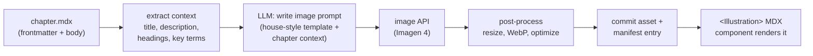
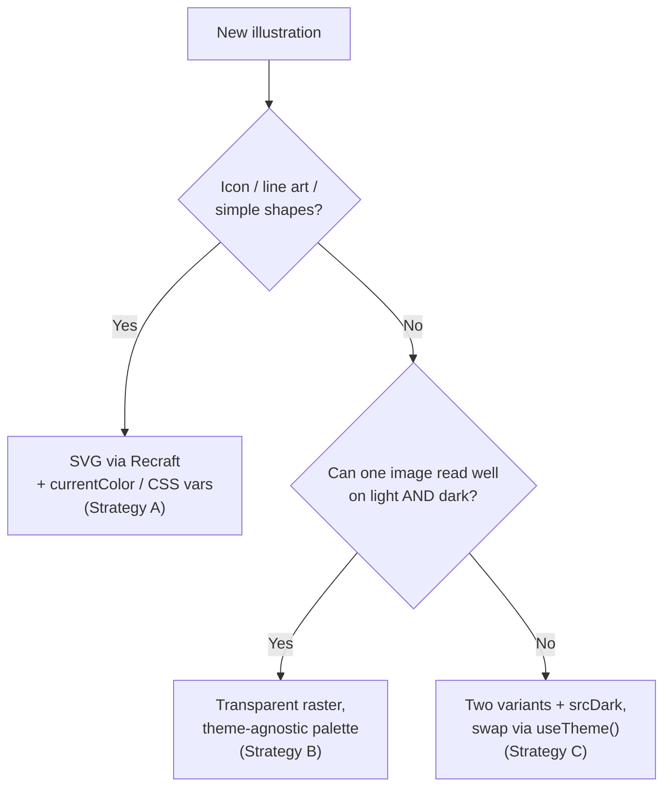

# AI Image Generation for Course Illustrations — Research Report

**Date:** 2026-06-05
**Author:** Claude (research agent)
**Scope:** Evaluate AI image-generation APIs for adding decorative and explanatory illustrations to DataSlope courses; estimate cost; design a context-aware programmatic generation pipeline that fits the existing Next.js / Fumadocs / MDX stack.

---

## 1. Executive summary

- **DataSlope has 28 courses / 781 MDX chapters / ~6,100 `## ` sections** and currently uses **zero raster illustrations** in content. The only visuals today are **Mermaid diagrams** (client-rendered SVG) and **runtime-generated plots** (base64 PNG from R/Python code cells). There is no image-asset folder, image component, or CDN image pipeline for content yet.
- **Two very different needs are bundled in "illustrations":**
  - **Decorative / conceptual art** (chapter hero images, section banners, mood/metaphor art) → *a great fit for AI image generation.*
  - **Explanatory technical diagrams** (data flow, architecture, algorithm steps, ER diagrams) → *mostly a poor fit for raster AI image gen.* These should keep using **Mermaid** (already in the stack, version-controlled, accessible, editable). Use AI only for *conceptual* explanatory art (e.g. "a vector as an arrow in 2-D space") where literal accuracy of labels isn't load-bearing.
- **Recommended primary API: Google Imagen 4 (Fast/Standard)** for decorative art at **$0.02–$0.04/image**, with **Google Gemini "Nano Banana Pro" (Gemini 3 Pro Image, ~$0.134/image)** or **OpenAI GPT Image 1.5 (~$0.04/image)** reserved for the rare illustration that must contain **legible text/labels**. All three render text far better than the 2024-era models.
- **Cost is not the constraint.** One illustration per chapter (781 images) costs **~$16–$31** at Imagen 4 Fast/Standard rates. Even a lavish budget of one hero + 3 section images per chapter (~3,100 images) lands around **$62–$420** depending on tier. The real costs are **art-direction, consistency, review, and accessibility**, not API spend.
- **Build a one-off generation script + a JSON manifest + committed PNG/WebP assets.** Do **not** generate at request time or live build time (slow, nondeterministic, costs recur, breaks offline/preview builds). Generate offline, review, commit the images, and reference them through a new `<Illustration>` MDX component backed by `next/image`.
- **Dark mode is a first-class constraint, not an afterthought.** The `/learn` site runs **next-themes** via Fumadocs `RootProvider`, toggling a `.dark` **class** on `<html>` (confirmed in `app/learn/layout.tsx` and `app/_components/mdx/mermaid.tsx`, which already re-renders per theme). A raster illustration baked onto a **white background will look broken in dark mode**. Solve it with: **(a) transparent-background art** that lets the page background show through, **(b) SVG art recolored via `currentColor`/CSS variables** so it themes automatically, or **(c) two committed variants** (light/dark) swapped by the `<Illustration>` component — the same `useTheme()` pattern Mermaid already uses. See §7.
- **Hosting: don't let Vercel's image optimizer meter you.** On the **Hobby plan**, `next/image` optimization is capped at **5,000 transformations/month** — hundreds of illustrations × responsive sizes × formats blow past it on the first crawl (then new images 402). Since art is pre-generated, **optimize once at build, set `next/image` to `unoptimized`/custom-loader, and serve from a CDN**. Recommended path: **jsDelivr (free, already in your stack) now → Cloudflare R2 (free egress) as traffic grows.** Keep the app on Vercel; just decouple image delivery. See §8.
- **Latest models (June 2026):** prefer **Recraft V4.1** (incl. V4.1 Vector for SVG) and **Ideogram 4.0** (best-in-class text *plus* native transparency/background removal) over their prior versions. See §3.

---

## 2. What "illustrations" should and shouldn't be AI-generated

| Need | Example in DataSlope | Best tool | Why |
|---|---|---|---|
| Chapter hero / header art | Banner atop `the-age-of-data.mdx` | **AI image gen** | Decorative, no factual labels, sets tone |
| Section break / metaphor art | "missing values as gaps in a fabric" | **AI image gen** | Conceptual, evocative |
| Conceptual explanatory art | "a vector as an arrow", "tidy vs messy data" | **AI image gen (with caution)** | OK if labels are minimal/none; verify accuracy |
| Precise technical diagram | dplyr pipeline, ER diagram, control flow | **Mermaid (keep)** | Exact labels, editable, diffable, accessible, free |
| Data plots / charts | distributions, ggplot output | **Runtime code cells (keep)** | Already live + reproducible |
| Diagrams needing exact in-image text | labeled architecture with 10 boxes | **Mermaid or SVG** | AI text rendering improved but still error-prone at density |

**Key judgement:** AI image generation is strongest for the *decorative and conceptual* layer that DataSlope completely lacks today. It is weakest exactly where DataSlope is already strong (precise diagrams via Mermaid, live plots). Lean into the gap; don't replace what works.

---

## 3. API landscape & pricing (June 2026)

Prices are **per generated 1024×1024 (1K) output image** unless noted. The market has commoditized: most "standard" tiers cluster at **$0.02–$0.06/image**. Numbers below are corroborated across vendor docs and multiple pricing trackers (see Sources); treat them as *current estimates* — verify against live vendor pricing before committing budget, as these shift frequently.

### 3.1 Comparison table

| Provider / model | Price/image (1K) | Higher tiers | Text-in-image | SVG/vector | Notes |
|---|---|---|---|---|---|
| **Google Imagen 4 Fast** | **$0.02** | Standard $0.04, Ultra $0.06 | Good | No | Cheapest official option; text-to-image only; great default for decorative art |
| **Google Imagen 4 Standard** | **$0.04** | Ultra $0.06 | Good | No | Best quality/price balance |
| **OpenAI GPT Image 1.5** | **~$0.04** (medium) | low ~$0.009, high ~$0.167 | **Excellent** | No | Strong instruction-following; flagship (gpt-image-1 deprecates 2026-10-23) |
| **OpenAI GPT Image 1 Mini** | **$0.005–$0.036** | — | Good | No | Budget floor; good for drafts/iteration |
| **OpenAI GPT Image 2** | $0.005–$0.211 | medium ~$0.041–0.053, high ~$0.165–0.211 | **Excellent** | No | Latest flagship; portrait/landscape slightly cheaper than square |
| **Google Nano Banana Pro** (Gemini 3 Pro Image) | **$0.134** (1K/2K) | 4K $0.24 | **Best-in-class** | No | Best for legible text/labels; **50% off** via Batch/Flex ($0.067) |
| **Google Nano Banana 2** (Gemini 3.1 Flash Image) | **$0.067** (1K) | 2K $0.101, 4K $0.151 | Excellent | No | **50% off** via Batch; 0.5K ~$0.045 |
| **Flux 2 [schnell]** | **$0.015** | dev $0.025, **pro $0.05** | Good | No | Megapixel-based pricing; photorealism; self-host option exists |
| **Ideogram 4.0** *(latest)* | **$0.03** (Turbo) | Default $0.06, Quality $0.10 | **Best-in-class typography** | No (raster) | **Native background removal / transparency + editable text layers**; multilingual text; bounding-box layout control; **open weights** (commercial license) |
| **Ideogram 3.0** | **$0.03** (Standard) | Quality $0.09 | **Excellent (typography)** | No | Prior gen; still fine for readable text in images |
| **Recraft V4.1** *(latest, May 2026)* | ~$0.04 (raster) | **~$0.08 (vector/SVG)** | Excellent | **Yes (true SVG)** | Three variants: **V4.1** (expressive), **V4.1 Vector** (logos/precision SVG), **V4.1 Utility** (clean mockups/product shots); improved photorealism + coherence over V4 |
| **Recraft V3** | **$0.04** (raster) | **$0.08 (vector/SVG)** | Excellent | **Yes (true SVG)** | Prior gen; still a solid SVG workhorse |

### 3.2 Free tiers & discounts worth knowing

- **Google AI Studio** offers a generous free image tier (reported up to ~500 images/day) — ideal for **prototyping and style exploration at zero cost** before committing.
- **Google Vertex AI**: $300 free trial credit for new GCP accounts.
- **Batch APIs** (OpenAI, Google) cut rates ~**50%** for non-interactive bulk jobs — perfect for a one-shot generation run over hundreds of chapters.
- **Aggregators** (fal.ai, Replicate, OpenRouter) give a single API key across many models for easy A/B testing, at a small markup, with volume discounts (~15–25%) at 100K+ images.

### 3.3 Recommendation by use case

- **Decorative hero/section art (the bulk):** **Imagen 4 Fast → Standard.** Cheapest, fast, consistent enough with a strong style prompt.
- **Conceptual art that needs a few legible words:** **GPT Image 1.5**, **Ideogram 4.0**, or **Nano Banana 2** (Batch tier). Ideogram 4 is the typography specialist *and* gives native transparency/background removal in one shot — a strong pick when you need clean labeled cutouts.
- **The rare label-heavy "infographic" illustration:** **Nano Banana Pro** or **Ideogram 4.0 Quality** — but first ask whether Mermaid/SVG is the better tool (usually yes).
- **Crisp scalable icons/spot-illustrations for the web:** **Recraft V4.1 Vector** (true SVG, scales perfectly at any DPI, ~KB-sized, themes via CSS). V4.1 Utility is handy for clean front-facing product/mockup shots.
- **Latest-model note (June 2026):** Prefer **Recraft V4.1** over V3 and **Ideogram 4.0** over 3.0 — both are current-gen with better coherence; V3/3.0 remain fine fallbacks. The flagship raster trio (Imagen 4, GPT Image 1.5/2, Nano Banana) is unchanged as the decorative workhorse.
- **Prototyping:** Google AI Studio free tier, then a multi-model aggregator for the A/B bake-off.

### 3.4 Transparency & SVG support by model (matters for dark mode — see §7)

| Model | Native transparent PNG (alpha) | Native SVG / vector | Practical note |
|---|---|---|---|
| **Recraft V4.1 / V3 Vector** | n/a (vector) | **Yes — true editable SVG** | Only major API that emits production SVG; best path for icons/spot art that must theme cleanly |
| **Ideogram 4.0** | **Yes** (native background removal / transparency) | No | One-shot transparent raster *with* best-in-class text — strong for labeled cutouts |
| **OpenAI GPT Image 1.5** | **Yes** (`background: "transparent"`, request PNG/WebP) | No | Best raster route to a clean alpha cutout from a prompt |
| **OpenAI GPT Image 2** | **No** (per OpenAI docs — common failure point) | No | Use 1.5 if you need transparency |
| **Google Imagen 4** | No | No | Opaque output; needs background removal for transparency |
| **Google Nano Banana / Pro** | Limited / inconsistent | No | Treat as opaque; post-process if you need alpha |
| **Flux 2** | **No** | No | Cannot output transparency natively |
| **Runware LayerDiffuse** | **Yes (built-in alpha at generation)** | No | Purpose-built for one-step transparent raster |
| **Background-removal APIs** (e.g. remove.bg, Recraft vectorizer, Transparify) | Yes (post-process any image) | Some vectorize | The universal fallback: generate opaque, then strip the background |

**Two reliable routes to transparency:** (1) pick a model that emits alpha directly (**GPT Image 1.5** or **LayerDiffuse**), or (2) generate opaque on any model and run a **background-removal pass**. For anything icon-like, **SVG from Recraft** sidesteps the whole problem because vectors carry no background and recolor via CSS.

---

## 4. Cost estimates for DataSlope

Content scale: **781 chapters**, **~6,100 sections**.

| Illustration policy | # images | @ Imagen 4 Fast ($0.02) | @ Imagen 4 Std ($0.04) | @ Nano Banana Pro Batch ($0.067) |
|---|---|---|---|---|
| 1 hero per chapter | 781 | **$16** | **$31** | $52 |
| 1 hero + 2 section images/chapter | ~2,343 | $47 | $94 | $157 |
| 1 hero + every section (~6,100) | ~6,881 | $138 | $275 | $461 |

**Add realistic overhead for iteration.** Plan for **~3–5× the raw count** in actual API calls because you'll regenerate for style misses, bad anatomy, off-brief results, and prompt tuning. Even at 5× the most generous policy, you're looking at **low hundreds to ~$1–2K** of API spend total — a rounding error next to the human review time.

**Bottom line:** budget **$50–$200 for a first pass** (1 hero/chapter with iteration headroom on Imagen 4), and treat the API bill as negligible. Allocate effort instead to art direction, a consistency system, and review.

---

## 5. Context-aware programmatic generation strategy

The interesting engineering problem is **turning each chapter's content into a good prompt automatically**, while keeping a **consistent house style** across 781 chapters.

### 5.1 Two-stage pipeline: text → prompt → image



**Stage 1 — Context extraction (deterministic).** Parse each `.mdx`: pull `title` + `description` from frontmatter, the `## ` headings, and optionally the first paragraph of each section. This is cheap and reuses patterns already in `scripts/check-mcq.mjs` (which already reads and parses MDX files).

**Stage 2 — Prompt synthesis (LLM, e.g. Claude).** Feed the extracted context + a **fixed house-style preamble** into an LLM that returns a tight image prompt. This is where "include the relevant chapter content" actually happens — the LLM distills the lesson into a concrete, drawable scene and *strips anything that would force literal text into the image*. Cost is trivial (a few cents per chapter).

**Stage 3 — Image generation.** Send the synthesized prompt to the image API. Generate **n=2–4 candidates** per slot so a human can pick the best.

> Why an LLM in the middle rather than prompting the image model with raw markdown? Image models follow *scene descriptions*, not lesson text. The LLM converts "this chapter explains vectorized computation in R" into "a row of identical gears turning in unison along a conveyor belt, flat vector illustration, …" — which is what actually produces good art.

### 5.2 House-style system (the hard part)

Consistency across hundreds of images is the difference between "looks designed" and "looks like a random AI dump." Techniques, in order of reliability:

1. **A locked style preamble** appended to every prompt — fixed palette (ideally pull DataSlope brand colors from Tailwind theme), medium ("flat vector editorial illustration / isometric / line art"), lighting, composition, negative prompts ("no text, no watermark, no photorealism"). Reuse the **identical** string for every image.
2. **Style reference images** — most APIs (GPT Image edits, Gemini, Flux) accept a reference image to condition style. Generate 2–3 "golden" reference illustrations you love, then condition every subsequent generation on them.
3. **Seed pinning** — fix the random seed per style family for reproducibility where the API supports it.
4. **Per-course accent** — vary only one controlled dimension (e.g. accent color) per course so courses feel distinct but the system feels unified.
5. **(Advanced) Custom LoRA / fine-tune** on a curated set if you later want pixel-tight brand consistency at scale — overkill for v1.

### 5.3 Suggested prompt template (illustrative)

```
[HOUSE STYLE — constant]
Flat vector editorial illustration, clean geometric shapes, generous negative
space, limited palette of {brand_primary}, {brand_accent}, warm neutral background,
soft long shadows, subtle grain. Friendly and modern. No text, no labels, no
letters, no numbers, no watermark, no UI chrome, not photorealistic.

[CHAPTER CONTEXT — from LLM, per chapter]
Subject: a single clear visual metaphor for "{chapter_title}".
Scene: {one concrete drawable scene the LLM derived from the chapter}.
Mood: {curiosity / clarity / momentum}.

[FRAMING]
16:9 hero banner, centered composition, safe margins.
```

---

## 6. Integration into the existing stack

The codebase is **Next.js 16 + Fumadocs 16 + dynamic MDX** (`source.config.ts` uses Fumadocs `dynamic` mode; MDX compiled on demand). Custom MDX components are registered in `mdx-components.tsx` (`CodeBlock`, `ChallengeCard`, `Mermaid`, etc.). There is **no `images.remotePatterns` config** in `next.config.ts` and **no content image folder** today.

### 6.1 Where assets live

Recommended: **commit optimized images into the repo** and serve them as static assets.

```
public/illustrations/{course-slug}/{chapter-slug}/hero.webp
public/illustrations/{course-slug}/{chapter-slug}/section-2.webp
```

- Serve via **`next/image`** for automatic responsive sizing, lazy-loading, and modern formats.
- Keep them in `public/` (mirrors how `tools.jar` and brand assets are already handled) rather than colocating in `content/` — Fumadocs treats `content/learn` as MDX page sources, and binary blobs there add noise.
- If repo size becomes a concern (hundreds of WebP at ~50–150KB each ≈ tens of MB — manageable), consider pushing to the **same jsDelivr CDN pattern already used** for the .NET runtime and PGlite (`app/_components/runtime/cdn.ts`). **See §8 for the full hosting/delivery strategy** — important because you're on Vercel's Hobby plan, where `next/image` optimization and bandwidth have caps that hundreds of illustrations can hit.

### 6.2 New `<Illustration>` MDX component

Add a component and register it in `mdx-components.tsx` alongside `Mermaid`:

```mdx
<Illustration id="practical-r/the-age-of-data/hero" />
```

```tsx
// app/_components/mdx/Illustration.tsx (sketch)
import Image from "next/image";
import manifest from "@/content/illustrations.manifest.json";

export function Illustration({ id }: { id: string }) {
  const meta = manifest[id];               // { src, width, height, alt, credit }
  if (!meta) return null;                  // fail soft if not yet generated
  return (
    <figure className="my-6">
      <Image src={meta.src} width={meta.width} height={meta.height}
             alt={meta.alt} className="rounded-lg" />
      {meta.caption && <figcaption>{meta.caption}</figcaption>}
    </figure>
  );
}
```

- Referencing by **`id` + manifest** (rather than raw ``) means MDX authors don't hardcode paths, the alt text/caption live in one reviewed place, and missing images fail soft instead of 404-ing.
- For a zero-MDX-edit option, a remark plugin could auto-inject a hero from the manifest based on the page slug — but the explicit component is clearer and easier to review.

### 6.3 The manifest

`content/illustrations.manifest.json` (committed) is the source of truth linking IDs → file, dimensions, **alt text**, caption, the prompt used, model, and generation date:

```json
{
  "practical-r/the-age-of-data/hero": {
    "src": "/illustrations/practical-r-for-beginners/the-age-of-data/hero.webp",
    "srcDark": null,
    "format": "raster",
    "transparent": true,
    "width": 1600, "height": 900,
    "alt": "Abstract flat-vector scene of data streams converging into a glowing hub",
    "caption": null,
    "model": "imagen-4.0-fast",
    "prompt": "Flat vector editorial illustration ...",
    "seed": 12345,
    "generatedAt": "2026-06-05"
  }
}
```

The `format`, `transparent`, and `srcDark` fields drive the light/dark-mode behavior described in **§7**: `format:"svg"` entries inline and recolor via CSS; transparent raster entries render on any theme; and a non-null `srcDark` tells `<Illustration>` to swap variants per theme via `useTheme()`.

### 6.4 Generation script

Add `scripts/generate-illustrations.mjs` (ESM, matching `scripts/check-mcq.mjs` conventions) and an npm script. It should:

1. Walk `content/learn/**/*.mdx`, read frontmatter + headings.
2. For each slot **not already in the manifest** (idempotent — never regenerate/charge for existing art unless `--force`), call the LLM for a prompt, then the image API for n candidates.
3. Write candidates to a `/_review` staging dir; a human approves one.
4. On approval: optimize (resize, WebP), write to `public/illustrations/...`, update the manifest, commit.

> **Run offline, not in `build`/`dev`/`postinstall`.** Generation is slow, nondeterministic, costs money, and needs human review — it must never be on the request path or the CI build path. Contrast with the existing `build-almostnode-workers.mjs` (deterministic, free, safe to run on every build). Image generation is a deliberate, reviewed, occasional batch job.

---

## 7. SVG, transparency, and light/dark mode

This is the section that most affects whether illustrations *look intentional* on DataSlope, because the `/learn` site ships a real dark theme.

### 7.1 The problem, concretely

`app/learn/layout.tsx` wraps every lesson in Fumadocs's `RootProvider`, which uses **next-themes**. Theme switching adds/removes a **`.dark` class on `<html>`** (it is *not* purely a `prefers-color-scheme` media query — a user can manually toggle). `app/_components/mdx/mermaid.tsx` already imports `useTheme` from `next-themes` and re-renders diagrams when the theme flips.

Consequences for raster art:

- A PNG with a **solid white background** sits in a glaring white box on a dark page. A solid dark background does the inverse in light mode.
- Because next-themes toggles a **class**, a pure CSS `<picture media="(prefers-color-scheme: dark)">` approach **will not track the manual toggle** — it only follows the OS setting. Theme-aware swapping must key off the `.dark` class (CSS) or `useTheme()` (JS), not the media query alone.

### 7.2 Four strategies (use the right one per art type)

**Strategy A — SVG that recolors itself (best for icons / line art / simple spot illustrations).**
Generate vector art with **Recraft V4/V3 Vector**, then make it theme-aware by letting strokes/fills inherit `currentColor` or reference CSS custom properties. Inline the SVG (or load it so its `fill`/`stroke` can be CSS-driven) and it adapts to *any* theme automatically — one asset, infinitely scalable, ~a few KB, no white box ever. This is the cleanest dark-mode answer and also the most accessible (crisp at any zoom/DPI).
- Caveat: complex/painterly SVGs with baked-in hex colors won't auto-recolor — you'd post-process to swap a known palette to CSS variables, or treat them like raster (Strategy C).

**Strategy B — Transparent-background raster that works on both themes (best for hero/decorative art).**
Generate a **transparent PNG/WebP** (GPT Image 1.5 `background:"transparent"`, LayerDiffuse, or generate-then-background-remove) using a **theme-agnostic palette**: avoid near-white and near-black; favor your brand accent + mid-tones; use soft shadows/glows that read on both light and dark. One asset, no theme logic. ~80% of decorative needs can be met this way and it's the lowest-maintenance option.
- Watch-outs: subtle anti-aliasing halos around edges show on dark backgrounds (check at generation); fine dark linework can vanish on dark bg, so prefer shapes with their own fill over thin outlines.

**Strategy C — Two committed variants, swapped by the component (best when an image genuinely needs different treatment per theme).**
Generate/store a **light** and **dark** version, list both in the manifest (`src` + `srcDark`), and have `<Illustration>` pick using `useTheme()` — mirroring exactly what `mermaid.tsx` does today. Costs 2× the assets/generation and doubles review, so reserve it for high-value images (e.g. course hero banners) where a single asset can't satisfy both.
- No-JS / SSR nicety: you can also render both and toggle with CSS `.dark` class utilities (`hidden dark:block` / `block dark:hidden`) so there's no theme flash before hydration.

**Strategy D — CSS containment (fallback for legacy/opaque images).**
If you're stuck with an opaque raster, wrap it in a `<figure>` with consistent padding and a **theme-neutral container** (e.g. a soft card surface using the theme's surface variable, rounded corners, subtle border) so the image reads as an intentional framed element rather than a clashing rectangle. Avoid `filter: invert()` hacks — they wreck colored art and only sometimes work for pure black/white line drawings.

### 7.3 Decision guide



### 7.4 What this means for the component and manifest (extends §6)

- **Manifest** gains optional fields: `format` (`"svg" | "raster"`), `srcDark`, and `transparent: true`. SVG entries can be inlined; raster entries go through `next/image`.
- **`<Illustration>`** reads the theme with `useTheme()` (already a project dependency) and chooses `srcDark` when present and `.dark` is active; otherwise renders the single theme-agnostic asset. For SVG, render inline so CSS can drive `fill`/`stroke`.
- **Generation script** records which strategy each slot used and, for transparency, whether alpha was native or added via a background-removal pass (provenance for later re-runs).

### 7.5 Recommended default

- **Spot/icon art → Strategy A (Recraft SVG).** Themes for free, tiny, scalable, accessible.
- **Hero/decorative art → Strategy B (transparent raster, theme-agnostic palette).** One asset, low maintenance; this should cover most chapters.
- **Strategy C only for marquee images** where the extra asset is worth it. **Strategy D** is a stopgap, not a plan.

---

## 8. Image hosting & delivery at scale

You're on **Vercel's Hobby plan** today. Adding hundreds of illustrations changes the bandwidth and image-optimization math, so this section covers what breaks first and the affordable, scalable paths.

### 8.1 What the Hobby plan actually limits (June 2026)

| Resource | Hobby monthly allowance | What consumes it |
|---|---|---|
| **Bandwidth (Fast Data Transfer)** | **100 GB** | Every image byte served from `public/` or `next/image` |
| **Edge requests** | **1 M** | Every asset request (each image = ≥1 request) |
| **Image Optimization transformations** | **5,000** | Each unique `next/image` (src × size × format) the first time it's optimized |
| **Image cache reads / writes** | **300K / 100K** | Serving/creating optimized variants |

Two things bite first:

- **The 5,000 transformations cap.** `next/image` creates a *separate* optimized variant per source × resolution × format. 781 heroes × ~4 responsive widths × 2 formats (WebP/AVIF) ≈ **6,000+ transformations** — you blow the monthly cap on the **first** crawl, after which **new images return HTTP 402** until the 30-day window resets (already-cached variants keep working).
- **100 GB bandwidth.** At ~100 KB/image, 100 GB ≈ **1 M image views/month** before you're capped — fine now, but it's shared with all other page/app traffic and scales linearly with growth.

> **Also worth flagging:** Vercel's **Hobby plan is for non-commercial use**. If DataSlope monetizes (or you want to lift these caps), you're on **Pro (~$20/seat/mo)** regardless — where the same image work becomes *metered* ($0.05/1K transformations, $0.40/1M cache reads, $4/1M cache writes, plus bandwidth). The strategies below keep that meter near zero.

### 8.2 The key move: stop paying Vercel to optimize already-optimized images

Because DataSlope **pre-generates illustrations offline**, they can be **optimized once at build time** (sharp/Squoosh → fixed-width WebP/AVIF + SVG). That makes Vercel's on-the-fly optimizer redundant. Bypass it so you never touch the 5K transformation cap:

- Set `<Image unoptimized />` (or `images.unoptimized = true`) — serve the pre-optimized file as-is, **0 transformations**. You still get layout/lazy-load benefits of `next/image`.
- **Or** a **custom loader** (`images.loader = "custom"`) that points at an external CDN/transformer (Cloudflare, Bunny) instead of Vercel's.
- SVGs (Strategy A in §7) are already tiny and need no optimization at all.

This alone removes the most fragile Hobby limit. What remains is raw bandwidth — addressed by offloading delivery to a CDN.

### 8.3 Hosting options, cheapest-to-richest

| Option | Cost model | Egress | Transforms | Best when |
|---|---|---|---|---|
| **jsDelivr** *(already in your stack)* | **Free** (OSS/GitHub/npm-backed) | Free | None | Public, pre-optimized static assets; you already serve the .NET runtime + PGlite this way (`app/_components/runtime/cdn.ts`) |
| **Cloudflare R2 + CDN** | $0.015/GB stored (10 GB free), $4.50/M writes (10M free) | **Free** | Via Workers/Image Resizing (opt-in) | Highest-traffic, pre-optimized assets — free egress decouples image bandwidth from app growth |
| **Bunny.net** | $0.01/GB storage + **$0.005/GB** bandwidth (EU/NA) | Cheap | Bunny Optimizer (WebP/AVIF, resize) | Dead-simple pay-as-you-go CDN with optional auto-optimization; pennies at this scale |
| **Cloudflare Images** | $5/100K stored + $1/100K delivered | Free | **Built-in** | You want on-the-fly resizing without managing a pipeline; ~60–80% cheaper than Cloudinary |
| **Cloudinary / imgix** | From ~$99/mo | Included | Rich API | Heavy dynamic transformation needs — **overkill here**, skip |
| **Vercel `next/image` (status quo)** | Free within Hobby caps, then metered on Pro | Counts to plan | Built-in (5K cap) | Small asset counts only; the thing we're offloading |

### 8.4 Recommendation for DataSlope

1. **Now / v1 — pre-optimize + serve via jsDelivr (free).** Since assets are static, public, and committed to GitHub, jsDelivr is a zero-cost CDN you're *already using*. Pre-optimize at build (WebP/AVIF + SVG), reference via the existing CDN base-URL pattern, set `next/image` to `unoptimized`/custom-loader. Result: **~0 Vercel image transformations, near-zero Vercel image bandwidth, $0 hosting.** Caveat: jsDelivr is a best-effort fair-use OSS service (per-file size limits, public-only) — perfect for course art, not for private/huge assets.
2. **As traffic grows — move the images to Cloudflare R2.** **Free egress** is the decisive feature: image bandwidth no longer scales your Vercel bill or competes with the 100 GB app allowance. Storage for hundreds of MB of art is cents/month. Keep serving via a custom `next/image` loader. This is the **scalable, affordable** answer for sustained growth.
3. **If you want zero pipeline work — Bunny.net or Cloudflare Images.** Both add automatic resize/format at trivial cost and offload all egress. Reach for these only if managing a build-time optimize step becomes annoying.
4. **Keep the Next.js app on Vercel.** The point isn't to leave Vercel — it's to **decouple image delivery from the app** so static art (which is what illustrations are) rides a cheap/free CDN while Vercel handles the dynamic app. The manifest's `src`/`srcDark` (from §6.3) just point at CDN URLs, so switching hosts later is a one-line base-URL change.

> **Rule of thumb:** illustrations are immutable, cacheable, public static files — exactly what CDNs serve for free or near-free. Don't pay a serverless platform's metered image pricing to deliver them.

---

## 9. Quality, legal, and accessibility

- **Accessibility (required).** Every illustration needs meaningful **`alt` text** (stored in the manifest, human-reviewed). Decorative-only images should be marked decorative (empty alt / `aria-hidden`) so screen readers skip them. This is the single most important non-cost consideration.
- **Don't put load-bearing information only in an image.** If an illustration conveys a concept, the prose must convey it too (it already does). Images supplement, never replace, text — also protects you if an image is wrong or fails to load.
- **Factual accuracy review.** AI art invents details. For anything semi-explanatory, a human must confirm it isn't subtly *teaching the wrong thing* (e.g. a mislabeled axis, a wrong arrow direction). This is why conceptual-only + Mermaid-for-precision is the safe split.
- **Licensing / commercial use.** Major API providers (OpenAI, Google, Black Forest Labs, Ideogram, Recraft) grant commercial-use rights to API-generated images, but **terms vary and change** — confirm the current ToS for your chosen provider, and keep the **manifest's prompt/model/date** as a provenance record. Consider whether you want C2PA/provenance metadata.
- **Consistency review gate.** A human picks among n candidates and rejects off-style results before commit. Budget this time; it's the real cost.
- **Performance.** Use `next/image`, ship WebP/AVIF, lazy-load below-the-fold, and cap hero file sizes (~100–150KB). Hundreds of small WebP in `public/` is fine; revisit CDN offload only if repo/deploy size becomes painful.

---

## 10. Recommended rollout

**Phase 0 — Style discovery (free, ~1 day).** Use Google AI Studio's free tier (and an aggregator for A/B) to nail a house style on **3–5 chapters across different courses**. Produce "golden" reference images. Decide medium, palette, aspect ratios — **and the default light/dark strategy (§7): transparent raster + theme-agnostic palette, or SVG.** Test every candidate on both the light and dark theme before locking the style.

**Phase 1 — Pipeline + pilot (small).** Build `scripts/generate-illustrations.mjs`, the manifest, and the `<Illustration>` component. Generate **hero images for one full course** (e.g. `practical-r-for-beginners`, ~30 chapters) on **Imagen 4 Fast**. Review, commit, ship behind the existing render path. Cost: a few dollars.

**Phase 2 — Scale heroes.** Roll hero-per-chapter across all 28 courses (781 images) once the style holds. Cost: ~$16–$31 + iteration.

**Phase 3 — Selective section art & conceptual explainers.** Add section/metaphor images only where they earn their place. Use GPT Image 1.5 / Nano Banana where a few legible words are genuinely needed. Keep precise diagrams on **Mermaid**.

**Phase 4 — Optional hardening.** Consider Recraft SVG for icon-like spot art (themes for free in dark mode), `srcDark` variants for marquee heroes that need them, a custom fine-tune/LoRA for tighter brand consistency, and/or CDN offload if repo size grows.

---

## 11. Open questions for you

1. **Style direction** — flat vector / isometric / line-art / painterly? (Drives model choice and the locked preamble.)
2. **Density** — hero-only, or hero + section art? (Drives count and review burden.)
3. **Brand palette** — should illustrations pull DataSlope's Tailwind theme colors for cohesion?
4. **Provider preference / constraints** — any existing GCP or OpenAI account, data-residency, or licensing constraints that should pick the API for us?
5. **Asset hosting (§8)** — on Vercel Hobby today: start with **pre-optimize + jsDelivr (free)**, then graduate to **Cloudflare R2 (free egress)** as traffic grows? Or do you want a managed transformer (Bunny / Cloudflare Images) from day one? Also: is DataSlope commercial (which would require Vercel Pro regardless)?
6. **Dark-mode default (§7)** — standardize on transparent raster + theme-agnostic palette (one asset, lowest maintenance), lean into SVG for spot art, or accept `srcDark` two-variant cost for hero images? This decision shapes both the model choice and the component/manifest design.

---

## Sources

- [OpenAI API Pricing (official)](https://openai.com/api/pricing/)
- [GPT Image 1 model docs (OpenAI)](https://developers.openai.com/api/docs/models/gpt-image-1)
- [OpenAI image API pricing 2026 (AI Free API)](https://www.aifreeapi.com/en/posts/openai-image-generation-api-pricing)
- [OpenAI GPT Image pricing calculator (CostGoat)](https://costgoat.com/pricing/openai-images)
- [Gemini Developer API pricing (official)](https://ai.google.dev/gemini-api/docs/pricing)
- [Nano Banana image generation docs (Google)](https://ai.google.dev/gemini-api/docs/image-generation)
- [Gemini 3 Pro Image / Nano Banana Pro (Google AI Studio)](https://aistudio.google.com/models/gemini-3-pro-image)
- [Gemini image free tier & limits (AI Free API)](https://www.aifreeapi.com/en/posts/gemini-image-generation-free-api)
- [Nano Banana Pro pricing (LaoZhang AI)](https://blog.laozhang.ai/en/posts/nano-banana-pro-pricing)
- [FLUX API pricing (Black Forest Labs)](https://bfl.ai/pricing)
- [Flux vs Ideogram vs Recraft API comparison (APIScout)](https://apiscout.dev/guides/flux-vs-ideogram-vs-recraft-image-gen-api-2026)
- [AI image generation API pricing — 12 providers (Digital Applied)](https://www.digitalapplied.com/blog/ai-image-generation-api-pricing-comparison-2026)
- [AI image generation API pricing June 2026 (BuildMVPFast)](https://www.buildmvpfast.com/api-costs/ai-image)
- [AI image pricing: Google vs OpenAI (IntuitionLabs)](https://intuitionlabs.ai/articles/ai-image-generation-pricing-google-openai)
- [AI image generation API comparison 2026 (TokenMix)](https://tokenmix.ai/blog/ai-image-generation-api-comparison)
- [Best AI image models 2026 (Melies)](https://melies.co/compare/ai-image-models)
- [Keep AI images consistent — 7 techniques (ZSky AI)](https://zsky.ai/blog/ai-image-consistency-tips)
- [AI art style libraries & keywords 2026 (GensGPT)](https://www.gensgpt.com/blog/ai-art-style-libraries-popular-styles-keywords-2026-guide)
- [Replicate pricing](https://replicate.com/pricing)
- [fal.ai image generators](https://fal.ai/learn/tools/ai-image-generators)
- [OpenAI image generation guide — background/transparency parameter](https://developers.openai.com/api/docs/guides/image-generation)
- [GPT-Image-2 transparent background limitations (Apiyi)](https://help.apiyi.com/en/gpt-image-2-transparent-background-not-supported-en.html)
- [Can AI generate transparent images? (ZSky AI)](https://zsky.ai/blog/can-ai-generate-transparent-images)
- [LayerDiffuse — built-in transparency at generation (Runware)](https://runware.ai/blog/introducing-layerdiffuse-generate-images-with-built-in-transparency-in-one-step)
- [Recraft V3 SVG — text-to-SVG API (Replicate)](https://replicate.com/recraft-ai/recraft-v3-svg)
- [Recraft V4 models & SVG output (Recraft docs)](https://www.recraft.ai/docs/recraft-models/recraft-V4)
- [Transparent PNGs from any AI generator (Transparify)](https://transparify.app/blog/ai-image-transparent-background)
- [Recraft V4.1 announcement](https://www.recraft.ai/blog/recraft-v4-1-more-beautiful-by-nature)
- [Ideogram 4.0 model page](https://ideogram.ai/models/4.0/)
- [Vercel Image Optimization — limits & pricing](https://vercel.com/docs/image-optimization/limits-and-pricing)
- [Vercel Hobby plan limits](https://vercel.com/docs/plans/hobby)
- [Increased Hobby usage limits for Image Optimization (Vercel changelog)](https://vercel.com/changelog/increased-hobby-usage-limits-for-image-optimization)
- [Media storage cost comparison: S3 vs R2 vs Cloudinary (LeanOps)](https://leanopstech.com/blog/media-storage-serverless-cost-comparison-2026/)
- [Cloudflare Images pricing 2026 (LeanOps)](https://leanopstech.com/blog/cloudflare-images-pricing-2026/)
- [Cloudflare Images pricing — real cost math (TheImageCDN)](https://theimagecdn.com/docs/cloudflare-images-pricing)
- [Bunny.net vs Cloudflare 2026 (Kunal Ganglani)](https://www.kunalganglani.com/blog/bunnynet-vs-cloudflare-2026)

> **Pricing caveat:** Image-API prices change frequently and vary by region, resolution, and aggregator markup. Figures above reflect June 2026 estimates aggregated from the sources listed — re-confirm against live vendor pricing pages before committing budget.
