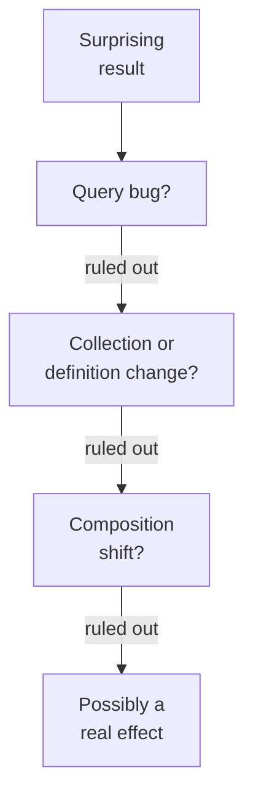

There are two very different things you can ask an assistant for. One
is code, which is checkable: you can run it, inspect intermediate
values, and compare against a second method. The other is
**interpretation**, and interpretation is much harder to check because
there is no traceback for a bad inference.

## Why interpretation is the riskier request

When you paste a table of numbers and ask "what does this tell us?",
several things happen at once:

* The model produces a **fluent narrative**, because producing fluent
  narrative is what it is best at.
* The narrative will be **causally worded**, because human writing
  about data is causally worded. "Revenue rose because the new pricing
  landed" reads naturally; "revenue rose, and pricing changed in the
  same period" does not.
* You have **no way to check** the causal claim, because it is not a
  computation.

The result is that a model's weakest capability (knowing why something
happened in your business) is delivered in its strongest register
(confident, well-organized prose). That combination is exactly
backwards from what you want.

<Callout type="warn" title="The correlation-to-cause slide">
Watch for the moment a summary changes from describing to explaining.
"Region B is 12% below Region A" is a description you can verify.
"Region B is underperforming because of weaker account coverage" is a
causal claim the model has no evidence for, and it will often appear
in the very next sentence.
</Callout>

## Requests that work well

Interpretation is not useless. It is useful in a specific shape:
**as a hypothesis generator, not a conclusion generator.**

Good requests:

* "List five things that could explain this pattern, including boring
  ones like data collection changes."
* "What would I need to check to rule out each of those?"
* "What is the strongest argument that this pattern is a data
  artifact rather than a real effect?"
* "What additional column or table would make this conclusion much
  more solid?"

Each of these asks the model to widen your search rather than close
it. That plays to a real strength: models have read enormous numbers
of analyses and are genuinely good at recalling the standard list of
confounders you might not have thought of.

## Requests that go badly

* "What caused this drop?" invites a confident single answer.
* "Is this statistically significant?" invites a test being named
  without its assumptions being checked.
* "Write the executive summary." invites causal language that will be
  read as established fact by people who never see the data.

## The boring-explanation rule

When a pattern is surprising, the most likely explanations are, in
order: a bug in your query, a change in data collection, a
composition shift, and only then a real behavioral change. Models
tend to reach for the interesting explanation, because interesting
explanations dominate the text they learned from.

Ask explicitly: **"What are the boring explanations?"** It reliably
surfaces the pipeline-change and definition-change possibilities that
turn out to be right most of the time.

## Concept check

<MultipleChoice
  markdown={`Why is interpretation a riskier request than code generation?

- Interpretation requests are more likely to be refused.
  > Assistants answer interpretation questions readily.
- [o] There is no equivalent of running the code to check the claim.
  > A wrong computation can be caught by re-computing; a wrong causal claim has no mechanical check at all.
- Interpretation requests consume substantially more tokens.
  > Token cost is a minor consideration and not the source of risk.
- Models are trained on less prose than on code.
  > Training corpora contain far more prose than code.

Code has a verification path. Narrative does not, which is precisely
what makes it dangerous.`}
/>

<MultipleChoice
  markdown={`Which request uses an assistant's genuine strength on interpretation?

- [o] "List explanations for this drop, including data-collection changes."
  > Recalling the standard catalogue of confounders is a real strength, and framing it as a list keeps it a hypothesis rather than a verdict.
- "Confirm that the pricing change caused this."
  > This asks for confirmation of a conclusion you have already reached, which invites agreement rather than analysis.
- "Tell me why signups dropped in March."
  > This asks for a single causal conclusion the model has no evidence for.
- "Write the board summary explaining this quarter's results."
  > This bakes unverified causal language into a document read as authoritative.

Use it to widen the hypothesis space, not to close it.`}
/>

<MultipleChoice
  markdown={`An assistant writes: "Churn rose in Q2 because onboarding quality declined after the team reorganization." What is the problem?

- [o] It asserts a cause the model has no evidence for.
  > It has your churn numbers and no data whatever about onboarding quality or the reorganization, so the causal link is invented connective tissue.
- The word "churn" is ambiguous without a definition.
  > Definitional care matters, but the causal leap is the more serious defect.
- The sentence is too long to include in a summary.
  > Length is not the issue.
- Churn cannot be measured quarterly.
  > Quarterly churn is a normal metric.

The number is yours. The explanation is narrative, and it will be read
as fact.`}
/>

<MultipleChoice
  markdown={`When a result is surprising, which explanation should you rule out *first*?

- A genuine change in customer behavior.
  > This is the most interesting explanation and the least likely, so it belongs last.
- A seasonal effect specific to that quarter.
  > Seasonality is plausible but should be considered after mechanical causes are eliminated.
- [o] A bug in the query that produced it.
  > Query defects are the most common cause of surprising numbers and the cheapest to check.
- A shift in the mix of customer segments.
  > Composition shifts are worth checking, but after mechanical causes.

Most surprising results are not discoveries. They are mistakes, and
the mistake is usually in the code you just wrote.`}
/>

<MultipleChoice
  markdown={`Why do model-written summaries tend toward causal language even without causal evidence?

- Because the model has been instructed to sound authoritative.
  > No such instruction is present in ordinary use.
- Because correlational phrasing triggers safety filters.
  > Nothing about correlational wording interacts with safety systems.
- Because causal claims are shorter to express than correlational ones.
  > Correlational phrasing is not meaningfully longer.
- [o] Because human writing about data is overwhelmingly causal.
  > The model reproduces the register of the analyses it learned from, and those explain rather than merely describe.

It writes like the analyses it read, and those analyses explain things.`}
/>

<MultipleChoice
  markdown={`Which follow-up most improves the reliability of an interpretation you have been given?

- "Rewrite that more concisely."
  > Concision does not test the claim.
- "Are you confident in that conclusion?"
  > Self-reported confidence is poorly calibrated and typically returns reassurance.
- [o] "What would I need to observe for that explanation to be wrong?"
  > This forces a falsifiable prediction, which converts a story into something you can go and check.
- "Summarize that in one sentence for the executive team."
  > This propagates the unverified claim to a wider audience.

Asking what would disprove it turns narrative into a testable claim.`}
/>

<MultipleChoice
  markdown={`You ask "is this difference statistically significant?" and get a p-value and a test name. What is missing?

- The name of the software package used to compute it.
  > Tooling provenance does not affect validity.
- The confidence interval, which is required for any valid test.
  > Intervals are informative but their absence does not invalidate the test.
- The sample size, which the model cannot know.
  > If you supplied the data, the sample size is available.
- [o] Any check that the test's assumptions hold for your data.
  > A test name and a number are easy to produce; whether independence, distribution, and variance assumptions hold requires knowing how the data was collected.

Naming a test is the easy part. Justifying it against your data is the
part that got skipped.`}
/>

<MultipleChoice
  markdown={`What is the practical distinction between a description and an interpretation in a generated summary?

- Interpretations appear only in the final paragraph.
  > They routinely appear inline, often in the sentence right after a description.
- Descriptions are always shorter than interpretations.
  > Length does not distinguish them.
- [o] A description can be checked against the data; an interpretation cannot.
  > "Region B is 12% below Region A" is recomputable; "because coverage is weaker" is not checkable from the same data.
- Descriptions use percentages while interpretations use absolute numbers.
  > Both can use either.

The dividing line is verifiability, and the two are usually adjacent in
the same paragraph.`}
/>
