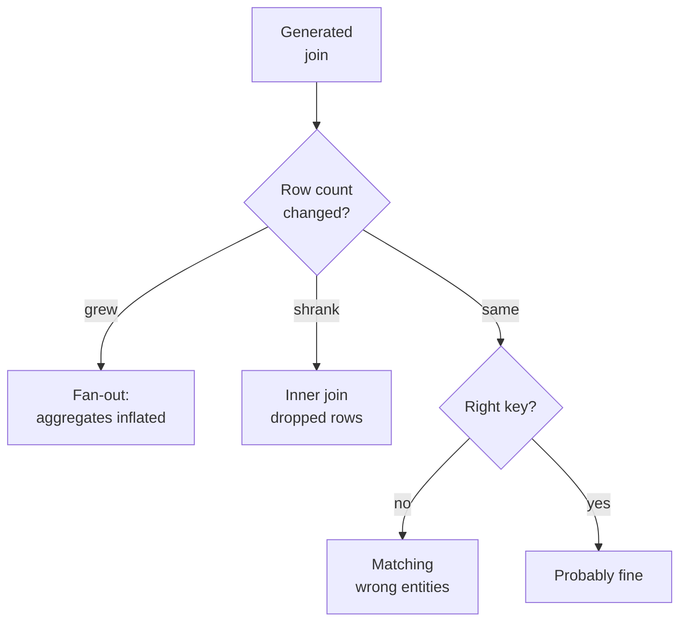

Joins are where generated code goes wrong most expensively, because a
join defect does not corrupt one value. It corrupts the row set, and
every aggregate computed afterwards inherits the damage.

<Figure
  slug="aida-broken-joins-cutout"
  alt="Two rows of blocks being zipped together, where one block on the left splits into three duplicate copies as it passes the join point, the resulting pile visibly taller than it should be"
/>

## Fan-out: the expensive one

You join `orders` to `order_lines` on `order_id`. Orders is one row
per order. Order lines is one row per line. The result has one row per
*line*.

That is correct join behavior. It becomes a bug the moment you then
write:

```sql
SELECT SUM(o.order_total) FROM orders o
JOIN order_lines l ON o.order_id = l.order_id
```

Every order's total is now counted once per line it contains. A
three-line order contributes its total three times. Revenue is
inflated, by a factor that varies per order, in a way that looks like
a plausible business number.

<Callout type="warn" title="Why fan-out survives review">
The inflated total is not absurd. If your average order has 2.4 lines,
your revenue is 2.4 times too high, which is exactly the kind of
discrepancy that gets attributed to "a different definition" rather
than recognized as a bug.
</Callout>

The fix is to aggregate before joining, or to join at a grain where
the value being summed is unique.

## Wrong key

The model joins on a column that *looks* like a key:

* `ON a.customer_id = b.id` where `b.id` is the id of something else
  entirely.
* `ON a.name = b.name`, matching on a display string, which
  double-matches duplicates and misses anything with different
  whitespace or case.
* `ON a.date = b.date`, a many-to-many join that produces a partial
  cross product and an enormous result.

The name-matching case is particularly common, because the model has
no way to know your surrogate keys and names are semantically
appealing.

## Wrong join type

`INNER` versus `LEFT` is a decision about what to do with unmatched
rows, and it is a *business* decision that the model guesses at.

* Inner join where left was meant: customers with no orders vanish. Your
  "average orders per customer" is computed only over customers who
  ordered, which is a different and higher number.
* Left join where inner was meant: unmatched rows arrive with nulls,
  and a later `SUM` treats them as absent while a later `COUNT(*)`
  counts them.

Neither raises an error. Both change the answer.



## The join checklist

Four questions, every time:

1. **What is the grain of each side?** One row per what, on the left
   and on the right?
2. **What is the grain of the result?** If it is finer than the left
   side, you have fanned out.
3. **Is the join key unique on at least one side?** If it is unique on
   neither, you have a many-to-many join and probably a bug.
4. **What happens to unmatched rows, and is that what you want?**

## Concept check

<MultipleChoice
  markdown={`You join \`orders\` (one row per order) to \`order_lines\` (one row per line) and then \`SUM(orders.order_total)\`. What happens?

- The total is correct because the join is on the primary key.
  > Joining on the order key is what creates the duplication, since the right side has many rows per key.
- The total is correct because \`SUM\` deduplicates automatically.
  > \`SUM\` performs no deduplication; it adds every row it is given.
- The query errors because \`order_total\` is not in the \`GROUP BY\`.
  > With no grouping at all this is a valid aggregate over the whole result.
- [o] Each order's total is counted once per line it contains.
  > The join produces one row per line, so a three-line order contributes its total three times and revenue is inflated.

Fan-out multiplies the left side's values by the number of matching
right-side rows.`}
/>

<MultipleChoice
  markdown={`Why is joining on a name column risky?

- Name columns cannot be indexed, so the join runs slowly.
  > Performance is a secondary concern and names can be indexed.
- [o] Names are neither unique nor consistently formatted.
  > Two different entities can share a name and match wrongly, while trailing whitespace or case differences cause real matches to be missed.
- Names are always stored with inconsistent types.
  > Type consistency is not the issue.
- Joins on text columns are not supported in most engines.
  > Text joins are fully supported.

A name is a label, not an identifier, and it fails in both directions
at once.`}
/>

<MultipleChoice
  markdown={`Your row count after a join is *lower* than before. What does that indicate?

- A fan-out has occurred.
  > Fan-out increases the row count.
- [o] An inner join dropped rows that had no match.
  > Only an inner (or right) join removes unmatched left-side rows, which is the standard cause of shrinkage.
- The join key contained duplicate values.
  > Duplicates would raise the count, not lower it.
- The engine deduplicated the result automatically.
  > Joins do not deduplicate unless explicitly asked.

A falling row count means unmatched rows were discarded, which may or
may not be what you wanted.`}
/>

<MultipleChoice
  markdown={`You compute "average orders per customer" using an inner join between \`customers\` and \`orders\`. What is the likely bias?

- The average is unaffected because both tables are filtered equally.
  > They are not filtered equally; only unmatched customers disappear.
- The average is too low because some orders are excluded.
  > Orders are not excluded; customers are.
- [o] The average is too high because customers with zero orders are excluded.
  > The zero values are removed from the denominator, which raises the mean.
- The average is undefined because of division by zero.
  > There is no division by zero; the denominator is simply smaller than it should be.

Dropping the zeros is the classic inner-join bias in any per-entity
average.`}
/>

<MultipleChoice
  markdown={`Which situation is the strongest signal of an accidental many-to-many join?

- The result contains null values in some columns.
  > Nulls indicate unmatched rows in an outer join, not multiplication.
- The query takes longer than usual to run.
  > Slowness has many causes and is weak evidence on its own.
- [o] The result has far more rows than either input table.
  > When neither side's key is unique, matching produces a partial cross product, which is the only way to exceed both inputs.
- The result has exactly the same number of rows as the left table.
  > A stable count suggests the join did not multiply.

Exceeding both input sizes is only possible when both sides have
repeated keys.`}
/>

<MultipleChoice
  markdown={`What is the correct way to sum order totals when you also need line-level detail?

- [o] Aggregate the lines first, then join at order grain.
  > Collapsing lines to one row per order restores a grain at which each order total appears exactly once.
- Use \`SELECT DISTINCT\` on the joined result before summing.
  > \`DISTINCT\` on the full row does not collapse duplicated order totals, since the line columns still differ.
- Divide the sum by the average number of lines per order.
  > Line counts vary per order, so a single divisor is wrong for almost every order.
- Use a \`LEFT JOIN\` instead of an \`INNER JOIN\`.
  > Join type does not address duplication caused by the right side's grain.

Fix the grain before aggregating, rather than trying to correct the
aggregate afterwards.`}
/>

<MultipleChoice
  markdown={`Why is the choice between \`INNER\` and \`LEFT\` join described as a business decision?

- Because different engines implement them differently.
  > Semantics are standardized across engines.
- Because \`LEFT\` joins are slower and therefore cost more.
  > Performance is not what makes it a business question.
- Because only one of them preserves referential integrity.
  > Neither join type enforces integrity constraints.
- [o] Because it decides whether entities with no matches belong in the answer.
  > Whether a customer with zero orders counts as a customer for this metric is a definition your organization owns, not a technical detail.

The model can pick a join type. It cannot know whether your metric is
supposed to include the zeros.`}
/>

<MultipleChoice
  markdown={`Which check would catch fan-out fastest?

- Confirming that no null values appear in the output.
  > Fan-out produces no nulls.
- [o] Comparing the row count before and after the join.
  > Duplication shows up immediately as an increased count, which is the defining symptom.
- Verifying that the join key exists in both tables.
  > Existence is necessary and says nothing about uniqueness.
- Checking that the output column types are correct.
  > Types are unaffected by duplication.

A single row count comparison is the cheapest fan-out detector there
is.`}
/>
