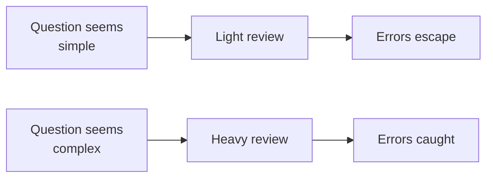

The four previous failure modes are things the model does. This one is
something *you* do, and it is the reason the other four survive to
production.

<Figure
  slug="aida-confidence-accuracy-cutout"
  alt="Two identical polished trophies on matching pedestals, one resting on solid rock and the other on a thin cracking sheet, both equally shiny and equally bright"
/>

## The core asymmetry

When a person writes confidently, that confidence is weak evidence.
They looked something up, or they have done it before, or they at
least felt sure. Confidence and correctness are loosely correlated in
human writing, which is why we learned to read tone as a signal.

A language model produces its output through the same process whether
the content is right or wrong. There is no separate "unsure" mode that
generates hedged text. The polish you are reading is a property of how
the text was generated, not a report on whether it is true.

So the signal you spent your whole life learning to read is, in this
one context, **empty**.

<Callout type="warn" title="Stated in one line">
A model's tone tells you about the model. It tells you nothing about
your data.
</Callout>

## Simple questions are more dangerous

This is counterintuitive and well documented. Errors get caught in
proportion to how carefully the output is read, and output is read
carefully in proportion to how difficult the question seemed.

Ask for a complicated window-function query and you will scrutinize
every line. Ask "how many customers do we have?" and you will glance
at the number and use it. But the simple query is where the
`COUNT(*)` versus `COUNT(DISTINCT ...)` distinction lives, and where
the "customers table includes test accounts" quirk bites.

The result is that the most-checked queries are the least likely to be
wrong, and the least-checked queries carry most of the errors that
actually escape.

## What self-reported confidence is worth

Asking "are you sure?" or "rate your confidence from 1 to 10" produces
a number. That number is poorly calibrated: it responds more to how the
question was phrased than to whether the answer is right. Pushing back
on a correct answer often produces a retraction, and pushing back on a
wrong answer often produces a defence.

This is not deception. The model has no privileged access to its own
reliability, any more than it has access to your database.

**Useful substitutes:**

* "What would have to be true of my data for this to be wrong?"
* "Give me a second, independent approach to the same number."
* "What is the strongest argument that this answer is incorrect?"

Each replaces an unanswerable introspective question with a
substantive one.

## Automation bias

The general form of this failure has a name in human factors research:
**automation bias**, the tendency to accept a machine's output more
readily than a human's, and to stop looking for disconfirming evidence
once the machine has spoken.

It has two practical signatures in analysis work:

* **Omission**: you do not notice a problem the tool did not flag.
* **Commission**: you act on a tool's output against evidence you
  already had.

The countermeasure is procedural rather than attitudinal. Deciding to
"be more careful" does not survive a deadline. A checklist that runs
on every result does.

## Concept check

<MultipleChoice
  markdown={`Why is a model's confident tone uninformative about correctness?

- Because confident phrasing only appears in longer responses.
  > Response length has no relationship to tone.
- [o] Because the same generation process produces both right and wrong output.
  > There is no separate low-confidence mode, so polish reflects the process rather than the truth of the content.
- Because models are tuned to sound confident regardless of accuracy.
  > There is no tuning objective for confidence specifically; the behavior emerges from how generation works.
- Because confidence is stripped from responses before display.
  > Nothing is stripped; you see the model's text as produced.

Fluency is a property of the mechanism, not a report about the world.`}
/>

<MultipleChoice
  markdown={`Why do simple questions produce more errors that reach production?

- [o] Because simple-looking answers get reviewed less carefully.
  > Review effort tracks perceived difficulty, so the errors in easy-looking answers pass through unexamined.
- Because models perform worse on simple questions.
  > Models perform better on simple questions in absolute terms.
- Because simple questions are asked more often overall.
  > Frequency contributes but is not the mechanism being described.
- Because simple queries cannot be verified.
  > They are the easiest of all to verify; the problem is that nobody does.

The escape rate is driven by review effort, and review effort is driven
by apparent difficulty rather than actual risk.`}
/>

<MultipleChoice
  markdown={`You ask "are you confident in that query?" What is the response worth?

- A reliable estimate, since the model can inspect its own reasoning.
  > It has no privileged access to its own reliability.
- Nothing at all, since models never answer such questions.
  > They answer readily; the answer is simply not well calibrated.
- A reliable estimate, provided you ask for a numeric score.
  > Requesting a number produces a number, not calibration.
- [o] Very little, since the reply tracks your phrasing more than the truth.
  > Pushing back tends to produce retraction and accepting tends to produce agreement, regardless of whether the original answer was right.

Self-assessment questions return something that looks like an answer
and carries almost no information.`}
/>

<MultipleChoice
  markdown={`Which follow-up question is a genuine substitute for asking about confidence?

- "Would another model agree with you?"
  > It cannot know what another model would produce.
- [o] "What would have to be true of my data for this to be wrong?"
  > This asks for concrete, checkable conditions rather than a self-assessment.
- "Please double-check that for me."
  > Without new information there is nothing to check against, so this usually returns the same answer restated.
- "How certain are you on a scale of 1 to 10?"
  > This is the same uncalibrated introspection in numeric form.

Replace introspection with a question that has a factual answer you can
go and verify.`}
/>

<MultipleChoice
  markdown={`What is automation bias, in this context?

- A statistical bias caused by sampling automated systems.
  > No sampling procedure is involved.
- The tendency of models to prefer automated solutions.
  > It describes human behavior, not model behavior.
- A systematic error introduced by automated data pipelines.
  > It is a cognitive tendency rather than a pipeline defect.
- [o] The human tendency to accept machine output and stop seeking disconfirming evidence.
  > It has an omission form, missing what the tool did not flag, and a commission form, acting against evidence you already held.

The bias sits in the reader, which is why the countermeasures are
procedural.`}
/>

<MultipleChoice
  markdown={`Why is "I will just be more careful" a weak countermeasure?

- Because careful review requires tools most analysts lack.
  > The checks need nothing beyond what any analyst already has.
- Because errors are introduced after review, not before.
  > Errors are present in the output being reviewed.
- [o] Because an intention does not survive deadline pressure the way a checklist does.
  > Under time pressure, resolve degrades while an explicit routine still gets run.
- Because carefulness has no effect on error rates.
  > Careful review does reduce errors; the problem is sustaining it.

Reliability comes from routines that run regardless of how you feel
that afternoon.`}
/>

<MultipleChoice
  markdown={`You push back on a correct answer, saying "that doesn't look right." What commonly happens?

- The model requests access to your data to verify.
  > It cannot request access in plain chat.
- The model reasserts the answer with additional evidence.
  > Additional evidence is rarely available, and reassertion is not the common response.
- [o] The model revises toward your objection, even though it was correct.
  > Agreement with the user is a strong pull, so pushback often produces a retraction that has nothing to do with the merits.
- The model refuses to continue the conversation.
  > Refusal does not occur for ordinary disagreement.

Because pushback moves the answer regardless of correctness, agreement
after pushback is not evidence you were right.`}
/>

<MultipleChoice
  markdown={`Which pair of queries is riskier in practice, and why?

- Neither, since risk is determined purely by query length.
  > Length is a poor proxy for risk; review effort matters more.
- A complex join, because joins are the hardest operation to get right.
  > Joins are error-prone and also attract careful review when they look complicated.
- A complex window function, because more syntax means more defects.
  > More syntax does mean more opportunities for error, but those queries are read closely.
- [o] A simple row count, because nobody checks it.
  > It hides real distinctions such as distinct versus total and test-account inclusion, and it receives almost no scrutiny.

Risk is error rate multiplied by escape rate, and the escape rate on
trivial-looking answers is close to one.`}
/>
