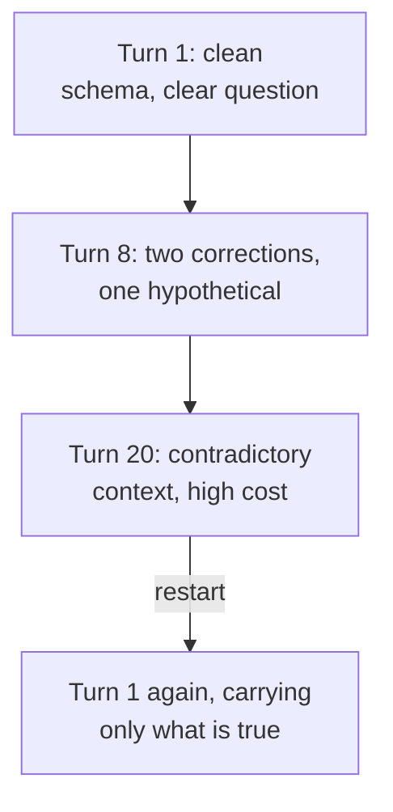

Two things happen as a conversation grows. It costs more, and the
answers get less reliable. Both come from the same mechanism, and
knowing the mechanism tells you what to do about it.

## The conversation is resent every time

Assistants are stateless. When you send your tenth message, the whole
conversation is sent again: your first nine messages, the assistant's
nine replies, and any files or schema you pasted along the way.

This has an immediate consequence for cost. A conversation with a
50,000-token schema pasted at the top pays for those 50,000 tokens on
**every subsequent turn**, not once. Twenty turns into that
conversation you have paid for a million tokens of schema.

It also explains why long conversations feel slower: there is more to
process before the first word of the answer appears.

<Callout type="info" title="Prompt caching changes the arithmetic">
All the major providers now offer prompt caching, which stores a
processed prefix and serves it back at roughly a tenth of the normal
input price. A stable schema at the top of a long conversation is
exactly the case it was designed for, which is why chat interfaces
apply it automatically. Course 2 covers the mechanism in detail.
</Callout>

## Drift: why the tenth answer is worse than the first

A long conversation accumulates content that is no longer true:

* A schema you pasted, then corrected two turns later. Both versions
  are still in context.
* A hypothetical you floated ("suppose the table had a `region`
  column") that has since become fact in the conversation's memory.
* Ten turns of debugging, including all the wrong approaches, all of
  which now sit in context as apparent examples of how to do this.

The model attends to all of it. It has no way to know which parts were
superseded, because nothing marks them as superseded. So it blends the
current schema with the old one and produces something that matches
neither.

The visible symptoms:

* Reintroducing a column you already corrected.
* Reverting a fix from three turns ago.
* Answers that read as a compromise between two incompatible framings.

## The fix is the same for both

**Start a new conversation.** Carry forward only what is still true:
the current schema, the current question, and any decisions that
stuck.

This is not a workaround. It is the correct use of a stateless system,
and it costs you thirty seconds of copying. A fresh conversation with
a clean 500-token setup is cheaper and more accurate than turn 25 of a
thread carrying 60,000 tokens of debugging history.

## Practical rules

* **Restart when the topic changes.** A new question does not benefit
  from the previous question's debugging.
* **Restart after a correction storm.** If you have corrected the
  model three times, the context now contains three wrong versions.
* **Do not paste the same schema twice.** If you need to correct it,
  restart instead, so only one version exists.
* **Watch for reintroduced errors.** A mistake you already fixed
  coming back is the clearest drift signal there is, and it means
  restart rather than correct again.

## Concept check

<MultipleChoice
  markdown={`Why does a long conversation cost more per turn than a short one?

- Because providers charge a surcharge for extended sessions.
  > There is no session surcharge; pricing is per token.
- Because responses get longer as conversations progress.
  > Response length does not systematically grow.
- Because older messages are stored at a premium rate.
  > Nothing is stored between requests in the first place.
- [o] Because the entire history is resent and reprocessed on every turn.
  > Assistants are stateless, so turn twenty pays for all nineteen previous turns plus everything you pasted.

Statelessness means every turn re-pays for the whole conversation.`}
/>

<MultipleChoice
  markdown={`You paste a schema, correct it two turns later, and ask a question at turn ten. What is in context?

- [o] Both versions, with nothing indicating which is current.
  > The model attends to the whole history and can blend the two into a schema matching neither.
- Only the corrected schema, since the correction supersedes it.
  > Nothing marks the earlier version as superseded.
- Only the original schema, since it was seen first.
  > Both remain, and neither is privileged by position.
- Neither, since schemas are discarded after two turns.
  > No content is discarded within the window.

The correction was added to the context, not applied to it.`}
/>

<MultipleChoice
  markdown={`What is the clearest signal that a conversation has drifted?

- The assistant's responses becoming longer.
  > Length varies for many reasons.
- The assistant using more technical vocabulary.
  > Vocabulary shifts with topic and says nothing about drift.
- The assistant asking clarifying questions.
  > Clarifying questions are usually a good sign.
- [o] An error you already corrected reappearing.
  > The superseded version is still in context and is being attended to again, which is drift by definition.

A resurrected mistake means the old context is winning.`}
/>

<MultipleChoice
  markdown={`Why is starting a fresh conversation better than correcting again?

- Because models become less capable after twenty turns.
  > Model capability does not degrade with turn count; the context does.
- Because a new conversation uses a newer model version.
  > The same model serves both.
- Because correction requests are billed at a higher rate.
  > There is no differential pricing for corrections.
- [o] Because a restart removes the superseded content instead of adding to it.
  > Each correction leaves the wrong version in place, so restarting is the only way to actually eliminate it.

Correcting adds. Restarting removes, which is what the situation needs.`}
/>

<MultipleChoice
  markdown={`What does prompt caching do to the cost of a long conversation with a stable schema?

- [o] It serves the repeated prefix at roughly a tenth of the input price.
  > A stable prefix is stored in processed form and billed at a large discount on subsequent turns.
- It compresses the schema so fewer tokens are billed.
  > No compression occurs; the token count is unchanged.
- It eliminates the cost of the schema entirely after the first turn.
  > Cached tokens are discounted rather than free.
- It moves the schema into a separate free storage tier.
  > There is no free storage tier for prompt content.

The prefix still costs something, just far less than reprocessing it
at full price.`}
/>

<MultipleChoice
  markdown={`You floated a hypothetical at turn three: "suppose the table had a \`region\` column". At turn fifteen, why might \`region\` appear in generated code?

- Because the model invented it independently at turn fifteen.
  > Possible in principle, but there is a specific and much likelier cause present.
- Because the model confused it with a column from its training data.
  > The far simpler explanation is that you supplied the name yourself.
- Because hypothetical framing is stripped from stored context.
  > Nothing is stripped; the full text remains.
- [o] Because the hypothetical is still in context and reads as an established fact.
  > Twelve turns later the conditional framing carries much less weight than the concrete column name.

Hypotheticals become facts as the conversation moves on from them.`}
/>

<MultipleChoice
  markdown={`Which is cheaper and more accurate: turn 25 of a thread with 60,000 tokens of history, or turn 1 of a fresh thread with a 500-token setup?

- [o] The fresh thread, on both counts.
  > It costs a fraction as much per turn and contains only content that is currently true.
- Turn 25, because accumulated context improves the answer.
  > Accumulated context includes superseded and contradictory material.
- Turn 25, because prompt caching makes long threads effectively free.
  > Caching reduces cost substantially without making it free, and it does nothing for accuracy.
- They are equivalent, since the same model handles both.
  > The model is the same; the context it is reasoning over is very different.

A clean context is both the cheaper and the more reliable option.`}
/>

<MultipleChoice
  markdown={`Which content is safe to carry into a fresh conversation?

- [o] The current schema, the current question, and decisions that stuck.
  > These are the parts that are still true, which is the whole selection criterion.
- The full transcript, so no information is lost.
  > This recreates exactly the problem you restarted to escape.
- Nothing, since any carryover reintroduces drift.
  > Carrying forward accurate context is helpful; it is stale context that causes drift.
- The debugging attempts, so the model avoids repeating them.
  > Wrong approaches in context read as examples rather than warnings.

Carry what is true. Leave behind what was superseded.`}
/>
