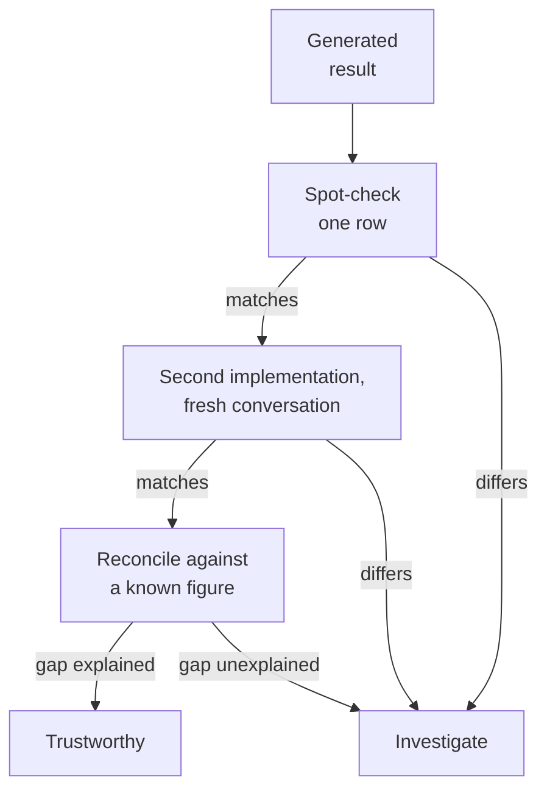

Reviewing code tests whether the code matches your understanding.
Cross-checking tests something stronger: whether the *answer* is
right, independently of whether either of you understood the problem.

## What makes a check independent

Two calculations are independent to the degree that they do not share
assumptions. Ranked from weakest to strongest:

| Check | Shares | Strength |
| --- | --- | --- |
| Run the same query again | Everything | None |
| Ask the same model to review its own code | Everything | Very weak |
| Ask a second model to review the code | The code | Weak |
| Ask for a second implementation, same data | The data and framing | Moderate |
| Compute it yourself a different way | Almost nothing | Strong |
| Compare against a known-good existing report | Almost nothing | Strong |

Note how weak self-review is. A model reviewing its own output starts
from the same misunderstanding that produced it, and the review reads
as thorough regardless.

## The cheapest strong check

Take one row of the result. Compute it by hand from the raw data.

If the pipeline says Region B did $412,300 in 2025, then filter the
raw table to Region B and 2025 and sum the amount column, directly,
with no joins or grouping. Two lines of code. If they match, the
entire chain is very likely correct, because the odds of two different
routes producing the same wrong answer are low.

If they do not match, you have learned something enormous for almost
no effort.

<Callout type="info" title="Why one row is enough">
People skip this because checking all 47 regions sounds tedious. You
do not check all 47. A pipeline defect is almost never
region-specific, so one region either exposes it or gives you real
evidence there is nothing to expose.
</Callout>

## The second-implementation trick

Open a fresh conversation. Give the same schema and question, phrased
differently, and ask for a solution in a *different tool*: SQL if the
first was Pandas, or vice versa. Then compare the numbers.

The fresh conversation matters. Asking in the same thread inherits the
whole context, including whatever misunderstanding is already present,
so the "second" answer is not independent at all.

Agreement is meaningful but not proof: both attempts can share a
misreading of your prompt. Disagreement is extremely valuable, because
it is a guaranteed signal that at least one of them is wrong and you
now know to look.

## Reconciling against something known

The strongest check available is comparing against a number that has
already survived scrutiny: last quarter's board deck, the finance
team's revenue figure, an existing dashboard.

You are usually not expecting an exact match, since definitions
differ. What you want is to be able to *explain the gap*. "Ours is 3%
higher because finance excludes internal transfers and we do not" is a
complete answer. "Ours is 3% higher and I do not know why" means you
are not finished.

## Concept check

<MultipleChoice
  markdown={`Why is asking a model to review its own output a weak check?

- [o] Because it starts from the same misunderstanding that produced the code.
  > Nothing in the review introduces information the original attempt lacked, so a shared wrong assumption survives intact.
- Because reviews are limited to syntax rather than logic.
  > Models comment on logic readily.
- Because models are unwilling to criticize their own work.
  > They will readily identify problems when asked.
- Because review requests are answered by a separate, weaker model.
  > The same model handles both.

Independence requires a different starting point, and self-review has
exactly the same one.`}
/>

<MultipleChoice
  markdown={`What makes spot-checking a single row a strong check despite its small scope?

- [o] Pipeline defects are rarely specific to one row, so one row usually exposes them.
  > A wrong join or wrong denominator affects the whole result, so a single independent recomputation surfaces it.
- It proves the result is correct for every other row.
  > It is strong evidence rather than proof, and the distinction matters.
- It verifies that the data contains no null values.
  > It says nothing general about nulls.
- It confirms the query is syntactically valid.
  > Validity was already established by the query running.

One row is a sample of a systematic property, which is why such a small
sample is informative.`}
/>

<MultipleChoice
  markdown={`Why must a second implementation be requested in a *fresh* conversation?

- Because context windows fill up and truncate the request.
  > Truncation is not the concern at ordinary conversation lengths.
- Because the same conversation is billed at a higher rate.
  > Billing does not affect independence.
- [o] Because the existing thread carries forward any misunderstanding already present.
  > A follow-up inherits the earlier framing and assumptions, so the second answer is not independent of the first.
- Because models refuse to answer the same question twice.
  > They will answer repeated questions readily.

The value of the second attempt comes entirely from it not knowing
about the first.`}
/>

<MultipleChoice
  markdown={`Two independent implementations produce the same number. What can you conclude?

- The number is definitely correct.
  > Both can share a misreading of your prompt, so agreement is not proof.
- The two implementations must have used the same algorithm.
  > Different tools were used deliberately; identical results do not imply identical methods.
- Nothing, since agreement between models is expected.
  > Agreement is genuine evidence, just not conclusive evidence.
- [o] It is meaningful evidence, weakened by both sharing your framing.
  > Independent routes to the same answer is real support, but a defect in how you described the problem affects both.

Agreement raises your confidence without settling the question,
particularly where your own prompt is the weak link.`}
/>

<MultipleChoice
  markdown={`Your figure is 3% above finance's number. When are you finished?

- When both teams agree to use your number going forward.
  > Agreement on which number to use does not establish why they differ.
- When you recompute your figure and get the same answer again.
  > Repeating your own calculation adds no independent information.
- When the difference falls below a 5% tolerance threshold.
  > An arbitrary threshold does not explain anything.
- [o] When you can explain what causes the gap.
  > A specific, checkable explanation such as a differing exclusion rule turns an unexplained discrepancy into a documented definitional difference.

An explained gap is a finding. An unexplained gap is unfinished work.`}
/>

<MultipleChoice
  markdown={`Which check is strongest?

- [o] Comparing against a number produced by a separate, established process.
  > An existing vetted figure shares almost no assumptions with your pipeline, which is what makes disagreement informative.
- Running the same query a second time.
  > This shares every assumption and tests only determinism.
- Asking the original model to explain its reasoning.
  > Explanation adds narrative rather than independent evidence.
- Asking a second model to review the first model's code.
  > The code, with its embedded assumptions, is still the shared starting point.

Strength tracks how little the two routes have in common.`}
/>

<MultipleChoice
  markdown={`Two independent implementations disagree. What is the correct response?

- [o] Investigate, since at least one is definitely wrong.
  > Disagreement is a guarantee of a defect somewhere, and finding it is the whole value of the exercise.
- Use the one produced by the more capable model.
  > Capability is not evidence about this particular result.
- Take the average of the two results.
  > Averaging a right answer with a wrong one produces a third wrong answer.
- Re-run both and take whichever result is reproducible.
  > Both are likely reproducible; reproducibility is not correctness.

A disagreement is the most useful outcome of the check, because it
proves there is something to find.`}
/>

<MultipleChoice
  markdown={`What is the practical objection to spot-checking, and why is it weak?

- It only works on numeric results.
  > Counts, rates, and categorical breakdowns can all be recomputed manually.
- [o] It feels tedious, though checking one row rather than all of them takes minutes.
  > The perceived cost comes from imagining exhaustive checking; a systematic defect shows up in the first row you try.
- It requires a second tool, which may not be approved.
  > A manual recomputation uses the same tool you already have.
- It requires access to raw data, which analysts often lack.
  > Analysts computing the result necessarily have the raw data.

The objection is to a version of the task nobody is proposing.`}
/>
