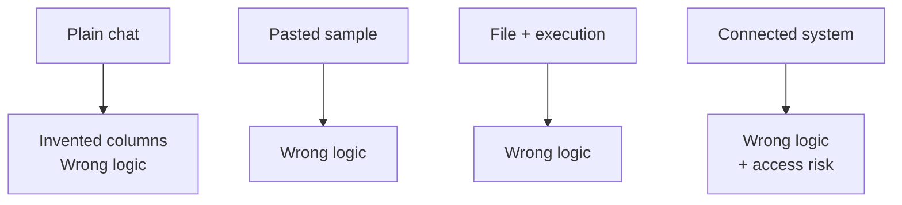

Before you can judge an answer, you need to know what the assistant
was actually looking at when it produced that answer. There are four
arrangements, and they differ enormously.

## Mode 1: Nothing (plain chat)

You type a question. No file, no connection.

The model's entire knowledge of your data is **the words in your
message**. If you write "I have a customers table", it knows you have
a table called customers and nothing else. Any column it mentions is
invented, drawn from what tables called `customers` usually contain in
its training data.

This is not a bug. It is doing exactly what you asked. The mistake is
on the reader's side: the output *looks* like it was written by
someone who had seen your table.

<Callout type="warn" title="The most common misread in the whole course">
In plain chat, every column name in the answer that you did not supply
is a guess. Confident formatting does not change that. `customer_id`
appearing in the generated query is not evidence that `customer_id`
exists.
</Callout>

## Mode 2: Pasted sample rows

You paste the output of `df.head()` or a `CREATE TABLE` statement.

Now the model knows your actual column names and can see example
values. This closes the biggest gap, and it is a very cheap thing to
do. It is the single highest-return habit in this course, and the next
chapter is devoted to doing it well.

What it still does not know: the *distribution* beyond your sample,
whether nulls exist below row 5, whether the grain is one row per
order or one row per order line, or what happened in the 2024
migration.

## Mode 3: Uploaded file with code execution

You attach a CSV and the assistant runs Python on it in a sandbox.

This is a genuine step change, because the model now gets **feedback**.
It writes code, sees the traceback or the output, and corrects itself.
A column name it invented will raise a `KeyError` immediately, and it
will fix it without you saying anything.

Two things to keep in mind:

* **It sees results, not meaning.** Execution eliminates crashes. It
  does nothing about a query that runs cleanly and answers a subtly
  different question than the one you asked.
* **The sandbox is isolated.** It usually has no internet access, and
  the environment disappears after the session.

## Mode 4: Connected to a live system

Through MCP or a vendor connector, the assistant can query your actual
warehouse.

The upside is large: it can introspect the real schema rather than
guessing at it. The risks change shape rather than going away:

* **Write access is a genuine hazard.** A connection that can `DELETE`
  is a connection that can delete. Read-only credentials are the
  default posture for analysis work.
* **Data volume and cost.** A model that decides to `SELECT *` from a
  billion-row table has just run an expensive query.
* **Everything it reads becomes context**, with all the privacy
  implications that carries.

## The risk table

| Mode | Knows real columns | Gets error feedback | Main risk |
| --- | --- | --- | --- |
| Plain chat | No | No | Invented schema |
| Pasted sample | Yes | No | Wrong assumptions past the sample |
| File + execution | Yes | Yes | Right code, wrong question |
| Connected system | Yes | Yes | Access scope, cost, data exposure |

Notice the pattern: as you move down the table, crash-type errors
disappear and **logic-type errors stay exactly where they were**. No
amount of tooling substitutes for reading the answer.

## Concept check

<MultipleChoice
  markdown={`In plain chat with no file attached, you write "my orders table has a total column". The assistant's answer references \`order_date\`. What do you know about \`order_date\`?

- It exists, because the assistant would not reference a column it could not verify.
  > The assistant has no verification mechanism in plain chat; it cannot check anything.
- It does not exist, since you did not mention it.
  > It may well exist; the point is that the answer is not evidence either way.
- It exists, because \`order_date\` is a standard column in orders tables.
  > Conventional naming makes it a good guess, not a fact about your table.
- [o] Nothing. It is a guess based on what orders tables usually contain.
  > You supplied one column name; every other column in the answer is inferred from patterns in similar data.

Everything past what you typed is inference, and inference is right
often enough to be dangerous.`}
/>

<MultipleChoice
  markdown={`Which class of error does sandboxed code execution reliably eliminate?

- Using an inner join where a left join was intended.
  > An inner join executes without complaint; only the row count differs.
- Grouping by a display name instead of a key.
  > This runs perfectly and returns plausible output, so execution never flags it.
- [o] References to columns that do not exist.
  > A missing column raises immediately, and the assistant sees the traceback and corrects itself.
- Computing a rate against the wrong denominator.
  > Both denominators are valid columns, so the arithmetic completes normally.

Execution kills the errors that crash. It leaves every error that runs.`}
/>

<MultipleChoice
  markdown={`You paste \`df.head()\` output covering five rows. Which assumption is still unsafe?

- That the column names shown are the real column names.
  > The header line is literal output, so the names are accurate.
- That \`amount\` holds numeric-looking values in those rows.
  > You can see the displayed values, so this much is directly observed.
- That the table contains at least five rows.
  > Five rows were displayed, so at least five exist.
- [o] That the column contains no nulls, because none appear in the sample.
  > Five rows say nothing about the other rows; nulls commonly appear later in a file and are a leading cause of silent wrongness.

A sample is evidence about the sample. Extending it to the full column
is exactly the inference that gets analysts into trouble.`}
/>

<MultipleChoice
  markdown={`What is the most important precaution when connecting an assistant to a production database?

- Choosing an assistant with the largest context window.
  > Window size is unrelated to access scope.
- [o] Granting read-only credentials.
  > A connection that can write can also destroy, and analysis work never requires write access.
- Disabling the assistant's ability to format tables.
  > Output formatting is cosmetic and carries no risk.
- Limiting the conversation to fewer than twenty messages.
  > Conversation length has nothing to do with what the connection can do.

Scope the credentials to what the task actually needs, which for
analysis is reading.`}
/>

<MultipleChoice
  markdown={`An assistant with file execution runs your CSV and reports "the average order value is $84.10". What has execution guaranteed?

- That $84.10 answers the question you meant to ask.
  > Execution has no opinion on intent; it can compute the wrong average flawlessly.
- [o] That the code ran to completion and produced that number from your file.
  > Execution certifies the arithmetic happened on your data, and nothing beyond that.
- That no rows were dropped during loading.
  > Rows can be dropped silently by parsing or filtering without any error.
- That the column used was the correct one for the question.
  > Column choice is a modelling decision the sandbox cannot evaluate.

Execution is a guarantee about mechanics, never about meaning.`}
/>

<MultipleChoice
  markdown={`Which mode carries the risk of an assistant running an unexpectedly expensive query?

- Plain chat with no attachments.
  > Nothing is executed at all in plain chat.
- [o] A live connection to a large warehouse.
  > The assistant can issue a query that scans an enormous table, and warehouse billing is usually per byte scanned.
- Uploading a 2 MB CSV for sandbox analysis.
  > The file is small and the sandbox is isolated, so cost is bounded.
- Pasting the first twenty rows of a table.
  > Pasted text is inert; nothing runs.

Only a live connection lets a generated query reach infrastructure that
charges by volume.`}
/>

<MultipleChoice
  markdown={`What does a connected assistant gain that a "pasted sample" assistant does not?

- The ability to interpret business meaning of a column.
  > Semantic meaning is organizational knowledge and is not recoverable from a schema.
- [o] The ability to introspect the real schema rather than rely on your description.
  > It can list tables and columns itself, which removes transcription gaps and invented names.
- Immunity from aggregation mistakes.
  > Aggregation errors occur equally against a real schema.
- A guarantee that its queries reflect your intent.
  > Intent is never guaranteed by access.

Connection replaces your description of the schema with the schema
itself. That is a real gain and a narrow one.`}
/>

<MultipleChoice
  markdown={`Reading down the risk table from plain chat to a connected system, what stays constant?

- The chance that the assistant invents a column name.
  > This falls sharply once the model can see or introspect the real schema.
- [o] The chance that correct-running code answers the wrong question.
  > Logic errors are untouched by tooling, because every mode executes what was asked rather than what was meant.
- The chance that generated code raises a runtime error.
  > Execution feedback drives crash rates down substantially.
- The amount of data exposed to the vendor.
  > Exposure increases considerably as you move toward connected systems.

Better plumbing removes crashes. It does not remove misunderstanding.`}
/>
