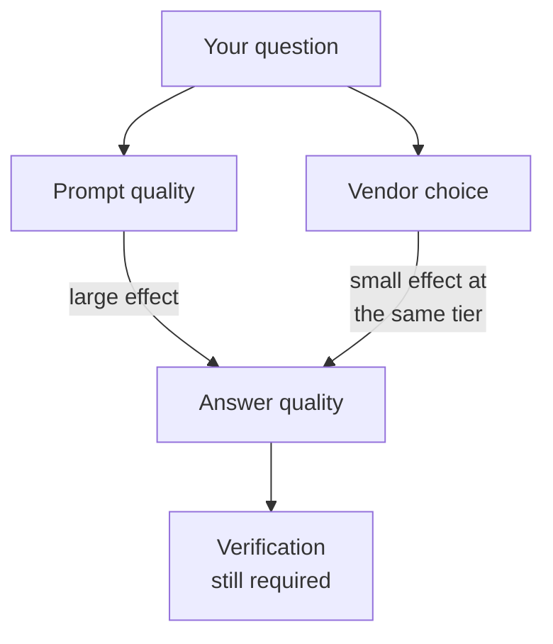

Three assistants dominate general-purpose analysis work: **ChatGPT**
(OpenAI), **Claude** (Anthropic), and **Gemini** (Google). All three
offer a free tier and a paid tier at around $20 per month, and all
three can read a spreadsheet, write analysis code, and explain a
result.

<Figure
  slug="aida-tool-landscape-cutout"
  alt="Three friendly rounded assistant robots of different colors standing on separate low platforms, each holding the same small data tile, a shared toolbelt of identical instruments laid out in front of them"
/>

<Callout type="warn" title="Dated material">
Everything specific in this chapter reflects **August 2026**. Model
names and feature lists move faster than any course can. What is
durable is the *categories* of capability, which have been stable for
some time and are what the rest of the course builds on.
</Callout>

## The capability categories that matter

Rather than memorizing which product currently leads, learn the four
axes that actually change your workflow.

### 1. Can it run code on your file?

This is the single most important distinction, and we give it its own
chapter next. An assistant that only writes code is a very different
collaborator from one that writes code, runs it on your uploaded CSV,
sees the traceback, and fixes itself.

All three major assistants now offer a sandboxed Python environment on
their paid tiers, under various names. When it is available, it
converts "here is some code, hope it works" into "here is a result I
actually computed".

### 2. How much can it hold at once?

Context windows have grown enormously. Frontier models now advertise
windows around one million tokens, which is a few thousand pages of
text. This matters for analysis in a narrow but real way: you can
paste an entire schema definition, a long data dictionary, and a
sample of rows without truncation.

It matters less than the headline suggests, for reasons covered in
*Context, Cost, and Drift*: a model with a million-token window does
not attend equally well to all million tokens, and you pay for every
one of them on every turn.

### 3. What is it connected to?

Plain chat is isolated. But all three vendors now support connecting
assistants to live systems through the **Model Context Protocol**
(MCP), an open standard introduced by Anthropic in late 2024 that
OpenAI, Google, and Microsoft subsequently adopted. By 2026 it is the
de facto way to give an assistant access to a database, a file store,
or an internal API.

A connected assistant can check a schema instead of guessing at it,
which removes an entire class of errors covered in *Invented Columns*.

### 4. How strong is it at long, multi-step work?

Assistants differ most on tasks that require many steps held together
coherently: reading a repository, running a multi-stage pipeline,
debugging across several files. This is the axis on which the coding-
focused offerings compete hardest, and it is the least stable axis of
the four.

## What the differences do not affect

It is worth being blunt: for a single well-specified analysis
question, on a dataset that fits in the context window, the three
assistants are close enough that your prompt quality matters more than
your choice of vendor.

The failure modes in this course (invented columns, broken joins,
aggregation traps, silent null handling) appear in all of them.
Choosing a different assistant is not a mitigation. Verification is.

## A reasonable default setup

If you want a recommendation rather than a survey:

* Use whichever assistant your organization has already approved,
  because the governance question (covered later) outranks the
  capability question for most real work.
* Prefer a tier with sandboxed code execution if you work with files.
  Being able to say "run it and show me the output" removes a large
  fraction of wasted round trips.
* Keep a second assistant available for cross-checking, which is a
  technique we develop in *Cross-Checking a Number*.

## Concept check

<MultipleChoice
  markdown={`Which capability difference between assistants has the largest practical effect on analysis work?

- [o] Whether it can execute code against your uploaded file.
  > Execution converts an untested suggestion into a computed result the model has seen the output of, which changes the whole interaction.
- The number of languages the assistant can converse in.
  > Multilingual ability is broadly comparable and rarely the constraint in analysis.
- The visual design of the chat interface.
  > Interface polish affects comfort, not correctness.
- The maximum length of a single response.
  > Response caps rarely bind on analysis tasks and are easily worked around by asking for output in parts.

Execution is the dividing line between "here is code that might work"
and "here is a result I actually produced".`}
/>

<MultipleChoice
  markdown={`What is the Model Context Protocol (MCP)?

- A benchmark suite for comparing assistant accuracy on analysis tasks.
  > Benchmarks are a separate topic; MCP is not an evaluation.
- A proprietary Anthropic format for compressing long prompts.
  > It is neither proprietary in practice nor a compression scheme.
- [o] An open standard for connecting assistants to external tools and data.
  > Introduced by Anthropic in late 2024 and adopted across the major vendors, it is how assistants reach databases, files, and internal APIs.
- A licensing agreement governing commercial use of model outputs.
  > Licensing terms are separate contractual documents.

MCP standardizes the plumbing between an assistant and the systems it
needs to reach.`}
/>

<MultipleChoice
  markdown={`Your colleague argues that switching from one frontier assistant to another will fix the wrong-join problems your team keeps hitting. What is the best response?

- [o] Disagree, because that failure mode appears in every assistant.
  > Switching vendors changes the failure rate somewhat and the failure *type* not at all, so it substitutes for verification rather than adding to it.
- Agree, since join handling is the clearest quality difference between vendors.
  > Join errors are not a vendor-specific defect; they appear across all of them.
- Disagree, because join errors are always caused by bad schema design.
  > Schema quality contributes, but the errors occur against well-designed schemas too.
- Agree, but only if the new assistant has a larger context window.
  > Context size does not address a model reasoning incorrectly about relationships between tables.

Vendor choice moves the numbers a little. It does not remove a class of
error, which is what the team actually needs.`}
/>

<MultipleChoice
  markdown={`Why does a one-million-token context window matter less for analysis than the headline number suggests?

- [o] Because attention quality degrades across a long window and you pay for every token each turn.
  > Filling the window has both an accuracy cost and a direct financial cost that recurs on every message.
- Because context windows apply only to output, not to input.
  > The window covers input and output together; output has its own separate cap.
- Because most analysis datasets exceed a million tokens anyway.
  > Plenty of analysis datasets fit comfortably; the issue arises even when they do.
- Because assistants silently truncate anything past 100,000 tokens.
  > Advertised windows are real; the problem is not silent truncation.

A big window is an option, not an instruction. Using all of it has real
costs on both axes.`}
/>

<MultipleChoice
  markdown={`For a single, well-specified question on a dataset that fits comfortably in context, what has the largest effect on answer quality?

- [o] How precisely you described the data and the question.
  > Schema, grain, and intent are the information the model does not otherwise have, so supplying them well dominates.
- Whether you asked in the morning or the evening.
  > Time of day has no bearing on model behavior.
- Which of the three major assistants you used.
  > At comparable tiers the gap on a single well-specified question is small.
- The length of your conversation history before asking.
  > Longer history can hurt through drift, but it is not the dominant factor on a fresh, well-specified question.

The model's biggest handicap is not knowing your data. Prompt quality
is how you fix that.`}
/>

<MultipleChoice
  markdown={`Which of these is the best reason to keep a second assistant available?

- To increase the total number of answers you can generate per hour.
  > Volume is not the constraint; verified volume is.
- To reduce your monthly subscription costs.
  > Two subscriptions cost more, not less.
- [o] To cross-check an important result against an independent attempt.
  > Two independently produced answers that agree is weak but real evidence, and disagreement flags something worth investigating.
- Because one vendor's answers are always correct when the other's are wrong.
  > Neither vendor is reliably right where the other is wrong; that is not how the errors distribute.

Independence is the value. Two attempts that agree are more
trustworthy than one, and a disagreement is a useful alarm.`}
/>

<MultipleChoice
  markdown={`Your organization has approved exactly one AI assistant for internal data work, and it is not the one that currently leads on public coding benchmarks. What should drive your choice?

- The benchmark leader, since accuracy on coding tasks is the priority.
  > Benchmark leads are narrow, they change frequently, and they do not outrank a governance decision.
- Whichever tool your team already knows best, regardless of approval.
  > Familiarity is a real benefit but does not authorize sending data to an unapproved processor.
- [o] The approved tool, because governance constraints outrank small capability gaps.
  > Sending company data through an unapproved service is a policy and legal problem, and the capability difference at comparable tiers is modest.
- Whichever tool has the largest context window available.
  > Context size is one capability among several and does not override policy.

Where your data is allowed to go is a harder constraint than which
model scores highest this quarter.`}
/>

<MultipleChoice
  markdown={`On which axis do the major assistants differ *most*, and least predictably over time?

- [o] Coherence across long, multi-step, tool-using tasks.
  > This is the hardest capability to build, the most actively competed on, and therefore the fastest to change hands.
- Ability to translate between SQL dialects.
  > All of them handle dialect translation well and have for some time.
- Support for uploading a CSV file.
  > File upload is table stakes across the paid tiers.
- Willingness to answer questions about statistics.
  > None of them refuse ordinary statistical questions.

Long-horizon agentic work is where the leaderboard actually moves.
Single-question accuracy has largely converged.`}
/>
