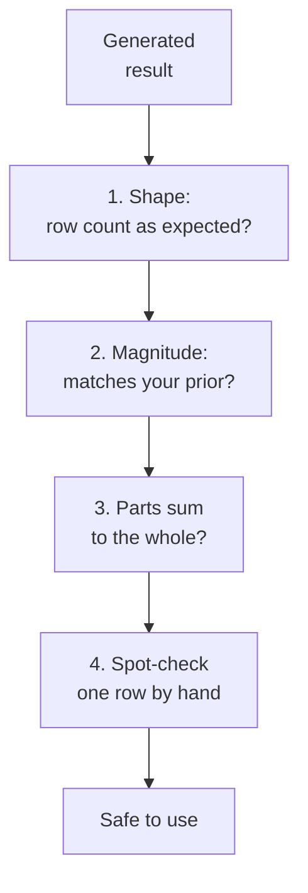

This chapter is the centre of the course. Everything before it was
setup; everything after it is detail on the specific things that go
wrong.

<Figure
  slug="aida-verification-habit-cutout"
  alt="A small four-station inspection line where one glowing number tile passes through four gates in turn, each gate a different simple instrument, a scale, a ruler, a balance, and a magnifier"
/>

The habit is this: **before a generated number leaves your screen, run
four checks.** They take under a minute together. They are not a
replacement for understanding the code, they are what makes
understanding the code fast.

## Check 1: Does the shape make sense?

Not the value, the *shape*.

* How many rows came back? If you grouped by region and there are 47
  regions, something is wrong with the grouping key.
* Is it one row per thing you expected one row per?
* Did the row count change across a join in a way you can explain?

Shape errors are the most common and the easiest to spot, and almost
nobody looks.

## Check 2: Does the magnitude make sense?

You usually have a rough prior. Monthly revenue is in the millions,
not the thousands. Conversion rate is a few percent, not 40%. Average
order value is around $80, because it has been around $80 for two
years.

If the number violates your prior, the number is wrong far more often
than your prior is. Investigate before you get excited.

<Callout type="info" title="Order-of-magnitude beats precision">
You do not need to know the right answer to catch a wrong one. Knowing
that it should be "roughly a hundred thousand" catches a result of
1,204 and a result of 8.4 million equally well, and those are the
errors that matter.
</Callout>

## Check 3: Do the parts sum to the whole?

This one catches an astonishing range of bugs in one step. If you have
a per-region breakdown, sum it and compare against the ungrouped
total. If they differ:

* rows with a null grouping key were silently dropped, or
* a filter was applied in one branch and not the other, or
* a join duplicated rows in some groups and not others.

All three are common and all three are invisible until you add up the
column.

## Check 4: Spot-check one row by hand

Pick a single customer, order, or region and compute its value
manually from the raw data. If the pipeline says Region B did
$412,300, filter the raw table to Region B and sum it yourself.

This is the only check that tests the *whole chain* end to end. It
catches errors no structural review will find, because it does not
rely on you having understood the code correctly.

## Why this beats reading the code carefully

Careful code reading is valuable and it is not sufficient, for one
reason: **you read the code with the same assumptions that produced
the wrong code.** If you believe the table is one row per order, you
will read an order-level aggregation as correct, because within your
belief it is correct.

The four checks are different because they test the *output* against
reality rather than testing the code against your understanding. That
is why the spot-check matters most, and why it is the one people skip.

## Concept check

<MultipleChoice
  markdown={`Which check tests the entire pipeline end to end rather than one property of it?

- [o] Recomputing one row by hand from the raw data.
  > It reproduces the full chain independently, so it catches errors anywhere in it, including ones you misread in the code.
- Checking that group totals sum to the grand total.
  > This catches dropped rows and duplication, but a uniformly wrong calculation still sums consistently.
- Comparing the magnitude against your prior.
  > A useful smell test, but it only detects errors large enough to move the order of magnitude.
- Confirming the row count matches expectations.
  > This tests structure only, and a correctly shaped result can still hold wrong values.

Only the manual spot-check is independent of your understanding of the
code.`}
/>

<MultipleChoice
  markdown={`You group orders by \`region\` and get 47 rows, but the business has 6 regions. What is the most likely cause?

- The query is correct and the business has more regions than you thought.
  > Possible but unlikely, and it is the explanation to consider only after checking the data.
- [o] The values are inconsistent, such as varying case or whitespace.
  > "North", "north", and "North " group separately, which is the classic cause of an inflated group count.
- The result needs a \`DISTINCT\` clause added.
  > \`DISTINCT\` on an aggregate result would not merge variants of the same region name.
- \`GROUP BY\` returns one row per input row in some dialects.
  > It does not; grouping collapses rows in every SQL dialect.

An unexpectedly high group count almost always means the grouping key
has dirty variants.`}
/>

<MultipleChoice
  markdown={`Your per-region revenue sums to $2.1M but the ungrouped total is $2.3M. What is the most likely explanation?

- [o] Rows with a null \`region\` were dropped by the grouping.
  > Nulls in the grouping key commonly vanish from grouped output while still counting toward an ungrouped total.
- Rounding error accumulated across the groups.
  > Rounding does not produce a 9% gap.
- The grouped query used a different date range by accident.
  > Possible, but there is a much more common cause with exactly this signature.
- The ungrouped total double-counted refunds.
  > That would make the grouped result the trustworthy one, but null handling is the far more frequent cause of this exact discrepancy.

A grouped total that falls short of the grand total is the signature of
a null grouping key.`}
/>

<MultipleChoice
  markdown={`Why is careful code reading insufficient on its own?

- [o] Because you read the code using the same assumptions that produced it.
  > If you believe the wrong thing about the grain, an aggregation built on that belief reads as correct.
- Because generated code is too long to read reliably.
  > Length is a nuisance; the deeper problem is independent of it.
- Because code review cannot detect syntax errors.
  > Syntax errors are the easiest thing to detect and rarely survive anyway.
- Because reviewers rarely know the language well enough.
  > Fluent reviewers hit this problem too.

Shared assumptions between the writer and the reviewer are exactly what
output-based checks are immune to.`}
/>

<MultipleChoice
  markdown={`An analysis reports average order value of $6,240 for a business whose orders have averaged about $80 for two years. What should you conclude?

- That the average is being distorted by a single large order.
  > One outlier rarely moves an average this far, and the magnitude points elsewhere.
- That the definition of "order" must have changed.
  > Worth checking eventually, but not the first hypothesis for a discrepancy of this size.
- That a genuine shift occurred and should be reported urgently.
  > A 78-fold jump is far more likely to be a defect than a real change.
- [o] That the calculation is almost certainly wrong.
  > A result that violates a stable prior by that margin is a bug until proven otherwise, and cents-versus-dollars or a bad join are prime suspects.

When a number contradicts a well-established prior, doubt the number.`}
/>

<MultipleChoice
  markdown={`Which situation would the "parts sum to the whole" check *fail* to catch?

- A join duplicating rows within one group.
  > That group is inflated and the sums disagree, so this is caught.
- A filter applied to the grouped query but not the total.
  > The two disagree, so this is caught.
- [o] Every row's amount being read in cents instead of dollars.
  > Both the parts and the whole are inflated by the same factor of 100, so they agree perfectly while both are wrong.
- Rows with null grouping keys silently dropped.
  > The grouped sum falls short of the total, so this is caught.

Consistency checks catch inconsistency. A uniform error stays
consistent.`}
/>

<MultipleChoice
  markdown={`After a join, your row count went from 12,400 to 12,400. What does this tell you?

- Nothing useful, since row counts are unrelated to join correctness.
  > Row counts are one of the most informative join diagnostics available.
- That the join was definitely correct.
  > It rules out one failure mode, not all of them; the join could still be on the wrong key.
- [o] That the join did not fan out, though it may still have matched wrongly.
  > A stable count rules out duplication, and says nothing about whether the matched rows are the right ones.
- That the join matched every row on both sides.
  > An unchanged count is also consistent with a one-to-one join that dropped and added equal numbers of rows.

The count is evidence about multiplication, not about correctness of
the matching.`}
/>

<MultipleChoice
  markdown={`Which check is most often skipped, and why does that matter?

- The sum check, because it requires a second query.
  > It does need a second query, but it is quick and commonly done.
- The magnitude check, because analysts lack priors.
  > Most analysts have decent priors and apply them almost automatically.
- The shape check, because row counts are hard to obtain.
  > Row counts are trivially available.
- [o] The manual spot-check, because it is the only one requiring real work.
  > It takes a few minutes rather than seconds, and it is also the only check independent of your reading of the code.

The most informative check is the most effortful one, which is exactly
why it gets dropped under time pressure.`}
/>
