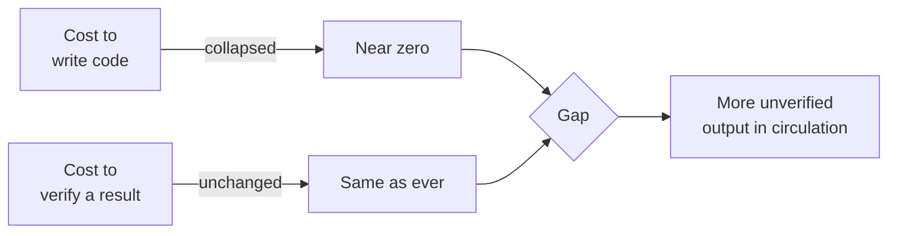

Between 2023 and 2026, one specific thing about analysis work changed
enormously, and almost everything else stayed exactly where it was.
Getting the boundary right is the difference between using these tools
well and being quietly burned by them.

<Figure
  slug="aida-what-changed-cutout"
  alt="Two side-by-side platforms, one holding a tall slow stack of hand-cut blocks and the other a fast conveyor pouring finished blocks out quickly, with a single small inspection gate at the end of both"
/>

## What changed: the cost of a first draft

Writing a first draft of analysis code used to be a real cost. You
looked up the `pivot_table` signature. You remembered which argument
`merge` wanted. You wrote thirty lines of reshaping before you learned
anything about the data.

That cost is now close to zero. Describe what you want, get working
syntax back in seconds, in whichever dialect you asked for. This is
genuinely transformative for a few categories of work:

* **Syntax recall.** Nobody needs to memorize `str.extract` regex
  behavior any more.
* **Translation.** Pandas to SQL, SQL to dplyr, Excel formula to
  Python. These are near-mechanical and models do them well.
* **Boilerplate.** Loading, parsing dates, renaming forty columns to
  snake_case, writing the plot scaffolding.
* **Getting unstuck.** A blank page is much less intimidating when a
  plausible starting point costs one sentence.

## What did not change: the cost of being wrong

Here is the part that gets missed. The cost of *producing* an answer
collapsed. The cost of *a wrong answer reaching a decision* did not
move at all.

If anything, it went up, for a reason worth stating plainly:
**verification did not get faster at the same rate as generation.**
You can now produce ten candidate analyses in the time it used to take
to produce one. You cannot check ten analyses in the time it used to
take to check one. So the ratio of generated work to verified work has
shifted, and it has shifted in the direction of risk.

## The three-part job that survived

Analysis work was never mostly typing. Strip out the typing and the
job that remains is:

1. **Deciding what question to ask.** A model will answer the question
   you asked. It has no way to know that the question you asked is not
   the question your organization needs answered.
2. **Knowing whether the data can answer it.** Whether `status` was
   backfilled in 2024, whether test accounts are still in the table,
   whether "active user" means what the dashboard says it means. This
   knowledge lives in your organization, not in the model.
3. **Judging whether the answer is trustworthy.** Which is this
   course's subject.

None of those three shrank. The middle one arguably grew, because a
model that cannot see your data will confidently reason about it
anyway.

<Callout type="info" title="A useful reframing">
It helps to stop thinking of the assistant as an oracle that returns
answers, and start thinking of it as a very fast junior colleague who
has never seen your data, never met your stakeholders, and will never
tell you when they are guessing. That framing gets the right behavior
out of you almost automatically.
</Callout>

## The skill that got more valuable

Notice what this implies about your own development. Before, an
analyst's marginal hour was often best spent getting faster at
producing code. Now it is best spent getting faster at *evaluating*
code, because that is the step that did not get automated and is now
the bottleneck.

That is a genuinely different skill. Producing code rewards knowing
one correct approach. Evaluating code rewards knowing the space of
plausible-looking wrong approaches, which is a much larger and more
interesting body of knowledge.

## Concept check

<MultipleChoice
  markdown={`Why does the arrival of fast code generation increase the practical risk of a wrong analysis reaching a decision?

- [o] Because generation got much faster while verification did not.
  > The ratio of produced-to-checked work shifts, so more unverified output circulates than before.
- Because analysts using AI tools tend to work on harder problems.
  > Problem difficulty is roughly unchanged; the shift is in how much output is produced per unit of checking.
- Because generated code contains more syntax errors than hand-written code.
  > Generated code usually has *fewer* syntax errors; the errors that survive are logical ones that run cleanly.
- Because models are trained mostly on incorrect examples.
  > Training corpora skew heavily toward working code; the problem is fit to your specific data, not the quality of the training examples.

Generation and verification scaled at very different rates, and the gap
between them is where the risk lives.`}
/>

<MultipleChoice
  markdown={`Which of these tasks is the *strongest* fit for delegating to an AI assistant?

- Deciding whether a 4% drop in weekly signups is worth escalating.
  > This needs organizational context and judgment about consequences, neither of which the model has.
- [o] Rewriting a working Pandas pipeline as an equivalent SQL query.
  > Translation between dialects is near-mechanical and well represented in training data.
- Choosing which customer segment the team should analyze next quarter.
  > This is a prioritization decision that depends on business strategy.
- Determining whether the \`is_active\` flag was backfilled correctly in 2024.
  > This is a fact about your systems that exists nowhere in the model's training data.

Translation tasks have a checkable, well-defined correct answer and
appear constantly in training data, which is exactly the profile models
handle well.`}
/>

<MultipleChoice
  markdown={`An analyst says: "I don't need to know Pandas any more, the model writes it for me." What is the strongest objection?

- [o] You cannot review code in a language you cannot read.
  > Reviewing is now the bottleneck, and reviewing requires more fluency than writing does, not less.
- Writing the code was always the hardest part of the job.
  > Writing was rarely the hardest part; that is precisely why automating it changed less than expected.
- Pandas syntax changes too frequently for a model to track.
  > The API is comparatively stable, and this is not the core issue.
- Models are not able to write correct Pandas code.
  > They frequently write correct Pandas; the objection has to be sharper than a blanket accuracy claim.

You can get away with not *writing* Pandas. You cannot get away with
not *reading* it, because reading is the step that catches the errors.`}
/>

<MultipleChoice
  markdown={`Which part of the analyst's job did AI assistance shrink the least?

- Producing an initial working draft of a transformation.
  > First drafts are the clearest win, and they now cost roughly one sentence.
- Recalling function signatures and argument names.
  > This is almost entirely handled now; nobody needs to memorize argument orders.
- Writing plotting and file-loading boilerplate.
  > Boilerplate generation is reliable and saves real time.
- [o] Knowing what the data actually represents.
  > Institutional knowledge about collection, filtering, and definitions lives in your organization, not in the model.

The model has read a great deal about Pandas and nothing at all about
your company's 2024 schema migration.`}
/>

<MultipleChoice
  markdown={`Why is "the model will tell me if it isn't sure" an unsafe assumption?

- Uncertainty warnings are stripped out by the chat interface.
  > Interfaces pass model text through; nothing is filtering out hedges.
- Models only express uncertainty when the temperature setting is raised.
  > Sampling settings affect variability of wording, not calibrated self-assessment.
- Models are specifically trained to conceal their uncertainty.
  > There is no such training objective; the behavior emerges from how fluent text generation works.
- [o] Output fluency is roughly constant whether the model is right or wrong.
  > A confident-sounding answer and a correct answer are produced by the same process, so tone carries almost no signal about accuracy.

Fluency is a property of the generation process, not a signal about
whether the content is correct.`}
/>

<MultipleChoice
  markdown={`A team adopts an AI assistant and their analysis throughput triples. Which metric should they watch most closely?

- The average length of generated code snippets.
  > Snippet length says nothing about correctness.
- [o] The share of published results that were independently checked.
  > This is the ratio that the speed-up puts under pressure, and the one that predicts whether errors reach decisions.
- The number of prompts sent per analyst per day.
  > Prompt volume measures activity, not quality or risk.
- The proportion of queries written in SQL rather than Pandas.
  > Dialect choice is orthogonal to whether results are trustworthy.

Throughput gains are only real if the verification rate keeps up with
them.`}
/>

<MultipleChoice
  markdown={`Which statement best describes what a language model knows about *your* dataset when you type a question into a chat window with no file attached?

- [o] Only what you have told it in the conversation.
  > Everything else it produces about your schema is inference from patterns in similar-sounding data.
- It has indexed your organization's databases during training.
  > Training data is public and licensed text; your internal tables are not in it.
- It knows the schema if you mention the table name, since table names are standardized.
  > Table names are not standardized, and naming a table conveys almost nothing about its columns.
- It can query your warehouse to check column names before answering.
  > Not without an explicit connection or tool; plain chat has no data access.

With no attachment and no connection, the model's entire picture of
your data is the text you typed.`}
/>

<MultipleChoice
  markdown={`Why is evaluating code arguably a *deeper* skill than writing it?

- Because evaluation is performed under stricter time pressure.
  > Time pressure varies by situation and is not intrinsic to the skill.
- Because evaluators must be able to rewrite the code from scratch.
  > A reviewer often does not rewrite anything, and rewriting is not what catches defects.
- [o] Because it requires knowing the space of plausible wrong answers, not one right one.
  > Writing needs a single working approach; judging needs a mental catalogue of the ways an approach can look fine and not be.
- Because evaluation requires memorizing more function signatures.
  > Signature recall matters less for evaluation than for writing.

Writing rewards one correct path. Reviewing rewards familiarity with
every wrong path that still runs.`}
/>
