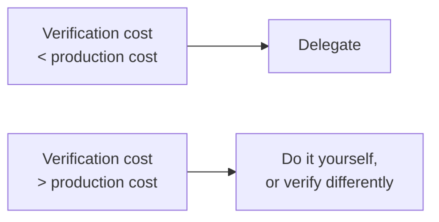

This course has spent several chapters on things that go wrong. That
is the right emphasis, because the failures are what nobody warns you
about. But a course that left you afraid of the tools would be giving
bad advice, because for a substantial fraction of analysis work they
are simply better than doing it yourself.

## The property that predicts success

Every task in this chapter has the same shape:

**The correct answer is checkable in less time than producing it.**

That is the whole rule. If you can verify a result faster than you
could have created it, delegating is a clear win even at a
non-trivial error rate, because the error rate is caught by the
verification and you keep the speed.

Where verification costs as much as production, or more, the
economics reverse. That is the next chapter.

## The strong-fit list

### Translation between dialects

Pandas to SQL, SQL to dplyr, Excel formula to Python, Stata to R. The
semantics are well defined, examples are abundant in training data,
and the result is directly checkable by running both and comparing.

### Syntax and API recall

`str.extract` regex behavior, the argument order of `pivot_table`, how
to make a window function do a rolling 7-day sum. Recall tasks with a
single correct answer that you will recognize immediately.

### Boilerplate

Reading a directory of files, parsing dates in six formats, renaming
forty columns to snake_case, setting up plot axes and labels. Tedious,
mechanical, and instantly verifiable by looking at the output.

### Regular expressions

Genuinely one of the strongest use cases. Writing a regex is hard,
reading one is harder, and testing one against examples is trivial.
Ask for the pattern, then test it on ten strings.

### Explaining unfamiliar code

You inherited a 200-line script. Asking what it does is a fast way to
orient, and you can spot-check the explanation against the code. Note
this is the *reverse* of generation: the ground truth is present and
you are asking for a summary of it.

### Generating test data

Realistic-looking fixtures with the shape you specify, including edge
cases you asked for. There is no ground truth to get wrong.

### First-pass exploration

"Here is a dataset, what should I look at?" produces a list of
reasonable starting points. You are using it to widen your search, and
a bad suggestion costs you nothing because you evaluate each one.

### Naming, structuring, and documenting

Suggesting clearer variable names, breaking a long function into
pieces, writing the docstring. Low stakes, immediately judgeable.

## The underrated one: rubber-ducking

Explaining your problem to an assistant, in enough detail that it can
respond usefully, forces you to state your assumptions. Analysts
regularly solve their own problem in the middle of typing the question.
This benefit does not depend on the model being right about anything.

## Concept check

<MultipleChoice
  markdown={`What property do the strongest AI-assisted tasks share?

- They involve small volumes of data.
  > Data volume is unrelated; translation tasks apply at any scale.
- They require no domain knowledge.
  > Some, such as explaining inherited code, benefit from domain knowledge.
- They have been performed many times before by the same analyst.
  > Prior familiarity helps you review but does not define the category.
- [o] Verifying the answer costs less than producing it.
  > When checking is cheap relative to creating, a non-trivial error rate is absorbed by verification and you keep the speed advantage.

The economics of verification, not the subject matter, determine
whether delegating pays.`}
/>

<MultipleChoice
  markdown={`Why are regular expressions an unusually strong use case?

- Because models were trained primarily on regex documentation.
  > Training composition is not the reason.
- Because regex has only one valid syntax across all languages.
  > Dialects differ meaningfully between languages.
- Because regex errors always raise a clear exception.
  > A wrong pattern usually compiles fine and silently matches the wrong things.
- [o] Because writing one is hard and testing one against examples is trivial.
  > The production cost is high, the verification cost is close to zero, which is the ideal ratio.

The gap between how hard it is to write and how easy it is to test is
unusually wide here.`}
/>

<MultipleChoice
  markdown={`Why is explaining unfamiliar code a different kind of task from generating code?

- Because explanations are shorter than implementations.
  > Length is incidental.
- Because explanation requests are cheaper to process.
  > Cost is not the distinction.
- Because models are more accurate at natural language than at code.
  > Both are handled well; the difference is the availability of ground truth.
- [o] Because the ground truth is already present and can be checked against.
  > The code exists, so any claim in the explanation can be verified by reading the relevant lines.

Generation invents something you must validate from scratch.
Explanation summarizes something you already hold.`}
/>

<MultipleChoice
  markdown={`Why is generating synthetic test data a low-risk use?

- Because test data does not need to be realistic.
  > Realism is often exactly what you asked for.
- Because models generate perfectly distributed random values.
  > Generated distributions are approximate and often not statistically clean.
- Because synthetic data is never used in production.
  > Test fixtures are used in production test suites routinely.
- [o] Because there is no ground truth for it to get wrong.
  > You specified the shape you wanted, so the only correctness criterion is whether it matches your specification, which you can see.

Without a fact of the matter to contradict, the main failure mode of
generation does not apply.`}
/>

<MultipleChoice
  markdown={`Which benefit of rubber-ducking does not depend on the model's accuracy?

- The confidence boost from having a second opinion.
  > A second opinion is only worth something if it is informed.
- The code it produces while you explain.
  > Generated code requires the usual verification.
- The suggestions it makes about your approach.
  > Suggestions depend entirely on the model being right.
- [o] Being forced to state your assumptions explicitly while writing.
  > The clarifying effect happens as you compose the question, before any response arrives.

Writing the problem down is a thinking exercise whose value is
independent of what comes back.`}
/>

<MultipleChoice
  markdown={`Why does dialect translation work well even at a meaningful error rate?

- Because translation errors are rare enough to ignore.
  > Errors do occur; the reason it works is different.
- Because both dialects share identical semantics.
  > Semantics differ in real ways, particularly around nulls and ordering.
- Because models refuse translations they are unsure about.
  > No such refusal behavior exists.
- [o] Because you can run both versions and compare the outputs directly.
  > A mechanical check against the original implementation catches translation defects immediately.

The original implementation is a ready-made oracle, which makes
checking almost free.`}
/>

<MultipleChoice
  markdown={`An analyst asks "what should I look at in this dataset?" and gets eight suggestions, three of which are unhelpful. Is this a good use?

- No, because the model cannot see the actual data distribution.
  > Suggestions can be useful even from a schema alone.
- No, because a 37% miss rate is unacceptably high.
  > Miss rate matters when you must act on every output, which is not the case here.
- Yes, but only if the assistant has file execution enabled.
  > Execution improves the suggestions but is not what makes this use safe.
- [o] Yes, because you evaluate each suggestion and bad ones cost nothing.
  > The output is a menu rather than an answer, so discarding the weak options is the intended workflow.

When output is a list of candidates you filter, the error rate stops
being the relevant metric.`}
/>

<MultipleChoice
  markdown={`Which task falls *outside* the strong-fit category?

- [o] Deciding whether a 4% drop warrants escalating to leadership.
  > This requires organizational context and judgment about consequences, and there is nothing to verify the answer against.
- Renaming forty columns to snake_case.
  > Mechanical, and the result is visible at a glance.
- Converting a Pandas pipeline into SQL.
  > Directly checkable by running both.
- Writing a regex for extracting order numbers from free text.
  > Testable against a handful of examples in seconds.

Every strong-fit task has a checkable answer. Judgment calls do not.`}
/>
