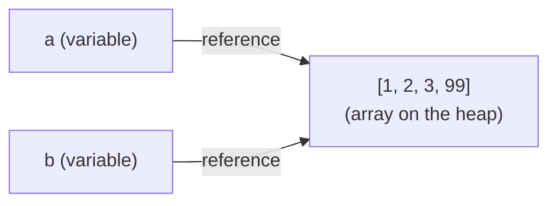

A **scalar** value (a single number, string, or boolean) is rarely
enough. Most real-world data is a *collection*, a list of users,
a row of pixels, a stack of moves. JavaScript's most fundamental
collection is the **array**.

<Figure
  slug="js-arrays-cutout"
  alt="Arrays, an isometric illustration"
/>

## Creating arrays

An array is written with square brackets and commas:

<CodeBlock
  adapter="javascript"
  files={[
    {
      filename: "main.js",
      starterCode: `const empty = [];
const nums = [1, 2, 3, 4, 5];
const colors = ["red", "green", "blue"];
const mixed = [1, "two", true, null, [10, 20]]; // any types, even nested arrays

console.log(empty);
console.log(nums);
console.log(colors);
console.log(mixed);
`,
    },
  ]}
/>

JavaScript arrays can hold *anything*: numbers, strings, booleans,
other arrays, objects, even functions. They are dynamically sized,
you don't declare a length up front.

## Length

Every array has a `.length` property, the number of elements in
it.

<CodeBlock
  adapter="javascript"
  files={[
    {
      filename: "main.js",
      starterCode: `const xs = [10, 20, 30, 40];
console.log(xs.length); // 4

console.log([].length); // 0
`,
    },
  ]}
/>

## Indexing: zero-based

Read or write an element by its **index**, starting at `0`.

<CodeBlock
  adapter="javascript"
  files={[
    {
      filename: "main.js",
      starterCode: `const xs = [10, 20, 30, 40];

console.log(xs[0]); // 10, first
console.log(xs[1]); // 20
console.log(xs[3]); // 40, last
console.log(xs[xs.length - 1]); // 40, idiom for "last element"

console.log(xs[100]); // undefined, out of range, no error

xs[1] = 999; // assignment by index
console.log(xs); // [10, 999, 30, 40]

xs[10] = "boo"; // assigning past the end stretches the array!
console.log(xs);
console.log(xs.length); // 11, with "holes" in the middle
`,
    },
  ]}
/>

That last block is a classic JavaScript surprise: setting an index
beyond the current length silently grows the array, filling the
gap with "empty slots". Real code almost never does this on
purpose, use `.push` instead.

## Adding and removing elements

| Method | Where | Returns |
| --- | --- | --- |
| `arr.push(x)` | end (add) | new length |
| `arr.pop()` | end (remove) | the removed element |
| `arr.unshift(x)` | start (add) | new length |
| `arr.shift()` | start (remove) | the removed element |

<CodeBlock
  adapter="javascript"
  files={[
    {
      filename: "main.js",
      starterCode: `const xs = [];
xs.push("a");
xs.push("b");
xs.push("c");
console.log(xs); // ["a","b","c"]

const last = xs.pop();
console.log("popped:", last, "-> array:", xs); // popped: "c" -> ["a","b"]

xs.unshift("Z");
console.log(xs); // ["Z","a","b"]

const first = xs.shift();
console.log("shifted:", first, "-> array:", xs);
`,
    },
  ]}
/>

These four methods (`push`, `pop`, `shift`, `unshift`) **mutate**
the array, they change it in place. That is important to keep in
mind, especially when an array is shared across functions.

## Iterating

We met loops in the control-flow chapter. Recall:

<CodeBlock
  adapter="javascript"
  files={[
    {
      filename: "main.js",
      starterCode: `const fruits = ["apple", "banana", "cherry"];

// for...of, cleanest when you only need the element
for (const fruit of fruits) {
  console.log(fruit);
}

// classic for, when you need the index
for (let i = 0; i < fruits.length; i++) {
  console.log(i, "->", fruits[i]);
}

// entries(), element AND index together
for (const [i, fruit] of fruits.entries()) {
  console.log(i, "->", fruit);
}

// forEach, concise, no need for the index
fruits.forEach((f) => console.log("got:", f));
`,
    },
  ]}
/>

## Slicing and copying

Two methods that look similar but are completely different:

- `slice(start, end)` returns a **new** array with a portion of
  the original. The original is **not modified**.
- `splice(start, deleteCount, ...newItems)` **mutates** the array
  in place. Powerful but sharp.

<CodeBlock
  adapter="javascript"
  files={[
    {
      filename: "main.js",
      starterCode: `const xs = ["a", "b", "c", "d", "e"];

// slice: non-destructive, original is unchanged
const middle = xs.slice(1, 4); // ["b","c","d"]
console.log("middle:", middle);
console.log("xs after slice:", xs); // still ["a","b","c","d","e"]

// shortcut: copy the whole array
const copy = xs.slice();
copy.push("Z");
console.log("copy:", copy);
console.log("xs:  ", xs); // unchanged

// splice: destructive, modifies in place, returns removed elements
const xs2 = ["a", "b", "c", "d", "e"];
const removed = xs2.splice(1, 2, "X", "Y", "Z");
console.log("removed:", removed); // ["b","c"]
console.log("xs2:", xs2); // ["a","X","Y","Z","d","e"]
`,
    },
  ]}
/>

When in doubt, **prefer non-destructive operations**. The
"functional" methods we will see in the next chapter (`map`,
`filter`, `reduce`) are all non-destructive, which makes them much
easier to reason about.

## Useful array methods

A starter set, with the most common patterns:

<CodeBlock
  adapter="javascript"
  files={[
    {
      filename: "main.js",
      starterCode: `const xs = [3, 1, 4, 1, 5, 9, 2, 6];

// Membership / search
console.log(xs.includes(5)); // true
console.log(xs.indexOf(4)); // 2
console.log(xs.indexOf(99)); // -1 (not found)

// Joining into a string
console.log(xs.join(", ")); // "3, 1, 4, 1, 5, 9, 2, 6"
console.log(xs.join()); // "3,1,4,1,5,9,2,6"

// Reversing (in place!) and sorting (in place!)
const a = [4, 1, 3, 2];
a.reverse();
console.log("reversed:", a); // [2,3,1,4]

const b = [4, 1, 3, 2];
b.sort();
console.log("sorted (default):", b); // [1,2,3,4]

// WARNING: default sort is by string comparison.
const c = [10, 2, 33, 4];
c.sort();
console.log("string sort:", c); // [10, 2, 33, 4], surprising!
// Numeric sort: pass a comparator
c.sort((a, b) => a - b);
console.log("numeric sort:", c); // [2, 4, 10, 33]

// Concatenation
const left = [1, 2, 3];
const right = [4, 5];
console.log(left.concat(right)); // [1,2,3,4,5]
console.log([...left, ...right]); // same, using spread
`,
    },
  ]}
/>

The string-sort-by-default trap is famous. If you call `.sort()`
on an array of numbers expecting `[2,4,10,33]` and you get
`[10,2,33,4]`, this is why. Always pass a comparator for numbers.

## Spread and destructuring

Two pieces of modern syntax that come up everywhere with arrays.

### Spread: unpack an array

<CodeBlock
  adapter="javascript"
  files={[
    {
      filename: "main.js",
      starterCode: `const a = [1, 2, 3];
const b = [4, 5];

// Combine
const combined = [...a, ...b];
console.log(combined);

// Copy
const copy = [...a];
copy.push(99);
console.log("copy:", copy);
console.log("a:   ", a);

// Insert in the middle
const surrounded = [0, ...a, ...b, 6];
console.log(surrounded);

// Spread into function arguments
console.log(Math.max(...a)); // 3
`,
    },
  ]}
/>

### Destructuring: pull elements out by position

<CodeBlock
  adapter="javascript"
  files={[
    {
      filename: "main.js",
      starterCode: `const xs = [10, 20, 30, 40, 50];

const [first, second] = xs;
console.log(first, second); // 10 20

// Skip elements with commas
const [, , third] = xs;
console.log(third); // 30

// Default values
const [a = 1, b = 2, c = 3, d = 4, e = 5, f = 6] = [10, 20];
console.log(a, b, c, d, e, f); // 10 20 3 4 5 6

// Gather the rest
const [head, ...tail] = xs;
console.log(head); // 10
console.log(tail); // [20,30,40,50]

// Swap two variables in one line
let x = 1,
  y = 2;
[x, y] = [y, x];
console.log(x, y); // 2 1
`,
    },
  ]}
/>

Destructuring is a *huge* readability win. Once you internalise
it, you stop writing `xs[0]`, `xs[1]`, `xs[2]` and start writing
`const [first, second, third] = xs`.

## Arrays are objects (and references)

A subtle but important point: arrays in JavaScript are a kind of
**object**. That means they are passed by reference, when you
assign an array to another variable or pass it to a function, you
are sharing the same underlying array.

<CodeBlock
  adapter="javascript"
  files={[
    {
      filename: "main.js",
      starterCode: `const a = [1, 2, 3];
const b = a; // NOT a copy, b points at the same array
b.push(99);
console.log("a:", a); // [1, 2, 3, 99], surprising if you weren't expecting it!
console.log("b:", b); // [1, 2, 3, 99]
console.log(a === b); // true, same array

// To make a real copy, use spread or slice:
const c = [...a];
c.push("X");
console.log("a:", a); // unchanged
console.log("c:", c);
console.log(a === c); // false, different arrays
`,
    },
  ]}
/>

This is the same point we noted about objects in the variables
chapter: `const` protects the *binding*, not the *contents*.
`const a = [1,2,3]; a.push(4)` is perfectly legal, you cannot
reassign `a`, but you can modify what it points to.

## Quick visual: an array in memory

Two variables, one array. Changing the array through *either*
variable affects what *both* see.

## A multi-file array example

A small two-file program demonstrates the typical shape: a module
that owns the array operations, and a driver that uses them.

<CodeBlock
  adapter="javascript"
  entryFilename="index.js"
  files={[
    {
      filename: "index.js",
      starterCode: `const { stats } = require("./stats");

const grades = [82, 47, 91, 58, 73, 65, 99, 30, 88, 60];

const { count, min, max, average, passed } = stats(grades);
console.log("Students:", count);
console.log("Range:    ", min, "to", max);
console.log("Average:  ", average.toFixed(1));
console.log("Passed:   ", passed);
`,
    },
    {
      filename: "stats.js",
      starterCode: `function stats(xs) {
  if (xs.length === 0) {
    return { count: 0, min: null, max: null, average: 0, passed: 0 };
  }
  let min = xs[0],
    max = xs[0],
    total = 0,
    passed = 0;
  for (const n of xs) {
    if (n < min) min = n;
    if (n > max) max = n;
    total += n;
    if (n >= 60) passed += 1;
  }
  return {
    count: xs.length,
    min,
    max,
    average: total / xs.length,
    passed,
  };
}

module.exports = { stats };
`,
    },
  ]}
/>

## Challenge

<ChallengeCard
  adapter="javascript"
  title="Rotate an array"
  instructions={`Write a function \`rotate(xs, k)\` that returns a *new* array equal to \`xs\` rotated to the right by \`k\` positions. The original \`xs\` must not be modified.

Examples:
- \`rotate([1, 2, 3, 4, 5], 1)\` → \`[5, 1, 2, 3, 4]\`
- \`rotate([1, 2, 3, 4, 5], 2)\` → \`[4, 5, 1, 2, 3]\`
- \`rotate([1, 2, 3, 4, 5], 5)\` → \`[1, 2, 3, 4, 5]\` (full rotation)
- \`rotate([1, 2, 3, 4, 5], 7)\` → \`[4, 5, 1, 2, 3]\` (k larger than length wraps)
- \`rotate([], 3)\` → \`[]\`

Hint: use the modulo operator (\`%\`) to handle \`k\` larger than the array length, then combine \`slice\` with the spread operator.`}
  files={[
    {
      filename: "main.js",
      starterCode: `function rotate(xs, k) {
  // your code here
  return xs;
}

console.log(rotate([1, 2, 3, 4, 5], 1));
console.log(rotate([1, 2, 3, 4, 5], 2));
console.log(rotate([1, 2, 3, 4, 5], 5));
console.log(rotate([1, 2, 3, 4, 5], 7));
console.log(rotate([], 3));
`,
      solutionCode: `function rotate(xs, k) {
  if (xs.length === 0) return [];
  const n = k % xs.length;
  return [...xs.slice(-n), ...xs.slice(0, xs.length - n)];
}

console.log(rotate([1, 2, 3, 4, 5], 1));
console.log(rotate([1, 2, 3, 4, 5], 2));
console.log(rotate([1, 2, 3, 4, 5], 5));
console.log(rotate([1, 2, 3, 4, 5], 7));
console.log(rotate([], 3));
`,
    },
  ]}
  tests={[
    {
      id: "by_one",
      name: "Rotate by 1",
      description: "[1,2,3,4,5], 1 → [5,1,2,3,4]",
      code: `if (JSON.stringify(rotate([1,2,3,4,5], 1)) !== "[5,1,2,3,4]") throw new Error("wrong rotation by 1");`,
    },
    {
      id: "by_two",
      name: "Rotate by 2",
      description: "[1,2,3,4,5], 2 → [4,5,1,2,3]",
      code: `if (JSON.stringify(rotate([1,2,3,4,5], 2)) !== "[4,5,1,2,3]") throw new Error("wrong rotation by 2");`,
    },
    {
      id: "full",
      name: "Full rotation",
      description: "[1,2,3,4,5], 5 → [1,2,3,4,5]",
      code: `if (JSON.stringify(rotate([1,2,3,4,5], 5)) !== "[1,2,3,4,5]") throw new Error("full rotation should equal original");`,
    },
    {
      id: "overshoot",
      name: "k larger than length",
      description: "[1,2,3,4,5], 7 → [4,5,1,2,3]",
      code: `if (JSON.stringify(rotate([1,2,3,4,5], 7)) !== "[4,5,1,2,3]") throw new Error("k larger than length should wrap");`,
    },
    {
      id: "empty",
      name: "Empty array",
      description: "[], 3 → []",
      code: `if (JSON.stringify(rotate([], 3)) !== "[]") throw new Error("empty should return empty");`,
    },
    {
      id: "no_mutation",
      name: "Original is unchanged",
      description: "rotate should not mutate its argument",
      code: `const original = [1,2,3,4,5];
rotate(original, 2);
if (JSON.stringify(original) !== "[1,2,3,4,5]") throw new Error("original array was modified!");`,
    },
  ]}
/>

---

<MultipleChoice
  markdown={`Two variables point to the same array: \`const a = [1, 2, 3]; const b = a;\`. You then call \`b.push(99)\`. What is \`a\`?

- \`[1, 2, 3]\`, \`a\` is independent of \`b\`
  > \`b = a\` does not copy the array; both variables refer to the same array in memory, so any mutation through \`b\` is immediately visible through \`a\`.
- [o] \`[1, 2, 3, 99]\`, \`a\` and \`b\` reference the *same* array, so changes through one are visible through the other
  > Arrays (and all objects) in JavaScript are passed by reference. Assigning \`b = a\` makes \`b\` refer to the same array, not a copy. To get a real copy, use \`[...a]\` or \`a.slice()\`.
- \`undefined\`, pushing through \`b\` clears \`a\`
  > \`push\` adds an element to the end of the shared array; it does not clear it or produce \`undefined\`.
- A \`TypeError\` is thrown
  > \`push\` is a perfectly legal operation on any array; it never throws a \`TypeError\` simply for being called through an alias.

This sharing-by-reference behaviour is the source of many subtle bugs. When you need an independent copy, always make one explicitly.`}
/>
