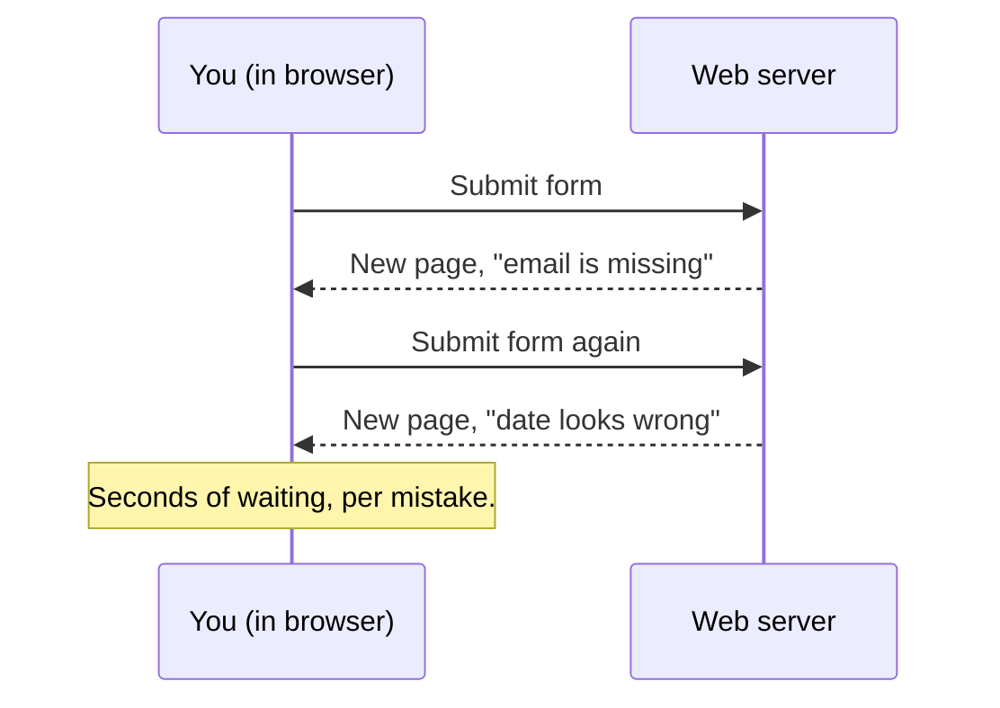
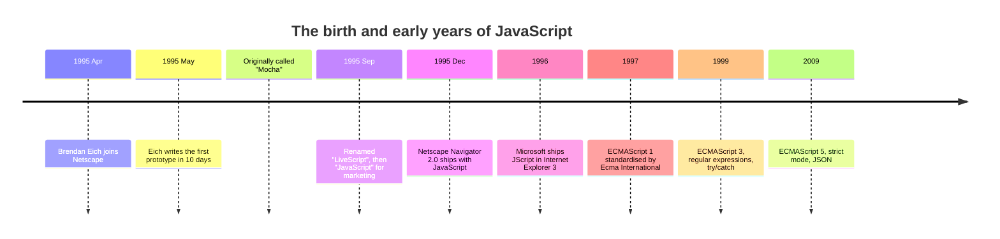

In May 1995, a programmer named Brendan Eich wrote a programming
language in **ten days**. Today that language runs on every phone,
laptop, server farm, and smart television on Earth. It is, by most
measures, the most widely used programming language ever created,
and it was built in less time than most teams spend naming a
project.

<Figure
  slug="js-birth-of-javascript-cutout"
  alt="The birth of JavaScript, an isometric illustration"
/>

How does that happen? Not by accident, it turns out, but by a
collision of three stories: what programming languages *are*, what
the early web *couldn't do*, and what one company needed shipped
*immediately*. This page tells all three. By the end, half of
JavaScript's famous quirks will already make sense, because almost
all of them were decided in those ten days.

## The machine underneath

A computer, at its absolute lowest level, does not understand
"JavaScript", "Python", "English", or even "math". A computer is, in
the end, a vast collection of tiny switches, each either **on** or
**off**, `1` or `0`. Patterns of bits flow through circuits, and
the circuits react. Some patterns mean "add two numbers". Some mean
"read the value at this position in memory". These patterns are
called **machine code**, and they are the *only* thing a CPU truly
understands.

Here is what a single instruction looks like in raw bits:

```
10110000 01100001
```

That is genuinely how the earliest computers were programmed: by
flipping physical switches or punching holes in cards. A "program"
was a stack of cards, and a single mistake meant combing through
thousands of bits by hand.

Programmers climbed out of the bit-mine one rung at a time. The
first rung was **assembly language**: short names for each bit
pattern, translated back into bits by a program called an
assembler. Instead of `10110000 01100001`, you could write
`MOV AL, 0x61`. Vastly better, but still one line per machine
instruction, and still specific to one kind of CPU.

The second rung, in the late 1950s, was the real revolution:
**high-level languages** like FORTRAN and COBOL, where a programmer
could write `SUM = A + B` and a new kind of program, a
**compiler**, would translate that human-friendly text into
machine code. The same source code could now run on many different
machines. From that point on, language designers kept asking the
same question with different answers: *how close to human thought
can we get, and what does it cost?* C chose speed. Lisp chose
mathematical elegance. Smalltalk chose objects. Every language is a
set of opinions.

Hold on to the core picture, because it is the foundation of
everything in this course: **source code is just text**. By itself
it does nothing. The magic happens when a **runtime**, a compiler
or an interpreter, reads that text and makes the machine act.

## Run your first program

JavaScript's runtimes are programs like V8 (inside Chrome and
Node.js), SpiderMonkey (Firefox), and JavaScriptCore (Safari), and
there is one running in your browser right now. Below is a real,
runnable JavaScript program. Don't worry about understanding every
symbol; we will spend the whole course on that. Just notice that
the code is plain text, and that pressing *Run* makes a runtime
bring it to life.

<CodeBlock
  adapter="javascript"
  files={[
    {
      filename: "main.js",
      starterCode: `// Anything after // on a line is a "comment", JavaScript ignores it.
// This program adds two numbers and prints the result.

const a = 3;
const b = 4;
const sum = a + b;

console.log("The sum of", a, "and", b, "is", sum);
`,
    },
  ]}
/>

You just ran a program. There was a runtime, it read your text, and
the text caused something to happen. That is the entire story of
computing, in miniature. Now: why did a language like this end up
*inside a web browser*?

## The web before JavaScript

In the late 1980s, a researcher at CERN named **Tim Berners-Lee**
designed a system for sharing scientific documents. It had three
pieces we still use today: **HTML** (documents with links),
**HTTP** (a way to ask another computer for a document), and
**URLs** (a way to name any document anywhere). That is *all* the
early web was: a global, hyperlinked library of documents. You
opened a browser; it downloaded a page; you read it. The page was
exactly as static as a printed one.

If you wanted anything "interactive", say, submitting a form, the
entire form went to the server, the server checked it, and the
server sent back a *brand new page*. Forgot to fill in your email?
Round trip. Typo in the date? Round trip. On a mid-1990s modem,
every round trip took seconds.



The experience felt like passing notes through a closed door.
Everyone could see what was needed: the **browser itself** should
be able to run small programs, check the form *before* sending it,
open a menu, update a clock, without asking the server's
permission for every move. In other words, the browser needed to
host a programming language.

## The Java detour

The first serious attempt was not JavaScript. In 1995, Sun
Microsystems released **Java**, a serious, statically typed
language with a famous promise: *write once, run anywhere*. Sun and
Netscape, maker of Navigator, the dominant browser, struck a
deal: Navigator would embed a Java Virtual Machine, and web pages
could include small Java programs called **applets**.

Applets worked, but they were the wrong shape for the job. Each one
downloaded a chunk of code and booted a virtual machine, so they
were slow to start. They lived in an isolated box, largely cut off
from the rest of the page. And Java itself was simply *too big* for
the small jobs a typical page needed. You should not need a
compiler, a class hierarchy, and a virtual machine to check whether
an email field contains an `@`.

Netscape's leadership saw the gap clearly: Java would be the big,
serious language in the page, and next to it they needed a **small,
friendly scripting language**, something a graphic designer could
pick up in an afternoon, something that lived directly inside the
HTML. It had to be easy, forgiving, vaguely Java-looking so the
syntax felt familiar, and, because Netscape was in a knife-fight
with competitors, it had to ship in the *next browser release*.

That is the job Brendan Eich was hired for.

## Ten days in May

Eich joined Netscape in April 1995. He was 33, with a background in
operating systems and compilers, and a deep fondness for **Scheme**,
a tiny, elegant descendant of Lisp in which functions are values
you can pass around like numbers. The assignment he was handed
sounds absurd in hindsight: design and implement a new language,
embeddable in HTML, friendly to amateurs, Java-flavoured on the
surface, and demo-ready in ten days.

Several decisions had been made for him before he wrote a line:

1. **It must look like Java.** Java was the buzz of the industry,
   and Netscape's marketing wanted to ride the wave. Curly braces,
   semicolons, `if`, `while`, `for`, essentially mandatory.
2. **It must be tiny.** It would live inside a `<script>` tag and
   run instantly, with no compile step.
3. **It must never crash the browser.** A bug in a script on some
   random web page could not be allowed to bring down Navigator.
   The language had to be *forgiving*: silent conversions instead
   of hard errors, defaults for missing values, no dangerous memory
   operations.
4. **It must ship in weeks.** No years of careful revision.
   Whatever Eich shipped would be locked in by deployment to
   millions of users.

These are not the conditions under which a beautiful language gets
designed. They are the conditions under which a *useful, weird,
incredibly successful* language gets designed.

In ten days in May 1995, Eich produced a working prototype, called
**Mocha** internally, then renamed **LiveScript**, and finally,
purely to ride Java's hype, **JavaScript**. It was one of the most
consequential marketing decisions in software history, and one of
the most confusing. JavaScript and Java are **not the same
language**. They are not even relatives. They share little beyond
curly braces, yet thirty years later beginners still ask "is Java
like JavaScript?" and seasoned programmers still grit their teeth.

The disguise mattered less than what Eich smuggled in underneath
it. Behind the Java-shaped syntax, he planted ideas from the
languages he actually loved:

- **First-class functions**, from Scheme. A function in JavaScript
  is a value, you can store it in a variable, hand it to another
  function, return it from a function. This single idea is the
  bedrock of modern JavaScript style, and we will spend several
  chapters on it.
- **Prototype-based objects**, from a research language called
  **Self**. Instead of classes as blueprints, JavaScript objects
  can inherit directly from other objects.
- **Dynamic typing**, from the scripting-language tradition:
  variables don't declare types; values carry them.

Learning JavaScript well largely means noticing the Scheme-and-Self
soul peeking out from behind the Java-shaped curly braces.

## What the tiny language could do

By December 1995, Netscape Navigator 2.0 shipped with JavaScript
built in, and web designers could make a page *react* without a
server round trip. The language was small: a handful of primitive
values, one universal container (the object), functions as values,
a few control structures, and automatic memory management. Here is
the flavour of mid-90s JavaScript, and every line of it still runs
today, unchanged:

<CodeBlock
  adapter="javascript"
  files={[
    {
      filename: "main.js",
      starterCode: `// A function is just a value with a name.
function greet(name) {
  return "Hello, " + name + "!";
}

// An object is just a bag of named values.
const user = {
  name: "Ada",
  age: 28,
};

console.log(greet(user.name));

// You can add properties to an object at any time,
// JavaScript will not stop you.
user.email = "ada@example.com";
console.log("Email:", user.email);

// A function can be stored in a variable, like a number.
const shout = function (text) {
  return text.toUpperCase() + "!!!";
};

console.log(shout("javascript was born in 1995"));
`,
    },
  ]}
/>

Look at what happened there: we added a property to an object after
creating it, and we put a function in a variable as if it were a
string. Both of those design choices, radical permissiveness, and
functions as ordinary values, were made in those frantic ten days,
and both shaped how the entire web works now.

## Standard wars and a strange name

Microsoft noticed. In 1996 they reverse-engineered the language and
shipped their own version, **JScript**, in Internet Explorer 3. Two
similar-but-not-identical implementations in two warring browsers
was a nightmare for developers, so the language was submitted to a
standards body, **Ecma International**. The standardized language
was named **ECMAScript**, "JavaScript" was trademarked, and
politics demanded a different word. To this day the specification
says ECMAScript and everyone on Earth says JavaScript.



## Why this language, of all languages?

It is worth pausing on the question, because the answer is *not*
"because it was the best design". A few reasons, none of them about
elegance:

1. **It shipped first, in the most important place**, the world's
   dominant browser, at the precise moment the web exploded.
2. **It was forgiving.** Beginners could make mistakes and still
   see something work. That accessibility pulled in millions of
   people a stricter language would have turned away.
3. **It was light.** A few lines in a tag could change a page, no
   installer, no plugin, no virtual machine.
4. **It was universal.** Whatever the browser, whatever the
   operating system, JavaScript was *there*. For decades it was the
   only language with that property.

JavaScript won because it was the right language in the right place
at the right time, and because, once it was everywhere, nobody
could replace it. What happened next is its own story: the language
everyone dismissed as a toy grew into the backbone of modern
software. That story is the next page.

<Callout type="info" title="Want more of the deep history?">
This page compresses a much longer story. If you enjoy this kind of
thing, the **Interesting discussions** section at the end of the
course digs further: [Scripting languages and the art of
glue](/courses/beginners-javascript/scripting-and-glue) explains where
"scripting" languages came from and why big systems embed small
languages, and [JavaScript beyond the
browser](/courses/beginners-javascript/javascript-beyond-the-browser)
tours the surprising places JavaScript runs today.
</Callout>

---

<MultipleChoice
  markdown={`Which of these statements best describes the design situation when Brendan Eich created JavaScript in 1995?

- He had several years to design and refine the language carefully
  > Eich joined Netscape in April 1995 and had the first working prototype finished in about ten days in May, far too short a time for careful, iterative design.
- [o] He had about ten days to ship a working prototype, with rigid constraints (look like Java, embed in HTML, never crash the browser, be friendly to beginners)
  > JavaScript was designed under extreme time pressure with externally imposed constraints. Many of the language's quirks, and its great strengths, like first-class functions and forgiving runtime behaviour, come directly from those conditions.
- He copied the language directly from an existing language called LiveScript
  > LiveScript was the name given to Eich's original creation before it was renamed JavaScript; it was not a pre-existing language that he copied.
- He designed it as a pure functional language modelled on Haskell
  > Eich personally admired Scheme, not Haskell, and the language he shipped was far from purely functional, it used Java-style syntax and prototype-based objects from Self.

Knowing this history makes JavaScript's mix of Java-flavoured syntax and Scheme-style flexibility much easier to understand.`}
/>
