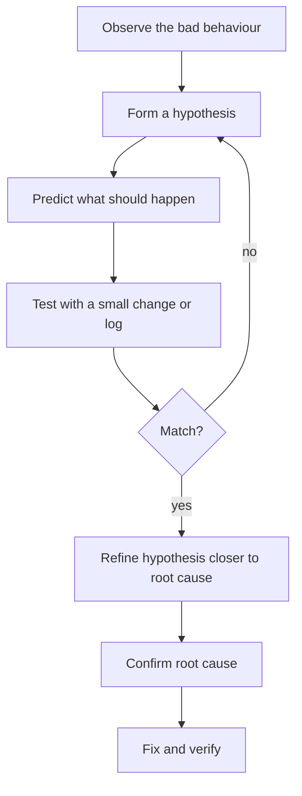

Every programmer spends more time *reading* and *debugging* code
than writing it. The good news is that debugging is a skill, not
a talent, and it gets dramatically easier once you have a
process.

<Figure
  slug="js-debugging-and-reasoning-cutout"
  alt="Debugging and reasoning, an isometric illustration"
/>

This chapter covers two things:

1. **Reasoning** about code so you understand what it *should* do.
2. **Debugging** code that isn't doing what you thought.

## What debugging really is

A bug exists because there's a gap between:

- the **mental model** you have of what the program does, and
- what the program **actually does** when it runs.

Debugging is the process of finding *where* and *why* those two
differ. You're not "fixing the code"; you're updating your model
until it matches reality, *then* fixing the code.

> If you find yourself thinking *"this should work"*, you've
> already discovered the bug. The gap between *"should"* and
> *"does"* is the entire problem.

## A scientific-method approach

When something goes wrong, resist the urge to start changing
code. Instead, follow a tiny loop:



The biggest beginner mistake is jumping straight to *fix*. The
person who slows down at "form a hypothesis" finishes faster.

## The most useful debugging tool: `console.log`

It's not glamorous, but `console.log` solves more bugs than any
debugger. The trick is to print **what you assumed**, not the
final answer.

<Figure
  slug="js-debugging-and-reasoning-inline-cutout"
  alt="A chain of linked blocks with one link visibly cracked, a magnifier held over that link alone"
/>

<CodeBlock
  adapter="javascript"
  files={[
    {
      filename: "main.js",
      starterCode: `function average(nums) {
  let total = 0;
  for (const n of nums) {
    total += n;
  }
  return total / nums.length;
}

// Suspicious result:
console.log(average([1, 2, 3, "4", 5])); // not 3, why?
`,
    },
  ]}
/>

If you log the *types* of the inputs and the running total, the
bug screams at you:

<CodeBlock
  adapter="javascript"
  files={[
    {
      filename: "main.js",
      starterCode: `function average(nums) {
  let total = 0;
  for (const n of nums) {
    console.log("adding", n, "type:", typeof n, "total before:", total);
    total += n;
  }
  return total / nums.length;
}

console.log("result:", average([1, 2, 3, "4", 5]));
`,
    },
  ]}
/>

The third iteration shows `total` becoming the string `"64"`,
that's the moment something went wrong. Now you know *where*.

### Better than `console.log`: structured logging

A few small habits make logs much more useful:

- **Label what you're printing**: `console.log("user:", user)` is
  far better than `console.log(user)` when 10 logs appear at once.
- **Group related logs**: `console.group("processing order", id)`
  + `console.groupEnd()`.
- **Use `console.table` for arrays of objects**:

<CodeBlock
  adapter="javascript"
  files={[
    {
      filename: "main.js",
      starterCode: `const users = [
  { name: "Ada", age: 28, role: "admin" },
  { name: "Linus", age: 35, role: "user" },
  { name: "Grace", age: 80, role: "admin" },
];

console.table(users);
console.table(users, ["name", "role"]);
`,
    },
  ]}
/>

## Reading a stack trace

When something throws, JS prints a **stack trace**, a snapshot
of the call stack at the moment of the error.

<CodeBlock
  adapter="javascript"
  files={[
    {
      filename: "main.js",
      starterCode: `function inner() {
  throw new Error("Something is wrong here");
}

function middle() {
  inner();
}

function outer() {
  middle();
}

try {
  outer();
} catch (e) {
  console.log(e.message);
  console.log(e.stack);
}
`,
    },
  ]}
/>

Read stack traces **top to bottom**:

1. The **message** tells you *what* went wrong.
2. The **top frame** tells you *where* it threw.
3. The **lower frames** tell you *how the program got there*.

If a function appears in the trace but you didn't call it
directly, the line above it called it. Walk up until you find
*your* code (vs. library code), that's usually the most
informative line.

## Common error patterns

A small zoo of errors you'll meet often:

<CodeBlock
  adapter="javascript"
  files={[
    {
      filename: "main.js",
      starterCode: `// TypeError: Cannot read properties of undefined (reading 'name')
const user = undefined;
try {
  console.log(user.name);
} catch (e) {
  console.log("1:", e.message);
}

// ReferenceError: x is not defined
try {
  console.log(notDeclared);
} catch (e) {
  console.log("2:", e.message);
}

// SyntaxError: parsed at load time, before any of your code runs.
// (Can't demo here; uncomment to see "missing )" etc.)
// const x = (

// RangeError: Maximum call stack size exceeded
function recurse() {
  recurse();
}
try {
  recurse();
} catch (e) {
  console.log("3:", e.message);
}
`,
    },
  ]}
/>

A pattern: errors usually tell you *exactly* what went wrong if
you read them. "Cannot read property `X` of undefined" means
"something I expected to be an object was undefined, and I tried
to read `X` from it." Find what that "something" is.

## Defensive thinking: invariants

An **invariant** is a fact about your program that should always
be true at a given point. Stating them in your head, or in
comments, assertions, or tests, gives you anchors.

<CodeBlock
  adapter="javascript"
  files={[
    {
      filename: "main.js",
      starterCode: `function withdraw(account, amount) {
  // INVARIANT: amount must be a positive number.
  // INVARIANT: account.balance is a non-negative number.
  if (typeof amount !== "number" || amount <= 0) {
    throw new Error("amount must be a positive number");
  }
  if (amount > account.balance) {
    throw new Error("insufficient funds");
  }
  account.balance -= amount;
  // INVARIANT: account.balance is still non-negative.
  return account.balance;
}

const acct = { balance: 100 };
console.log(withdraw(acct, 40)); // 60
try {
  withdraw(acct, 999);
} catch (e) {
  console.log(e.message);
}
try {
  withdraw(acct, -5);
} catch (e) {
  console.log(e.message);
}
`,
    },
  ]}
/>

When a bug appears, ask: *which invariant did I think held that
actually didn't?* That question, asked out loud, often *is* the
debugging session.

## Rubber-duck debugging

The classic trick: explain the code, line by line, **out loud**,
to an inanimate object, traditionally a rubber duck. The act of
articulating "and then this returns... wait, no it doesn't"
catches a huge fraction of bugs.

You don't need a duck. You just need to slow down enough to
*describe* what you think is happening.

## Binary search bug-hunting

When the bug is "somewhere in this big code path", don't read top
to bottom, bisect.

1. Pick a point in the middle.
2. Print or check: *is the state correct here?*
3. If yes, the bug is *after* this point. If no, it's *before*.
4. Repeat in the smaller half.

This narrows down even huge codebases in a handful of steps.

## Reproducing the bug

The single most powerful debugging technique: **shrink the
failing case to the smallest reliably-reproducing example.**

- "My app crashes sometimes", useless.
- "My app crashes when I open the user page", better.
- "It crashes in `formatDate` when a user has no `birthday`
  field, but not otherwise", that's a *fix request*, not a bug
  report.

When you can reproduce a bug on demand, you've already done 80%
of the work.

## Writing code that's easier to reason about

The best debugging is *not needing to debug*. A few habits that
slash bug rates:

1. **Small functions.** A 5-line function is easier to verify
   correct than a 50-line one.
2. **Pure when possible.** As you saw in the FP chapter, side
   effects make code harder to reason about.
3. **Name things precisely.** `data` and `result` say nothing.
   `filteredOrders` and `revenueByMonth` say a lot.
4. **Use `const` by default.** A variable that never changes can't
   secretly be the wrong value somewhere.
5. **Guard at the edges.** Validate inputs, then trust them inside.
6. **Don't be clever.** Clear code beats clever code. The code you
   write today, your future self has to read tomorrow.

## Multi-file: a bug-hunting walk-through

This module has a subtle bug. Run it, then read the code and find
the bug *before* looking at the fix below.

<CodeBlock
  adapter="javascript"
  entryFilename="index.js"
  files={[
    {
      filename: "index.js",
      starterCode: `const { applyDiscounts } = require("./pricing");

const cart = [
  { name: "Pen", price: 2, qty: 3 },
  { name: "Notebook", price: 5, qty: 2 },
  { name: "Laptop", price: 999, qty: 1 },
];

console.log("total:", applyDiscounts(cart, 0.1));
console.log("cart afterwards:", cart);
`,
    },
    {
      filename: "pricing.js",
      starterCode: `// Apply a percentage discount to every item, and return the total.
function applyDiscounts(cart, discount) {
  let total = 0;
  for (const item of cart) {
    item.price = item.price * (1 - discount); // bug: mutates caller's data!
    total += item.price * item.qty;
  }
  return total;
}

module.exports = { applyDiscounts };
`,
    },
  ]}
/>

Symptoms you'd notice:

- The `total` is correct on the first call.
- But run `applyDiscounts(cart, 0.1)` again and the total drops
  further every time, because each call mutates `item.price`.

The fix: don't mutate the caller's data.

```javascript
function applyDiscounts(cart, discount) {
  return cart.reduce(
    (total, item) => total + item.price * (1 - discount) * item.qty,
    0,
  );
}
```

This is a classic *immutability bug*, the same one we warned
about in the functional intuition chapter.

## Challenge

<ChallengeCard
  adapter="javascript"
  title="Find and fix the bug"
  instructions={`Below is a function \`average(nums)\` that is supposed to return the arithmetic mean of an array of numbers, ignoring any non-number entries (strings, nulls, etc.). It has at least one bug.

Your task:
- Identify the issue(s) by reasoning about the code.
- Replace the function with a correct implementation.
- It must return \`0\` for an empty array AND for an array with no valid numbers (avoid \`NaN\` from dividing by zero).
- It must not mutate the input array.`}
  files={[
    {
      filename: "main.js",
      starterCode: `function average(nums) {
  // The current (buggy) implementation:
  let total = 0;
  for (let i = 0; i <= nums.length; i++) {
    // bug-ish?
    total += nums[i]; // bug-ish?
  }
  return total / nums.length; // bug-ish?
}

console.log(average([1, 2, 3])); // expect 2
console.log(average([])); // expect 0
console.log(average([1, "x", 3, null])); // expect 2
`,
      solutionCode: `function average(nums) {
  const valid = nums.filter((n) => typeof n === "number" && !Number.isNaN(n));
  if (valid.length === 0) return 0;
  const total = valid.reduce((sum, n) => sum + n, 0);
  return total / valid.length;
}

console.log(average([1, 2, 3]));
console.log(average([]));
console.log(average([1, "x", 3, null]));
`,
    },
  ]}
  tests={[
    {
      id: "basic",
      name: "Average of plain numbers",
      description: "[1,2,3] -> 2",
      code: `if (average([1,2,3]) !== 2) throw new Error("expected 2");`,
    },
    {
      id: "empty",
      name: "Empty array returns 0 (not NaN)",
      description: "[] -> 0",
      code: `const r = average([]);
if (r !== 0) throw new Error("expected 0, got " + r);`,
    },
    {
      id: "ignores_non_numbers",
      name: "Non-numbers are ignored",
      description: "[1,'x',3,null] -> 2",
      code: `if (average([1, "x", 3, null]) !== 2) throw new Error("must ignore non-numbers");`,
    },
    {
      id: "all_invalid",
      name: "Array with no valid numbers returns 0",
      description: "['a',null] -> 0",
      code: `if (average(["a", null]) !== 0) throw new Error("expected 0 for no valid numbers");`,
    },
    {
      id: "no_mutation",
      name: "Original array is not mutated",
      description: "Length stays the same",
      code: `const a = [1, 2, 3];
average(a);
if (a.length !== 3 || a[0] !== 1) throw new Error("must not mutate input");`,
    },
  ]}
/>

---

<MultipleChoice
  markdown={`A function you wrote is returning the wrong number. You've stared at the code for ten minutes. What's the most effective next step?

- Rewrite the function from scratch and hope the new version is correct
  > Rewriting without understanding the cause almost always reproduces the same bug, because the flawed mental model that produced the bug the first time is still intact.
- Search the web for "JavaScript function wrong number"
  > A query that vague won't find the actual cause; the bug is in your specific logic, not a general JavaScript problem, so web searches can't substitute for investigating the actual values your code is producing.
- [o] Add logs that print your inputs, intermediate values, and assumptions, then re-run to see *where* the actual values diverge from what you expected
  > Bugs are gaps between your mental model and reality. The fastest way to close that gap is to print what you *think* is happening at each step and compare with what's actually happening. Rewriting blindly often reintroduces the same bug; reasoning from data tells you *where* the wrong value first appeared.
- Add try/catch around the call to suppress the error
  > \`try\`/\`catch\` silences exceptions; it does nothing to fix a wrong return value, and hiding errors makes debugging harder, not easier.

Debugging is investigation, not vandalism. Don't change code until you know what's wrong.`}
/>
