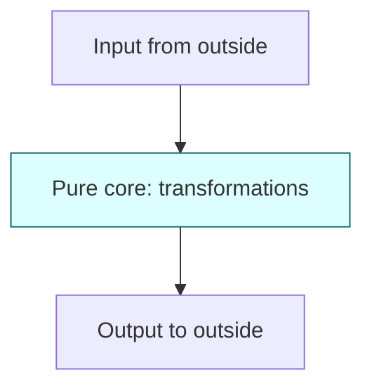

Now that you've met `map()`, `filter()`, and `reduce()`, you've actually
been doing a kind of programming called **functional
programming** (FP), even if no one used the phrase. This chapter
makes the underlying ideas explicit. You don't need to become a
strict functional programmer to benefit from them; you just need
the *intuition*.

<Figure
  slug="js-functional-intuition-cutout"
  alt="Functional intuition, an isometric illustration"
/>

Three ideas do most of the work:

1. **Pure functions**, same input, same output, no surprises.
2. **Immutability**, prefer creating new values to mutating old ones.
3. **Data in, data out**, programs as pipelines of transformations.

## Pure functions

A **pure function** is one that:

- Returns the same output every time it's called with the same input.
- Does not change anything outside itself (no side effects).

<CodeBlock
  adapter="javascript"
  files={[
    {
      filename: "main.js",
      starterCode: `// PURE: depends only on its arguments, returns a value, changes nothing.
function add(a, b) {
  return a + b;
}

// PURE: the array argument is never mutated.
function double(nums) {
  return nums.map((n) => n * 2);
}

// IMPURE: depends on a hidden variable.
let tax = 0.2;
function withTax(price) {
  return price * (1 + tax); // result depends on outer 'tax'
}

// IMPURE: mutates its argument.
function addItem(cart, item) {
  cart.push(item); // side effect on caller's array
  return cart;
}

// IMPURE: does I/O.
function shout(msg) {
  console.log(msg.toUpperCase()); // side effect: writes to terminal
}

console.log(add(2, 3));
console.log(double([1, 2, 3]));
`,
    },
  ]}
/>

Pure functions are easy to reason about because you only need to
look at their arguments to predict their output. No hidden state,
no surprises.

> "Same input, same output" sounds boring. That's the point,
> *boring* is exactly the property you want when debugging.

### Side effects are not evil

Real programs *must* eventually do I/O, print things, save files,
send network requests, update the screen. A program of only pure
functions would never affect the outside world.

The functional advice is not "never have side effects", it's
**push them to the edges of your program** and keep the core
logic pure.

Imperative shell, functional core. Most modern code follows this
shape, whether or not the author names it.

## Immutability

A value is **immutable** when, once created, it cannot change.
JavaScript's primitives (numbers, strings, booleans) *are* already
immutable, `"hello".toUpperCase()` returns a new string,
"hello" itself never changes.

<Figure
  slug="js-functional-intuition-immutability-inline-cutout"
  alt="A sealed block left untouched on a shelf while a fresh copy with one changed face is set beside it"
  caption="The original is left where it was, and the change goes into a fresh copy."
/>

Objects and arrays are *mutable* by default. Functional code
treats them as if they weren't.

<CodeBlock
  adapter="javascript"
  files={[
    {
      filename: "main.js",
      starterCode: `// MUTATING style: change the array in place.
const nums = [1, 2, 3];
nums.push(4); // nums is now [1,2,3,4], the SAME array
console.log(nums);

// IMMUTABLE style: produce a new array, leave the old one alone.
const a = [1, 2, 3];
const b = [...a, 4]; // a is still [1,2,3]; b is [1,2,3,4]
console.log(a);
console.log(b);

// Same idea for objects:
const user = { name: "Ada", age: 28 };
const olderUser = { ...user, age: user.age + 1 };
console.log(user); // { name: 'Ada', age: 28 }, unchanged
console.log(olderUser); // { name: 'Ada', age: 29 }
`,
    },
  ]}
/>

Why prefer the immutable style?

- **No spooky action at a distance.** If you pass an array to a
  function and trust it not to mutate, the caller's data stays
  safe.
- **Easier to compare.** "Did this change?" is just `oldValue !==
  newValue`.
- **Easier to undo / time-travel.** Old versions are still around.
- **Works nicely with concurrency** (relevant in async code).

The trade-off: you allocate more objects. For typical app code,
this cost is negligible.

### Mutating methods vs. non-mutating

A handful of array methods *mutate*; most don't. It's worth
memorising the mutators because they're the ones that bite you.

| Mutating | Non-mutating (returns new) |
| --- | --- |
| `push()`, `pop()`, `shift()`, `unshift()` | `concat()`, `[...arr, x]` |
| `splice()` | `slice()`, `toSpliced` |
| `sort()`, `reverse()` | `toSorted`, `toReversed` |
| `arr[i] = x` | `arr.map((v, i) => i === idx ? x : v)` |

When you can, prefer the non-mutating version.

## Functions as values

We already saw this in the *functions* chapter, but it's worth
repeating because it's the bedrock of FP: in JavaScript, functions
are values like any other. You can:

- Assign them to variables.
- Put them in arrays.
- Pass them to other functions.
- Return them from functions.

<CodeBlock
  adapter="javascript"
  files={[
    {
      filename: "main.js",
      starterCode: `// Pass a function as an argument.
const nums = [1, 2, 3, 4];
console.log(nums.map((n) => n * 10));

// Store functions in an object: a tiny strategy table.
const ops = {
  add: (a, b) => a + b,
  sub: (a, b) => a - b,
  mul: (a, b) => a * b,
  div: (a, b) => a / b,
};

console.log(ops.add(2, 3));
console.log(ops.mul(4, 5));

// Return a function from a function: a "factory".
function multiplier(by) {
  return (n) => n * by;
}

const double = multiplier(2);
const triple = multiplier(3);
console.log(double(7));
console.log(triple(7));
`,
    },
  ]}
/>

Treating functions as data is what enables `map()`/`filter()`/`reduce()`,
event handlers, callbacks, middleware, promise chains, and dozens
of other patterns you'll keep meeting.

<Figure
  slug="js-functional-intuition-pure-functions-inline-cutout"
  alt="A sealed press with one inlet and one outlet, the same block fed twice and the same result leaving twice"
  caption="A pure function returns the same result for the same input, every time."
/>

## Composition

A pipeline like `arr.filter(...).map(...).reduce(...)` is a form
of **composition**: small functions stuck together to make a
bigger one. You can compose at the function level too.

<CodeBlock
  adapter="javascript"
  files={[
    {
      filename: "main.js",
      starterCode: `const trim = (s) => s.trim();
const lower = (s) => s.toLowerCase();
const dashify = (s) => s.replace(/\\s+/g, "-");

// Compose by hand:
function slugify(text) {
  return dashify(lower(trim(text)));
}

console.log(slugify("  Hello World  ")); // "hello-world"

// Or build a generic 'pipe' helper:
const pipe =
  (...fns) =>
  (input) =>
    fns.reduce((v, fn) => fn(v), input);

const slugify2 = pipe(trim, lower, dashify);
console.log(slugify2("  Functional STYLE  ")); // "functional-style"
`,
    },
  ]}
/>

`pipe` is a tiny but powerful tool: it expresses "do these things
in order" as data. Many real-world libraries (Ramda, Lodash/fp,
RxJS) make this style the default.

## Declarative vs. imperative

A useful pair of words to know:

- **Imperative** code says *how* to do something, step by step.
- **Declarative** code says *what* the result should be.

`map()`, `filter()`, and `reduce()` are declarative. SQL is declarative.
JSX is declarative. A `for` loop is imperative.

Both styles are valid. Use whichever makes the code clearer for
its purpose. Declarative tends to win when describing
*transformations of data*; imperative often wins for low-level
algorithms or performance-critical inner loops.

## A practical refactor

Let's take some imperative code and *gradually* make it more
functional. None of these versions is "wrong", they're trade-offs.

<CodeBlock
  adapter="javascript"
  files={[
    {
      filename: "main.js",
      starterCode: `const orders = [
  { id: 1, amount: 120, status: "paid" },
  { id: 2, amount: 80, status: "cancelled" },
  { id: 3, amount: 60, status: "paid" },
  { id: 4, amount: 200, status: "paid" },
];

// Version 1, imperative. Works, but verbose.
function totalPaidV1(orders) {
  let total = 0;
  for (let i = 0; i < orders.length; i++) {
    if (orders[i].status === "paid") {
      total += orders[i].amount;
    }
  }
  return total;
}

// Version 2, for...of. Cleaner.
function totalPaidV2(orders) {
  let total = 0;
  for (const order of orders) {
    if (order.status === "paid") total += order.amount;
  }
  return total;
}

// Version 3, functional. Pipeline of transformations.
function totalPaidV3(orders) {
  return orders
    .filter((o) => o.status === "paid")
    .reduce((sum, o) => sum + o.amount, 0);
}

console.log(totalPaidV1(orders));
console.log(totalPaidV2(orders));
console.log(totalPaidV3(orders));
`,
    },
  ]}
/>

All three return `380`. The third version *reads* like the
specification: "of the paid orders, sum the amounts."

## Multi-file: keeping the core pure

<CodeBlock
  adapter="javascript"
  entryFilename="index.js"
  files={[
    {
      filename: "index.js",
      starterCode: `// IMPURE shell: reads input, calls the pure core, writes output.
const { summarise } = require("./summary");

const orders = [
  { id: 1, customer: "Ada", amount: 120, status: "paid" },
  { id: 2, customer: "Linus", amount: 80, status: "cancelled" },
  { id: 3, customer: "Ada", amount: 60, status: "paid" },
  { id: 4, customer: "Grace", amount: 200, status: "paid" },
];

const result = summarise(orders);

console.log("Total paid:   ", result.totalPaid);
console.log("By customer:  ", result.byCustomer);
console.log("Top customer: ", result.topCustomer);
`,
    },
    {
      filename: "summary.js",
      starterCode: `// PURE core: data in, data out. No console.log, no I/O.

function totalPaid(orders) {
  return orders
    .filter((o) => o.status === "paid")
    .reduce((sum, o) => sum + o.amount, 0);
}

function byCustomer(orders) {
  return orders
    .filter((o) => o.status === "paid")
    .reduce((acc, o) => {
      acc[o.customer] = (acc[o.customer] || 0) + o.amount;
      return acc;
    }, {});
}

function topCustomer(orders) {
  const totals = byCustomer(orders);
  return Object.entries(totals).reduce(
    (best, [customer, total]) =>
      total > best.total ? { customer, total } : best,
    { customer: null, total: -Infinity },
  );
}

function summarise(orders) {
  return {
    totalPaid: totalPaid(orders),
    byCustomer: byCustomer(orders),
    topCustomer: topCustomer(orders),
  };
}

module.exports = { totalPaid, byCustomer, topCustomer, summarise };
`,
    },
  ]}
/>

The `summary.js` module is entirely pure. You could test it
without ever printing anything: feed it orders, inspect the
returned object. The `index.js` module does the impure part,
prints to the terminal.

## Challenge

<ChallengeCard
  adapter="javascript"
  title="Refactor without mutation"
  instructions={`Write a function \`incrementScores(students, name)\` that, given an array of \`{ name, score }\` objects, returns a *new* array where the matching student's score is incremented by 1.

Rules:
- Do NOT mutate the original array.
- Do NOT mutate any element object.
- If no student matches, return an equivalent new array.

This is a classic immutable update.`}
  files={[
    {
      filename: "main.js",
      starterCode: `function incrementScores(students, name) {
  // your code here, no mutation!
  return students;
}

const students = [
  { name: "Ada", score: 90 },
  { name: "Linus", score: 75 },
  { name: "Grace", score: 100 },
];

const updated = incrementScores(students, "Linus");
console.log("Updated:", updated);
console.log("Original unchanged:", students);
`,
      solutionCode: `function incrementScores(students, name) {
  return students.map((s) =>
    s.name === name ? { ...s, score: s.score + 1 } : s,
  );
}

const students = [
  { name: "Ada", score: 90 },
  { name: "Linus", score: 75 },
  { name: "Grace", score: 100 },
];

const updated = incrementScores(students, "Linus");
console.log("Updated:", updated);
console.log("Original unchanged:", students);
`,
    },
  ]}
  tests={[
    {
      id: "increments",
      name: "Increments the matching score",
      description: "Linus 75 -> 76",
      code: `const students = [{ name: "Ada", score: 90 }, { name: "Linus", score: 75 }];
const r = incrementScores(students, "Linus");
if (r[1].score !== 76) throw new Error("Linus should be 76, got " + r[1].score);`,
    },
    {
      id: "no_mutation_array",
      name: "Original array is not mutated",
      description: "students !== returned array",
      code: `const students = [{ name: "Ada", score: 90 }];
const r = incrementScores(students, "Ada");
if (r === students) throw new Error("must return a new array");`,
    },
    {
      id: "no_mutation_object",
      name: "Original object is not mutated",
      description: "Ada's original object keeps its score",
      code: `const ada = { name: "Ada", score: 90 };
const students = [ada];
incrementScores(students, "Ada");
if (ada.score !== 90) throw new Error("must not mutate the element object; ada.score is now " + ada.score);`,
    },
    {
      id: "no_match",
      name: "No matching name leaves data equal",
      description: "Scores unchanged when name is absent",
      code: `const students = [{ name: "Ada", score: 90 }];
const r = incrementScores(students, "Nobody");
if (r[0].score !== 90) throw new Error("should not change unrelated entries");`,
    },
  ]}
/>

---

<MultipleChoice
  markdown={`A function is called "pure" when it...

- always returns the same type
  > Consistent return types are good practice, but purity is about consistent *values* for the same inputs and the absence of side effects, not about type consistency.
- doesn't use any \`if\` statements
  > Control flow structures like \`if\` say nothing about purity; a function with many \`if\` branches can still be pure, and a function with no \`if\` statements can still read global state or mutate its argument.
- uses arrow-function syntax
  > Arrow functions are just a syntax shorthand; purity is a behavioural property that applies equally to regular \`function\` declarations and arrow functions.
- [o] returns the same output for the same input and has no side effects
  > Purity is about *behavior*, not syntax: a pure function depends only on its arguments and changes nothing outside itself (no I/O, no mutation of inputs, no reliance on hidden state).

Purity is what makes functions easy to test, easy to combine, and easy to reason about. It's a property of *what* a function does, not *how* it's written.`}
/>
