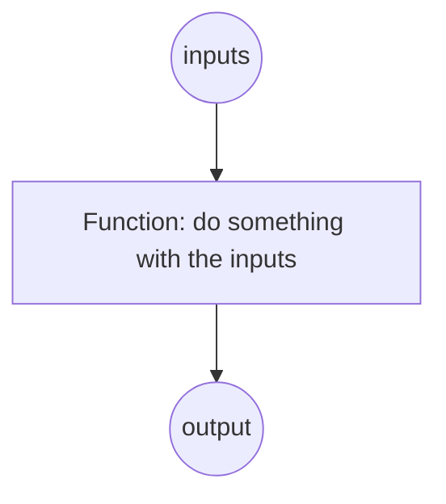
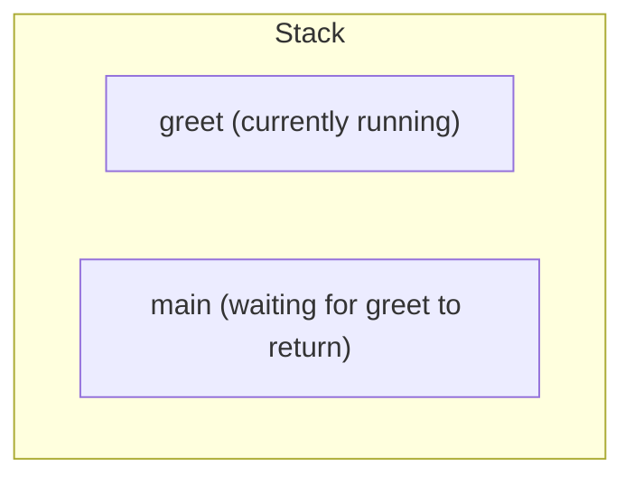

If there is one concept in this whole course you should take the
time to truly understand, it is **functions**. Everything else,
data structures, classes, asynchronous programming, frameworks,
is built on top of functions. They are the atom of programming.

<Figure
  slug="js-functions-basics-cutout"
  alt="Functions, the building blocks, an isometric illustration"
/>

## What a function is

A **function** is a named, reusable piece of code that takes some
**inputs** (arguments) and produces an **output** (a return value).
You define it once. You call it many times.



That picture is the entire mental model. Inputs in, work happens,
output out.

## Declaring a function

The classic syntax:

```javascript
function name(parameter1, parameter2) {
  // body
  return someValue;
}
```

A real example:

<CodeBlock
  adapter="javascript"
  files={[
    {
      filename: "main.js",
      starterCode: `function double(n) {
  return n * 2;
}

console.log(double(3)); // 6
console.log(double(10)); // 20
console.log(double(-7)); // -14

// 'double' is the function. We can use it as many times as we like.
`,
    },
  ]}
/>

Notice four things:

- The **declaration** is a recipe, it does not execute the body
  yet.
- A **call** like `double(3)` *executes* the body, with `n` bound
  to `3`.
- The function does its work and `return`s a value.
- The caller can then use that value.

If a function has no `return` (or `return` with nothing after it),
the result is `undefined`.

## Why functions matter

It's tempting to write your whole program as one long script. For
twenty lines, that's fine. For two hundred, it becomes a maze. The
moment you find yourself copying-and-pasting a chunk of code with
small tweaks, you should be writing a function instead.

Functions give you three huge benefits:

1. **Reuse.** Write it once, use it everywhere.
2. **Naming.** A well-named function is *documentation*. `tip()` is
   easier to read than the formula inside it.
3. **Isolation.** What happens inside a function stays mostly
   inside it. You can think about the function on its own without
   reading the whole program.

Compare these two equivalent programs:

<CodeBlock
  adapter="javascript"
  files={[
    {
      filename: "main.js",
      starterCode: `// Without functions, the formula is repeated and unnamed.
const bill1 = 80;
const tip1 = bill1 * 0.18;
const total1 = bill1 + tip1;
console.log("Table 1 total:", total1);

const bill2 = 45;
const tip2 = bill2 * 0.18;
const total2 = bill2 + tip2;
console.log("Table 2 total:", total2);

const bill3 = 120;
const tip3 = bill3 * 0.18;
const total3 = bill3 + tip3;
console.log("Table 3 total:", total3);
`,
    },
  ]}
/>

<CodeBlock
  adapter="javascript"
  files={[
    {
      filename: "main.js",
      starterCode: `// With a function, the formula has a name and lives in one place.
function totalWithTip(bill, tipRate) {
  return bill + bill * tipRate;
}

console.log("Table 1 total:", totalWithTip(80, 0.18));
console.log("Table 2 total:", totalWithTip(45, 0.18));
console.log("Table 3 total:", totalWithTip(120, 0.18));

// And if the tip rate ever changes, you change ONE line.
`,
    },
  ]}
/>

Both programs produce the same output. One is a maintenance
nightmare; the other is a pleasure. The difference is just one
function.

## Function expressions and arrow functions

JavaScript has more than one syntax for defining functions. They
all produce the same kind of value.

### Function declaration

```javascript
function add(a, b) {
  return a + b;
}
```

### Function expression

A function can also appear as a *value* on the right-hand side of
an assignment:

```javascript
const add = function (a, b) {
  return a + b;
};
```

### Arrow function

The most modern, compact syntax. Especially common for short
callbacks:

```javascript
const add = (a, b) => a + b;
```

Arrow functions have a few useful shorthand rules:

- If there is exactly one parameter, the parentheses are optional:
  `n => n * 2`.
- If the body is a single expression, the `{}` and `return` are
  optional: `n => n * 2`.
- For a multi-line body, use `{}` and an explicit `return` as
  normal: `(n) => { console.log(n); return n * 2; }`.

<CodeBlock
  adapter="javascript"
  files={[
    {
      filename: "main.js",
      starterCode: `// Three equivalent ways to define the same function:
function squareA(n) {
  return n * n;
}
const squareB = function (n) {
  return n * n;
};
const squareC = (n) => n * n;

console.log(squareA(5));
console.log(squareB(5));
console.log(squareC(5));

// Arrow functions are especially nice as small inline callbacks:
const nums = [1, 2, 3, 4, 5];
const doubled = nums.map((n) => n * 2);
console.log(doubled);
`,
    },
  ]}
/>

(There are a couple of subtle differences between regular
functions and arrow functions, chiefly around the `this`
keyword. We will look at `this` later. For now, treat them as
near-interchangeable.)

## Functions are first-class values

This is the deep idea borrowed from Scheme back in 1995, and it is
the secret weapon of modern JavaScript.

> In JavaScript, **functions are values**. You can put them in
> variables, pass them to other functions, return them from
> functions, and store them in arrays and objects, exactly like
> numbers and strings.

<CodeBlock
  adapter="javascript"
  files={[
    {
      filename: "main.js",
      starterCode: `// A function in a variable.
const greet = (name) => "Hello, " + name + "!";
console.log(greet("Ada"));

// A function passed as an argument to another function.
function applyTwice(f, x) {
  return f(f(x));
}
console.log(applyTwice((n) => n + 1, 5)); // 7
console.log(applyTwice((s) => s + "!", "go")); // "go!!"

// A function returned from a function.
function makeAdder(amount) {
  return (n) => n + amount;
}
const add10 = makeAdder(10);
const add100 = makeAdder(100);
console.log(add10(5)); // 15
console.log(add100(5)); // 105

// Functions stored in an array.
const operations = [(n) => n + 1, (n) => n * 2, (n) => n - 3];

let v = 10;
for (const op of operations) {
  v = op(v);
  console.log("after op:", v);
}
`,
    },
  ]}
/>

If this feels like magic, that's normal, and important. We will
return to it in the closures chapter.

## Pure functions and side effects

A **pure function** has two properties:

1. Given the same inputs, it always returns the same output.
2. It does not affect anything outside itself, no printing, no
   variable changes, no network calls, no file writes.

A function with **side effects** does some kind of work the
outside world can observe: printing, writing files, modifying a
shared variable.

Pure functions are easier to think about, easier to test, and
easier to reuse. Side effects are sometimes necessary, eventually
you *do* want output and persistence, but the goal of a good
design is to keep them in well-marked, predictable places.

<CodeBlock
  adapter="javascript"
  files={[
    {
      filename: "main.js",
      starterCode: `// Pure: depends only on its inputs, returns a value, no side effects.
function add(a, b) {
  return a + b;
}

// Impure: reads from / writes to the outside world.
let total = 0;
function addToTotal(n) {
  total += n; // side effect, modifies an outside variable
  console.log(total); // side effect, produces output
}

console.log(add(2, 3)); // 5
console.log(add(2, 3)); // 5, same every time

addToTotal(2);
addToTotal(3); // result depends on previous calls!
addToTotal(2);
`,
    },
  ]}
/>

Whenever you can, write pure functions and put the side effects
on the edges (a single function that calls `console.log`, a
single place that touches the database). This single discipline
will, more than almost anything else, make your code
maintainable.

## Reading the call stack

Every time you call a function, the runtime pushes a new entry
onto its **call stack**. When the function returns, the entry is
popped off. This is how the runtime always knows "where to return
to".



In a simple program:

```javascript
function bigName(name) {
  return name.toUpperCase();
}

function greet(name) {
  const big = bigName(name);   // push bigName onto the stack
  return "Hello, " + big;      // bigName returns; pop it off
}

console.log(greet("Ada"));     // push greet onto the stack
                               // (greet calls bigName inside)
```

At the moment `bigName` is running, the call stack looks like:

```
[ bigName ]   <- currently running
[ greet   ]
[ console.log ] (well, the runtime's outer frame)
```

When `bigName` returns, it is removed, and we continue running
`greet`.

You will see the call stack again when we discuss debugging, most
error messages include a stack trace that lists every function
that was in progress when the error happened. Learning to read
that trace is a superpower.

## A multi-file functions example

Real-world programs split functions across files. Each file
exports the functions it owns; other files import them. Here is a
small two-file example that does exactly that.

<CodeBlock
  adapter="javascript"
  entryFilename="index.js"
  files={[
    {
      filename: "index.js",
      starterCode: `const { totalWithTip, perPerson } = require("./bill");

const bill = 84.5;
const tipRate = 0.18;
const people = 4;

const total = totalWithTip(bill, tipRate);
const share = perPerson(total, people);

console.log("Total:", total.toFixed(2));
console.log("Per person:", share.toFixed(2));
`,
    },
    {
      filename: "bill.js",
      starterCode: `function totalWithTip(bill, tipRate) {
  return bill + bill * tipRate;
}

function perPerson(amount, people) {
  return amount / people;
}

module.exports = { totalWithTip, perPerson };
`,
    },
  ]}
/>

`bill.js` is a small **module**, a collection of related
functions, exported for use by other files. `index.js` is the
**driver**, it imports those functions and uses them. We will see
this pattern many more times.

## Challenge

<ChallengeCard
  adapter="javascript"
  title="Reusable formula"
  instructions={`Define a function \`bmi(weightKg, heightM)\` that returns the Body Mass Index, using the formula:

\`bmi = weight / (height * height)\`

Then define a function \`bmiCategory(bmi)\` that returns:

- \`"underweight"\` if bmi < 18.5
- \`"normal"\` if 18.5 ≤ bmi < 25
- \`"overweight"\` if 25 ≤ bmi < 30
- \`"obese"\` if bmi ≥ 30`}
  files={[
    {
      filename: "main.js",
      starterCode: `function bmi(weightKg, heightM) {
  // your code here
  return 0;
}

function bmiCategory(value) {
  // your code here
  return "";
}

console.log(bmi(70, 1.75), bmiCategory(bmi(70, 1.75)));
`,
      solutionCode: `function bmi(weightKg, heightM) {
  return weightKg / (heightM * heightM);
}

function bmiCategory(value) {
  if (value < 18.5) return "underweight";
  if (value < 25) return "normal";
  if (value < 30) return "overweight";
  return "obese";
}

console.log(bmi(70, 1.75), bmiCategory(bmi(70, 1.75)));
`,
    },
  ]}
  tests={[
    {
      id: "bmi_value",
      name: "BMI value",
      description: "bmi(70, 1.75) ≈ 22.857",
      code: `if (Math.abs(bmi(70, 1.75) - 70 / (1.75 * 1.75)) > 1e-9) throw new Error("bmi formula wrong");`,
    },
    {
      id: "underweight",
      name: "Underweight",
      description: "16 → underweight",
      code: `if (bmiCategory(16) !== "underweight") throw new Error("expected 'underweight'");`,
    },
    {
      id: "normal",
      name: "Normal",
      description: "22 → normal",
      code: `if (bmiCategory(22) !== "normal") throw new Error("expected 'normal'");`,
    },
    {
      id: "overweight",
      name: "Overweight",
      description: "27 → overweight",
      code: `if (bmiCategory(27) !== "overweight") throw new Error("expected 'overweight'");`,
    },
    {
      id: "obese",
      name: "Obese",
      description: "33 → obese",
      code: `if (bmiCategory(33) !== "obese") throw new Error("expected 'obese'");`,
    },
    {
      id: "boundary",
      name: "Boundary 25 → overweight",
      description: "Exactly 25 is overweight",
      code: `if (bmiCategory(25) !== "overweight") throw new Error("expected 'overweight' for 25");`,
    },
  ]}
/>

---

<MultipleChoice
  markdown={`Which of these statements about JavaScript functions is true and most distinctive of the language?

- Functions cannot be assigned to variables
  > Functions are first-class values in JavaScript; assigning them to variables is one of the core patterns of the language: \`const greet = function(name) { ... };\` is perfectly valid.
- Functions can only be called once
  > Functions can be called any number of times; there is no such limit in JavaScript, and many patterns (loops, recursion, event listeners) rely on calling the same function repeatedly.
- [o] Functions are *first-class values*: they can be stored in variables, passed as arguments, and returned from other functions
  > This is one of JavaScript's most powerful features (inherited from languages like Scheme). It makes idioms like \`array.map(fn)\`, \`array.filter(fn)\`, callbacks, event handlers, and higher-order functions natural. Without it, the entire modern JavaScript style would be impossible.
- Functions must always be declared before they're called
  > Function *declarations* (the \`function foo() {}\` form) are hoisted, so they can be called before the line they appear on. Function *expressions* assigned to variables are not hoisted, but the requirement to declare before calling is not universal.

First-class functions are what set the stage for closures, callbacks, functional programming, and most of modern JavaScript.`}
/>
