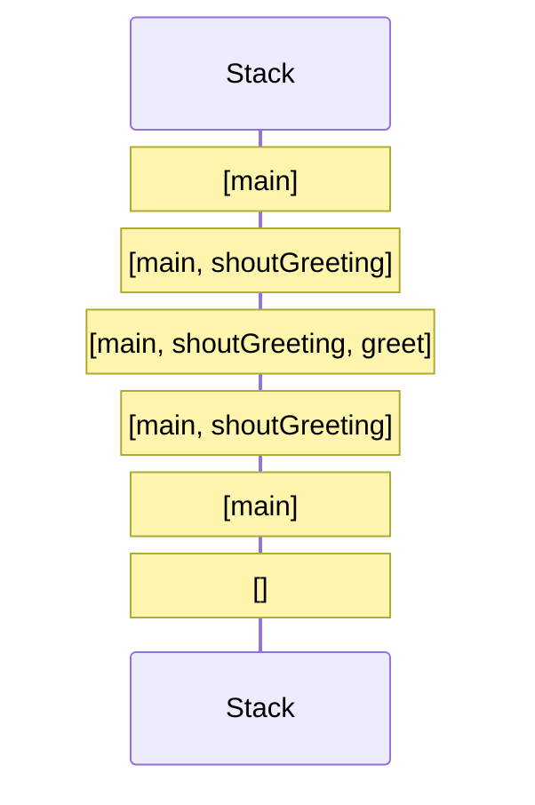
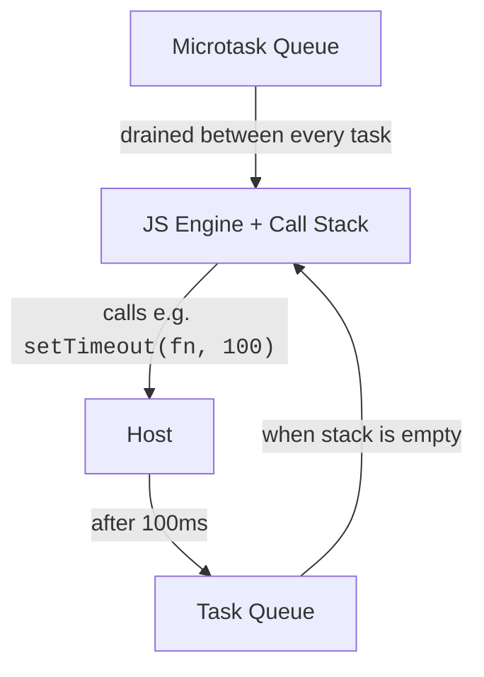
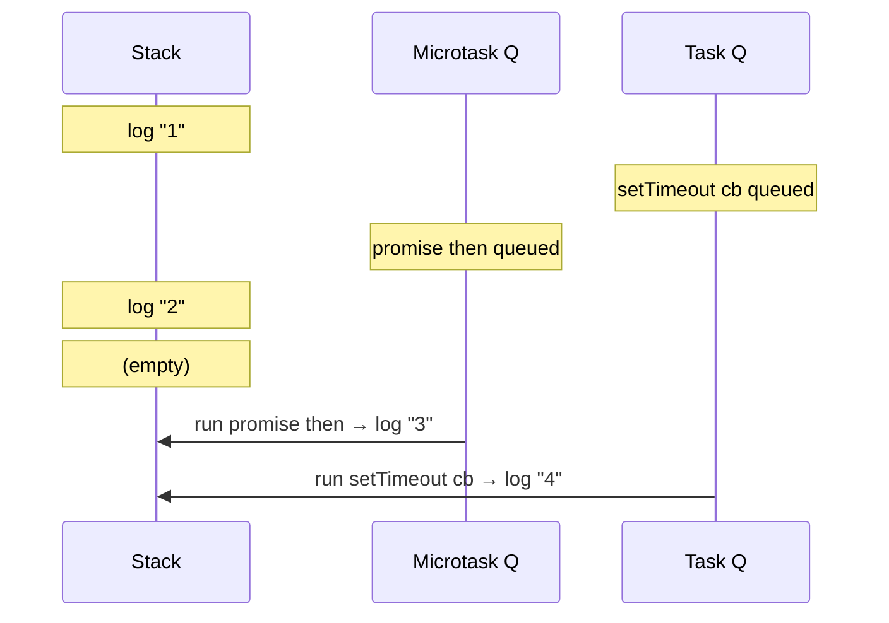

So far we've written code and pressed Run, and it has Just Worked.
Now we lift the hood. Understanding *how* the JavaScript runtime
schedules your code is what separates "I think this should work"
from "I know exactly why this prints in that order."

<Figure
  slug="js-how-javascript-runs-cutout"
  alt="How JavaScript runs, an isometric illustration"
/>

We'll focus on three structures:

1. The **call stack**, what's currently executing.
2. The **task queue** (a.k.a. macrotask queue), things waiting to start.
3. The **microtask queue**, promise reactions, very high priority.

Sitting on top of them: the **event loop**, the bit that ties
them together.

## JavaScript is single-threaded

This is the most important sentence in the whole chapter:

> JavaScript runs one piece of code at a time on a single thread.

There is no parallelism happening inside your JS code. If a
function takes 5 seconds, *nothing else* in your program runs
during those 5 seconds. (We'll see why slow blocking code is a
problem, and how async solves it without adding more threads.)

## The call stack

When a function is called, JS pushes a **stack frame** for it.
When the function returns, the frame is popped. That's it. The
"stack" is just the list of "things in progress, most recent on
top."

<CodeBlock
  adapter="javascript"
  files={[
    {
      filename: "main.js",
      starterCode: `function greet(name) {
  return "Hello, " + name;
}

function shoutGreeting(name) {
  return greet(name).toUpperCase();
}

function main() {
  console.log(shoutGreeting("Ada"));
}

main();
`,
    },
  ]}
/>

When `main()` runs, the stack grows and shrinks like this:



If you push too many frames without returning, for example, with
an infinitely recursive function, you get the famous
"Maximum call stack size exceeded" error.

<CodeBlock
  adapter="javascript"
  files={[
    {
      filename: "main.js",
      starterCode: `function forever() {
  forever();
}

try {
  forever();
} catch (e) {
  console.log("Caught:", e.message);
}
`,
    },
  ]}
/>

## Synchronous code blocks everything

While a function is on the stack, *nothing else can run*. Not
timers, not network responses, not clicks, nothing.

<CodeBlock
  adapter="javascript"
  files={[
    {
      filename: "main.js",
      starterCode: `function busyWait(ms) {
  const start = Date.now();
  while (Date.now() - start < ms) {
    // doing nothing for ms milliseconds
  }
}

console.log("A");
busyWait(500); // ~half a second of nothing
console.log("B"); // logs after ~500ms
`,
    },
  ]}
/>

This is exactly why long synchronous work in a browser freezes
the UI, the browser also can't process clicks while the stack is
busy. The fix isn't "make it faster"; it's "don't block the
thread." That's what asynchronous APIs let you do.

## The event loop, tasks, and microtasks

JavaScript doesn't run alone. It lives inside a **host
environment** (a browser, Node, etc.) that provides timers,
network APIs, file APIs, and so on. These hosts are written in
other languages and *can* do work in parallel. When they finish,
they hand a result back to JS by **scheduling a task**.

A simplified picture:



The **event loop** is the host's little supervisor. Its job, on
repeat:

1. If the call stack is empty, take the next pending **microtask**
   and run it. Repeat until the microtask queue is empty.
2. Then take the next pending **task** from the task queue and run
   it (which usually means pushing a function onto the stack).
3. Then drain microtasks again.
4. Go to 2.

That's the whole "event loop."

- A **task** (macrotask) comes from `setTimeout`, `setInterval`,
  I/O completions, UI events, etc.
- A **microtask** comes from a Promise reaction (`.then`/`await`)
  or from `queueMicrotask`.

The key rule: **microtasks run to completion before the next task
starts.** That tiny rule explains a lot of surprising orderings.

Laid out on a clock, the rules stop needing to be memorised. A task runs
to completion, the microtask queue drains entirely, and only then may the
browser paint.

<Chart slug="event-loop-phases" />

## A famous ordering puzzle

Try predicting the output *before* running.

<CodeBlock
  adapter="javascript"
  files={[
    {
      filename: "main.js",
      starterCode: `console.log("1: script start");

setTimeout(() => {
  console.log("4: setTimeout callback");
}, 0);

Promise.resolve().then(() => {
  console.log("3: promise microtask");
});

console.log("2: script end");
`,
    },
  ]}
/>

You should see:

```
1: script start
2: script end
3: promise microtask
4: setTimeout callback
```

Why?

- `1` and `2` run synchronously, on the stack.
- `setTimeout(fn, 0)` does *not* run `fn` now. It schedules `fn`
  as a task.
- `Promise.resolve().then(...)` schedules its callback as a
  microtask.
- When the synchronous script finishes, the event loop drains the
  microtask queue first → `3`.
- Then it picks the next task → `4`.

Even though both were "scheduled for as soon as possible", the
microtask wins.

## Async functions and `await`

`await` is sugar for "pause this function, attach the rest as a
microtask, and let other code run in the meantime."

<CodeBlock
  adapter="javascript"
  files={[
    {
      filename: "main.js",
      starterCode: `async function demo() {
  console.log("A: before await");
  await Promise.resolve();
  console.log("C: after await");
}

console.log("1: before demo()");
demo();
console.log("2: after demo()");
`,
    },
  ]}
/>

The output is:

```
1: before demo()
A: before await
2: after demo()
C: after demo()  -- printed last
```

`demo()` runs synchronously up to the `await`. The `await` yields
back to the caller; "after demo()" runs because we're still on
the same stack. Only once the stack empties does the microtask
run `C`.

Don't worry if Promises feel hand-wavy, the next chapter is all
about them. The point right now is: **`await` is a scheduling
hint, not magic parallelism.**

## Frame-by-frame execution

Here's the event-loop view of the earlier puzzle:



Reading flows like this is how you debug *"why did my code print
in that order?"* questions.

## Tiny mental model summary

- Code runs *to completion* on the stack before anything else runs.
- Long sync work blocks *everything*.
- `setTimeout` schedules a *task*; promises schedule *microtasks*.
- Microtasks run between tasks; many can run back-to-back.
- The event loop alternates: drain microtasks → run one task → repeat.

## Multi-file: scheduling demo

<CodeBlock
  adapter="javascript"
  entryFilename="index.js"
  files={[
    {
      filename: "index.js",
      starterCode: `const { runDemo } = require("./scheduling");

console.log("> script begin");
runDemo();
console.log("> script end");
`,
    },
    {
      filename: "scheduling.js",
      starterCode: `function runDemo() {
  setTimeout(() => console.log("[task] timeout 0"), 0);
  setTimeout(() => console.log("[task] timeout 0 #2"), 0);

  Promise.resolve().then(() => console.log("[micro] promise A"));
  Promise.resolve().then(() => {
    console.log("[micro] promise B");
    // Microtasks can spawn more microtasks; they ALSO run before
    // any task.
    Promise.resolve().then(() => console.log("[micro] promise B.1"));
  });

  queueMicrotask(() => console.log("[micro] queueMicrotask"));

  console.log("[sync] inside runDemo");
}

module.exports = { runDemo };
`,
    },
  ]}
/>

Predicted order:

```
> script begin
[sync] inside runDemo
> script end
[micro] promise A
[micro] promise B
[micro] queueMicrotask
[micro] promise B.1
[task] timeout 0
[task] timeout 0 #2
```

All synchronous logs come first, then *all* microtasks (including
the one B spawns), then tasks.

## Challenge

<ChallengeCard
  adapter="javascript"
  title="Predict and produce"
  instructions={`Write a function \`schedule(log)\` that, when called, uses \`setTimeout\` and \`Promise.resolve().then\` to push strings into \`log\` (an array) such that, after the event loop fully drains, \`log\` equals:

\`["sync", "micro", "task"]\`

Constraints:
- Push \`"sync"\` synchronously.
- Push \`"micro"\` from a \`Promise.resolve().then\` callback.
- Push \`"task"\` from a \`setTimeout(..., 0)\` callback.
- Use a promise that resolves once everything has been pushed, and return it. The tests will \`await\` it.`}
  files={[
    {
      filename: "main.js",
      starterCode: `function schedule(log) {
  // your code here
  // must return a Promise that resolves after the third push.
}

const log = [];
schedule(log).then(() => console.log(log));
`,
      solutionCode: `function schedule(log) {
  return new Promise((resolve) => {
    log.push("sync");
    Promise.resolve().then(() => {
      log.push("micro");
    });
    setTimeout(() => {
      log.push("task");
      resolve();
    }, 0);
  });
}

const log = [];
schedule(log).then(() => console.log(log));
`,
    },
  ]}
  tests={[
    {
      id: "returns_promise",
      name: "schedule returns a Promise",
      description: "Result must be thenable",
      code: `const r = schedule([]);
if (!r || typeof r.then !== "function") throw new Error("must return a Promise");`,
    },
    {
      id: "order",
      name: "Log ends in correct order",
      description: "['sync', 'micro', 'task']",
      code: `(async () => {
  const log = [];
  await schedule(log);
  const expected = ["sync", "micro", "task"];
  if (JSON.stringify(log) !== JSON.stringify(expected)) {
    throw new Error("expected " + JSON.stringify(expected) + " got " + JSON.stringify(log));
  }
})();`,
    },
    {
      id: "sync_first",
      name: "sync is pushed synchronously",
      description: "log has 'sync' before await",
      code: `const log = [];
const p = schedule(log);
if (log[0] !== "sync") throw new Error("'sync' must be pushed synchronously, before any await");`,
    },
  ]}
/>

---

<MultipleChoice
  markdown={`Given this code:

\`\`\`javascript
console.log("A");
setTimeout(() => console.log("B"), 0);
Promise.resolve().then(() => console.log("C"));
console.log("D");
\`\`\`

What does it print?

*Hint: the two \`console.log\` calls are synchronous and run first; then ask which kind of callback the event loop drains first, a promise (microtask) or a \`setTimeout\` (task).*

- A D B C
  > The two synchronous logs \`A\` and \`D\` are in the right place, but this assumes the \`setTimeout\` callback (\`B\`) runs before the promise callback (\`C\`). It's the other way around, microtasks run before tasks.
- [o] A D C B
  > \`A\` and \`D\` are synchronous and run first. When the stack empties, the event loop drains *microtasks* before tasks, so the promise callback \`C\` runs before the \`setTimeout\` callback \`B\`. Even though \`setTimeout\` is scheduled before the promise, microtasks always win against macrotasks.
- A B C D
  > This would be the order if callbacks ran the instant they were scheduled. They don't: \`setTimeout\` and the promise \`.then\` are both deferred until the synchronous code finishes, so \`B\` and \`C\` cannot appear before \`D\`.
- A C D B
  > This puts \`C\` before \`D\`, but \`D\` is synchronous and the promise callback \`C\` is a microtask, microtasks only run after all the synchronous code (including \`D\`) has finished.

The crucial rule: microtasks (promises, \`queueMicrotask\`) run between every task. \`setTimeout(..., 0)\` is a *task*, so it has to wait its turn.`}
/>
