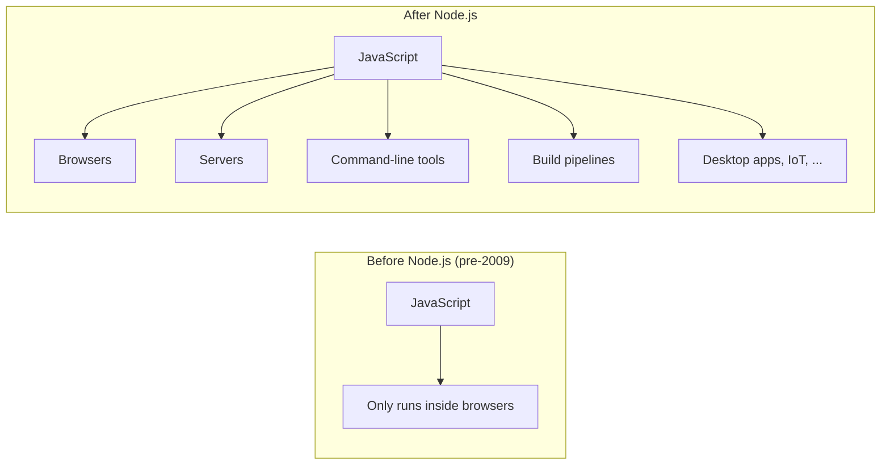

When JavaScript shipped in 1995, almost nobody thought of it as a
*real* programming language. It validated forms. It animated
snowflakes on personal homepages. It put a digital clock in the
corner of a page. Serious software lived on the server, written in
PHP, Java, or Perl; JavaScript was a sprinkle on top.

<Figure
  slug="js-javascript-today-cutout"
  alt="JavaScript today, an isometric illustration"
/>

This page tells the story of how that changed, slowly, then
suddenly, and ends with a clear-eyed picture of what JavaScript
*is* today, including the one distinction that will save you more
confusion than any other as you learn.

## The dark ages (1995–2005)

The first decade was, frankly, painful. Netscape, Internet
Explorer, and later Firefox each had subtly different
implementations of the language and the page. The same code might
work in one browser and silently fail in another, so programmers
shipped piles of defensive scaffolding:

```javascript
// Pseudo-real code from the early 2000s
if (window.attachEvent) {
  element.attachEvent("onclick", handler);   // Internet Explorer
} else if (window.addEventListener) {
  element.addEventListener("click", handler); // Everyone else
}
```

Writing serious software on this ground felt like building a house
during an earthquake, and the language's toy reputation hardened.
But three things were quietly improving underneath: browser engines
were getting dramatically faster, the ECMAScript standard was
pulling implementations into line, and web pages were getting more
ambitious. People wanted *applications*, not documents.

## The AJAX revolution (2004–2005)

Then two products shocked the industry: **Gmail** (2004) and
**Google Maps** (2005). Gmail behaved like a desktop email client
that happened to live in a browser tab, instant, no full-page
reloads. Google Maps let you *drag* a world map smoothly while new
tiles streamed in under your cursor.

<Figure
  slug="js-javascript-today-ajax-revolution-2004-inline-cutout"
  alt="A page panel that stays in place while one small tray inside it is swapped through a hatch"
  caption="Swapping one part of a page, without reloading it, changed what a page could be."
/>

The trick underneath both was the same: JavaScript could silently
ask the server for new data **in the background**, using a
half-forgotten browser feature called `XMLHttpRequest`, and update
parts of the page without reloading it. The pattern got a catchy
name, **AJAX** (Asynchronous JavaScript And XML), and it
instantly reframed the language in everyone's mind. Maybe
JavaScript wasn't a toy. Maybe it was the foundation of a new kind
of software.

## Libraries, then a jailbreak

Even after AJAX, raw browser programming was rough, so the
community built layers to smooth it over. The most famous was
**jQuery**, released by John Resig in 2006, one line of jQuery
replaced fifty lines of cross-browser plumbing, and for years it
was the most-used library on the web. Hundreds of libraries
followed. The lesson stuck: when the platform lags, the JavaScript
community builds what's missing rather than waiting.

<Figure
  slug="js-today-node-server-cutout"
  alt="An engine block lifted by crane out of a browser window and bolted onto a plain server rack"
  caption="2009: V8 taken out of the browser and bolted onto a server, and JavaScript stopped being a browser language."
/>

The real turning point came in 2009, when **Ryan Dahl** took V8,
the high-performance JavaScript engine Google built for Chrome,
and wrapped it so it could run **outside the browser**: on a
server, or on your laptop's command line. He called the result
**Node.js**.

It is hard to overstate what this changed. Until Node.js,
JavaScript was a language *trapped* inside a browser. After it, you
could write web servers, command-line tools, and build scripts in
JavaScript, and share code between the browser and the server.



Node.js brought a companion that mattered just as much: **npm**,
a central registry where anyone could publish a reusable package.
Today npm hosts millions of packages, the largest collection of
shared code in the history of software. (The full tour of where
JavaScript ended up running, desktops, phones, robots, databases,
is a story of its own; we keep it for the [Interesting discussions
section](/courses/beginners-javascript/javascript-beyond-the-browser)
at the end of the course.)

On top of this platform grew the **frameworks** you have probably
heard of, React, Vue, Angular, Svelte, and an industry of build
tools: bundlers, linters, formatters, type checkers. You need none
of them to learn the language, and this course deliberately uses
none of them. When people say "I'm learning JavaScript" they often
mean "I'm learning React"; this course is the other way around. We
are learning the language those frameworks stand on.

## The language grows up

While the ecosystem exploded, the language itself was transformed.
After years of standards stagnation, **ECMAScript 2015** (usually
called ES6) landed the largest upgrade in the language's history:
`let` and `const`, arrow functions, classes, template literals,
destructuring, modules, and Promises all arrived at once. Since
then the language has shipped a small, careful release every
year, `async`/`await` in 2017, optional chaining `?.` and nullish
coalescing `??` in 2020, and so on.

Through all of it, the committee has kept one iron rule: **don't
break the web**. Features are added; almost nothing is ever
removed. A page written in 1996 should still run today. That is
why JavaScript carries its entire history with it, `var` and
`==` still exist, even though modern code avoids them, and why
this course will occasionally say "this exists, don't use it".

Here is a taste of the modern language, using several features that
did not exist in 1995. If it looks like magic, good, by the end of
this course, every line will be ordinary to you:

<CodeBlock
  adapter="javascript"
  files={[
    {
      filename: "main.js",
      starterCode: `const users = [
  { name: "Ada", role: "admin", active: true },
  { name: "Linus", role: "member", active: true },
  { name: "Grace", role: "admin", active: false },
];

// Arrow function + .filter() + destructuring + template literal:
const activeAdmins = users
  .filter(({ role, active }) => role === "admin" && active)
  .map(({ name }) => \`Active admin: \${name}\`);

console.log(activeAdmins);

// Optional chaining: safely read a nested value
// without crashing if something in the middle is missing.
const first = users[0]?.name?.toUpperCase();
console.log("First user (shouting):", first);
`,
    },
  ]}
/>

## What JavaScript is, in one sentence

> **JavaScript is a dynamic, multi-paradigm, garbage-collected
> programming language that runs almost everywhere, with
> first-class functions and a single-threaded asynchronous
> execution model.**

That sentence is dense, and unpacking it is a preview of the whole
course:

**Dynamic** means decisions about what a value *is* are made while
the program runs. A variable can hold a number on one line and a
string on the next. This makes the language flexible and easy to
start with, and it means some mistakes only reveal themselves at
runtime, which is why we will spend real time on debugging.

**Multi-paradigm** means JavaScript doesn't force one style on you.
You can write step-by-step imperative code, organise behaviour into
objects, or compose pure functions into pipelines, and a healthy
codebase often mixes all three. This course teaches each style and,
more importantly, when each one shines.

**Garbage-collected** means you never manually free memory. The
runtime watches which values your program can still reach and
quietly reclaims the rest. In a language like C, forgetting to
free memory is an entire category of painful bugs; in JavaScript,
the category simply does not exist.

**First-class functions**, the Scheme inheritance from the
previous page, means functions are values: storable, passable,
returnable. It sounds abstract and is actually the single most
practical feature of the language. Every modern JavaScript library
leans on it, and so will you.

**Single-threaded and asynchronous** is the big one. JavaScript
does one thing at a time, yet it handles thousands of slow
operations (network requests, timers, clicks) without freezing, by
*scheduling* work instead of waiting for it. This sounds
paradoxical now. The runtime chapters near the end of the course
will make it precise, and it will become one of your favourite
things about the language.

## The three layers (the distinction that saves you)

The single most useful mental model for a beginner is that
"JavaScript" is used to mean three different layers:

1. **The language itself**, syntax, values, functions, closures,
   async. Standardized, portable, slow-changing. *This is what
   this course teaches.*
2. **The platform APIs**, what your code can *do* depends on
   where it runs. Browsers add the Document Object Model and `fetch()`; Node.js adds
   files and servers. Same language, different toolbelts.
3. **The frameworks and tools**, React, Vue, Express, Vite,
   TypeScript, ESLint… an ever-shifting landscape built *on top of*
   the other two layers.

Layer 3 changes every few years. Layer 1 essentially never changes,
code you write in it, and the understanding you build of it,
does not expire. That is why this course lives in layer 1: learn
the language deeply once, and every framework becomes "just a
library I can read the docs for".

JavaScript is honestly not the best tool for everything, heavy
numerical computing, hard real-time systems, and tiny embedded
chips are better served by other languages. But for a *first*
language, it is hard to beat: zero setup (a browser is a
development environment), instant feedback, an enormous community,
and concepts, closures, first-class functions, asynchronous
thinking, that transfer to every language you will ever learn.

## One last warm-up

Let's run one more program before we leave the history and start
learning properly. This one prints a small table, a hint of the
kind of program you'll be writing yourself within a few pages.

<Figure
  slug="js-javascript-today-dark-ages-1995-inline-cutout"
  alt="A cramped workshop of mismatched tools, each bench needing its own adapter before anything fits"
  caption="Before the standards settled, every browser needed its own adapter."
/>

<CodeBlock
  adapter="javascript"
  files={[
    {
      filename: "main.js",
      starterCode: `// Show a small multiplication table.
// Don't worry about the syntax yet, we'll learn each piece.
function table(n) {
  console.log(\`Multiplication table for \${n}:\`);
  for (let i = 1; i <= 10; i++) {
    console.log(\`  \${n} x \${i} = \${n * i}\`);
  }
}

table(7);
console.log();
table(12);
`,
    },
  ]}
/>

If you understand even roughly what is happening, *a function
called `table` prints multiplications for a given number*, you
already have the right instincts. The rest is detail, and the
details start on the next page with the most fundamental question
of all: *what does it actually mean for a computer to run a
program?*

---

<MultipleChoice
  markdown={`What is the most important distinction to keep in mind as you learn JavaScript?

- [o] The difference between the JavaScript *language* (stable, portable, this course's focus) and the *frameworks and tools* built on top of it (which change every few years)
  > The language itself is the durable, transferable skill. Frameworks like React, build tools like Webpack, and even runtime APIs like \`fetch()\` come and go or differ between runtimes, but \`let\`, \`const\`, \`function\`, \`if\`, \`for\`, arrays, objects, closures, and \`async\`/\`await\` will be exactly the same a decade from now.
- The difference between \`==\` and \`===\`
  > Understanding \`==\` vs \`===\` is a useful JavaScript detail, but it is a single language feature rather than the overarching distinction between the stable language core and the ever-changing ecosystem that surrounds it.
- The difference between Java and JavaScript
  > Java and JavaScript are unrelated languages that share a superficial naming similarity for historical marketing reasons; knowing this distinction is a fun fact but not the most important thing to keep in mind while learning JavaScript.
- The difference between Chrome and Firefox
  > Browser differences matter for compatibility, but they are a runtime-level concern; the most consequential distinction for a learner is between the language itself and the ecosystem built on top of it.

The language is the bedrock. Once you know it well, picking up any framework or runtime API is a matter of reading documentation.`}
/>
