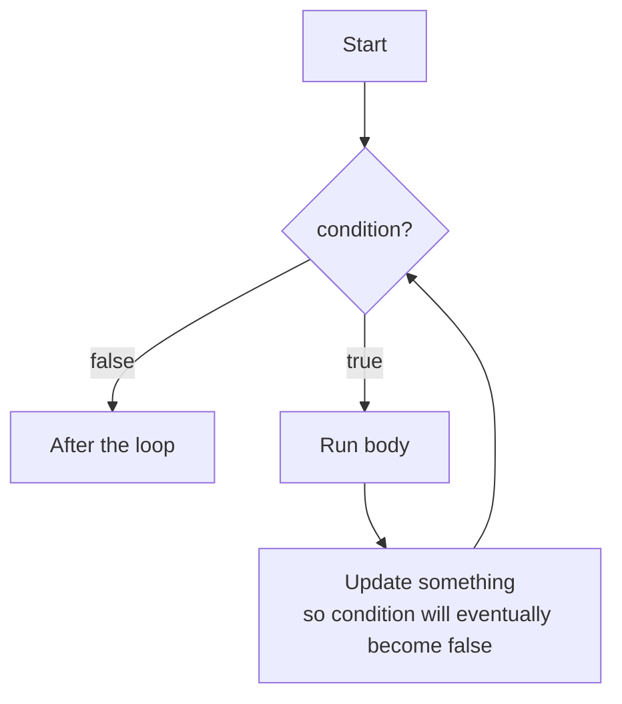
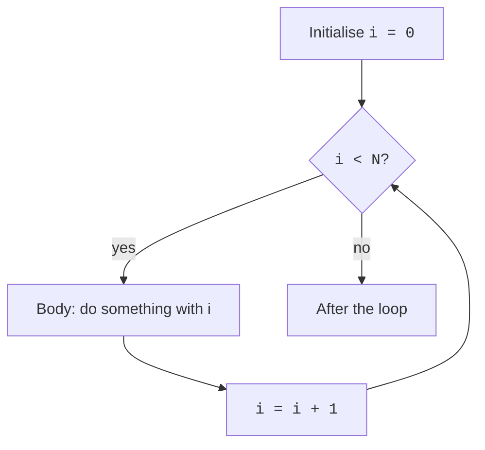

The second great power of control flow — after **decisions** — is
**repetition**. Almost every interesting program needs to do the
same kind of thing many times: process every file in a folder,
every row in a table, every pixel on a screen, every customer in a
database. That repetition is called **iteration**, and the
syntactic tools for it are called **loops**.

JavaScript has several kinds of loop. We will learn each one and,
just as importantly, when to use which.

<svg
  viewBox="0 0 640 210"
  role="img"
  aria-label="A row of squares being colored in one at a time, a marker over the current square, and a smooth arrow sweeping from the end of the row back to the start — a loop repeating over items"
  style={{ display: "block", width: "100%", maxWidth: "640px", height: "auto", margin: "2.5rem auto" }}
>
  <g style={{ color: "var(--ds-blue-500)" }} fill="currentColor">
    <rect x="130" y="70" width="34" height="34" rx="8" />
  </g>
  <g style={{ color: "var(--ds-green-500)" }} fill="currentColor">
    <rect x="210" y="70" width="34" height="34" rx="8" />
  </g>
  <g style={{ color: "var(--ds-yellow-500)" }} fill="currentColor">
    <rect x="290" y="70" width="34" height="34" rx="8" />
  </g>
  <g style={{ color: "var(--ds-red-500)" }} fill="currentColor">
    <circle cx="387" cy="48" r="6" />
  </g>
  <g fill="currentColor" opacity="0.15">
    <rect x="370" y="70" width="34" height="34" rx="8" />
    <rect x="450" y="70" width="34" height="34" rx="8" />
  </g>
  <g style={{ color: "var(--ds-gray-400)" }}>
    <path
      d="M467 118 C 472 172, 172 172, 147.3 121"
      fill="none"
      stroke="currentColor"
      strokeWidth="2.5"
      strokeLinecap="round"
    />
    <polygon points="152.9,122.8 147,112 141.9,123.2" fill="currentColor" />
  </g>
</svg>

## The `while` loop

The simplest loop. While the condition is truthy, run the body. Then
check the condition again.

```javascript
while (condition) {
  // body
}
```

<CodeBlock
  adapter="javascript"
  files={[
    {
      filename: "main.js",
      starterCode: `let n = 1;
while (n <= 5) {
  console.log("n =", n);
  n = n + 1;
}
console.log("Done. n is now", n);
`,
    },
  ]}
/>

Step-by-step trace of what the runtime does:

| Step | `n` before | condition | action |
| ---: | ---: | --- | --- |
| 1 | 1 | `1 <= 5` is true | print, `n` becomes 2 |
| 2 | 2 | true | print, `n` becomes 3 |
| 3 | 3 | true | print, `n` becomes 4 |
| 4 | 4 | true | print, `n` becomes 5 |
| 5 | 5 | true | print, `n` becomes 6 |
| 6 | 6 | `6 <= 5` is false | leave the loop |

The most important habit: **make sure something in the body
changes the condition**, or your loop will run forever. An
**infinite loop** that you cannot interrupt is one of the few
things in JavaScript that will make your tab unresponsive.



## The `for` loop

Often you want to do something `N` times, or walk an index from
some start to some end. The `for` loop is `while` with three slots
pulled out so they sit together at the top:

```javascript
for (init; condition; update) {
  // body
}
```

- **init** runs once, before the loop starts.
- **condition** is checked before each iteration.
- **update** runs at the end of each iteration.

<CodeBlock
  adapter="javascript"
  files={[
    {
      filename: "main.js",
      starterCode: `for (let i = 0; i < 5; i++) {
  console.log("i =", i);
}

// Count down:
for (let i = 10; i >= 0; i -= 2) {
  console.log("i =", i);
}
`,
    },
  ]}
/>

That `i++` is a compact way to write `i = i + 1`. Combined with the
`for` loop's three slots, it makes counting loops short and
readable.

The two loops you just ran are exactly equivalent to writing them
with `while`:

```javascript
let i = 0;
while (i < 5) {
  console.log("i =", i);
  i++;
}
```

Same behaviour; just less compactly written.

## `for...of`: walk every element

When you have an array (or any **iterable** — strings, Sets, Maps,
etc.) and you want to do something for each element, `for...of` is
usually the clearest choice. You don't have to manage an index at
all.

<CodeBlock
  adapter="javascript"
  files={[
    {
      filename: "main.js",
      starterCode: `const colors = ["red", "green", "blue"];

for (const color of colors) {
  console.log("color:", color);
}

// Works on strings too — each character is yielded:
for (const ch of "hello") {
  console.log(ch);
}
`,
    },
  ]}
/>

If you *do* need the index alongside the element, use
`array.entries()`:

<CodeBlock
  adapter="javascript"
  files={[
    {
      filename: "main.js",
      starterCode: `const colors = ["red", "green", "blue"];

for (const [index, color] of colors.entries()) {
  console.log(index, "->", color);
}
`,
    },
  ]}
/>

That `[index, color]` is **destructuring**, which we have not
formally introduced yet. Treat it as a convenient way to say "give
me each pair as two named variables". We will see destructuring
properly in the objects chapter.

## `for...in`: walk an object's keys

`for...in` walks the **keys** of an object — useful when you want
to look at every named property. It is not appropriate for arrays
(use `for...of` for those).

<CodeBlock
  adapter="javascript"
  files={[
    {
      filename: "main.js",
      starterCode: `const user = { name: "Ada", age: 28, role: "admin" };

for (const key in user) {
  console.log(key, "=", user[key]);
}
`,
    },
  ]}
/>

We will look at objects in detail in their own chapter. For now,
remember the shape: `for (const key in object)`.

## `break` and `continue`

Inside any loop, two special statements let you bail out or skip
ahead:

- `break` exits the loop entirely.
- `continue` skips the rest of the current iteration and starts
  the next.

<CodeBlock
  adapter="javascript"
  files={[
    {
      filename: "main.js",
      starterCode: `// Find the first number bigger than 50.
const numbers = [3, 17, 42, 9, 88, 13, 99];

let found;
for (const n of numbers) {
  if (n > 50) {
    found = n;
    break; // stop immediately — no need to keep looking
  }
}
console.log("first > 50:", found);

// Print only odd numbers.
for (let i = 1; i <= 10; i++) {
  if (i % 2 === 0) continue; // skip even numbers
  console.log("odd:", i);
}
`,
    },
  ]}
/>

Use these sparingly. Heavy use of `break`/`continue` is often a
sign that the loop is doing too many things at once and could be
split into smaller helpers.

## The "loop and accumulate" pattern, revisited

We saw this in the *Computational thinking* chapter. It is the
single most common shape of loop in real code: **start with a
blank result, walk a list, update the result**.

<CodeBlock
  adapter="javascript"
  files={[
    {
      filename: "main.js",
      starterCode: `const numbers = [10, 22, 3, 47, 9];

// Sum
let total = 0;
for (const n of numbers) {
  total += n;
}
console.log("total:", total);

// Count
let countOver10 = 0;
for (const n of numbers) {
  if (n > 10) countOver10++;
}
console.log("count > 10:", countOver10);

// Build a new list (kept positive numbers only)
const positives = [];
for (const n of numbers) {
  if (n > 0) positives.push(n);
}
console.log("positives:", positives);

// Find the max
let max = numbers[0];
for (const n of numbers) {
  if (n > max) max = n;
}
console.log("max:", max);
`,
    },
  ]}
/>

Notice that each example is the same pattern: *initialise; loop;
update*. Once you see this shape, you see it everywhere.

## Higher-level alternatives: `forEach`, `map`, `filter`, `reduce`

For the very common pattern of "do something with every element
of an array", arrays come with built-in methods that often read
better than a hand-written loop. We will dedicate an entire later
chapter to these, but here is a small taste:

<CodeBlock
  adapter="javascript"
  files={[
    {
      filename: "main.js",
      starterCode: `const numbers = [1, 2, 3, 4, 5];

// forEach — just run a function for each element
numbers.forEach((n) => console.log("element:", n));

// map — produce a new array of the same length
const squared = numbers.map((n) => n * n);
console.log("squared:", squared);

// filter — produce a new array with only the elements that pass a test
const evens = numbers.filter((n) => n % 2 === 0);
console.log("evens:", evens);

// reduce — collapse the array into a single value
const total = numbers.reduce((acc, n) => acc + n, 0);
console.log("total:", total);
`,
    },
  ]}
/>

These are the *functional* style of iteration: instead of writing
the loop, you describe *what* you want done with each element, and
JavaScript runs the loop for you.

When learning, write the explicit `for` loop first; then, once you
are comfortable, switch to `map`/`filter`/`reduce` where they make
the intent clearer.

## Nested loops

A loop inside a loop is called a **nested loop**. The inner loop
runs to completion *for each* iteration of the outer loop. This
is how you generate combinations, walk a grid, or compare every
item to every other item.

<CodeBlock
  adapter="javascript"
  files={[
    {
      filename: "main.js",
      starterCode: `// A small multiplication table.
for (let row = 1; row <= 5; row++) {
  let line = "";
  for (let col = 1; col <= 5; col++) {
    const product = row * col;
    line += product.toString().padStart(4, " ");
  }
  console.log(line);
}
`,
    },
  ]}
/>

Be mindful of cost: nesting an N-element loop inside another
N-element loop runs the inner body N×N times. For N=10 that's
100 — fine. For N=10,000 that's 100,000,000 — possibly too slow.

## Beware the infinite loop

<svg
  viewBox="0 0 640 160"
  role="img"
  aria-label="A closed ring of blue dots with a single red dot trapped on it — a loop with no way out"
  style={{ display: "block", width: "100%", maxWidth: "480px", height: "auto", margin: "2rem auto" }}
>
  <g style={{ color: "var(--ds-blue-500)" }} fill="currentColor" fillOpacity="0.75">
    <circle cx="363" cy="105" r="7" />
    <circle cx="345" cy="123" r="7" />
    <circle cx="320" cy="130" r="7" />
    <circle cx="295" cy="123" r="7" />
    <circle cx="277" cy="105" r="7" />
    <circle cx="270" cy="80" r="7" />
    <circle cx="277" cy="55" r="7" />
    <circle cx="295" cy="37" r="7" />
    <circle cx="320" cy="30" r="7" />
    <circle cx="345" cy="37" r="7" />
    <circle cx="363" cy="55" r="7" />
  </g>
  <g style={{ color: "var(--ds-red-500)" }} fill="currentColor">
    <circle cx="370" cy="80" r="10" />
  </g>
</svg>

Always ask: *how does this loop end?* Common mistakes:

```javascript
// (a) Forgetting to update the counter
let i = 0;
while (i < 5) {
  console.log(i);
  // Oops — forgot i++. This runs forever.
}

// (b) Updating the wrong way
for (let i = 0; i < 10; i--) {
  console.log(i);
  // i goes 0, -1, -2, ... forever.
}
```

If your tab freezes when you press Run, your loop almost certainly
forgot to terminate. Stop the runtime, find the loop, fix the
update.

## Step-by-step execution diagram

Mentally tracing a loop is a skill. Here is a flowchart for the
classic `for (let i = 0; i < N; i++) { ... }`:



Picture this in your head every time you write a `for` loop. Half
the loop bugs in the world come from forgetting where each piece
goes in this cycle.

## Challenge

<ChallengeCard
  adapter="javascript"
  title="FizzBuzz"
  instructions={`Write a function \`fizzbuzz(n)\` that returns an array of \`n\` strings. For positions \`1\` through \`n\`:

- If the position is divisible by 15, the string is \`"FizzBuzz"\`.
- Otherwise, if it's divisible by 3, the string is \`"Fizz"\`.
- Otherwise, if it's divisible by 5, the string is \`"Buzz"\`.
- Otherwise, the string is the position number, converted to a string (e.g. \`"7"\`).

For example, \`fizzbuzz(5)\` should return \`["1", "2", "Fizz", "4", "Buzz"]\`.

Implement it with a \`for\` loop and an array you build up with \`.push()\`.`}
  files={[
    {
      filename: "main.js",
      starterCode: `function fizzbuzz(n) {
  const out = [];
  // your code here
  return out;
}

console.log(fizzbuzz(15));
`,
      solutionCode: `function fizzbuzz(n) {
  const out = [];
  for (let i = 1; i <= n; i++) {
    if (i % 15 === 0) out.push("FizzBuzz");
    else if (i % 3 === 0) out.push("Fizz");
    else if (i % 5 === 0) out.push("Buzz");
    else out.push(String(i));
  }
  return out;
}

console.log(fizzbuzz(15));
`,
    },
  ]}
  tests={[
    {
      id: "size",
      name: "Returns n elements",
      description: "fizzbuzz(15).length === 15",
      code: `if (fizzbuzz(15).length !== 15) throw new Error("expected 15 elements");`,
    },
    {
      id: "first_five",
      name: "First five entries",
      description: `["1","2","Fizz","4","Buzz"]`,
      code: `const r = fizzbuzz(5);
const expected = ["1","2","Fizz","4","Buzz"];
for (let i = 0; i < expected.length; i++) {
  if (r[i] !== expected[i]) throw new Error("at index " + i + " expected " + expected[i] + " got " + r[i]);
}`,
    },
    {
      id: "fifteen",
      name: "FizzBuzz at 15",
      description: "fizzbuzz(15)[14] === 'FizzBuzz'",
      code: `if (fizzbuzz(15)[14] !== "FizzBuzz") throw new Error("expected 'FizzBuzz' at position 15");`,
    },
    {
      id: "all_strings",
      name: "All entries are strings",
      description: "no numbers in the array",
      code: `for (const x of fizzbuzz(20)) {
  if (typeof x !== "string") throw new Error("expected string, got " + typeof x);
}`,
    },
  ]}
/>

---

<MultipleChoice
  markdown={`Which loop is the *cleanest* way to do something for every element of an array, when you don't need the index?

- A \`while\` loop with a manual counter
  > A \`while\` loop with a counter works but requires you to initialise the counter, manage the condition, and increment manually — three things that can each go wrong when all you want is "do this for every element".
- A \`for (let i = 0; i < arr.length; i++)\` loop
  > The index-based \`for\` loop is the right choice when you need the index, but when you only need the elements it forces you to write index arithmetic that doesn't add any meaning.
- A \`for...in\` loop
  > \`for...in\` iterates over an object's enumerable *property keys*, not array elements; on an array it yields string indices like \`"0"\`, \`"1"\` and may also visit any enumerable properties added to \`Array.prototype\`, making it unreliable for arrays.
- [o] A \`for...of\` loop: \`for (const item of arr) { ... }\`
  > \`for...of\` walks each element directly, with no index arithmetic to get wrong. Use it whenever you don't need the index. If you do need the index, either fall back to the classic \`for (let i ...)\` loop or use \`arr.entries()\` for destructured \`[index, item]\` pairs.

The other forms work, but \`for...of\` expresses the intent most clearly. (And \`for...in\` is for object keys, not array elements — using it on arrays is a common bug.)`}
/>
