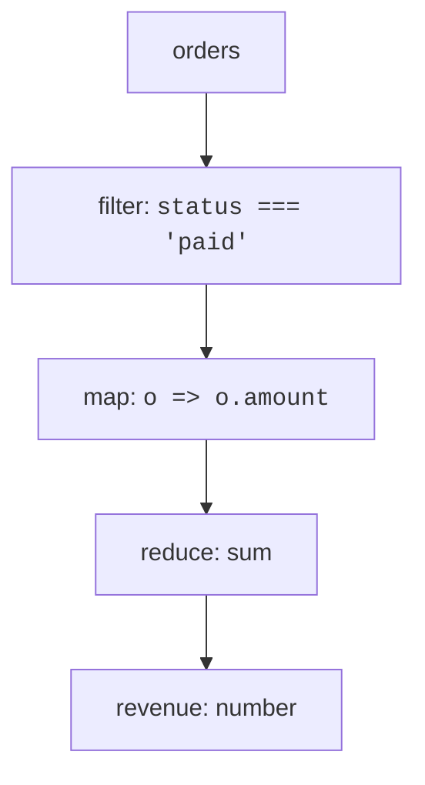

In the *loops* chapter we wrote out the "loop and accumulate"
pattern by hand: walk an array, build up a result. JavaScript
gives you three built-in methods — `map`, `filter`, and `reduce` —
that express these patterns more clearly. Once they click,
half the loops you would otherwise write disappear.

These three methods together are sometimes called the **functional
core** of array processing.

<svg
  viewBox="0 0 640 215"
  role="img"
  aria-label="A pipeline: four circles pass through a green bar and become squares, a yellow bar lets only two through, and a funnel merges them into one large circle — map, filter, reduce"
  style={{ display: "block", width: "100%", maxWidth: "640px", height: "auto", margin: "2.5rem auto" }}
>
  <g style={{ color: "var(--ds-blue-500)" }} fill="currentColor">
    <circle cx="66" cy="45" r="11" />
    <circle cx="66" cy="85" r="11" />
    <circle cx="66" cy="125" r="11" />
    <circle cx="66" cy="165" r="11" />
    <polygon points="340,35 340,185 430,110" />
    <circle cx="500" cy="110" r="30" />
  </g>
  <g style={{ color: "var(--ds-green-500)" }} fill="currentColor">
    <rect x="118" y="32" width="30" height="150" rx="13" />
    <rect x="170" y="34" width="22" height="22" rx="6" />
    <rect x="170" y="74" width="22" height="22" rx="6" />
    <rect x="170" y="114" width="22" height="22" rx="6" />
    <rect x="170" y="154" width="22" height="22" rx="6" />
    <rect x="276" y="54" width="22" height="22" rx="6" />
    <rect x="276" y="114" width="22" height="22" rx="6" />
  </g>
  <g style={{ color: "var(--ds-yellow-500)" }} fill="currentColor">
    <rect x="224" y="32" width="30" height="150" rx="13" />
  </g>
  <g style={{ color: "var(--ds-red-500)" }} fill="currentColor">
    <rect x="238" y="190" width="18" height="18" rx="5" fillOpacity="0.35" />
  </g>
</svg>

## The shift in mindset

A `for` loop says *how* to walk the array. The three methods say
*what* to produce.

| Loop says... | Higher-order method says... |
| --- | --- |
| Step from index 0 to length-1 | "For each element..." |
| Push into a result array | "Produce a new array of..." |
| Conditionally include | "Keep only the ones where..." |
| Accumulate a single value | "Combine all into..." |

The pattern is: **describe the transformation, not the mechanics**.

## `map`: transform every element

`arr.map(fn)` returns a *new* array of the same length, where each
element is the result of `fn` applied to the original element.

<CodeBlock
  adapter="javascript"
  files={[
    {
      filename: "main.js",
      starterCode: `const nums = [1, 2, 3, 4, 5];

// "For each n, give me n * n."
const squared = nums.map((n) => n * n);
console.log(squared); // [1, 4, 9, 16, 25]

// "For each user, give me their name."
const users = [
  { name: "Ada", age: 28 },
  { name: "Linus", age: 35 },
  { name: "Grace", age: 80 },
];

const names = users.map((u) => u.name);
console.log(names); // ["Ada","Linus","Grace"]

// "For each grade, format it as a percentage string."
const grades = [0.92, 0.78, 0.65];
const formatted = grades.map((g) => (g * 100).toFixed(1) + "%");
console.log(formatted); // ["92.0%","78.0%","65.0%"]
`,
    },
  ]}
/>

Three things to notice:

1. The original array is *not* modified.
2. The result is *always* the same length.
3. Each element is processed independently. The callback can't see
   the other elements.

If you need to *skip* elements, `map` is the wrong tool. That's
what `filter` is for.

## `filter`: keep only the elements that pass a test

`arr.filter(fn)` returns a *new* array containing only the
elements for which `fn` returns a truthy value.

<CodeBlock
  adapter="javascript"
  files={[
    {
      filename: "main.js",
      starterCode: `const nums = [1, 2, 3, 4, 5, 6, 7, 8, 9, 10];

const evens = nums.filter((n) => n % 2 === 0);
console.log(evens); // [2, 4, 6, 8, 10]

const users = [
  { name: "Ada", active: true, age: 28 },
  { name: "Linus", active: false, age: 35 },
  { name: "Grace", active: true, age: 80 },
];

const active = users.filter((u) => u.active);
console.log(active);

const seniors = users.filter((u) => u.age >= 65);
console.log(seniors);

// Remove falsy values from a mixed list:
const messy = [0, "hello", "", null, "world", undefined, 7];
const cleaned = messy.filter(Boolean); // Boolean is a function — neat trick!
console.log(cleaned); // ["hello", "world", 7]
`,
    },
  ]}
/>

Notice the last example: `Boolean` is itself a function, and
`filter(Boolean)` removes every falsy value in one stroke. Tiny
idioms like this make functional code remarkably compact.

## `reduce`: collapse the array into a single value

`reduce` is the most general of the three. It walks the array,
maintaining an "accumulator", and produces a single final value.

```javascript
arr.reduce(
  (accumulator, currentValue) => newAccumulator,
  initialAccumulator,
);
```

<CodeBlock
  adapter="javascript"
  files={[
    {
      filename: "main.js",
      starterCode: `const nums = [1, 2, 3, 4, 5];

// Sum
const total = nums.reduce((acc, n) => acc + n, 0);
console.log(total); // 15

// Product
const product = nums.reduce((acc, n) => acc * n, 1);
console.log(product); // 120

// Maximum
const max = nums.reduce((acc, n) => (n > acc ? n : acc), -Infinity);
console.log(max); // 5

// Count of evens (reduce can return any type)
const evenCount = nums.reduce((acc, n) => (n % 2 === 0 ? acc + 1 : acc), 0);
console.log(evenCount); // 2

// Build an object: grades by name.
const grades = [
  { name: "Ada", score: 90 },
  { name: "Linus", score: 75 },
  { name: "Grace", score: 100 },
];

const byName = grades.reduce((acc, g) => {
  acc[g.name] = g.score;
  return acc;
}, {});
console.log(byName); // { Ada: 90, Linus: 75, Grace: 100 }
`,
    },
  ]}
/>

`reduce` is *very* general. Anything you can do with a manual
"start with X, walk the array, update X, return X" loop, you can
do with `reduce`. In fact, `map` and `filter` are themselves just
special cases of `reduce`.

A common piece of advice: *don't reach for `reduce` first*. It can
do anything, but its generality makes it harder to read than `map`
or `filter`. Reach for it when you genuinely need to fold the
array into a non-list result.

## Composing the three

The real power of these methods is **chaining**. Each one returns
a new array, so you can apply the next one immediately.

<CodeBlock
  adapter="javascript"
  files={[
    {
      filename: "main.js",
      starterCode: `const orders = [
  { id: 1, customer: "Ada", amount: 120, status: "paid" },
  { id: 2, customer: "Linus", amount: 80, status: "cancelled" },
  { id: 3, customer: "Ada", amount: 60, status: "paid" },
  { id: 4, customer: "Grace", amount: 200, status: "paid" },
  { id: 5, customer: "Linus", amount: 50, status: "paid" },
];

// Total revenue from paid orders.
const revenue = orders
  .filter((o) => o.status === "paid")
  .map((o) => o.amount)
  .reduce((sum, n) => sum + n, 0);

console.log("Revenue:", revenue);

// Top customer (by total paid).
const totalsByCustomer = orders
  .filter((o) => o.status === "paid")
  .reduce((acc, o) => {
    acc[o.customer] = (acc[o.customer] || 0) + o.amount;
    return acc;
  }, {});

console.log("By customer:", totalsByCustomer);

const top = Object.entries(totalsByCustomer).reduce(
  (best, [customer, total]) =>
    total > best.total ? { customer, total } : best,
  { customer: null, total: -Infinity },
);

console.log("Top:", top);
`,
    },
  ]}
/>

Read the first chain top-to-bottom. It says, in plain English:
*"take the orders, keep the paid ones, get each amount, add them
all up."* That readability — the way each step describes a small,
clear transformation — is the whole point.

## Other useful array methods

A few more that follow the same functional spirit:

<CodeBlock
  adapter="javascript"
  files={[
    {
      filename: "main.js",
      starterCode: `const nums = [3, 1, 4, 1, 5, 9, 2, 6];

// find: first element matching a predicate
console.log(nums.find((n) => n > 4)); // 5

// findIndex: position of the first match (or -1)
console.log(nums.findIndex((n) => n > 4)); // 4

// some: does at least one element match?
console.log(nums.some((n) => n > 8)); // true
console.log(nums.some((n) => n > 100)); // false

// every: do ALL elements match?
console.log(nums.every((n) => n > 0)); // true
console.log(nums.every((n) => n > 1)); // false

// flatMap: map + flatten one level (great for "expand each element")
const words = ["hello world", "fancy chairs"];
const allTokens = words.flatMap((w) => w.split(" "));
console.log(allTokens); // ["hello","world","fancy","chairs"]
`,
    },
  ]}
/>

`some` and `every` are particularly worth remembering — they often
replace a hand-rolled loop with an early `return true`.

## Data flow visualised

A chain of `.filter().map().reduce()` is a small **data pipeline**.
Each step takes the previous output as input.



Each arrow carries a value (in this case, mostly arrays). Drawing
a tiny pipeline like this on paper is a great way to plan
transformations before writing code.

## Performance notes (lightly)

Methods chained one after another walk the array multiple times.
For small data this is fine; for arrays of millions of elements
you might prefer a single hand-written loop or a streaming
approach. For everyday programming, *prefer the readable version*
— modern engines are fast, and clarity is more valuable than
micro-optimisation.

## A multi-file pipeline

Real-world programs build pipelines that span multiple modules:
one module owns the transformations, another assembles them.

<CodeBlock
  adapter="javascript"
  entryFilename="index.js"
  files={[
    {
      filename: "index.js",
      starterCode: `const { revenueByMonth, topMonth } = require("./reporting");

const orders = [
  { month: "Jan", amount: 120 },
  { month: "Jan", amount: 80 },
  { month: "Feb", amount: 200 },
  { month: "Mar", amount: 50 },
  { month: "Mar", amount: 75 },
  { month: "Mar", amount: 100 },
];

console.log("Per month:", revenueByMonth(orders));
console.log("Top month:", topMonth(orders));
`,
    },
    {
      filename: "reporting.js",
      starterCode: `function revenueByMonth(orders) {
  return orders.reduce((acc, o) => {
    acc[o.month] = (acc[o.month] || 0) + o.amount;
    return acc;
  }, {});
}

function topMonth(orders) {
  const totals = revenueByMonth(orders);
  return Object.entries(totals).reduce(
    (best, [month, amount]) =>
      amount > best.amount ? { month, amount } : best,
    { month: null, amount: -Infinity },
  );
}

module.exports = { revenueByMonth, topMonth };
`,
    },
  ]}
/>

## Challenge

<ChallengeCard
  adapter="javascript"
  title="Pipeline practice"
  instructions={`Given an array of products, each shaped like \`{ name, price, inStock }\`, write a function \`affordableInStock(products, maxPrice)\` that returns an array of *names* of products that are in stock AND have a price less than or equal to \`maxPrice\`, sorted alphabetically.

Use \`.filter\`, \`.map\`, and \`.sort()\` — not a hand-written for loop.

Examples:
- For \`[{name:"A", price:5, inStock:true}, {name:"B", price:20, inStock:true}, {name:"C", price:3, inStock:false}]\` with \`maxPrice=10\`, return \`["A"]\`.
- For the same input with \`maxPrice=100\`, return \`["A","B"]\`.`}
  files={[
    {
      filename: "main.js",
      starterCode: `function affordableInStock(products, maxPrice) {
  // your code here, using .filter, .map, and .sort()
  return [];
}

const products = [
  { name: "Pen", price: 2, inStock: true },
  { name: "Notebook", price: 5, inStock: true },
  { name: "Laptop", price: 999, inStock: true },
  { name: "Eraser", price: 1, inStock: false },
  { name: "Ink", price: 8, inStock: true },
];

console.log(affordableInStock(products, 10));
`,
      solutionCode: `function affordableInStock(products, maxPrice) {
  return products
    .filter((p) => p.inStock && p.price <= maxPrice)
    .map((p) => p.name)
    .sort();
}

const products = [
  { name: "Pen", price: 2, inStock: true },
  { name: "Notebook", price: 5, inStock: true },
  { name: "Laptop", price: 999, inStock: true },
  { name: "Eraser", price: 1, inStock: false },
  { name: "Ink", price: 8, inStock: true },
];

console.log(affordableInStock(products, 10));
`,
    },
  ]}
  tests={[
    {
      id: "basic",
      name: "Filter and sort",
      description: "Keep affordable in-stock, sorted alphabetically",
      code: `const products = [
  { name: "Pen",       price: 2,  inStock: true  },
  { name: "Notebook",  price: 5,  inStock: true  },
  { name: "Laptop",    price: 999, inStock: true },
  { name: "Eraser",    price: 1,  inStock: false },
  { name: "Ink",       price: 8,  inStock: true  },
];
const r = affordableInStock(products, 10);
const expected = ["Ink", "Notebook", "Pen"];
if (JSON.stringify(r) !== JSON.stringify(expected)) throw new Error("expected " + JSON.stringify(expected) + ", got " + JSON.stringify(r));`,
    },
    {
      id: "skip_out_of_stock",
      name: "Skip out-of-stock items",
      description: "Eraser is out of stock",
      code: `const products = [
  { name: "Eraser", price: 1, inStock: false },
];
if (JSON.stringify(affordableInStock(products, 10)) !== "[]") throw new Error("should skip out-of-stock items");`,
    },
    {
      id: "skip_expensive",
      name: "Skip expensive items",
      description: "Laptop is too expensive",
      code: `const products = [
  { name: "Laptop", price: 999, inStock: true },
];
if (JSON.stringify(affordableInStock(products, 10)) !== "[]") throw new Error("should skip items above maxPrice");`,
    },
    {
      id: "names_only",
      name: "Returns names only",
      description: "Each element is a string",
      code: `const products = [{ name: "X", price: 1, inStock: true }];
const r = affordableInStock(products, 10);
if (r.length !== 1 || typeof r[0] !== "string") throw new Error("must return an array of name strings");`,
    },
  ]}
/>

---

<MultipleChoice
  markdown={`Which of these is the *cleanest* expression of "give me a new array where each user's name is uppercased"?

- A \`for\` loop that pushes into a new array
  > A \`for\` loop with \`push\` produces the right result but obscures the intent: the reader must understand the loop mechanics before seeing that the goal is "transform every element".
- A \`for...of\` loop with manual indexing
  > A \`for...of\` loop is already cleaner than an index-based \`for\`, but "with manual indexing" adds unnecessary bookkeeping; when the goal is to transform every element, \`map\` expresses that directly.
- [o] \`users.map((u) => ({ ...u, name: u.name.toUpperCase() }))\`
  > \`map\` precisely expresses "transform every element". The transformation describes the result without spelling out the mechanics of the loop. Using object spread together with \`map\` is the standard idiom for "produce a new array of updated objects".
- A \`while\` loop that builds a new array index-by-index
  > A \`while\` loop requires the most manual bookkeeping of all the options — initialising the index, checking the condition, incrementing, and pushing — none of which communicates the intent of "transform every element".

\`map\` makes the *intent* obvious. Hand-written loops do the same work but force the reader to figure out what you're trying to express.`}
/>
