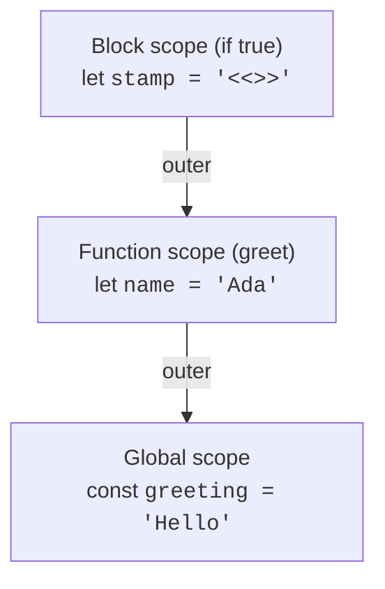

When your program writes the name `x`, the runtime has to figure
out *which* `x` you mean. There may be many. The rules for that
lookup are called **scope**, and they are simple once you have
the right picture.

<Figure
  slug="js-scope-and-scope-chain-cutout"
  alt="Scope and the scope chain, an isometric illustration"
/>

## What scope is

A **scope** is a region of the program where a particular set of
names is "in effect". When the runtime sees a name, it asks: *is
that name defined in the current scope? If not, what about the
scope around it? And the one around that?*

JavaScript has three kinds of scope:

- **Global scope**, the outermost level. Variables declared here
  are visible everywhere.
- **Function scope**, created when a function runs. Each call to
  a function gets its own.
- **Block scope**, created by any `{ ... }` block. Each `if`,
  `for`, or stand-alone block has its own.

Variables declared with `let` and `const` respect *block* scope.
Variables declared with the old `var` only respect *function*
scope, which is one of the reasons we avoid `var`.

## A first example

<CodeBlock
  adapter="javascript"
  files={[
    {
      filename: "main.js",
      starterCode: `const outside = "I am global";

function show() {
  const inside = "I am inside show";
  console.log(outside); // visible, global wraps around function
  console.log(inside); // visible, current scope
}

show();
console.log(outside); // visible, global
// console.log(inside);   // ReferenceError: inside is not defined
`,
    },
  ]}
/>

The function's scope can "see out" to the global scope, but the
global scope cannot see "in" to the function. Scopes are like
one-way mirrors.

## Block scope in action

<CodeBlock
  adapter="javascript"
  files={[
    {
      filename: "main.js",
      starterCode: `function example() {
  const x = "function-scope x";
  if (true) {
    const x = "block-scope x"; // a brand new x, only inside the if
    console.log("inner:", x); // "block-scope x"
  }
  console.log("outer:", x); // "function-scope x"
}

example();
`,
    },
  ]}
/>

The inner `const x` *shadows* the outer one. The two are separate
variables that happen to share a name. The moment the `if` block
ends, the inner `x` vanishes and the outer `x` is again the only
one in scope.

<Figure
  slug="js-scope-and-scope-chain-inline-cutout"
  alt="Three rooms nested one inside another, a lamp in the outermost lighting all three, and a lamp in the innermost lighting only its own room"
  caption="An inner block can see out, but nothing outside can see in."
/>

## The scope chain

When a name is referenced and the runtime cannot find it in the
*current* scope, it looks in the **enclosing scope**, then the
scope enclosing that, and so on out to the global scope. That
sequence of nested scopes is called the **scope chain**.

<Figure
  slug="js-scope-and-scope-chain-scope-inline-cutout"
  alt="One lit room inside a larger dark one, the light reaching only as far as the inner room's walls"
  caption="A name not found here is looked for in the scope that encloses this one."
/>

To resolve a name, the runtime walks *up* this chain, taking the
first match it finds.

<CodeBlock
  adapter="javascript"
  files={[
    {
      filename: "main.js",
      starterCode: `const greeting = "Hello";

function greet(name) {
  if (true) {
    const stamp = "<<>>";
    console.log(stamp, greeting, name, stamp);
    //          ^block ^global   ^function
  }
}

greet("Ada");
`,
    },
  ]}
/>

`stamp` is found in the block. `greeting` is not in the block, not
in the function, found in the global. `name` is not in the block,
found in the function. The runtime walks outward until it succeeds.

## Each function call gets its own scope

This is critical. Every time you call a function, a fresh scope is
created for that call. Local variables from one call do not leak
into another.

<CodeBlock
  adapter="javascript"
  files={[
    {
      filename: "main.js",
      starterCode: `function counter() {
  let n = 0; // a fresh n every time counter() is called
  n = n + 1;
  return n;
}

console.log(counter()); // 1
console.log(counter()); // 1, not 2!
console.log(counter()); // 1
`,
    },
  ]}
/>

Each call starts with `n = 0`, increments it to `1`, returns, and
the local `n` is then discarded. We will see in the *closures*
chapter how to make `n` persist across calls, that's a more
advanced trick.

## Shadowing: same name, different scopes

When a name is declared in an inner scope that already exists in
an outer scope, the inner one **shadows** the outer one, the
outer is still there, just hidden inside the inner scope.

<CodeBlock
  adapter="javascript"
  files={[
    {
      filename: "main.js",
      starterCode: `let user = "outer";

function modify() {
  let user = "inner"; // shadows the outer 'user'
  user = "inner v2";
  console.log("inside:", user);
}

modify();
console.log("outside:", user); // unchanged, modify() never touched the outer 'user'
`,
    },
  ]}
/>

This is sometimes intentional (a local variable that's
conceptually independent of the outer one), but more often it's a
source of subtle bugs. **Avoid shadowing** unless you have a good
reason.

## Lexical scope

A crucial property of JavaScript: scope is **lexical**, meaning
it is determined by *where the code is written*, not by *who calls
whom*. The scope chain of a function is fixed when the function is
defined.

<Figure
  slug="js-scope-and-scope-chain-lexical-scope-inline-cutout"
  alt="A lamp whose reach is fixed where it was hung rather than where the switch happens to be pressed"
  caption="A function sees the scope it was written in, not the scope it is called from."
/>

<CodeBlock
  adapter="javascript"
  files={[
    {
      filename: "main.js",
      starterCode: `const country = "Wonderland";

function describe() {
  console.log("country is", country);
}

function caller() {
  const country = "Looking-Glass-Land"; // local
  describe(); // What does this print?
}

caller();
`,
    },
  ]}
/>

The output is `"country is Wonderland"`. Even though `describe()`
is *called from* `caller()`, the `country` it sees is the one
visible from where `describe` was *written*, the global scope.

This is **lexical scoping**, and it is the foundation of closures
(coming next). If JavaScript used *dynamic* scope instead,
`describe()` would have looked up the *caller's* `country` and
printed `"Looking-Glass-Land"`. Lexical scope is far easier to
reason about, and it is what JavaScript (and almost every other
modern language) uses.

## Why globals are dangerous

A variable declared at the top level is visible *everywhere*. That
sounds convenient, but it means *any* part of the program can
read or modify it, and that any function might silently depend on
it. Big programs with many globals become impossible to reason
about.

The general rule: **declare variables in the narrowest scope you
can**. Inside a function. Inside a block. As close to where they
are used as possible.

<CodeBlock
  adapter="javascript"
  files={[
    {
      filename: "main.js",
      starterCode: `// Bad style: a global counter modified from anywhere
let count = 0;

function add() {
  count += 1;
}
function reset() {
  count = 0;
}

add();
add();
add();
console.log(count); // 3, but who set this? where? when?

// Better style: each function operates on values it is given,
// and returns new values. State is explicit and local.
function increment(value) {
  return value + 1;
}

let c = 0;
c = increment(c);
c = increment(c);
c = increment(c);
console.log(c);
`,
    },
  ]}
/>

The "better style" example is more verbose, but every change to
`c` is right there in the visible call sequence. Nothing can
sneak in.

## Hoisting (a short note)

You will sometimes hear that JavaScript "hoists" declarations.
For *modern* code (using `let`, `const`, and functions declared
with `function`), the important things to remember are:

- A `function NAME() { ... }` declaration is fully usable anywhere
  in its enclosing scope, *including before its declaration*.
- A `let` or `const` is only usable *after* the line on which it
  is declared. Using one earlier produces a "temporal dead zone"
  error.

<CodeBlock
  adapter="javascript"
  files={[
    {
      filename: "main.js",
      starterCode: `// This works because of function hoisting:
console.log(square(4)); // 16

function square(n) {
  return n * n;
}

// This does NOT work, 'x' is in the "temporal dead zone":
// console.log(x);
// const x = 5;
`,
    },
  ]}
/>

Function hoisting is convenient. The `let`/`const` rule prevents a
class of bugs where you accidentally use a variable before you've
given it a value.

## Putting it together: visualising the chain

Below is a slightly bigger example. Before you press Run, predict
what each `console.log()` will print, given the scope rules above.

<CodeBlock
  adapter="javascript"
  files={[
    {
      filename: "main.js",
      starterCode: `const planet = "Earth";

function outer(name) {
  const greeting = "Hello";

  function inner(suffix) {
    // 'suffix'  is in inner's own scope.
    // 'name'    is found in outer's scope.
    // 'greeting' is also in outer's scope.
    // 'planet'  is found in the global scope.
    return greeting + ", " + name + suffix + " on " + planet + ".";
  }

  return inner;
}

const f = outer("Ada");
console.log(f("!"));
console.log(f("?"));
console.log(f(" (welcome)"));
`,
    },
  ]}
/>

Two things to notice:

1. `f` *remembers* the variables from `outer` even though `outer`
   has long since finished. That memory is called a **closure**,
   the topic of the next page.
2. The lookups for `name`, `greeting`, and `planet` are happening
   through the scope chain that was set up when `inner` was
   defined, not when `inner` is called.

## Challenge

<ChallengeCard
  adapter="javascript"
  title="Spot the shadow"
  instructions={`The function \`compute\` below has a subtle scope problem: a local variable accidentally shadows another. Without changing the test, modify the function so that the outer \`total\` (declared at the top of the function) is the one updated and returned.

The function should return the sum of \`1 + 2 + 3\` which is \`6\`. As-is, it returns \`0\`.`}
  files={[
    {
      filename: "main.js",
      starterCode: `function compute() {
  let total = 0;
  for (let i = 1; i <= 3; i++) {
    let total = i; // BUG: this declares a NEW total, shadowing the outer one
    // your fix here
  }
  return total;
}

console.log(compute());
`,
      solutionCode: `function compute() {
  let total = 0;
  for (let i = 1; i <= 3; i++) {
    total += i; // assign to the OUTER total, no inner declaration
  }
  return total;
}

console.log(compute());
`,
    },
  ]}
  tests={[
    {
      id: "result",
      name: "compute() should return 6",
      description: "1 + 2 + 3 = 6",
      code: `if (compute() !== 6) throw new Error("expected 6, got " + compute());`,
    },
  ]}
/>

---

<MultipleChoice
  markdown={`In JavaScript, when the runtime needs to resolve a variable name, where does it look?

- Only in the current function's scope
  > If the name is not found in the current scope, the runtime does not stop there, it continues outward through each enclosing scope until the name is found or the global scope is exhausted.
- [o] First in the current scope, then in the enclosing scope, and so on outward through the *scope chain* until either it finds the name or reaches the global scope
  > JavaScript uses *lexical* scoping: the chain of scopes is determined by where the code is written. Each scope contains its own declarations, and unresolved names fall through to the enclosing scope. The first match wins.
- Wherever the function was called from (dynamic scoping)
  > JavaScript uses *lexical* (static) scoping, not dynamic scoping. The scope chain is fixed at the point where the code is written, not at the point where the function is called.
- Only in the global scope
  > The global scope is checked last, not first; the runtime starts at the innermost scope where the reference appears and works outward, so a local declaration always shadows a global one with the same name.

Lexical scoping makes the meaning of a name predictable from the source code, you don't need to know who called a function to know which variable it sees.`}
/>
