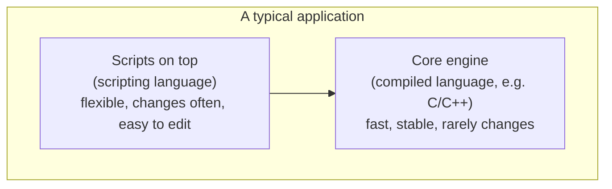

This is the first of two optional "interesting discussions",
deeper dives for readers who finished the course and want the
larger story around it. Nothing here is required, but it explains a
question worth asking: JavaScript is routinely called a *scripting
language*. What does that actually mean, and why did such languages
exist in the first place?

<Figure
  slug="js-scripting-and-glue-cutout"
  alt="Scripting and glue, an isometric illustration"
/>

By the 1970s and 1980s, computers were everywhere, in research
labs, banks, telephone exchanges, factories, and a growing number
of homes. Most "serious" software was written in heavyweight,
**compiled** languages like C, COBOL, or FORTRAN. These languages
were fast and powerful, but they carried a heavy ceremony: write
the code, run a **compiler** to translate it into machine code,
**link** that machine code with libraries, run the program, and if
anything was wrong, edit and repeat from the compile step.

For building an operating system or a database, that ceremony is
fine, those programs are huge, live for decades, and need every
ounce of speed. But an enormous amount of daily programming is
*small*: rename 500 files in a folder, count how many times "ERROR"
appears in a log, glue this command-line tool to that one, email a
daily report. For jobs like these, the compile-link-run cycle is
overkill, and in the gap a new kind of language appeared.

## What "scripting" actually means

The word **script** comes from the theatre: a script is the
sequence of lines an actor follows. In computing, a script is a
sequence of instructions that some larger system, an operating
system, a database, a web browser, follows, usually one at a time,
as it reads them.

Traditionally, a scripting language has a few recognisable traits.
It is **interpreted**: a program called an interpreter reads your
source and executes it directly, with no separate compile step to
remember. It is **dynamically typed**: you don't declare in advance
whether a variable holds a number or text. It is **high-level**:
memory layout and other low-level bookkeeping are handled for you.
And above all, it offers **quick feedback**, change a line,
re-run, see the result. Where a compiled language puts four steps
between an edit and a result (edit, compile, link, run), a
scripting language puts one.

That speed of iteration explains who scripting languages were
*for*: very often, **people who did not consider themselves
programmers**. System administrators automating servers with shell
scripts. Scientists processing experiment data in Python. Game
designers tweaking enemy behaviour in Lua. Web designers making a
form validate itself in JavaScript. None of these people wanted to
learn about pointers or linkers, they wanted the result, that
afternoon. This is also why scripting languages get a bad
reputation in some circles: the same flexibility that lets a
beginner ship something in an afternoon can let a careless team
build an unmaintainable monster by year three. That tension runs
through JavaScript's entire history.

## A small parade of scripting languages

A few names you may have heard, and what each was originally for:

- **shell** (sh, bash, zsh), scripting the operating system
  itself: run programs, move files, chain commands. Born in the
  early 1970s.
- **AWK** (1977) and **sed**, tiny languages dedicated to slicing
  and reshaping text files line by line.
- **Perl** (1987), "the Swiss Army chainsaw" of system
  administrators; superb at text processing and gluing tools
  together.
- **Tcl** (1988), designed specifically to be *embedded* inside
  larger applications, so users could script those applications.
- **Python** (1991), a scripting language with a strong emphasis
  on readability that grew far beyond scripting, eventually
  dominating data science.
- **Lua** (1993), tiny and embeddable; it became the de facto
  scripting language of the video game industry.
- **JavaScript** (1995), designed to be the scripting language
  *inside a web browser*.

<Figure
  slug="js-scripting-and-glue-scripting-actually-means-inline-cutout"
  alt="Three separate machines on a bench joined by short lengths of hose so one handle drives all three"
  caption="A scripting language is glue: one handle driving tools built elsewhere."
/>

Notice the pattern: scripting languages were not invented to
*replace* big compiled languages. They were invented to live
**alongside** them, connective tissue that lets a small amount of
code wield enormous amounts of pre-built power.

## The two-language pattern

For decades, professional software settled into a comfortable
rhythm sometimes called the **two-language pattern**: a fast,
compiled **systems language** for the heavy core, and a flexible
**scripting language** layered on top for the parts that change
often.

Video games are the classic example. The 3D engine, the physics
simulation, and the graphics-card communication are written in C++
for raw speed. But the *rules* of the game, what happens when the
player picks up a sword, how a quest unfolds, are very often
written in Lua, so that designers can change them without
recompiling the engine. The engine is rebuilt by engineers a few
times a year; the scripts are edited by designers many times a day.

Web browsers followed exactly this pattern. The browser itself is
enormous, millions of lines of C++. But pages need small bits of
logic, *"when the user clicks here, do this"*, and that logic
should be small, safe, and easy to write. The natural answer was to
embed a scripting language in the browser, and that embedded
scripting language was JavaScript.

The historical joke, of course, is that the "script layer"
outgrew the pattern. With Node.js, JavaScript became a language
that whole systems are written *in*, not just scripted *with*, a
fate none of the languages in the parade above quite predicted,
though Python came close.

## A scripting language in action

Here is a small piece of JavaScript doing what scripting languages
were born to do, read some data, reshape it, print a result. With
the whole course behind you, every line should read at a glance,
and if `counts[entry.level] = (counts[entry.level] || 0) + 1`
makes you smile in recognition, the course did its job.

<CodeBlock
  adapter="javascript"
  files={[
    {
      filename: "main.js",
      starterCode: `// A small script that summarises a server log.
const log = [
  { time: "10:00", level: "INFO", message: "started" },
  { time: "10:01", level: "INFO", message: "user logged in" },
  { time: "10:02", level: "WARN", message: "slow response" },
  { time: "10:03", level: "ERROR", message: "database down" },
  { time: "10:04", level: "INFO", message: "user logged out" },
  { time: "10:05", level: "ERROR", message: "database down" },
];

// Count how many lines of each level there are.
const counts = {};
for (const entry of log) {
  counts[entry.level] = (counts[entry.level] || 0) + 1;
}

console.log("Log summary:", counts);
console.log("Errors:");
for (const entry of log) {
  if (entry.level === "ERROR") {
    console.log("  ", entry.time, "-", entry.message);
  }
}
`,
    },
  ]}
/>

Twenty lines, no compile step, no type declarations, immediate
output. In a systems language this script would be twice as long
and need a build step before it ran. Neither approach is "better",
they are tuned for different jobs, which is exactly why both
kinds of language exist.

---

<MultipleChoice
  markdown={`What is the main reason scripting languages became popular alongside compiled languages?

- They run faster than compiled languages
  > Scripting languages are typically *slower* than compiled languages because they are interpreted or JIT-compiled at runtime rather than compiled ahead of time to native machine code; their appeal is ease of use and rapid iteration, not speed.
- [o] They let people write small, useful programs and "glue" larger systems together without a heavy compile/link cycle
  > Scripting languages are designed for fast iteration, simple syntax, and embedding inside larger systems. They rarely *replace* compiled languages, they sit on top of them, letting people automate, customise, and extend large systems with relatively little code.
- They produce smaller machine code than compiled languages
  > Scripting languages usually execute via an interpreter or virtual machine, producing no machine code directly; their output is not smaller native binaries than compiled languages.
- They are the only languages that support functions
  > Functions exist in virtually every programming language, including compiled languages like C, C++, and Fortran that predate or coexisted with scripting languages.

Scripting languages thrive in the role of connective tissue: text processing, configuration, automation, and customising larger applications.`}
/>
