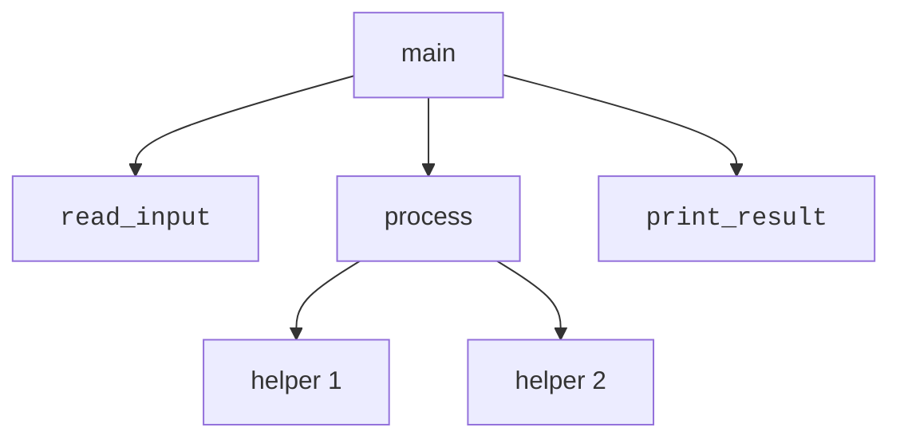
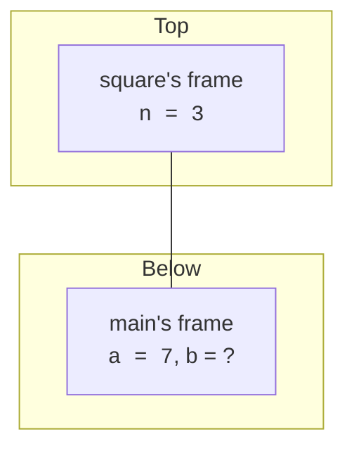

A **function** is a named, reusable block of code. Functions are the
single most important tool for managing complexity in any
programming language. They let you:

<Figure
  slug="c-functions-cutout"
  alt="Functions, an isometric illustration"
/>

- Avoid repeating yourself.
- Hide messy details behind a friendly name.
- Test small pieces in isolation.
- Read code at the level of *intent* rather than mechanism.

You already met one function: `main`. Every C program starts there.
Now let's write our own.

## Anatomy of a function

```c
return_type name(parameter_list) {
    // body
    return some_value;   // (omit for void)
}
```

A complete example:

<CodeBlock
  adapter="c"
  files={[
    {
      filename: "main.c",
      starterCode: `#include <stdio.h>

int square(int n) { return n * n; }

int main(void) {
  int a = 7;
  int b = square(a);
  printf("%d squared = %d\\n", a, b);
  printf("%d squared = %d\\n", 3, square(3));
  return 0;
}
`,
    },
  ]}
/>

Three things to notice:

- The function `square` is defined *above* `main`. The compiler must
  see a declaration before any caller (we'll see how to fix that
  with a header in a moment).
- `square(a)` is a **function call**: control jumps into the
  function, the parameter `n` is given the value of `a`, the body
  runs, and the value after `return` flows back out.
- The same function can be called many times with different
  arguments.

<Figure
  slug="c-functions-inline-cutout"
  alt="A bench with a machine that has a fixed-size input slot and a fixed-size output chute, a block being cut to fit before it goes in"
/>

## Parameters are local copies

C passes arguments **by value**. The function receives a fresh copy
of each argument, and changes inside the function do not affect the
caller's variables.

<CodeBlock
  adapter="c"
  files={[
    {
      filename: "main.c",
      starterCode: `#include <stdio.h>

void try_to_increment(int x) {
  x = x + 1;
  printf("inside function: x = %d\\n", x);
}

int main(void) {
  int n = 10;
  try_to_increment(n);
  printf("after call:      n = %d\\n", n);
  return 0;
}
`,
    },
  ]}
/>

`n` in `main` is unchanged because `try_to_increment` got its own
copy of the value. To actually modify a caller's variable, you would
pass a **pointer** to it, which is exactly what pointers are for,
and what we'll explore in a few chapters.

## `void`, when a function returns nothing

If a function does its work via side effects (like printing) and
has nothing meaningful to return, use `void` as the return type.

<CodeBlock
  adapter="c"
  files={[
    {
      filename: "main.c",
      starterCode: `#include <stdio.h>

void banner(void) { printf("============================\\n"); }

int main(void) {
  banner();
  printf(" Welcome to the program!\\n");
  banner();
  return 0;
}
`,
    },
  ]}
/>

`void name(void)` means "this function takes no arguments and
returns nothing". The empty `()` (without `void`) in an old-style
declaration means something subtly different, use `(void)` to be
unambiguous.

## Multiple parameters

Parameters are separated by commas. The order matters at the call
site.

<CodeBlock
  adapter="c"
  files={[
    {
      filename: "main.c",
      starterCode: `#include <stdio.h>

int max(int a, int b) {
  if (a > b) {
    return a;
  } else {
    return b;
  }
}

int main(void) {
  printf("max(3, 7)   = %d\\n", max(3, 7));
  printf("max(42, 10) = %d\\n", max(42, 10));
  printf("max(5, 5)   = %d\\n", max(5, 5));
  return 0;
}
`,
    },
  ]}
/>

You can stop using `if/else` and write it as a single expression:

```c
int max(int a, int b) {
    return (a > b) ? a : b;
}
```

The `condition ? a : b` form is the **ternary operator**: an
expression that evaluates to `a` if the condition is true, else `b`.

## Why functions matter for thinking

Suppose you wrote a 200-line `main` that did everything: read input,
processed it, and printed results. To understand that program, a
reader must hold all 200 lines in their head at once.

Now suppose you split it into:

```c
int main(void) {
    Data d = read_input();
    Result r = process(d);
    print_result(r);
    return 0;
}
```

Now `main` is **three lines** and reads like English. The reader can
dive into `process` only when they care to. This is what people mean
by **abstraction**: small, well-named pieces that let you reason at
a higher level.



## The call stack

Every function call is recorded on the **call stack**, a stack of
"frames", one per active call. A frame holds the function's
parameters, its local variables, and the address to return to in the
caller.

Here is a tiny scenario: `main` calls `square(3)`, which calls
nothing else, then returns. Right at the moment we're inside
`square`, the stack looks like:



When `square` returns, its frame is **popped** off the stack, the
returned value is delivered to `main`, and execution resumes in
`main`. This is the key insight: **each call has its own copies of
its variables**, neatly tucked into its own frame, with no
interference between them.

We will see this picture again, many times, in the chapter on
pointers and memory.

## Forward declarations

If a function uses another function defined *below* it in the same
file, you need to tell the compiler the signature first. That's a
**function prototype** or **forward declaration**.

<CodeBlock
  adapter="c"
  files={[
    {
      filename: "main.c",
      starterCode: `#include <stdio.h>

int max(int a, int b); // prototype: tell the compiler the signature

int largest_of_three(int a, int b, int c) {
  return max(a, max(b, c)); // can call max even though it's defined below
}

int main(void) {
  printf("largest = %d\\n", largest_of_three(3, 9, 7));
  return 0;
}

int max(int a, int b) { return (a > b) ? a : b; }
`,
    },
  ]}
/>

In multi-file projects, prototypes live in **header files** so any
file that needs them can `#include` the header. We'll see that
pattern again in the next chapter.

## Recursion: a function that calls itself

Recursion is bounded by the stack, and the bound is set by the size of a
frame rather than by the algorithm: a local buffer can cut the survivable
depth by a factor of a hundred.

<Chart slug="stack-depth-overflow" />

A function can call itself. This is **recursion**. The classic
example is factorial:

<CodeBlock
  adapter="c"
  files={[
    {
      filename: "main.c",
      starterCode: `#include <stdio.h>

long factorial(int n) {
  if (n <= 1) {
    return 1; // base case
  }
  return n * factorial(n - 1); // recursive case
}

int main(void) {
  for (int i = 0; i <= 6; i++) {
    printf("%d! = %ld\\n", i, factorial(i));
  }
  return 0;
}
`,
    },
  ]}
/>

Recursion always needs:

- A **base case**, a value of the parameter for which the function
  returns directly without calling itself.
- A **recursive case**, the function calls itself on a *smaller*
  problem.

Forget the base case and the program will recurse forever, until it
runs out of stack space and crashes with a *stack overflow*. Recursion
is powerful but also restrained: prefer a loop unless the problem is
naturally recursive (trees, divide-and-conquer, parsing).

## Challenge: is it prime?

<ChallengeCard
  adapter="c"
  title="Write an `is_prime` function"
  instructions={`Write a function \`int is_prime(int n)\` that returns \`1\` if \`n\` is a prime number and \`0\` otherwise. Treat 0, 1, and any negative number as **not prime**. \`main\` already loops from 2 through 10 and prints the primes it finds. Your job is to make the loop print exactly:

\`\`\`
2
3
5
7
\`\`\``}
  files={[
    {
      filename: "main.c",
      starterCode: `#include <stdio.h>

int is_prime(int n) {
  // your code here
  return 0;
}

int main(void) {
  for (int i = 2; i <= 10; i++) {
    if (is_prime(i)) {
      printf("%d\\n", i);
    }
  }
  return 0;
}
`,
      solutionCode: `#include <stdio.h>

int is_prime(int n) {
  if (n < 2)
    return 0;
  for (int d = 2; d * d <= n; d++) {
    if (n % d == 0)
      return 0;
  }
  return 1;
}

int main(void) {
  for (int i = 2; i <= 10; i++) {
    if (is_prime(i)) {
      printf("%d\\n", i);
    }
  }
  return 0;
}
`,
    },
  ]}
  tests={[
    {
      id: "primes",
      name: "Lists primes from 2..10",
      description: "Lines `2`, `3`, `5`, `7`",
      expect: {
        stdoutLines: ["2", "3", "5", "7"],
        stdoutLinesExact: true,
      },
    },
  ]}
/>

<MultipleChoice
  markdown={`After this program runs, what is printed?

\`\`\`c
#include <stdio.h>

void increment(int x) {
    x++;
}

int main(void) {
    int n = 5;
    increment(n);
    printf("%d\\n", n);
    return 0;
}
\`\`\`

- [o] 5
  > Arguments in C are passed by value. \`increment\` receives a copy of \`n\`; modifying that copy does not affect \`n\` in \`main\`.
- A compile-time error.
  > The code is syntactically valid; passing \`n\` by value and ignoring the side effect inside the function is not an error.
- 0
  > \`n\` starts at \`5\` and is never changed from \`main\`'s perspective; there is no code that would set it to \`0\`.
- 6
  > This would be the result if \`increment\` modified \`n\` in \`main\`, but C passes by value, so the function only modifies its local copy.

To modify a caller's variable, the function would need to receive a *pointer* to it, \`void increment(int *x) { (*x)++; }\`, and the caller would pass \`&n\`. We'll meet pointers soon.`}
/>

<MultipleChoice
  markdown={`Which is the most important reason to break a long \`main\` function into smaller helper functions?

- It makes the program run faster.
  > Modern compilers can sometimes inline calls so there's no speed difference. The main benefit is for *humans*.
- It is required by the compiler.
  > The compiler does not enforce any rule about function length or decomposition; the benefit is entirely for human maintainability.
- [o] It lets a human reader understand the program one small piece at a time.
  > Functions are an *abstraction tool*. They let you reason about *what* a chunk of code does without having to read every line.
- The C standard limits how many lines \`main\` may have.
  > No such limit exists in the C standard; a function can be any length the compiler will accept.

Abstraction is the only sustainable defense against complexity. Every well-named function you extract is one less thing the next reader (often: future you) has to hold in their head.`}
/>
