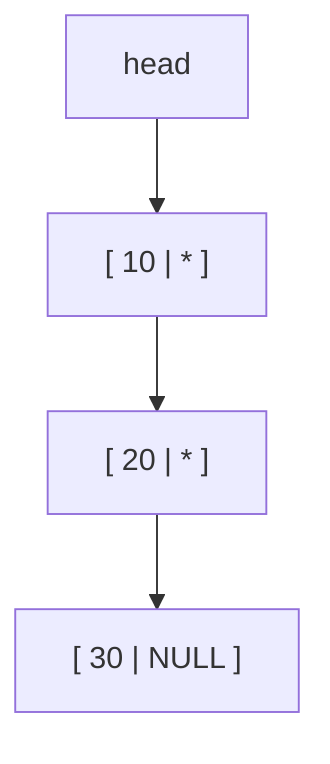
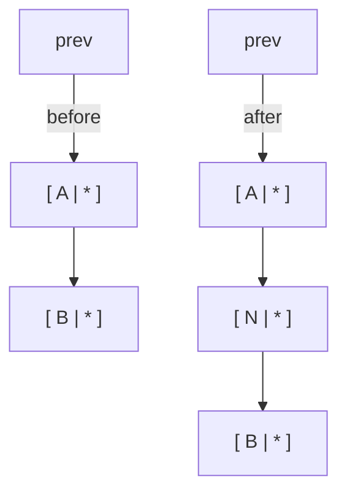

Arrays are great when you know the size up front and want fast
random access. They are awkward when you need to insert or remove
items in the middle, or when you don't know how large the collection
will grow.

<Figure
  slug="c-linked-lists-cutout"
  alt="Linked lists, an isometric illustration"
/>

The **linked list** is the canonical alternative. It's also the
canonical "you actually understand pointers now" exercise. Each
element of the list is a **node** on the heap, and each node holds a
pointer to the next node.

## The shape of a node

```c
typedef struct Node {
    int          value;
    struct Node *next;
} Node;
```

A few details worth unpacking:

- The struct is named `struct Node` *and* typedef'd to `Node`. The
  struct tag (`struct Node`) is needed inside the struct itself,
  because at that point the typedef name doesn't exist yet.
- The `next` field is a **pointer to the same kind of struct**. A
  pointer is the same size regardless of what it points at, so the
  compiler is happy.
- A `next` value of `NULL` means "no more nodes", the end of the
  list.



`head` is just a pointer; it's not a node itself. An empty list has
`head == NULL`.

## Building a list, one node at a time

<CodeBlock
  adapter="c"
  files={[
    {
      filename: "main.c",
      starterCode: `#include <stdio.h>
#include <stdlib.h>

typedef struct Node {
  int value;
  struct Node *next;
} Node;

Node *node_new(int value) {
  Node *n = malloc(sizeof(Node));
  if (n == NULL)
    return NULL;
  n->value = value;
  n->next = NULL;
  return n;
}

int main(void) {
  Node *head = node_new(10);
  head->next = node_new(20);
  head->next->next = node_new(30);

  for (Node *cur = head; cur != NULL; cur = cur->next) {
    printf("%d ", cur->value);
  }
  printf("\\n");

  // (we still have to free, see below)
  return 0;
}
`,
    },
  ]}
/>

The traversal loop is the heart of working with linked structures:

```c
for (Node *cur = head; cur != NULL; cur = cur->next) {
    // do something with cur->value
}
```

You always start at `head`, and you always stop when `cur` becomes
`NULL`. This idiom appears in trees, graphs, and every list-like
structure you'll write.

<Figure
  slug="c-linked-lists-shape-node-inline-cutout"
  alt="One block with a small socket on its face and a short cord leaving it, the cord's far end unattached"
  caption="A node holds a value and a pointer to the next node, or to nothing."
/>

## Prepending and appending

**Prepending** (adding to the front) is $O(1)$. You just point the new
node at the old head, then move the head:

```c
Node *prepend(Node *head, int value) {
    Node *n = node_new(value);
    if (n == NULL) return head;
    n->next = head;
    return n;
}
```

**Appending** (adding to the back) is $O(n)$ unless you also keep a
`tail` pointer:

```c
Node *append(Node *head, int value) {
    Node *n = node_new(value);
    if (n == NULL) return head;
    if (head == NULL) return n;
    Node *cur = head;
    while (cur->next != NULL) cur = cur->next;
    cur->next = n;
    return head;
}
```

Notice both functions return the (possibly new) head. The caller
reassigns:

```c
head = prepend(head, 5);
head = append(head, 99);
```

This pattern, "modify a structure, return the new root", is one
way to keep the call site simple. The alternative is passing a
`Node **` (a pointer to the head pointer). Both are correct;
returning the new head is friendlier to read in beginner code.

## Trace: building `[10, 20, 30]` by prepending

```
start:        head = NULL
prepend(30):  head -> [30 | NULL]
prepend(20):  head -> [20 | *] -> [30 | NULL]
prepend(10):  head -> [10 | *] -> [20 | *] -> [30 | NULL]
```

Prepending three values gives you the list in *reverse* of insertion
order. If you want them in insertion order with $O(1)$ inserts, keep a
`tail` pointer too, that's how a queue is built.

## Freeing a list

Every node was `malloc()`'d. Every node must be `free()`'d. The
canonical loop:

```c
void list_free(Node *head) {
    Node *cur = head;
    while (cur != NULL) {
        Node *next = cur->next;   // grab next BEFORE we free cur
        free(cur);
        cur = next;
    }
}
```

The temptation is to write `cur = cur->next` *after* `free(cur)`.
But that reads memory that has just been freed, undefined behavior.
Always remember "save then free".

## Inserting in the middle

To insert a new node *after* an existing one called `prev`:

```c
Node *n = node_new(value);
n->next = prev->next;
prev->next = n;
```



Two pointer assignments. No shuffling of array elements. That $O(1)$
insertion is exactly what people choose linked lists for.

To *remove* the node after `prev`:

```c
Node *dead = prev->next;
prev->next = dead->next;
free(dead);
```

## Why linked lists are a pointer workout

There's no way to misunderstand a pointer and still get a working
linked list. To build one, you must keep two pictures simultaneously
clear in your head:

1. **Where the boxes live** in memory (each node was `malloc()`'d).
2. **Which boxes point at which** (the `next` arrows).

If those two pictures aren't crystal clear, the program crashes or
leaks. If they are, every operation is just rearranging arrows. Once
you can write `list_free` from scratch without looking it up, you
have internalized pointers.

<Figure
  slug="c-linked-lists-inline-cutout"
  alt="Four separate boxes scattered across the frame, each with a short cord running from its side to the next, the last cord ending in a small stop block"
  caption="The list is only its links, and every operation is rearranging arrows."
/>

## Multi-file challenge: a complete linked-list module

<ChallengeCard
  adapter="c"
  title="Build and traverse a linked list"
  entryFilename="main.c"
  instructions={`Implement a linked list of ints in two files.

**\`list.h\`** declares:

\`\`\`c
typedef struct Node {
    int          value;
    struct Node *next;
} Node;

Node *list_prepend(Node *head, int value);
void  list_print(const Node *head);   // prints values space-separated, then '\\n'
void  list_free(Node *head);
\`\`\`

**\`list.c\`** implements them.

**\`main.c\`** uses \`list_prepend\` to build the list \`1 -> 2 -> 3\` (so prepend 3, then 2, then 1), prints it, and frees it.

The program must print exactly:

\`\`\`
1 2 3
\`\`\``}
  files={[
    {
      filename: "main.c",
      starterCode: `#include "list.h"

int main(void) {
  Node *head = NULL;
  head = list_prepend(head, 3);
  head = list_prepend(head, 2);
  head = list_prepend(head, 1);
  list_print(head);
  list_free(head);
  return 0;
}
`,
    },
    {
      filename: "list.h",
      starterCode: `#ifndef LIST_H
#define LIST_H

typedef struct Node {
  int value;
  struct Node *next;
} Node;

Node *list_prepend(Node *head, int value);
void list_print(const Node *head);
void list_free(Node *head);

#endif
`,
    },
    {
      filename: "list.c",
      starterCode: `#include "list.h"
#include <stdio.h>
#include <stdlib.h>

Node *list_prepend(Node *head, int value) {
  // your code here
  return head;
}

void list_print(const Node *head) {
  // your code here
}

void list_free(Node *head) {
  // your code here
}
`,
      solutionCode: `#include "list.h"
#include <stdio.h>
#include <stdlib.h>

Node *list_prepend(Node *head, int value) {
  Node *n = malloc(sizeof(Node));
  if (n == NULL)
    return head;
  n->value = value;
  n->next = head;
  return n;
}

void list_print(const Node *head) {
  for (const Node *cur = head; cur != NULL; cur = cur->next) {
    printf("%d%s", cur->value, cur->next == NULL ? "\\n" : " ");
  }
}

void list_free(Node *head) {
  Node *cur = head;
  while (cur != NULL) {
    Node *next = cur->next;
    free(cur);
    cur = next;
  }
}
`,
    },
  ]}
  tests={[
    {
      id: "list",
      name: "Prints 1 2 3",
      description: "stdout equals `1 2 3`",
      expect: { stdoutEquals: "1 2 3" },
    },
  ]}
/>

<MultipleChoice
  markdown={`What is wrong with this attempt to free a list?

\`\`\`c
for (Node *cur = head; cur != NULL; cur = cur->next) {
    free(cur);
}
\`\`\`

- It frees one node too few.
  > The loop condition \`cur != NULL\` ensures every node, including the last, is freed; the bug is about reading freed memory, not skipping a node.
- It runs forever.
  > The loop does terminate because it eventually reaches a node whose \`next\` was \`NULL\` before being freed, but it invokes undefined behavior on the way there.
- [o] \`cur->next\` is read after \`cur\` has been freed, undefined behavior.
  > By the time the loop step \`cur = cur->next\` runs, the memory at \`cur\` has already been returned to the heap. The fix is to save \`cur->next\` into a local before \`free(cur)\`.
- It will leak memory.
  > Every node is reached and freed; the problem is not that nodes are left unfreed but that the code reads freed memory to get to the next node.

This bug often *appears* to work because the freed memory hasn't been overwritten yet. Such bugs are a nightmare to debug. Tools like AddressSanitizer flag them immediately.`}
/>

<MultipleChoice
  markdown={`Compared to an \`int\` array of the same length, a singly linked list of \`int\`s:

- gives faster random access by index.
  > Reaching the nth element requires traversing n nodes from the head, giving $O(n)$ access, while an array reaches any element in $O(1)$ via pointer arithmetic.
- has cache-friendlier access patterns.
  > Nodes are scattered across the heap, so sequential traversal causes many cache misses. A contiguous array is far more cache-friendly.
- [o] gives $O(1)$ insertion at the front, but $O(n)$ access by index.
  > That's the classic trade-off. Lists win when you insert and remove a lot, especially at the front. Arrays win when you index a lot.
- uses less memory.
  > Each node in a singly linked list stores the value plus a \`next\` pointer, so it uses more memory per element than a plain array, not less.

In practice, modern hardware loves arrays, they're contiguous and the CPU cache prefetches the next elements. Linked lists are conceptually elegant but are slower than arrays for most real workloads. Use them when you specifically need their insertion characteristics or as a building block for more complex structures like trees and graphs.`}
/>
