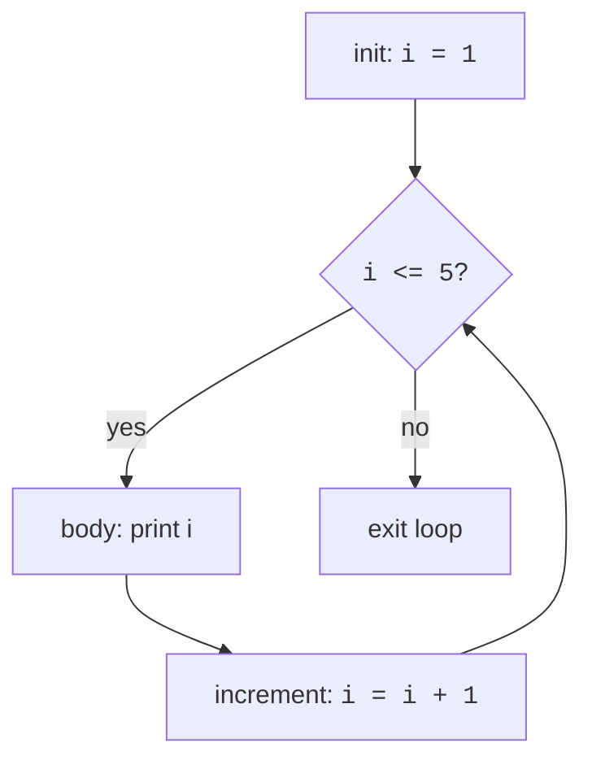

A **loop** runs the same block of code over and over until some
condition tells it to stop. Combined with conditionals, loops give
you all the expressive power you need to do anything a computer can
do. (That's a theorem, actually, the *structured programming
theorem*, but you don't have to take a class to feel it.)

<Figure
  slug="c-loops-cutout"
  alt="Loops, an isometric illustration"
/>

C has three loop forms. They differ in style; the substance is the
same.

## The `while` loop

```c
while (condition) {
    // body
}
```

Check the condition. If true, run the body. Repeat. Stop when the
condition becomes false.

<CodeBlock
  adapter="c"
  files={[
    {
      filename: "main.c",
      starterCode: `#include <stdio.h>

int main(void) {
  int i = 1;
  while (i <= 5) {
    printf("i = %d\\n", i);
    i = i + 1;
  }
  printf("done\\n");
  return 0;
}
`,
    },
  ]}
/>

Trace it:

| iteration | i (before) | condition | i (after body) |
|----------:|----------:|-----------|--------------:|
| 1 | 1 | 1 ≤ 5 = true | 2 |
| 2 | 2 | 2 ≤ 5 = true | 3 |
| 3 | 3 | 3 ≤ 5 = true | 4 |
| 4 | 4 | 4 ≤ 5 = true | 5 |
| 5 | 5 | 5 ≤ 5 = true | 6 |
| 6 | 6 | 6 ≤ 5 = **false** |, exit |

**If you forget to update `i`**, the loop runs forever. This is the
beginner's nightmare:

```c
int i = 1;
while (i <= 5) {
    printf("i = %d\n", i);
    // forgot: i = i + 1;
}
```

In the browser sandbox, the program will eventually time out. On
your laptop, you would have to kill the process by hand. Always
ensure that *something inside the loop changes the condition*.

## The `for` loop

`for` is `while` with three slots baked into one line: an
*initialization*, a *condition*, and an *increment*.

```c
for (init; condition; increment) {
    // body
}
```

It is exactly equivalent to:

```c
init;
while (condition) {
    // body
    increment;
}
```

The two snippets below print the same thing:

<CodeBlock
  adapter="c"
  files={[
    {
      filename: "main.c",
      starterCode: `#include <stdio.h>

int main(void) {
  for (int i = 1; i <= 5; i++) {
    printf("i = %d\\n", i);
  }
  return 0;
}
`,
    },
  ]}
/>

`i++` is shorthand for `i = i + 1`. Likewise `i--` for `i = i - 1`,
and `i += 3` for `i = i + 3`.

`for` is the natural choice when you know in advance *how many times*
to loop or you are stepping through a known range. The
initialization, the stop condition, and the step are all visible on a
single line, which makes the loop easy to read.

## The `do`-`while` loop

```c
do {
    // body
} while (condition);
```

Like `while`, but the condition is checked **after** the body. The
body always runs at least once. This is handy for input loops where
you must ask first and check the answer second.

<Figure
  slug="c-loops-while-loop-inline-cutout"
  alt="A belt circling past a gauge, the exit gate held shut while the gauge still reads high"
  caption="A `while` loop keeps circling while its condition still holds."
/>

<CodeBlock
  adapter="c"
  files={[
    {
      filename: "main.c",
      starterCode: `#include <stdio.h>

int main(void) {
  int n = 0;
  do {
    printf("n = %d\\n", n);
    n++;
  } while (n < 3);
  return 0;
}
`,
    },
  ]}
/>

## Loops + conditionals: a real example

Let's print every even number from 1 to 20:

<CodeBlock
  adapter="c"
  files={[
    {
      filename: "main.c",
      starterCode: `#include <stdio.h>

int main(void) {
  for (int i = 1; i <= 20; i++) {
    if (i % 2 == 0) {
      printf("%d ", i);
    }
  }
  printf("\\n");
  return 0;
}
`,
    },
  ]}
/>

There are two ways to think about this:

- "Walk through every number from 1 to 20. Print the even ones."
- "Walk through every *even* number from 2 to 20."

The second is more efficient (half the iterations). Try rewriting:

```c
for (int i = 2; i <= 20; i += 2) {
    printf("%d ", i);
}
```

Both produce identical output. As you get more comfortable, look for
ways to express the *intent* directly in the loop header.

## `break` and `continue`

Sometimes you want to exit a loop early or skip to the next
iteration.

- `break` exits the **innermost** enclosing loop immediately.
- `continue` jumps straight to the next iteration's condition check.

<CodeBlock
  adapter="c"
  files={[
    {
      filename: "main.c",
      starterCode: `#include <stdio.h>

int main(void) {
  // Print numbers 1..10, but skip multiples of 3 and stop at 8.
  for (int i = 1; i <= 10; i++) {
    if (i == 9) {
      break; // exit the loop
    }
    if (i % 3 == 0) {
      continue; // skip to next iteration
    }
    printf("%d ", i);
  }
  printf("\\n");
  return 0;
}
`,
    },
  ]}
/>

Expected output: `1 2 4 5 7 8`.

## Nested loops

You can put a loop inside a loop. The inner loop runs in full for
**every** iteration of the outer loop.

<Figure
  slug="c-loops-inline-cutout"
  alt="A belt running in a closed circuit past a counter dial, a block riding round and a gate at the right lifting once the dial has clicked its last notch"
  caption="The inner loop runs in full for every single pass of the outer one."
/>

<CodeBlock
  adapter="c"
  files={[
    {
      filename: "main.c",
      starterCode: `#include <stdio.h>

int main(void) {
  for (int row = 1; row <= 3; row++) {
    for (int col = 1; col <= 4; col++) {
      printf("(%d,%d) ", row, col);
    }
    printf("\\n");
  }
  return 0;
}
`,
    },
  ]}
/>

Nested loops are how you walk a 2D grid: rows and columns, x and y,
month and day.

## Counting up vs counting down

You can run a loop backwards. It's the same idea, just flipped:

<CodeBlock
  adapter="c"
  files={[
    {
      filename: "main.c",
      starterCode: `#include <stdio.h>

int main(void) {
  for (int i = 10; i >= 1; i--) {
    printf("%d ", i);
  }
  printf("blast off!\\n");
  return 0;
}
`,
    },
  ]}
/>

A classic countdown.

## Flowchart view



Every loop, no matter the syntax, has this same shape: init,
condition, body, update, back to condition.

## Challenge: factorial

<ChallengeCard
  adapter="c"
  title="Factorial of N"
  instructions={`Compute \`N!\` (\`N\` factorial, the product of all integers from \`1\` to \`N\`) for \`N = 6\` and print the result followed by a newline. The expected output is \`720\`.`}
  files={[
    {
      filename: "main.c",
      starterCode: `#include <stdio.h>

int main(void) {
  int N = 6;
  long result = 1;
  // multiply result by every integer from 1 to N
  printf("%ld\\n", result);
  return 0;
}
`,
      solutionCode: `#include <stdio.h>

int main(void) {
  int N = 6;
  long result = 1;
  for (int i = 1; i <= N; i++) {
    result *= i;
  }
  printf("%ld\\n", result);
  return 0;
}
`,
    },
  ]}
  tests={[
    {
      id: "fact",
      name: "6! = 720",
      description: "stdout equals `720`",
      expect: { stdoutEquals: "720" },
    },
  ]}
/>

## Challenge: triangle of stars

<ChallengeCard
  adapter="c"
  title="Print a right triangle of stars"
  instructions={`Print a right triangle of \`*\` characters with 5 rows. Row \`i\` should have \`i\` stars, separated by nothing. The expected output is exactly:

\`\`\`
*
**
***
****
*****
\`\`\``}
  files={[
    {
      filename: "main.c",
      starterCode: `#include <stdio.h>

int main(void) {
  // print the triangle here
  return 0;
}
`,
      solutionCode: `#include <stdio.h>

int main(void) {
  for (int row = 1; row <= 5; row++) {
    for (int col = 1; col <= row; col++) {
      printf("*");
    }
    printf("\\n");
  }
  return 0;
}
`,
    },
  ]}
  tests={[
    {
      id: "triangle",
      name: "Exact triangle",
      description: "5 rows of stars",
      expect: {
        stdoutLines: ["*", "**", "***", "****", "*****"],
        stdoutLinesExact: true,
      },
    },
  ]}
/>

<MultipleChoice
  markdown={`How many times does the body of this loop run?

\`\`\`c
for (int i = 0; i < 10; i += 2) {
    // body
}
\`\`\`

- [o] 5
  > \`i\` takes the values 0, 2, 4, 6, 8, five iterations. At \`i == 10\`, the condition is false and the loop exits.
- 6
  > \`i == 10\` does *not* run the body, because the condition is \`i < 10\` (not \`i <= 10\`). The values are 0, 2, 4, 6, 8, five, not six.
- Infinite, the loop never stops.
  > \`i\` keeps growing by \`2\` and eventually reaches \`10\`, where \`i < 10\` becomes false and the loop ends.
- 10
  > \`10\` would be the count if \`i\` increased by \`1\` each time. Here it increases by \`2\`, so there are half as many iterations.

To count iterations of a \`for\` loop, list the values of the loop counter that satisfy the condition. Each one corresponds to one execution of the body.`}
/>

<MultipleChoice
  markdown={`Which of the following describes the difference between \`break\` and \`continue\`?

- [o] \`break\` exits the loop entirely; \`continue\` skips to the next iteration's condition check.
  > \`break\` jumps past the closing \`}\` of the loop; \`continue\` jumps back up to the loop's condition / increment.
- \`break\` works only in \`switch\`; \`continue\` works only in loops.
  > \`break\` works in *both* \`switch\` and loops; \`continue\` works in loops only.
- They behave identically.
  > They do different things: \`break\` leaves the loop, while \`continue\` stays in it and proceeds to the next iteration.
- \`break\` skips the next iteration; \`continue\` exits the loop.
  > This is the two keywords swapped: \`continue\` is the one that skips ahead, and \`break\` is the one that exits.

A handy way to remember: \`break\` ends the conversation; \`continue\` says "next, please".`}
/>
