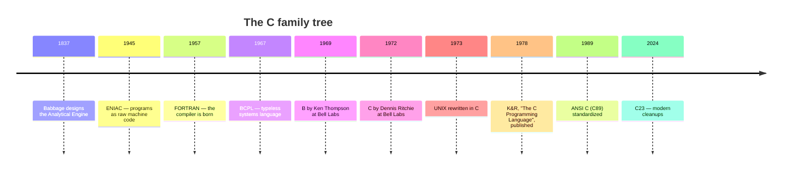
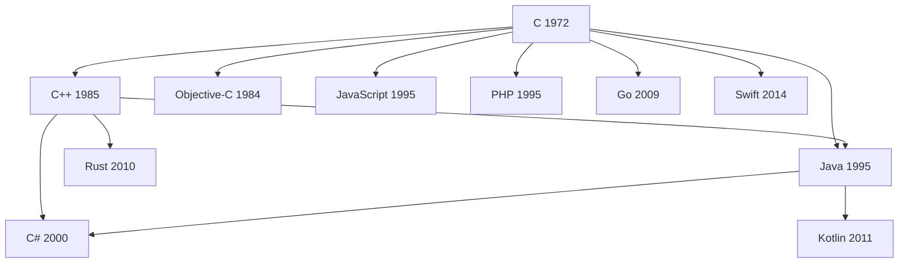

<IllustrationPrompt subject="Ken Thompson" photo />

In 1969, in a small office at **Bell Telephone Laboratories** in New
Jersey, a programmer named **Ken Thompson** wanted to play a game.

The game was called *Space Travel*, and the only computer he could
sneak it onto was a discarded **PDP-7**: a refrigerator-sized machine
with about 9 KB of memory. To make the game playable, Ken started
writing a small operating system for the PDP-7 from scratch — with
help from a colleague named **Dennis Ritchie**. They jokingly named it
**UNIX**, a pun on a much bigger, much more troubled OS called
*Multics* that they had been working on.

That side project — half operating system, half playground — went on
to change computing forever, and it forced the invention of the
language this course teaches. But to feel *why* C was such a big
deal, you need to know what programming was like before it. So let's
rewind — briefly — about a hundred and thirty years.

## The long road to "just type instructions"

<IllustrationPrompt subject="Charles Babbage's Analytical Engine, a Victorian-era mechanical computer of brass gears and cylinders" />

For most of human history, "computing" meant moving beads on an
abacus or doing arithmetic on paper. In the 1800s, **Charles
Babbage** designed mechanical machines — the *Difference Engine* and
the *Analytical Engine* — that could in principle calculate
automatically by turning gears, and his collaborator **Ada Lovelace**
wrote what is widely considered the first algorithm intended for a
machine. The machines were never fully built in their lifetimes, but
the idea was planted: one machine, fed a list of instructions, could
perform *any* calculation.

Electricity made it real. Machines like **ENIAC** (1945) and the
**Manchester Baby** (1948) were the first general-purpose electronic
computers, and they introduced the design we still use: the
**stored-program** architecture, where instructions live in the same
memory as data. A program, it turns out, is just data.

<svg
  viewBox="0 0 640 250"
  role="img"
  aria-label="A punch card with a clipped corner and rows of holes, a few punched out in color — the earliest physical shape of a program"
  style={{ display: "block", width: "100%", maxWidth: "640px", height: "auto", margin: "2.5rem auto" }}
>
  <path d="M140 64 L164 40 H486 A14 14 0 0 1 500 54 V206 A14 14 0 0 1 486 220 H154 A14 14 0 0 1 140 206 Z" fill="currentColor" opacity="0.07" />
  <g fill="currentColor" opacity="0.15">
    <circle cx="220" cy="80" r="6" />
    <circle cx="300" cy="80" r="6" />
    <circle cx="380" cy="80" r="6" />
    <circle cx="460" cy="80" r="6" />
    <circle cx="180" cy="116" r="6" />
    <circle cx="220" cy="116" r="6" />
    <circle cx="340" cy="116" r="6" />
    <circle cx="380" cy="116" r="6" />
    <circle cx="420" cy="116" r="6" />
    <circle cx="260" cy="152" r="6" />
    <circle cx="300" cy="152" r="6" />
    <circle cx="340" cy="152" r="6" />
    <circle cx="420" cy="152" r="6" />
    <circle cx="460" cy="152" r="6" />
    <circle cx="180" cy="188" r="6" />
    <circle cx="220" cy="188" r="6" />
    <circle cx="260" cy="188" r="6" />
    <circle cx="340" cy="188" r="6" />
    <circle cx="420" cy="188" r="6" />
  </g>
  <g style={{ color: "var(--ds-blue-500)" }} fill="currentColor">
    <circle cx="180" cy="80" r="7" />
    <circle cx="260" cy="116" r="7" />
    <circle cx="340" cy="80" r="7" />
    <circle cx="420" cy="80" r="7" />
  </g>
  <g style={{ color: "var(--ds-green-500)" }} fill="currentColor">
    <circle cx="220" cy="152" r="7" />
    <circle cx="300" cy="188" r="7" />
    <circle cx="460" cy="116" r="7" />
  </g>
  <g style={{ color: "var(--ds-yellow-500)" }} fill="currentColor">
    <circle cx="260" cy="80" r="7" />
    <circle cx="380" cy="152" r="7" />
  </g>
  <g style={{ color: "var(--ds-red-500)" }} fill="currentColor">
    <circle cx="300" cy="116" r="7" />
    <circle cx="460" cy="188" r="7" />
  </g>
</svg>

How did you program these machines? Directly in **machine code** —
the raw numeric patterns the CPU understands:

```text
01001000 11000111 11000000 00000001 00000000
00000000 00000000 01001000 11000111 11000111
00000001 00000000 00000000 00000000 00001111
```

A human being was supposed to read that, debug that, and modify
that. Change the third instruction and every address after it might
shift, so every jump had to be recalculated by hand. A single
mistyped bit could crash the program in ways indistinguishable from
a hardware fault. **It was no way to live**, and the first
programmers — brilliant, patient, frustrated — invented their way
out of it one layer at a time.

The first layer was **assembly language**: short names for the raw
patterns, like `MOV AL, 5` instead of `10110000 00000101`, with a
small program (the *assembler*) translating names back into bits.
Far better — but each line was still one machine instruction, and
assembly for an Intel chip was useless on anything else.

The second layer, in the late 1950s, was the **high-level language**:
write something closer to math or English, and let a program called
a **compiler** translate it into machine code. **FORTRAN** (1957)
let scientists write `SUM = A + B` instead of a dozen instructions,
and — crucially — the same source could be compiled for different
machines. **COBOL** followed for business, **Lisp** for symbolic
computation, **ALGOL** with ideas (block structure, recursion) that
nearly every later language borrowed.

<Callout type="info" title="What 'high-level' means">
"High-level" doesn't mean "advanced" or "fancy". It means **far from
the hardware**. A high-level language hides registers, addresses, and
opcodes behind friendlier ideas like variables, expressions, loops,
and functions.
</Callout>

But there was a hole in the middle. FORTRAN crunched numbers; COBOL
shuffled business records; neither could write the **software that
runs the computer itself** — operating systems, compilers, drivers —
because that work needs direct, byte-level control of memory and
hardware. So for two more decades, the answer to "what do I write an
operating system in?" remained: *assembly*. Which kept operating
systems painful to build and impossible to move between machines.

The world was waiting for a language that was high-level enough to
be readable and portable, low-level enough to control memory
directly, and small enough that one programmer could hold all of it
in their head.

Which brings us back to that office in New Jersey.

## A game, a discarded computer, and a typeless language

<svg
  viewBox="0 0 640 200"
  role="img"
  aria-label="A lineage of circles growing from faint to solid along a dotted trail — small languages evolving into C — with two companion dots and a spark beside the largest circle"
  style={{ display: "block", width: "100%", maxWidth: "640px", height: "auto", margin: "2.5rem auto" }}
>
  <g fill="currentColor" opacity="0.3">
    <circle cx="160" cy="130" r="3.5" />
    <circle cx="190" cy="130" r="3.5" />
    <circle cx="220" cy="130" r="3.5" />
    <circle cx="330" cy="127" r="3.5" />
    <circle cx="360" cy="124" r="3.5" />
    <circle cx="390" cy="122" r="3.5" />
  </g>
  <g style={{ color: "var(--ds-blue-500)" }} fill="currentColor">
    <circle cx="120" cy="130" r="18" fillOpacity="0.3" />
    <circle cx="280" cy="130" r="30" fillOpacity="0.6" />
    <circle cx="470" cy="118" r="46" />
  </g>
  <g style={{ color: "var(--ds-green-500)" }} fill="currentColor">
    <circle cx="528" cy="70" r="10" />
  </g>
  <g style={{ color: "var(--ds-red-500)" }} fill="currentColor">
    <circle cx="412" cy="64" r="8" />
  </g>
  <g style={{ color: "var(--ds-yellow-500)" }} fill="currentColor">
    <polygon points="560,28 564,38 574,42 564,46 560,56 556,46 546,42 556,38" />
  </g>
</svg>

<IllustrationPrompt subject="a PDP-11 minicomputer, an early 1970s refrigerator-sized machine with switches and blinking lights" />

The first version of UNIX was written entirely in **assembly
language** for the PDP-7, then rewritten in assembly for a newer
machine called the **PDP-11**. Each time UNIX moved to a new
computer, the entire OS had to be re-translated by hand — exactly
the pain the whole industry was stuck with.

Ken Thompson tried to escape using an existing high-level language
called **B** (itself derived from **BCPL**), but B had no notion of
data **types** — every value was a single machine word. That made it
hopeless for code that needed to deal with bytes, characters, and
structures of mixed-size data, which is most of what an operating
system does.

<IllustrationPrompt subject="Dennis Ritchie" photo />

So between 1969 and 1973, Dennis Ritchie did something quietly
historic. He took B, added **types** (`int`, `char`, `float`,
arrays, pointers, structs), kept it small, and called the result
**C**.



## Why C succeeded where others did not

Several deliberate decisions made C uniquely well suited to its job:

1. **It was small.** The entire language fits on a few dozen pages.
   You can hold all of C in your head. Compare this to the
   thousand-page specifications of modern languages.
2. **It mapped cleanly to hardware.** A C `int` is "a machine word".
   An `if` becomes a compare-and-jump. A function call becomes a
   stack frame. You can almost always *predict* what assembly the
   compiler will produce.
3. **It exposed memory.** Pointers gave programmers a way to talk
   about addresses directly. This is dangerous, but it is also
   *necessary* for writing operating systems, drivers, and runtimes.
4. **It was portable.** Once a C compiler existed for a new CPU, every
   C program — including the UNIX operating system itself — could be
   moved to that CPU. Suddenly UNIX could run on machines from many
   different vendors.

In 1973, Ken Thompson and Dennis Ritchie rewrote the UNIX kernel in
C. This was the first time anyone had written a serious operating
system in a high-level language. Most experts at the time said it
couldn't be done — the result, they predicted, would be too slow and
too bulky. They were wrong.

<Callout type="info" title="The book that taught the world">
In 1978, **Brian Kernighan and Dennis Ritchie** published a slim,
elegant book called *The C Programming Language*, now universally
known as **K&R**. For more than a decade it served as both the
tutorial and the de-facto specification of C. It is still in print and
still worth reading after this course.
</Callout>

## How C took over the world

Because C and UNIX were designed together, the spread of one helped
the spread of the other. Universities got UNIX (often free or for a
nominal license fee) and trained students who then walked into
industry already fluent in C. By the 1980s C was the default language
for systems programming everywhere.

Today, decades later, an astonishing amount of the software you use
every day is written in C — or in something built on top of C:

- **Operating system kernels.** Linux, the BSDs, the core of macOS
  (XNU), and large parts of Windows are written in C.
- **Embedded systems.** Microwaves, cars, pacemakers, satellites, and
  the firmware inside almost every electronic device.
- **Language runtimes.** The reference implementation of Python
  (CPython), the V8 JavaScript engine that powers Chrome and Node.js,
  the Ruby interpreter (MRI), the PHP interpreter — all written in C
  or C++.
- **Databases.** SQLite, PostgreSQL, MySQL, Redis — all C.
- **Compilers.** GCC and large parts of LLVM are written in C/C++.
- **Network infrastructure.** Web servers (nginx, Apache), TCP/IP
  stacks, OpenSSL, curl — all C.

When you load a web page, dozens of C programs collaborate to make
that happen.

## How C influenced everything that came after

Almost every popular language in use today inherits ideas — and
syntax — from C:



The braces `{ }` you see in JavaScript, Java, C#, Go, Rust, and Swift?
Those came from C. The `if (...) { ... } else { ... }` shape? C. The
`for (int i = 0; i < n; i++)` loop? C. The `printf`-style format
strings? C. The way functions take typed parameters and return a
value? C. The `\n` for newline, the `==` for equality, the `&&` for
logical AND — all C.

When you learn C, you are learning the **grammar** that the rest of
the industry has been speaking — sometimes consciously, sometimes
not — for fifty years.

## Why learning C is worth your time

If you only want to ship a website by Friday, you should probably not
learn C first. Use Python, or JavaScript, or whatever your team uses.

But if you want to **understand programming itself**, C is unmatched.
Here is what learning C will give you that most other languages will
not:

- A real mental model of **memory** — what a variable is, where it
  lives, who owns it, when it disappears.
- An understanding of **what the CPU does** when you write a loop, a
  function call, or an `if` statement.
- An appreciation for what your favorite "easy" language is *hiding*
  from you, and at what cost.
- The vocabulary to read systems code: kernels, drivers,
  cryptographic libraries, virtual machines, language runtimes.
- A baseline for picking up other systems languages — C++, Rust, Go,
  Zig — much faster than you otherwise would.

<Callout type="success" title="The big idea">
C is the layer where the cleanly abstracted world of "variables and
functions" meets the messy physical world of "wires and voltages".
Learning C lets you stand on that border and look in both directions.
</Callout>

## A short word from Dennis Ritchie

> *"C is quirky, flawed, and an enormous success."* — Dennis M. Ritchie

He was right on all three counts. C has rough edges. Some of its
defaults are dangerous. Modern languages fix many of its mistakes.
But the central idea — *a small, portable, low-level language that
treats memory honestly* — has never been seriously displaced. Fifty
years later, we are still building on top of it.

In the next chapter, we'll zoom into the machine itself: what happens
when a program runs. Then, finally, we'll write some code of our own.

<MultipleChoice
  markdown={`What was the main problem with writing programs directly in machine code (binary)?

- It was too slow for the CPU to execute.
  > Machine code is literally what the CPU executes — speed of execution is not the issue. The issue is for humans, not the machine.
- It used too much electricity.
  > Power consumption is a hardware concern unrelated to the representation of programs. Early computers were power-hungry, but that had nothing to do with writing in machine code.
- [o] It was extremely difficult for humans to read, write, and debug.
  > The machine doesn't care, but human beings can barely look at long sequences of 1s and 0s without making mistakes. This is why assembly language, and later high-level languages, were invented.
- It only worked on machines built after 1960.
  > Machine code ran on the earliest computers, including those built in the 1940s; there was no such temporal restriction.

Machine code is the native language of the CPU, so it always runs at full speed. The pain is on the human side: writing and maintaining anything non-trivial in raw bits is essentially impossible.`}
/>

<MultipleChoice
  markdown={`Why was C originally created at Bell Labs?

- To replace FORTRAN as the language of scientific computing.
  > FORTRAN was designed for numerical and scientific computation. C was designed to write operating systems — a very different domain, requiring direct memory and hardware control.
- [o] To make it possible to rewrite the UNIX operating system in a portable, high-level language.
  > UNIX was originally written in assembly for the PDP-7 and PDP-11. C was designed to give Thompson and Ritchie a language high-level enough to be productive in, but low-level enough to write an operating system in.
- To teach programming in universities.
  > C was created at Bell Labs for practical systems work, not as a teaching language. Languages like Pascal and, later, Python were designed with pedagogy in mind.
- To compete with Microsoft Windows.
  > Windows wouldn't exist for another decade. C predates the personal computer revolution.

C's first big customer was UNIX itself: rewriting the UNIX kernel in C in 1973 was a turning point in operating-system history.`}
/>

<MultipleChoice
  markdown={`Which of the following is **not** typically written in C (or a direct descendant like C++)?

- The Linux kernel.
  > The Linux kernel is written almost entirely in C, so it is not the exception this question asks for.
- The reference Python interpreter (CPython).
  > CPython, the standard Python implementation, is written in C — that is why it is called *C*Python.
- The SQLite database engine.
  > SQLite is a well-known example of a database engine implemented in C.
- [o] An HTML web page.
  > HTML is a markup language for describing documents, not a programming language. The *browser* that renders HTML, on the other hand, is largely written in C++.

C and C++ dominate the layer of software that other software is built on top of: operating systems, databases, browsers, and language runtimes.`}
/>
