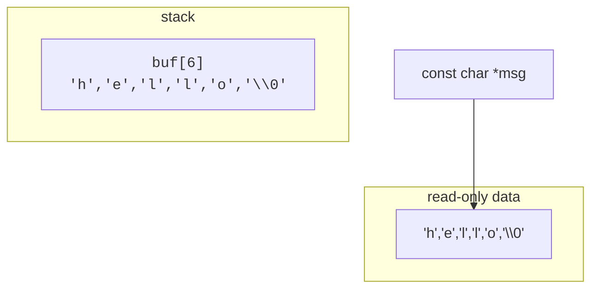

In most modern languages a string is a tidy, self-contained object
that knows its own length. **C is older than that idea.** In C, a
string is just an array of `char` ending in the special "null
character" `\0`.

<Figure
  slug="c-strings-cutout"
  alt="Strings, an isometric illustration"
/>

This page is about how to think about that, and how not to shoot
yourself in the foot.

<Figure
  slug="c-strings-inline-cutout"
  alt="A strip of single-letter tiles laid end to end along a rail, with one small red cap tile closing the run at the right"
/>

## The null-terminated string

```c
char greeting[] = "hello";
```

That declaration creates a 6-element array of `char`, five letters
plus a hidden `\0`:

```text
Index:    0    1    2    3    4    5
Value:   'h'  'e'  'l'  'l'  'o'  '\0'
```

The terminator is the **only** way functions like `printf("%s", s)`
or `strlen(s)` know where the string ends. There is no length field.
There is no metadata. The convention is: walk until you see a `\0`.

This convention is fast and compact, but it shifts a lot of
responsibility onto the programmer. Forget the terminator and
everything goes wrong.

## String literals

A double-quoted constant like `"hello"` is a **string literal**, a
read-only array of `char` somewhere in your program's data segment.
The compiler appends the `\0` for you.

A `char *` points to that array's first byte:

```c
const char *msg = "hello";   // points to read-only memory
```

Note `const`, modifying a string literal is undefined behavior:

```c
char *p = "hello";
p[0] = 'H';     // BAD: may crash on most systems
```

If you want a *writable* string, declare an array:

```c
char buf[] = "hello";
buf[0] = 'H';   // fine: buf is your own copy
```

## Useful functions from `<string.h>`

| Function           | What it does                                      |
|--------------------|---------------------------------------------------|
| `strlen(s)`        | length, **excluding** the `\0`                    |
| `strcpy(dest, src)`| copy `src` (including `\0`) into `dest`           |
| `strcmp(a, b)`     | `0` if equal; negative if `a < b`; positive otherwise |
| `strcat(dest, src)`| append `src` onto the end of `dest`               |
| `strchr(s, c)`     | pointer to first `c` in `s`, or `NULL`            |
| `strstr(haystack, needle)` | pointer to first occurrence of `needle`   |

<CodeBlock
  adapter="c"
  files={[
    {
      filename: "main.c",
      starterCode: `#include <stdio.h>
#include <string.h>

int main(void) {
  char first[16] = "Hello";
  const char *second = "World";

  printf("len(first) = %zu\\n", strlen(first));

  // append " " + second onto first
  strcat(first, " ");
  strcat(first, second);

  printf("first = '%s'\\n", first);

  if (strcmp(first, "Hello World") == 0) {
    printf("they match\\n");
  }
  return 0;
}
`,
    },
  ]}
/>

`%zu` is the format specifier for `size_t`, the type that `strlen`
returns.

## The danger: buffer sizes

Each of `strcpy`, `strcat`, and `sprintf` writes into a destination
buffer **without checking how big it is**. If your destination is
too small, you trash whatever memory is next to it. This was the
mechanism behind the **Morris worm** (1988), countless web-server
exploits, and many of the CVEs you read about today.

```c
char buf[8];
strcpy(buf, "this is way too long to fit in eight bytes");
// We just wrote past the end of buf. Anything can happen now.
```

The safer functions take an explicit destination size and refuse to
exceed it:

```c
char buf[8];
strncpy(buf, "this is way too long", sizeof(buf) - 1);
buf[sizeof(buf) - 1] = '\0';   // ensure null terminator
```

Even better, modern code often uses `snprintf`, which gives you back
the number of characters it *would have* written, so you can detect
truncation:

```c
char buf[32];
int needed = snprintf(buf, sizeof(buf), "Hello, %s! You are %d.", name, age);
if (needed >= (int)sizeof(buf)) {
    // truncated, handle it
}
```

<Callout type="warn" title="The C string rule">
**Every** time you write into a character buffer, ask yourself:
*how big is the buffer? Could the data I'm writing be longer? What
happens if it is?* If you can't answer those questions, your code
has a bug, usually a security bug.
</Callout>

## Reading strings safely

`gets()` is so dangerous it was removed from the language in C11. Use
`fgets()`, which lets you specify a maximum size:

```c
char line[256];
if (fgets(line, sizeof(line), stdin) != NULL) {
    // line contains at most 255 chars + '\0' (and possibly a trailing '\n')
}
```

To strip the trailing newline:

```c
size_t len = strlen(line);
if (len > 0 && line[len - 1] == '\n') {
    line[len - 1] = '\0';
}
```

## Walking a string character by character

Because a string is just an array, you can iterate over it with a
loop:

<CodeBlock
  adapter="c"
  files={[
    {
      filename: "main.c",
      starterCode: `#include <stdio.h>
#include <string.h>

int main(void) {
  const char *s = "C is fun!";
  size_t n = strlen(s);

  int vowels = 0;
  for (size_t i = 0; i < n; i++) {
    char c = s[i];
    if (c == 'a' || c == 'e' || c == 'i' || c == 'o' || c == 'u' || c == 'A' ||
        c == 'E' || c == 'I' || c == 'O' || c == 'U') {
      vowels++;
    }
  }

  printf("\\"%s\\" has %d vowels\\n", s, vowels);
  return 0;
}
`,
    },
  ]}
/>

The idiomatic C way to walk a null-terminated string is even more
direct, using the `\0` itself as the stop condition:

```c
for (const char *p = s; *p != '\0'; p++) {
    // *p is the current character
}
```

We'll see why that pattern is so common in the pointers chapter.

## Picture: a `char` array versus a `char *`



`buf` and `msg` both let you read the text `hello`. But `buf` *owns*
its bytes (you can modify them), while `msg` just *points at* shared
read-only bytes.

## Challenge: count characters in a sentence

<ChallengeCard
  adapter="c"
  title="Count letters and spaces"
  instructions={`Given the constant string \`s = "The quick brown fox"\`, print exactly:

\`\`\`
letters = 16
spaces = 3
\`\`\`

A "letter" here means any character that is not a space.`}
  files={[
    {
      filename: "main.c",
      starterCode: `#include <stdio.h>
#include <string.h>

int main(void) {
  const char *s = "The quick brown fox";
  int letters = 0, spaces = 0;
  // count here
  printf("letters = %d\\nspaces = %d\\n", letters, spaces);
  return 0;
}
`,
      solutionCode: `#include <stdio.h>
#include <string.h>

int main(void) {
  const char *s = "The quick brown fox";
  int letters = 0, spaces = 0;
  for (size_t i = 0; s[i] != '\\0'; i++) {
    if (s[i] == ' ')
      spaces++;
    else
      letters++;
  }
  printf("letters = %d\\nspaces = %d\\n", letters, spaces);
  return 0;
}
`,
    },
  ]}
  tests={[
    {
      id: "counts",
      name: "Letters and spaces match",
      description: "stdout matches",
      expect: { stdoutLines: ["letters = 16", "spaces = 3"], stdoutLinesExact: true },
    },
  ]}
/>

<MultipleChoice
  markdown={`What value does \`strlen("hello")\` return?

- 6
  > That would be the array's **storage size** (5 letters + 1 null). \`strlen\` excludes the terminator.
- [o] 5
  > \`strlen\` counts the visible characters, **not** the trailing \`\\0\`.
- It depends on the system.
  > \`strlen\` always counts the characters before the \`\\0\`, which is \`5\` for \`"hello"\` on every system.
- 4
  > That undercounts by one, \`"hello"\` has five letters (h-e-l-l-o), and \`strlen\` counts all of them.

\`strlen\` walks the string from the start until it finds the null terminator, counting characters along the way. The terminator itself is not counted.`}
/>

<MultipleChoice
  markdown={`Why is the following code dangerous?

\`\`\`c
char buf[10];
strcpy(buf, "This message is much longer than ten bytes.");
\`\`\`

- [o] \`strcpy\` doesn't check the destination size, so it writes far past the end of \`buf\`, corrupting other memory.
  > This is the classic *buffer overflow*. The runtime behavior is undefined: the program may crash, silently corrupt unrelated variables, or be exploitable by an attacker.
- The compiler will refuse to copy a string longer than \`buf\`.
  > The compiler does not track how big \`buf\` is at the \`strcpy\` call, so it cannot refuse; the overflow happens at runtime.
- \`strcpy\` is deprecated and the program won't compile.
  > Old C functions are still available in standard C; most compilers compile this without error (sometimes with a warning).
- It runs but \`buf\` will silently be truncated to 10 bytes.
  > \`strcpy\` does **not** truncate. It just keeps writing.

Safer alternatives: \`strncpy\` (with explicit size, but always null-terminate yourself), or \`snprintf\` (with size limit and truncation reporting). Or use a bigger buffer that you've sized to your data.`}
/>
