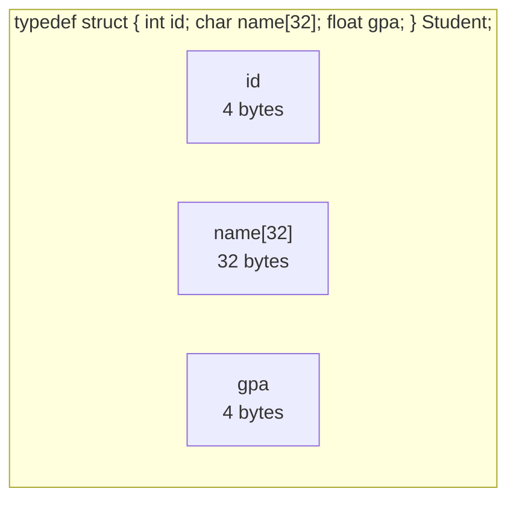

A program's data rarely comes in lone variables. A point has an `x`
and a `y`. A student has a name, an id, and a GPA. A date has a
year, month, and day. C's tool for bundling related values into a
single named thing is the **struct**.

<Figure
  slug="c-structs-cutout"
  alt="Structs, an isometric illustration"
/>

Without structs you'd be passing around parallel arrays or huge
parameter lists and praying nothing fell out of sync. With structs,
each "thing" becomes a single, named, typed value you can move
around as a unit.

## Declaring a struct

A struct declaration defines a *type*, not a variable. Those are two separate steps in C:

<SyntaxBreakdown
  parts={[
    { text: "struct", label: "define a new type" },
    { text: "Point", label: "its tag, written struct Point later" },
    { text: "{ int x; int y; };", label: "the members, laid out in this order" },
  ]}
/>

```c
struct Point {
    int x;
    int y;
};
```

This declares a **type** called `struct Point` with two **fields**
(also called *members*): `x` and `y`. It does not yet create any
variables. To create one:

```c
struct Point p;
p.x = 3;
p.y = 4;
```

Field access uses a dot. You can also initialize at declaration:

```c
struct Point p = {3, 4};                    // positional
struct Point q = { .x = 3, .y = 4 };        // designated (clearer)
```

Designated initializers are usually worth the extra characters,
they make the code readable and survive field reordering.

## `typedef` to drop the `struct` keyword

Writing `struct Point` over and over is noisy. The idiomatic remedy
is a `typedef`:

```c
typedef struct {
    int x;
    int y;
} Point;

Point p = { .x = 3, .y = 4 };
```

Now `Point` is the type name. You'll see both styles in real code;
the typedef'd form is more common in beginner-friendly tutorials and
in modern C code.

<Figure
  slug="c-structs-declaring-struct-inline-cutout"
  alt="An empty fitted tray whose compartments are cut to different shapes before anything is placed in them"
  caption="A struct lays out named compartments before anything is put in them."
/>

<CodeBlock
  adapter="c"
  files={[
    {
      filename: "main.c",
      starterCode: `#include <stdio.h>

typedef struct {
  int x;
  int y;
} Point;

int main(void) {
  Point p = {.x = 3, .y = 4};
  printf("p = (%d, %d)\\n", p.x, p.y);

  // distance squared from origin
  int d2 = p.x * p.x + p.y * p.y;
  printf("distance^2 = %d\\n", d2);
  return 0;
}
`,
    },
  ]}
/>

## Passing structs to functions

You can pass a struct by value (a copy is made):

```c
int dist_sq(Point p) {
    return p.x * p.x + p.y * p.y;
}
```

Or, for bigger structs or when you want to modify the original, pass
a pointer:

```c
void shift(Point *p, int dx, int dy) {
    (*p).x += dx;
    (*p).y += dy;
}
```

That `(*p).x` is so common that C has a special operator for it:
the **arrow** `->`.

```c
void shift(Point *p, int dx, int dy) {
    p->x += dx;
    p->y += dy;
}
```

`p->x` means "the field `x` of the struct that `p` points at". It's
exactly equivalent to `(*p).x` but easier to read.

| Through a value | Through a pointer    |
|-----------------|----------------------|
| `p.x`           | `p->x` or `(*p).x`   |

<CodeBlock
  adapter="c"
  files={[
    {
      filename: "main.c",
      starterCode: `#include <stdio.h>

typedef struct {
  int x;
  int y;
} Point;

void shift(Point *p, int dx, int dy) {
  p->x += dx;
  p->y += dy;
}

int main(void) {
  Point a = {.x = 1, .y = 2};
  shift(&a, 10, 20);
  printf("a = (%d, %d)\\n", a.x, a.y); // (11, 22)
  return 0;
}
`,
    },
  ]}
/>

## A bigger example: a student record

<CodeBlock
  adapter="c"
  files={[
    {
      filename: "main.c",
      starterCode: `#include <stdio.h>
#include <string.h>

typedef struct {
  int id;
  char name[32];
  float gpa;
} Student;

void print_student(const Student *s) {
  printf("#%d  %-20s  GPA %.2f\\n", s->id, s->name, s->gpa);
}

int main(void) {
  Student class[3];

  class[0] = (Student){.id = 101, .gpa = 3.7f};
  strcpy(class[0].name, "Ada Lovelace");

  class[1] = (Student){.id = 102, .gpa = 3.4f};
  strcpy(class[1].name, "Alan Turing");

  class[2] = (Student){.id = 103, .gpa = 3.9f};
  strcpy(class[2].name, "Grace Hopper");

  for (int i = 0; i < 3; i++)
    print_student(&class[i]);
  return 0;
}
`,
    },
  ]}
/>

Things to notice:

- An **array of structs** stores them back-to-back in memory, the
  same way an array of ints does.
- The string fields are fixed-size character arrays, they live
  *inside* the struct.
- `const Student *s` says "I want a pointer to a student, and I
  promise not to modify it". The `const` is documentation enforced
  by the compiler.

## Memory layout of a struct

A struct's fields are stored in declaration order, with possible
**padding** between them so each field is properly aligned for its
type:



`sizeof(Student)` will be at least `4 + 32 + 4 = 40` bytes, and may
be slightly larger because of alignment. Use `sizeof` rather than
hardcoding numbers.

## Nested structs

Structs can contain other structs as fields. This is how you build
up rich data without leaving C's type system.

<Figure
  slug="c-structs-inline-cutout"
  alt="One wide tray divided into four fitted compartments of different sizes, each holding a different shaped part, the whole tray lifted as one piece"
  caption="A struct groups related values into one thing you can pass by name."
/>

<CodeBlock
  adapter="c"
  files={[
    {
      filename: "main.c",
      starterCode: `#include <stdio.h>

typedef struct {
  int x, y;
} Point;

typedef struct {
  Point top_left;
  Point bottom_right;
} Rect;

int width(const Rect *r) { return r->bottom_right.x - r->top_left.x; }
int height(const Rect *r) { return r->bottom_right.y - r->top_left.y; }

int main(void) {
  Rect box = {
      .top_left = {.x = 1, .y = 1},
      .bottom_right = {.x = 5, .y = 4},
  };
  printf("%d x %d\\n", width(&box), height(&box)); // 4 x 3
  return 0;
}
`,
    },
  ]}
/>

Read `box.top_left.x` as "the `x` of the `top_left` of `box`". Dot
chains work just like in everyday English.

## Struct assignment copies

Assigning one struct to another copies every field:

```c
Point a = {1, 2};
Point b = a;     // b is now its own (1, 2)
b.x = 99;        // a is unchanged
```

This is convenient but be aware: copying a struct that contains a
pointer copies the *pointer*, not the thing it points to. Both
copies would then "own" the same heap allocation, which is a recipe
for double-frees. We'll meet this pattern again in the linked-list
chapter.

## Challenge: rectangle area

<ChallengeCard
  adapter="c"
  title="Compute the area of a rectangle"
  instructions={`Define a \`Rect\` struct with integer fields \`width\` and \`height\`. Write a function \`int area(const Rect *r)\` that returns \`r->width * r->height\`. The provided \`main\` builds a 4x5 rectangle and prints the area.

The program must print exactly \`20\`.`}
  files={[
    {
      filename: "main.c",
      starterCode: `#include <stdio.h>

typedef struct {
  // your fields here
} Rect;

int area(const Rect *r) {
  // your code here
  return 0;
}

int main(void) {
  Rect r = {.width = 4, .height = 5};
  printf("%d\\n", area(&r));
  return 0;
}
`,
      solutionCode: `#include <stdio.h>

typedef struct {
  int width;
  int height;
} Rect;

int area(const Rect *r) { return r->width * r->height; }

int main(void) {
  Rect r = {.width = 4, .height = 5};
  printf("%d\\n", area(&r));
  return 0;
}
`,
    },
  ]}
  tests={[
    {
      id: "area",
      name: "Area is 20",
      description: "stdout equals `20`",
      expect: { stdoutEquals: "20" },
    },
  ]}
/>

<MultipleChoice
  markdown={`Given \`Point *p = &some_point;\`, which expression accesses the field \`x\`?

- \`&p.x\`
  > \`&p.x\` would yield the address of a field, not the field's value. It is also malformed here because \`p\` is a pointer, not a struct value, so \`p.x\` itself is invalid.
- \`*p.x\`
  > Because \`.\` binds tighter than \`*\`, this is parsed as \`*(p.x)\`, first access field \`x\` of the pointer \`p\` (invalid), then dereference. Use \`(*p).x\` or \`p->x\` instead.
- \`p.x\`
  > The dot operator requires a struct value, not a pointer. Since \`p\` is a \`Point *\`, using \`p.x\` is a type error.
- [o] \`p->x\`
  > When you have a pointer to a struct, the arrow operator dereferences and accesses the field in one step. Equivalent to \`(*p).x\`.

The arrow operator exists purely because \`(*p).x\` is so common, and because the parentheses are easy to forget. \`*p.x\` would be parsed as \`*(p.x)\`, which is almost never what you want.`}
/>

<MultipleChoice
  markdown={`What does this code print?

\`\`\`c
typedef struct { int a; int b; } S;
S x = {1, 2};
S y = x;
y.a = 99;
printf("%d %d\\n", x.a, y.a);
\`\`\`

*Hint: the \`printf()\` prints \`x.a\` first, then \`y.a\`. Decide whether the assignment to \`y\` changes \`x\`.*

- \`99 1\`
  > This has the two values swapped. \`printf()\` prints \`x.a\` (still \`1\`) before \`y.a\` (now \`99\`).
- The code is invalid; you can't assign one struct to another.
  > C allows struct assignment with \`=\` as long as both sides have the same type; it copies every field just like assigning a scalar would copy its value.
- [o] \`1 99\`
  > Struct assignment makes a full copy. \`x.a\` stays \`1\`, and the modified \`y.a\` is \`99\`, printed in that order.
- \`99 99\`
  > This would require \`x\` and \`y\` to share storage. They don't: \`S y = x;\` copies, so changing \`y\` leaves \`x\` alone.

If \`S\` had contained a pointer field, only the pointer value (the address) would have been copied, not the data the pointer points at, that's known as a "shallow copy" and is something to watch out for once your structs start owning heap memory.`}
/>
