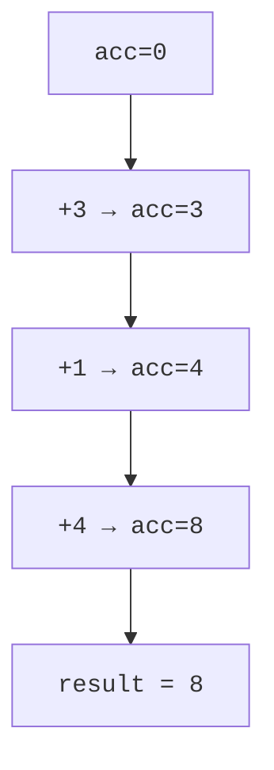

So far our operators have produced sequences. Aggregations are the
operators that produce a *single value*. They're how you turn "a
list of orders" into "the total revenue" or "the largest order".

This page covers the built-in shortcuts (`Count`, `Sum`, `Min`,
`Max`, `Average`) and then the general-purpose tool that underlies
all of them: `Aggregate`.

<svg
  viewBox="0 0 640 220"
  role="img"
  aria-label="A cloud of small dots funnels into one large circle, with a few small derived satellites beside it — a whole sequence collapsed to single values"
  style={{ display: "block", width: "100%", maxWidth: "640px", height: "auto", margin: "2.5rem auto" }}
>
  <g style={{ color: "var(--ds-blue-500)" }} fill="currentColor">
    <circle cx="90" cy="70" r="6" />
    <circle cx="130" cy="55" r="5" />
    <circle cx="170" cy="75" r="7" />
    <circle cx="110" cy="110" r="5" />
    <circle cx="150" cy="95" r="6" />
    <circle cx="195" cy="115" r="5" />
    <circle cx="85" cy="145" r="6" />
    <circle cx="125" cy="135" r="5" />
    <circle cx="165" cy="155" r="7" />
    <circle cx="205" cy="90" r="4" />
    <circle cx="145" cy="165" r="4" />
    <circle cx="190" cy="150" r="5" />
    <polygon points="250,40 250,180 360,110" />
  </g>
  <g style={{ color: "var(--ds-green-500)" }} fill="currentColor">
    <circle cx="430" cy="110" r="34" />
  </g>
  <g style={{ color: "var(--ds-yellow-500)" }} fill="currentColor">
    <circle cx="492" cy="84" r="9" />
  </g>
  <g style={{ color: "var(--ds-blue-500)" }} fill="currentColor">
    <circle cx="510" cy="114" r="7" />
  </g>
  <g style={{ color: "var(--ds-red-500)" }} fill="currentColor">
    <circle cx="496" cy="142" r="6" />
  </g>
</svg>

## The friendly built-ins

| Operator | What it returns | Notes |
| --- | --- | --- |
| `Count()` | Number of elements | Walks the sequence; for `ICollection<T>` it's O(1) |
| `LongCount()` | Same, as `long` | For very large counts |
| `Sum()` | Sum of elements | Overloads for numeric types and a selector |
| `Min()` | Smallest element | Throws on an empty non-nullable sequence |
| `Max()` | Largest element | Same caveat |
| `Average()` | Arithmetic mean | Returns `double`/`decimal`; throws on empty |
| `MinBy(key)` | Element with smallest key | New in .NET 6 |
| `MaxBy(key)` | Element with largest key | Same |

<CodeBlock
  adapter="csharp"
  files={[
    {
      filename: "main.cs",
      starterCode: `using System;
using System.Linq;

var products = new[] {
    new Product("Widget", 9.99m, 100),
    new Product("Gadget", 14.50m, 25),
    new Product("Gizmo", 19.99m, 0),
    new Product("Doodad", 4.50m, 250),
};

Console.WriteLine($"count:       {products.Count()}");
Console.WriteLine($"in stock:    {products.Count(p => p.Stock > 0)}");
Console.WriteLine($"total stock: {products.Sum(p => p.Stock)}");
Console.WriteLine($"min price:   {products.Min(p => p.Price):C}");
Console.WriteLine($"max price:   {products.Max(p => p.Price):C}");
Console.WriteLine($"avg price:   {products.Average(p => p.Price):C}");

var cheapest = products.MinBy(p => p.Price);
var pricey = products.MaxBy(p => p.Price);
Console.WriteLine($"cheapest:    {cheapest?.Name}");
Console.WriteLine($"priciest:    {pricey?.Name}");

record Product(string Name, decimal Price, int Stock);
`,
    },
  ]}
/>

The lambda overloads (`Sum(p => p.Price)`, `Count(p =>
p.Stock > 0)`) are the same as projecting first and then aggregating
— just a shortcut.

## Empty-sequence behavior

Aggregations on empty sequences are a famous source of bugs.

| Operator | Empty input |
| --- | --- |
| `Count()` | `0` |
| `Sum()` | `0` (good!) |
| `Min()`, `Max()`, `Average()` | **Throws `InvalidOperationException`** |
| `MinBy()`, `MaxBy()` | Returns `null` |
| `First()` | Throws |
| `FirstOrDefault()` | Returns the default value |

The pattern is: if the operator has a meaningful answer for "no
elements" (count is 0, sum is 0), it returns that. If not, it
throws — and you can usually pick a `…OrDefault` variant if you
want a sentinel.

<CodeBlock
  adapter="csharp"
  files={[
    {
      filename: "main.cs",
      starterCode: `using System;
using System.Linq;

var empty = System.Array.Empty<int>();

Console.WriteLine($"count: {empty.Count()}");
Console.WriteLine($"sum:   {empty.Sum()}");

try
{
    Console.WriteLine($"min: {empty.Min()}");
}
catch (Exception ex)
{
    Console.WriteLine($"min threw: {ex.GetType().Name}");
}

// Safe alternatives:
Console.WriteLine($"min-or-default: {empty.DefaultIfEmpty().Min()}");
`,
    },
  ]}
/>

`DefaultIfEmpty()` yields one default element if the source is empty.
It's a useful trick for "give me the min, or zero".

## The universal aggregator: `Aggregate`

`Aggregate` (sometimes called `fold` or `reduce` elsewhere) is the
general form. You give it:

1. A **seed** — the starting accumulator value.
2. An **accumulator function** — `(acc, element) => newAcc`.
3. Optionally, a **result selector** that turns the final accumulator
   into the answer.

`Sum`, `Count`, `Min`, and `Max` are all special cases.

<CodeBlock
  adapter="csharp"
  files={[
    {
      filename: "main.cs",
      starterCode: `using System;
using System.Linq;

var nums = new[] { 3, 1, 4, 1, 5, 9, 2, 6, 5 };

// Sum implemented with Aggregate.
int sum = nums.Aggregate(0, (acc, n) => acc + n);

// Product implemented with Aggregate.
int product = nums.Aggregate(1, (acc, n) => acc * n);

// Max implemented with Aggregate.
int max = nums.Aggregate(int.MinValue, (acc, n) => n > acc ? n : acc);

// Concatenate strings.
string csv = nums.Aggregate("", (acc, n) => acc == "" ? n.ToString() : $"{acc},{n}");

Console.WriteLine($"sum     = {sum}");
Console.WriteLine($"product = {product}");
Console.WriteLine($"max     = {max}");
Console.WriteLine($"csv     = {csv}");
`,
    },
  ]}
/>

`Aggregate` is the swiss-army knife. Any time you need to *fold*
a sequence into a single value and there's no specialised operator
already, reach for `Aggregate`.

## Aggregating into a richer accumulator

The accumulator doesn't have to be a simple type. It can be a tuple,
record, or even a collection — useful when you want to compute
several things in one pass.

<CodeBlock
  adapter="csharp"
  files={[
    {
      filename: "main.cs",
      starterCode: `using System;
using System.Linq;

var nums = new[] { 3, 1, 4, 1, 5, 9, 2, 6, 5, 3, 5 };

// One pass that computes count, sum, sum-of-squares, min, max.
var stats = nums.Aggregate(seed: (Count: 0, Sum: 0L, Sq: 0L, Min: int.MaxValue, Max: int.MinValue),
                           func: (acc, n) => (acc.Count + 1, acc.Sum + n, acc.Sq + (long)n * n,
                                              n<acc.Min ? n : acc.Min, n> acc.Max ? n : acc.Max));

double mean = (double)stats.Sum / stats.Count;
double var = (double)stats.Sq / stats.Count - mean * mean;

Console.WriteLine($"count={stats.Count} sum={stats.Sum} min={stats.Min} max={stats.Max}");
Console.WriteLine($"mean={mean:F2}  variance={var:F2}");
`,
    },
  ]}
/>

One pass through `nums`, five quantities computed. Compared with five
separate `Sum/Min/Max/Count/Sum` calls (which would walk the source
five times), this is potentially much more efficient — though for
small in-memory collections the difference is negligible.

## `Aggregate` is not always the best choice

Built-in operators are usually clearer and equally fast:

```csharp
// Prefer this:
int sum = nums.Sum();

// Over this (works, but harder to read):
int sum = nums.Aggregate(0, (acc, n) => acc + n);
```

Reach for `Aggregate` when:

- There is no built-in operator for what you want.
- You need to compute several things in one pass.
- The accumulator has a non-trivial type or update logic.

## A walkthrough of one fold

Let's trace `nums.Aggregate(0, (acc, n) => acc + n)` for
`nums = [3, 1, 4]`:



The accumulator threads through, one element at a time. The seed is
the starting point; the final accumulator is the result.

## A multi-file challenge

<ChallengeCard
  adapter="csharp"
  title="Compute a checksum"
  instructions={`Implement \`Checksum.Compute(IEnumerable<int> xs)\` which
returns a single int defined as:

> Start at 0. For each element, multiply the accumulator by 31, then
> add the element. Return the accumulator.

That formula is a classic polynomial-rolling hash. Implement it
with \`Aggregate\` — no \`foreach\` allowed.`}
  entryFilename="Program.cs"
  files={[
    {
      filename: "Program.cs",
      starterCode: `var xs = new[] { 1, 2, 3, 4 };
// 0*31 + 1 = 1
// 1*31 + 2 = 33
// 33*31 + 3 = 1026
// 1026*31 + 4 = 31810
System.Console.WriteLine(Checksum.Compute(xs));
`,
    },
    {
      filename: "Checksum.cs",
      starterCode: `using System.Collections.Generic;

public static class Checksum
{
    public static int Compute(IEnumerable<int> xs)
    {
        // your code here, must use Aggregate
        return 0;
    }
}
`,
      solutionCode: `using System.Collections.Generic;
using System.Linq;

public static class Checksum
{
    public static int Compute(IEnumerable<int> xs) => xs.Aggregate(0, (acc, x) => acc * 31 + x);
}
`,
    },
  ]}
  tests={[
    {
      id: "checksum",
      name: "Checksum of [1,2,3,4] is 31810",
      description: "Polynomial rolling hash with base 31",
      expect: { stdoutEquals: "31810" },
    },
  ]}
/>

<MultipleChoice
  markdown={`What does \`new int[0].Min()\` do?

- Returns 0.
  > It does not return any value; \`Min\` on an empty non-nullable sequence throws.
- Returns \`int.MinValue\`.
  > Same — \`Min\` does not fabricate a value when the sequence is empty.
- Returns \`null\`.
  > Returning \`null\` isn't possible for a non-nullable \`int\`, and even for nullable types the empty behavior depends on the overload.
- [o] Throws \`InvalidOperationException\` because the sequence is empty.
  > \`Min\` on an empty non-nullable \`IEnumerable<int>\` throws. Use \`DefaultIfEmpty\`, \`MinBy\`, or guard with \`Any()\` to handle the empty case.

\`Sum\` and \`Count\` have natural answers for empty sequences (zero),
but \`Min\`, \`Max\`, and \`Average\` do not. They throw. Always
consider the empty-sequence case when you write a pipeline.`}
/>
