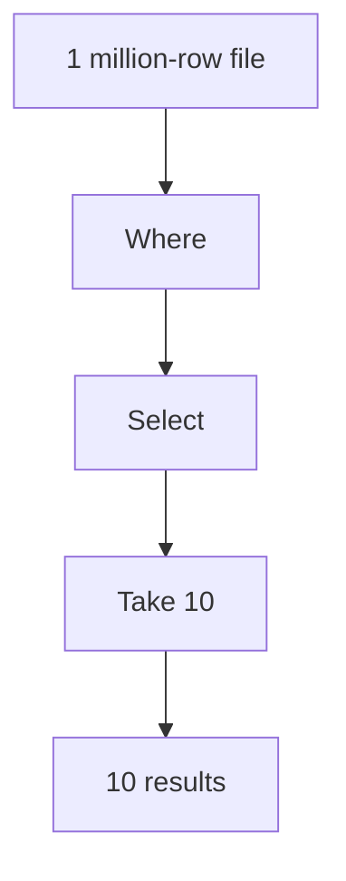
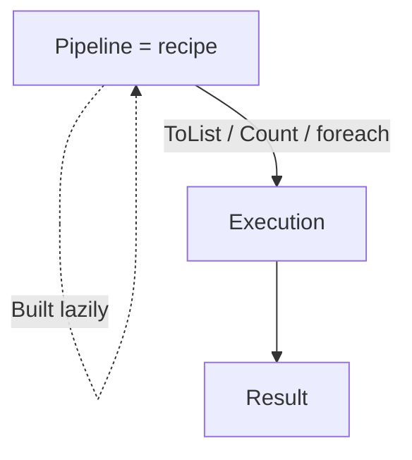

LINQ is **lazy**. That single fact explains 90% of the "weird"
behavior people encounter when they start using it. Once you
internalize laziness, LINQ becomes predictable; until you do, it can
feel like the operators are running at random times.

This page is dedicated to making it concrete: when does a LINQ
operator actually do its work, why is that the default, and what
goes wrong when you forget.

<svg
  viewBox="0 0 640 200"
  role="img"
  aria-label="A pipeline of unlit gray circles waiting dormant; a lightning bolt at the far end has just lit up the nearest stages in blue — nothing runs until something asks for results"
  style={{ display: "block", width: "100%", maxWidth: "640px", height: "auto", margin: "2.5rem auto" }}
>
  <g fill="currentColor" opacity="0.15">
    <circle cx="120" cy="100" r="20" />
    <circle cx="220" cy="100" r="20" />
    <circle cx="320" cy="100" r="20" />
    <circle cx="420" cy="100" r="20" />
  </g>
  <g fill="currentColor" opacity="0.25">
    <circle cx="158" cy="100" r="3" />
    <circle cx="182" cy="100" r="3" />
    <circle cx="258" cy="100" r="3" />
    <circle cx="282" cy="100" r="3" />
    <circle cx="358" cy="100" r="3" />
    <circle cx="382" cy="100" r="3" />
  </g>
  <g style={{ color: "var(--ds-blue-500)" }} fill="currentColor">
    <circle cx="320" cy="100" r="20" fillOpacity="0.45" />
    <circle cx="420" cy="100" r="20" />
  </g>
  <g style={{ color: "var(--ds-yellow-500)" }} fill="currentColor">
    <circle cx="470" cy="100" r="4" />
    <circle cx="488" cy="100" r="3" />
    <polygon points="532,62 512,98 525,98 517,130 548,92 534,92 543,62" />
  </g>
</svg>

## Two kinds of operator

LINQ operators fall into two camps:

| Camp | Examples | Behavior |
| --- | --- | --- |
| **Deferred** | `Where`, `Select`, `SelectMany`, `OrderBy`, `Skip`, `Take`, `Distinct`, `Concat`, `Zip`, `GroupBy` | Return a new `IEnumerable<T>` immediately; do **no work** until iterated |
| **Immediate** | `ToList`, `ToArray`, `ToDictionary`, `ToLookup`, `Count`, `Sum`, `Min`, `Max`, `First`, `Single`, `Any`, `Aggregate` | Walk the source *now* and return a concrete value (or collection) |

The deferred operators define a *recipe* for producing elements. The
immediate operators *execute* the recipe.

## Seeing laziness with your own eyes

The clearest demonstration: a deferred pipeline that prints as it
runs.

<CodeBlock
  adapter="csharp"
  files={[
    {
      filename: "main.cs",
      starterCode: `using System;
using System.Collections.Generic;
using System.Linq;

static IEnumerable<int> Source()
{
    Console.WriteLine("  Source: 1");
    yield return 1;
    Console.WriteLine("  Source: 2");
    yield return 2;
    Console.WriteLine("  Source: 3");
    yield return 3;
}

Console.WriteLine("Building pipeline (no source output expected yet):");
var pipeline = Source()
                   .Where(n =>
                          {
                              Console.WriteLine($"  Where checking {n}");
                              return n % 2 == 1;
                          })
                   .Select(n =>
                           {
                               Console.WriteLine($"  Select mapping {n}");
                               return n * 10;
                           });

Console.WriteLine("Pipeline built. Now iterating:");
foreach (var n in pipeline)
    Console.WriteLine($"  got {n}");

Console.WriteLine("Iterating a SECOND time — source runs again:");
foreach (var n in pipeline)
    Console.WriteLine($"  got {n}");
`,
    },
  ]}
/>

Notice three things in the output:

1. Nothing happens when the pipeline is built. `Source` doesn't even
   start.
2. Elements flow through one at a time. The order of "Source: 2",
   "Where checking 2", "got" is *interleaved*, not "Source finishes
   then Where runs then Select runs".
3. Each iteration of the pipeline re-runs the source.

## Why laziness is the default

Three good reasons:

### 1. Memory

A pipeline can describe a transformation over a million-element
sequence without ever holding all million elements in memory.



If `Take(10)` is lazy, only ten reads from the file ever happen
(plus the rejects from `Where` before reaching ten). The rest of the
file is never touched. The pipeline never holds more than a single
element at a time.

### 2. Composition

Lazy operators are composable because they don't commit. You can
build up a `IEnumerable<T>` as a *query value*, pass it around, and
let the consumer decide if and how to materialize.

```csharp
IEnumerable<Order> ActiveOrders(IEnumerable<Order> all) =>
    all.Where(o => o.Status == "active");

// caller decides:
ActiveOrders(orders).Count();              // just a count
ActiveOrders(orders).Take(10).ToList();    // top 10
ActiveOrders(orders).Sum(o => o.Total);    // total revenue
```

### 3. Short-circuit operators

Operators like `Any()`, `First()`, `Take(n)`, and `All()` can stop
early when laziness is preserved.

<CodeBlock
  adapter="csharp"
  files={[
    {
      filename: "main.cs",
      starterCode: `using System;
using System.Linq;
using System.Collections.Generic;

static IEnumerable<int> Counting()
{
    for (int i = 1;; i++)
    {
        Console.WriteLine($"  yielding {i}");
        yield return i;
    }
}

// Even though Counting is infinite, this terminates — Any stops as soon as it sees the first match.
bool hasBig = Counting().Any(n => n > 3);
Console.WriteLine($"hasBig = {hasBig}");
`,
    },
  ]}
/>

Without laziness, `Any` over an infinite sequence would loop
forever.

## The classic pitfalls

### Pitfall 1: enumerating twice

Each `foreach` over a lazy pipeline runs the source again. If the
source is expensive (HTTP call, file read, big query), that's bad.

```csharp
var pipeline = LoadFromApi().Where(...);   // 1 HTTP call promised
foreach (var x in pipeline) { ... }        // 1 HTTP call
foreach (var x in pipeline) { ... }        // ANOTHER HTTP call
var count = pipeline.Count();              // ANOTHER HTTP call
```

**Fix:** materialize once.

```csharp
var data = LoadFromApi().Where(...).ToList();   // 1 HTTP call
// reuse `data` freely
```

### Pitfall 2: captured variables in lambdas

Because lambdas execute *when the pipeline is enumerated*, they see
the captured variables' *current* values.

<CodeBlock
  adapter="csharp"
  files={[
    {
      filename: "main.cs",
      starterCode: `using System;
using System.Linq;

var nums = new[] { 1, 2, 3, 4, 5 };

int threshold = 3;
var pipeline = nums.Where(n => n > threshold);

threshold = 4; // change AFTER building the pipeline
Console.WriteLine($"With threshold=4: {string.Join(",", pipeline)}");

threshold = 1;
Console.WriteLine($"With threshold=1: {string.Join(",", pipeline)}");
`,
    },
  ]}
/>

Same pipeline, two enumerations, two different results — because
`threshold` was captured *by reference*.

This is often desirable (you can build a query that responds to
current state) and occasionally a bug (you didn't expect the
behavior to change). Either way, knowing it is the difference.

### Pitfall 3: side effects in lambdas

Because lambdas may run zero, one, or many times — and at unexpected
moments — putting side effects in them is a recipe for confusion.

```csharp
// BAD — when does this print? With Count(), no. With Sum(), yes. With ToList(), yes.
nums.Select(n => { Console.WriteLine(n); return n * 2; });
```

Treat LINQ lambdas as pure functions. Do side effects in an explicit
`foreach`, after the pipeline materializes.

### Pitfall 4: closing over disposed resources

```csharp
IEnumerable<string> Lines()
{
    using var reader = new StreamReader("file.txt");
    return reader.ReadLine() == null
        ? Enumerable.Empty<string>()
        : reader.ReadToEnd().Split('\n');
}
```

…is fine, because we materialize before `Dispose`. But this:

```csharp
IEnumerable<string> Lines()
{
    using var reader = new StreamReader("file.txt");
    return Reader(reader);   // yields lazily

    IEnumerable<string> Reader(StreamReader r)
    {
        string? line;
        while ((line = r.ReadLine()) != null) yield return line;
    }
}
```

…is broken. By the time the caller iterates, `reader` is disposed.
A safer pattern is to use `yield return` *inside* the same `using`,
or to materialize explicitly with `ToList`.

## How to think about it

Picture a LINQ pipeline as a *query you have not yet asked*. It is a
recipe. It is the *promise* of a result. The first time a consumer
walks it (or asks for `.Count()`, etc.), the recipe is executed.



Once you keep this picture in mind, every behavior on this page
follows naturally.

## A quick checklist

When writing LINQ, ask:

1. Will this pipeline be enumerated more than once? → consider
   `ToList()` or `ToArray()` at the end.
2. Are the lambdas pure? → if not, you have a bug waiting.
3. Are captured variables stable? → if not, your pipeline's behavior
   depends on when it runs.
4. Is the source expensive? → materialize once, reuse the result.

<MultipleChoice
  markdown={`Given:

\`\`\`csharp
var q = numbers.Where(n => n > 10).Select(n => n * 2);
foreach (var x in q) { ... }
foreach (var x in q) { ... }
\`\`\`

…and assuming \`numbers\` is the result of an expensive method call like \`LoadFromDatabase()\`, what is the consequence?

- Nothing notable — \`q\` is cached after the first iteration.
  > LINQ operators do not cache results; \`q\` is a re-runnable recipe, not a memoized value.
- A compile error, because you can't iterate a deferred sequence twice.
  > It compiles and runs fine, but it re-executes the pipeline on each iteration.
- [o] The pipeline (and the underlying \`LoadFromDatabase\` call) runs *twice*, once per \`foreach\`.
  > Deferred operators define a recipe, not a stored result. Each \`foreach\` walks the source again — re-running any side-effectful or expensive source method.
- The second \`foreach\` produces no output, because the enumerator is already at the end.
  > Each \`foreach\` calls \`GetEnumerator\` again, so it starts from the beginning each time.

If you want to iterate twice without re-running the source, materialize
once with \`ToList()\` or \`ToArray()\`. *This is one of the most common
LINQ performance bugs in real codebases.*`}
/>
