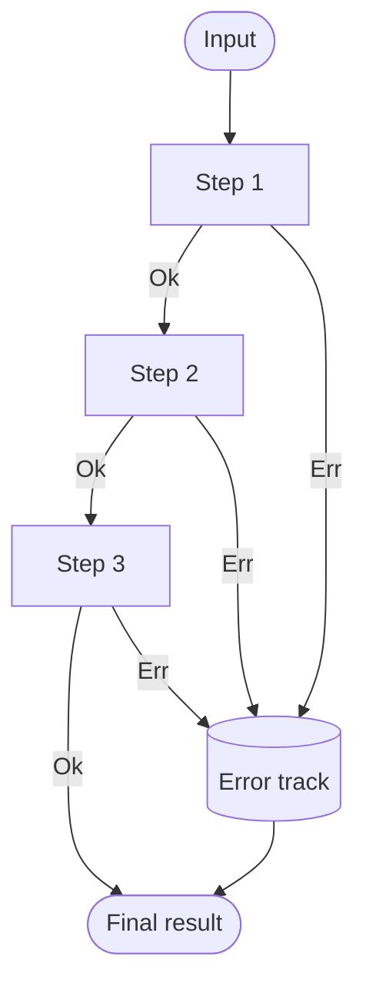

C# is not a "functional-first" language, but every meaningful
functional pattern has a clean translation into modern C#. This page
shows the patterns experienced functional developers reach for most
often, expressed in the idioms a C# reviewer would actually accept.

<Figure
  slug="cs-functional-design-patterns-cutout"
  alt="Functional design patterns, an isometric illustration"
/>

## Pattern 1: Option / Maybe

A `null` is a *runtime time bomb*: the type system swears the value
is there, the runtime says otherwise. The **Option** type makes the
"might-not-be-there"-ness *part of the type*.

C# has had nullable reference types (`string?`) since C# 8 and
nullable value types (`int?`) since C# 2. Combined with the null
operators, these give you most of what an `Option<T>` provides
elsewhere.

<Figure
  slug="cs-functional-design-patterns-pattern-1-option-inline-cutout"
  alt="Two sealed envelopes on a bench, one opened to show a block and one opened to show nothing"
  caption="One envelope holds a value and one holds nothing, and both are opened alike."
/>

<CodeBlock
  adapter="csharp"
  files={[
    {
      filename: "main.cs",
      starterCode: `#nullable enable
using System;
using System.Collections.Generic;
using System.Linq;

string Greet(int id) => Users
                            .Find(id)            // User?
                            ?.Email              // string?
                            ?.ToUpperInvariant() // string?
                        ?? "(no email)";         // string

Console.WriteLine(Greet(1));  // ADA@EXAMPLE.COM
Console.WriteLine(Greet(2));  // (no email)
Console.WriteLine(Greet(99)); // (no email)

public record User(int Id, string Name, string? Email);
public static class Users
{
    private static readonly User[] All = {
        new(1, "Ada", "ada@example.com"),
        new(2, "Bob", null),
        new(3, "Cara", "cara@example.com"),
    };

    public static User? Find(int id) => All.FirstOrDefault(u => u.Id == id);
}
`,
    },
  ]}
/>

The `?.` operator is *exactly* `Option.Map`. The `??` operator is
`Option.GetValueOrDefault`. The compiler will not let you call a
method on a nullable without acknowledging the null case. This is
the functional pattern, in C# clothing.

## Pattern 2: Result / Either

Operations can *fail*. Throwing an exception conflates control flow
with failure handling. A `Result<T, TError>` makes success and
failure *both* first-class.

<Figure
  slug="cs-functional-design-patterns-pattern-2-result-either-inline-cutout"
  alt="A load taking one of two chutes at each station, the lower chute carrying the first fault straight to the end untouched"
  caption="Failure is a value carried along the chain, so nothing has to throw."
/>

<CodeBlock
  adapter="csharp"
  files={[
    {
      filename: "main.cs",
      starterCode: `using System;

Result<int, string> Parse(string s) => int.TryParse(s, out var n) ? new Result<int, string>.Ok(n)
                                                                  : new Result<int, string>.Err($"not a number: '{s}'");

Result<int, string> Half(int n) => n % 2 == 0 ? new Result<int, string>.Ok(n / 2)
                                              : new Result<int, string>.Err($"odd: {n}");

void Show(Result<int, string> r) => Console.WriteLine(r switch { Result<int, string>.Ok o => $"ok: {o.Value}",
                                                                 Result<int, string>.Err e => $"err: {e.Error}",
                                                                 _ => "?" });

Show(Parse("10").Bind(Half));  // ok: 5
Show(Parse("7").Bind(Half));   // err: odd: 7
Show(Parse("abc").Bind(Half)); // err: not a number: 'abc'

public abstract record Result<T, E>
{
    public sealed record Ok(T Value) : Result<T, E>;
    public sealed record Err(E Error) : Result<T, E>;

    public Result<U, E> Map<U>(Func<T, U> f) =>
        this switch { Ok ok => new Result<U, E>.Ok(f(ok.Value)), Err err => new Result<U, E>.Err(err.Error),
                      _ => throw new InvalidOperationException() };

    public Result<U, E> Bind<U>(Func<T, Result<U, E>> f) =>
        this switch { Ok ok => f(ok.Value), Err err => new Result<U, E>.Err(err.Error),
                      _ => throw new InvalidOperationException() };
}
`,
    },
  ]}
/>

Notice: the failure cases *never throw*. The chain short-circuits
through `Bind`, carrying the first error along. This is the heart of
**railway-oriented programming**.

## Pattern 3: Railway-oriented programming

A pipeline of operations can succeed or fail at any step. Picture it
as two parallel tracks:

Each step either stays on the *success* track (continues to the next
step) or switches to the *failure* track (carries the original error
straight to the end). `Bind` is the switch operator that performs
this routing.

<Figure
  slug="cs-functional-design-patterns-pattern-3-railway-oriented-inline-cutout"
  alt="Two parallel rails where a load either carries on along the upper one or drops to the lower and runs straight to the end"
  caption="Each step continues on the success track or switches to failure, carrying the first error."
/>

The benefits are huge:

- No `try/catch` clutter.
- Errors are values you can inspect and combine.
- Function signatures *truthfully advertise* failure.
- Easy to test: just feed an `Err` in and watch it propagate.

## Pattern 4: Currying and partial application

A curried function takes one argument at a time. Partial application
fixes some arguments early and returns a function asking for the
rest.

<Figure
  slug="cs-functional-design-patterns-pattern-4-currying-partial-inline-cutout"
  alt="A machine with two slots, one filled and locked shut, leaving a smaller machine that needs only the second"
  caption="Fix the first argument and what is left is a smaller function waiting for the rest."
/>

<CodeBlock
  adapter="csharp"
  files={[
    {
      filename: "main.cs",
      starterCode: `using System;
using System.Linq;

// curried: (string sep) => (IEnumerable<string> xs) => string
Func<string, Func<System.Collections.Generic.IEnumerable<string>, string>> join = sep => xs => string.Join(sep, xs);

var joinCsv = join(", ");
var joinPath = join("/");

Console.WriteLine(joinCsv(new[] { "a", "b", "c" }));      // a, b, c
Console.WriteLine(joinPath(new[] { "usr", "bin", "x" })); // usr/bin/x
`,
    },
  ]}
/>

This is the trick behind the *configurable* pipeline helpers in the
previous chapter. Instead of passing a separator to every call, you
build a specialized helper once and reuse it.

## Pattern 5: Pipeline as data, discriminated unions

Modeling *states of the world* with a discriminated union (a sealed
hierarchy of records) replaces brittle bool/enum flags. With C#
pattern matching, branching on them is exhaustive and clear.

<Figure
  slug="cs-functional-design-patterns-pattern-5-pipeline-as-inline-cutout"
  alt="A set of distinctly shaped labelled slots replacing a row of identical toggle switches on the same panel"
  caption="A discriminated union names each state, where a pair of boolean flags only implies them."
/>

<CodeBlock
  adapter="csharp"
  files={[
    {
      filename: "main.cs",
      starterCode: `using System;

string Describe(Payment p) => p switch { Payment.Cash c => $"cash {c.Amount:C}",
                                         Payment.Card c => $"card ****{c.Last4} {c.Amount:C}",
                                         Payment.Voucher v => $"voucher #{v.Code}",
                                         _ => "unknown" };

Console.WriteLine(Describe(new Payment.Cash(20m)));
Console.WriteLine(Describe(new Payment.Card(150m, "0042")));
Console.WriteLine(Describe(new Payment.Voucher("XMAS24")));

public abstract record Payment
{
    public sealed record Cash(decimal Amount) : Payment;
    public sealed record Card(decimal Amount, string Last4) : Payment;
    public sealed record Voucher(string Code) : Payment;
}
`,
    },
  ]}
/>

If you add a new payment kind, the compiler can warn you about
non-exhaustive `switch` expressions, a small but lovely *FP-style*
safety net inside a C# program.

## Pattern 6: Combinators

A combinator builds a complex thing from simpler ones. We met one in
the previous page (`And` for predicates). Here's a tiny **validation
combinator** library.

<Figure
  slug="cs-functional-design-patterns-pattern-6-combinators-inline-cutout"
  alt="Two small rules clipped together end to end into one longer rule that still lifts as a single piece"
  caption="A combinator builds a bigger rule out of smaller ones, each still readable alone."
/>

<ChallengeCard
  adapter="csharp"
  title="Validator combinators"
  instructions={`A *validator* is a function from a value to a (possibly empty) list of error messages. Implement these rules in \`Validator.cs\`:

- \`NonEmpty(field)\`, yields the error \`"{field} is empty"\` when the value is null or an empty string.
- \`MaxLen(field, max)\`, yields \`"{field} too long"\` when \`value.Length > max\`.
- \`NoDigits(field)\`, yields \`"{field} contains digits"\` when the value contains any digit character.
- \`All(rules)\`, a *combinator* that runs every rule and concatenates their errors in argument order.

A rule that passes returns an **empty** sequence (no error).`}
  entryFilename="Program.cs"
  files={[
    {
      filename: "Program.cs",
      starterCode: `using System;
using System.Linq;

var rule = Validator<string>.All(Validator<string>.NonEmpty("name"), Validator<string>.MaxLen("name", 10),
                                 Validator<string>.NoDigits("name"));

foreach (var name in new[] { "Ada", "", "alongusername", "Ada1" })
{
    var errs = rule(name).ToList();
    Console.WriteLine(errs.Count == 0 ? $"OK: {name}" : $"BAD '{name}': {string.Join("; ", errs)}");
}
`,
      solutionCode: `using System;
using System.Linq;

var rule = Validator<string>.All(Validator<string>.NonEmpty("name"), Validator<string>.MaxLen("name", 10),
                                 Validator<string>.NoDigits("name"));

foreach (var name in new[] { "Ada", "", "alongusername", "Ada1" })
{
    var errs = rule(name).ToList();
    Console.WriteLine(errs.Count == 0 ? $"OK: {name}" : $"BAD '{name}': {string.Join("; ", errs)}");
}
`,
    },
    {
      filename: "Validator.cs",
      starterCode: `using System;
using System.Collections.Generic;
using System.Linq;

public static class Validator<T>
{
    // A validator is a function from a value to a (possibly empty) list of error messages.
    public delegate IEnumerable<string> Rule(T value);

    // TODO: implement
    public static Rule NonEmpty(string field) => throw new NotImplementedException();

    // TODO: implement
    public static Rule MaxLen(string field, int max) => throw new NotImplementedException();

    // TODO: implement
    public static Rule NoDigits(string field) => throw new NotImplementedException();

    // TODO: implement
    public static Rule All(params Rule[] rules) => throw new NotImplementedException();
}
`,
      solutionCode: `using System;
using System.Collections.Generic;
using System.Linq;

public static class Validator<T>
{
    public delegate IEnumerable<string> Rule(T value);

    public static Rule NonEmpty(string field) => v => string.IsNullOrEmpty(v as string) ? new[] { $"{field} is empty" }
                                                                                        : Enumerable.Empty<string>();

    public static Rule MaxLen(string field, int max) => v => (v as string)?.Length > max? new[] { $"{field} too long" }
        : Enumerable.Empty<string>();

    public static Rule NoDigits(string field) => v => (v as string)?.Any(char.IsDigit) == true
                                                          ? new[] { $"{field} contains digits" }
                                                          : Enumerable.Empty<string>();

    public static Rule All(params Rule[] rules) => v => rules.SelectMany(r => r(v));
}
`,
    },
  ]}
  tests={[
    {
      id: "validator-combinators",
      name: "Validator combinators accumulate errors in order",
      description: "All combines NonEmpty + MaxLen + NoDigits; errors concatenate",
      expect: {
        stdoutEquals: "OK: Ada\nBAD '': name is empty\nBAD 'alongusername': name too long\nBAD 'Ada1': name contains digits\n",
      },
    },
  ]}
/>

`All()` is a combinator, it makes a bigger rule out of smaller rules.
Each individual rule stays focused. The library composes naturally
because every rule has the same type signature.

## Choosing patterns wisely

These patterns are *tools*, not laws. In real C# code:

- Use `string?` and `?.` for everyday "might be missing" cases.
  Don't import an Option library just to wrap two values.
- Use `Result<T, E>` when failure is *expected and frequent* (input
  parsing, validation, external calls). For "this should never
  happen" cases, exceptions are still appropriate.
- Use discriminated unions when you have a *closed* set of states.
- Use combinators when you're writing a small DSL.

| Need to model… | Reach for |
| --- | --- |
| Missing data | Nullable types: `string?`, `int?` |
| Failure | `Result<T, E>` |
| A closed set of states | Discriminated union: sealed records |
| Complex things built from simple ones | Combinators |

When chosen carefully, these patterns make C# code dramatically more
expressive *without* abandoning the strengths of the object-oriented model.

<MultipleChoice
  markdown={`In railway-oriented programming, what is the central role of \`Bind\` (also called \`FlatMap\` or \`SelectMany()\`)?

- It converts a synchronous result into an async one.
  > That's a separate concern (lifting into a \`Task\` / \`ValueTask\`), not the purpose of \`Bind\`.
- It catches exceptions inside each step and converts them to errors.
  > A useful helper, but not what \`Bind\` itself does, it just propagates the existing \`Err\` value.
- [o] It chains an operation that *returns* a \`Result\` onto a previous \`Result\`, automatically short-circuiting on the first error.
  > \`Bind\` lets you write \`a.Bind(Step2).Bind(Step3)\` where each step may fail. As soon as one step returns \`Err\`, every subsequent \`Bind\` skips its function and threads the error to the end of the pipeline.
- It runs all steps in parallel and collects every error at once.
  > That's *applicative* composition, a different combinator. \`Bind\` is sequential.

\`Bind\` is the switch operator that defines the success/failure track topology of a pipeline.`}
/>
