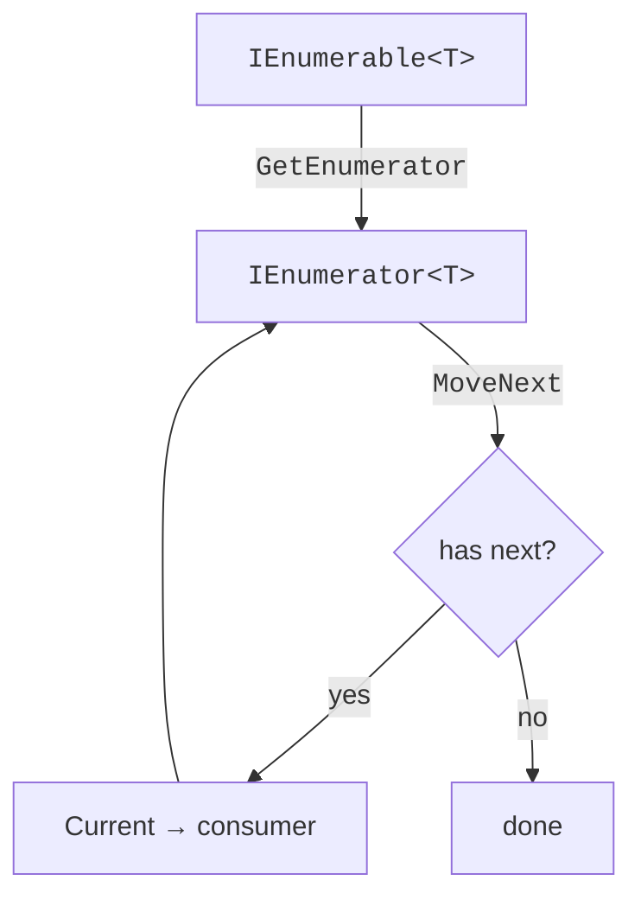
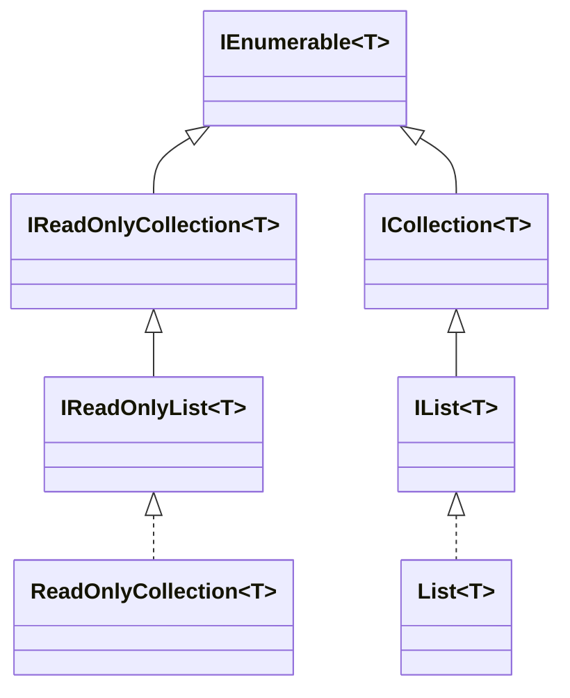

LINQ is built on a single, deceptively small interface:
`IEnumerable<T>`. Every collection type you'll ever use in
C#, `List<T>`, `T[]`, `Dictionary<TKey, TValue>.Values`,
`HashSet<T>`, the output of every LINQ operator, is an
`IEnumerable<T>`.

<Figure
  slug="cs-ienumerable-iteration-cutout"
  alt="IEnumerable and iteration, an isometric illustration"
/>

This page is about what that interface actually *is*, what it
promises, and what it deliberately does *not* promise. Once you
understand this, every later page in the course makes more sense.

## The interface itself

`IEnumerable<T>` is **two methods**:

```csharp
public interface IEnumerable<T>
{
    IEnumerator<T> GetEnumerator();
}

public interface IEnumerator<T> : IDisposable
{
    T Current { get; }
    bool MoveNext();
    void Reset();   // rarely used in modern code
}
```

That's it. The contract is:

> "You can ask me for an *enumerator*, which lets you walk through
> my elements one at a time. Each `MoveNext()` either advances and
> returns `true`, or returns `false` if we've reached the end."

Notice what's *not* there:

- No `Count()`. You may not know how many elements there are.
- No `Indexer`. You can't ask for "element 7".
- No `Add` or `Remove`. Sequences may be immutable, infinite,
  or computed.

This minimal contract is exactly what makes LINQ work uniformly over
arrays, files, network streams, and infinite sequences.



## `foreach` is just sugar

A `foreach` loop in C# is just a sugar over `GetEnumerator`/
`MoveNext`/`Current`. These two programs are equivalent.

<CodeBlock
  adapter="csharp"
  files={[
    {
      filename: "main.cs",
      starterCode: `using System;
using System.Collections.Generic;

var nums = new List<int> { 10, 20, 30 };

// foreach version.
foreach (var n in nums)
    Console.WriteLine(n);

Console.WriteLine("---");

// Hand-rolled version.
using (var e = nums.GetEnumerator())
{
    while (e.MoveNext())
        Console.WriteLine(e.Current);
}
`,
    },
  ]}
/>

When you call a LINQ operator like `Where(...)`, you receive
something that *implements* `IEnumerable<T>`, but the elements have
not been computed yet. They are computed on demand, one at a time,
as `MoveNext()` is called. This is the foundation of
[deferred execution](./deferred-execution), which we'll cover in
detail later.

## Building your own sequence with `yield`

The easiest way to produce an `IEnumerable<T>` is the `yield return`
keyword. The compiler turns your method into a state machine that
implements `IEnumerator<T>` for you.

<CodeBlock
  adapter="csharp"
  files={[
    {
      filename: "main.cs",
      starterCode: `using System;
using System.Collections.Generic;

static IEnumerable<int> Naturals()
{
    int i = 1;
    while (true)
    {
        yield return i;
        i++;
    }
}

// Infinite source, but we only consume 5.
foreach (var n in Naturals())
{
    if (n > 5)
        break;
    Console.WriteLine(n);
}
`,
    },
  ]}
/>

Read that carefully. `Naturals()` would loop forever if you let it.
But because `IEnumerable<T>` is *pull-based*, values are only
produced when the consumer asks, it is safe to define and even
safer to use with operators that stop early.

## A custom operator written from scratch

To prove how simple the contract is, let's implement our own `Where()`.

<CodeBlock
  adapter="csharp"
  files={[
    {
      filename: "main.cs",
      starterCode: `using System;
using System.Collections.Generic;

static IEnumerable<T> MyWhere<T>(IEnumerable<T> source, Func<T, bool> predicate)
{
    foreach (var item in source)
        if (predicate(item))
            yield return item;
}

var nums = new[] { 1, 2, 3, 4, 5, 6, 7 };
foreach (var n in MyWhere(nums, n => n % 2 == 0))
    Console.WriteLine(n);
`,
    },
  ]}
/>

That's the entire implementation. The built-in `Enumerable.Where` is
a touch more sophisticated (it specializes for common types), but the
core idea is exactly the eight lines above.

This is the moment LINQ stops looking magical.

## What `IEnumerable<T>` does *not* promise

This is where most beginner LINQ bugs come from. `IEnumerable<T>`
explicitly **does not** promise:

| What people assume | What's actually true |
| --- | --- |
| You can call `.Count()` cheaply | It may walk the entire sequence |
| You can iterate twice | It may be a one-shot sequence (a network stream, a `yield` method) |
| Elements are stored in memory | They may be computed on demand |
| `.Count()` and `foreach` will agree | They may not, if the source is changing |

Practical example of the "iterate twice" trap:

<CodeBlock
  adapter="csharp"
  files={[
    {
      filename: "main.cs",
      starterCode: `using System;
using System.Collections.Generic;

static IEnumerable<int> Source()
{
    Console.WriteLine("  Source: yielding 1");
    yield return 1;
    Console.WriteLine("  Source: yielding 2");
    yield return 2;
    Console.WriteLine("  Source: yielding 3");
    yield return 3;
}

var seq = Source();

Console.WriteLine("First pass:");
foreach (var n in seq)
    Console.WriteLine($"  got {n}");

Console.WriteLine("Second pass:");
foreach (var n in seq)
    Console.WriteLine($"  got {n}");
`,
    },
  ]}
/>

The source method runs **twice**. If `Source()` were reading from a
file or making HTTP calls, that's two disk reads or two network
trips, usually not what you want.

<Figure
  slug="cs-ienumerable-and-iteration-interface-itself-inline-cutout"
  alt="A sealed drum with one crank and one chute, handing out a single block per turn"
  caption="`IEnumerable<T>` promises one element at a time and nothing more."
/>

<Figure
  slug="cs-ienumerable-and-iteration-inline-cutout"
  alt="A sealed drum with a crank handing out one block per turn, the drum's remaining contents unknown from outside"
  caption="You cannot see inside from outside, which is why iterating twice runs it twice."
/>

The fix is to **materialize** the sequence once, into a real
collection:

<CodeBlock
  adapter="csharp"
  files={[
    {
      filename: "main.cs",
      starterCode: `using System;
using System.Collections.Generic;
using System.Linq;

static IEnumerable<int> Source()
{
    Console.WriteLine("  Source: yielding 1");
    yield return 1;
    Console.WriteLine("  Source: yielding 2");
    yield return 2;
    Console.WriteLine("  Source: yielding 3");
    yield return 3;
}

var seq = Source().ToList(); // materialize once

Console.WriteLine("First pass:");
foreach (var n in seq)
    Console.WriteLine($"  got {n}");

Console.WriteLine("Second pass:");
foreach (var n in seq)
    Console.WriteLine($"  got {n}");
`,
    },
  ]}
/>

Now `Source()` runs only once. The two passes iterate the
in-memory `List<int>`.

## Materializing: ToList, ToArray, ToDictionary

These three operators end a pipeline and return a *concrete
collection*. They are the moment "deferred LINQ" becomes "actual
data sitting in memory".

<CodeBlock
  adapter="csharp"
  files={[
    {
      filename: "main.cs",
      starterCode: `using System;
using System.Linq;

var nums = Enumerable.Range(1, 5); // deferred

int[] arr = nums.ToArray();
System.Collections.Generic.List<int> list = nums.ToList();
var dict = nums.ToDictionary(n => n, n => n * n);

Console.WriteLine($"arr = [{string.Join(", ", arr)}]");
Console.WriteLine($"list count = {list.Count}");
foreach (var kv in dict)
    Console.WriteLine($"  {kv.Key} → {kv.Value}");
`,
    },
  ]}
/>

A useful rule:

> **Stay in `IEnumerable<T>` for as long as possible. Materialize
> exactly once, at the end, when you need to consume the result more
> than once or want to know the count.**

## `IReadOnlyCollection`, `ICollection`, `IList`, quick map

It's worth a glance at how the broader hierarchy looks. Most of the
time you should *type your variables as `IEnumerable<T>`* unless you
need more.



- `IEnumerable<T>`, can iterate.
- `IReadOnlyCollection<T>`, can iterate + has `Count()`.
- `IReadOnlyList<T>`, adds indexing.
- `ICollection<T>` / `IList<T>`, add mutation.

If your method only needs to iterate, **accept `IEnumerable<T>`**.
If you need `Count()` but no mutation, accept
`IReadOnlyCollection<T>`. If you accept `List<T>` "just in case",
you've locked your caller into one concrete type for no reason.

<MultipleChoice
  markdown={`A method has the signature \`IEnumerable<int> GetTemperatures()\`. Which assumption about the returned value is **safe**?

- You can iterate the returned sequence multiple times and always get the same results.
  > The sequence might be backed by a \`yield\` method, a network stream, or a one-shot reader. Iterating twice can re-run the source, or fail.
- The results are already in memory and indexing is O(1).
  > Indexing isn't part of \`IEnumerable<T>\` at all, that's \`IList<T>\` or arrays. And the elements may be computed on demand rather than stored.
- [o] You can call \`foreach\` over the result and read elements one at a time.
  > That is exactly what \`IEnumerable<T>\` promises: it gives you an enumerator that produces elements until it signals the end.
- The returned sequence has a known \`Count()\` property you can read cheaply.
  > \`IEnumerable<T>\` does not expose \`Count()\`; calling \`.Count()\` may walk the entire sequence (potentially expensive).

\`IEnumerable<T>\` is intentionally minimal: *"you can ask me for the
next element until I say I'm done."* Anything beyond that, counting,
indexing, re-iterating, depends on the concrete type you happen to
have.`}
/>
