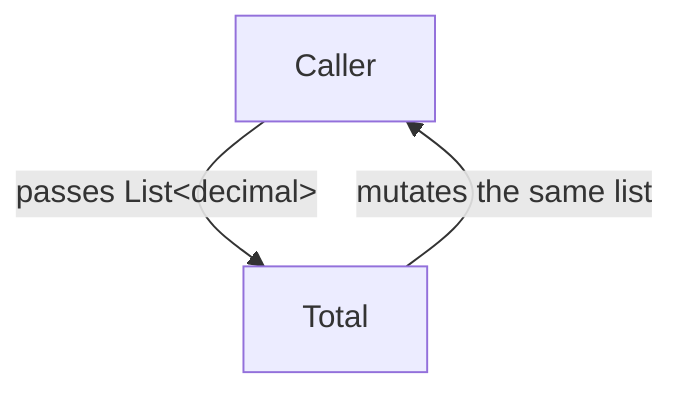

A value is **immutable** if it cannot change after it is constructed.
Once you create the `Point { X=1, Y=2 }`, it stays `Point { X=1,
Y=2 }` forever. To get a "modified" version, you build a *new* point.

<Figure
  slug="cs-immutability-cutout"
  alt="Immutability, an isometric illustration"
/>

This sounds wasteful. It is not. It is the single most reliable
weapon against an entire family of bugs that every programmer has
written at least once, and once you stop fighting it, you'll find
your code gets *simpler*, not more complex.

## The bug that immutability prevents

Here is a tiny "shopping cart" written with a mutable list. Look
at what happens.

<CodeBlock
  adapter="csharp"
  files={[
    {
      filename: "main.cs",
      starterCode: `using System;
using System.Collections.Generic;

static decimal Total(List<decimal> cart)
{
    decimal sum = 0;
    foreach (var item in cart)
        sum += item;
    cart.Add(99m); // "Tax line", but we mutate the caller's cart!
    return sum;
}

var myCart = new List<decimal> { 10m, 5m, 3m };
var t = Total(myCart);

Console.WriteLine($"total: {t}");
Console.WriteLine($"cart now has {myCart.Count} items: {string.Join(", ", myCart)}");
`,
    },
  ]}
/>

The caller passed in a cart with three items. The function computed
the total, *and silently added a fourth item*. Now anywhere else in
the program that touches `myCart` sees four items. That bug is
called **aliasing**: two pieces of code share a reference to the
same mutable object, and one of them quietly changes what the other
is reading.

Immutable data eliminates aliasing as a bug class. If `cart` cannot
be changed, it doesn't matter who else holds a reference to it.

## Immutable values in modern C#

C# has multiple tools for immutability, each at a different level.

### Records (the workhorse)

A `record` is a class designed for immutability. By default its
positional properties are read-only and equality is by value.

<CodeBlock
  adapter="csharp"
  files={[
    {
      filename: "main.cs",
      starterCode: `using System;

var a = new Money(10m, "USD");
var b = new Money(10m, "USD");
var c = a with { Amount = 25m }; // new instance, original untouched

Console.WriteLine($"a={a}");
Console.WriteLine($"b={b}");
Console.WriteLine($"c={c}");
Console.WriteLine($"a==b: {a == b}");
Console.WriteLine($"a==c: {a == c}");

record Money(decimal Amount, string Currency);
`,
    },
  ]}
/>

`a` is unchanged. `c` is a brand-new record. Equality compares
*contents*, not references, which is what you want for value types.

### `readonly` fields and `init` setters

For classes (not records), use `init` for properties that should be
set once during construction:

<CodeBlock
  adapter="csharp"
  files={[
    {
      filename: "main.cs",
      starterCode: `using System;

var c = new Config { Host = "example.com", Port = 443 };
// c.Host = "x";   // compile error: init-only property

Console.WriteLine($"{c.Host}:{c.Port}");

class Config
{
    public string Host { get; init; } = "localhost";
    public int Port { get; init; } = 8080;
}
`,
    },
  ]}
/>

### Immutable collections

The mutable defaults, `List<T>`, `Dictionary<TKey,TValue>`,
`HashSet<T>`, have immutable cousins in
`System.Collections.Immutable`. An immutable list returns a *new*
list when you "add" to it.

<CodeBlock
  adapter="csharp"
  files={[
    {
      filename: "main.cs",
      starterCode: `using System;
using System.Collections.Immutable;

var a = ImmutableList.Create(1, 2, 3);
var b = a.Add(4);
var c = b.SetItem(0, 99);

Console.WriteLine(string.Join(", ", a)); // 1, 2, 3
Console.WriteLine(string.Join(", ", b)); // 1, 2, 3, 4
Console.WriteLine(string.Join(", ", c)); // 99, 2, 3, 4
`,
    },
  ]}
/>

Each call returns a new structure. Internally, the immutable
collections share storage so this isn't as expensive as it looks.

## Non-destructive update

Building a new value from an old one is called **non-destructive
update**. The `with` expression is its idiomatic form for records.

<CodeBlock
  adapter="csharp"
  files={[
    {
      filename: "main.cs",
      starterCode: `using System;

var p = new Player("Ada", 0, 1);

var afterPoint = p with { Score = p.Score + 10 };
var leveledUp = afterPoint with { Level = afterPoint.Level + 1, Score = 0 };

Console.WriteLine(p);
Console.WriteLine(afterPoint);
Console.WriteLine(leveledUp);

record Player(string Name, int Score, int Level);
`,
    },
  ]}
/>

Notice the pattern: each "transition" is a new value. The previous
states still exist. This is incredibly useful for undo, time travel,
debugging, and persistence.

## The performance question

The most common objection to immutability is *"isn't allocating new
objects expensive?"*. The honest answer:

- For small records and short pipelines, **no**. Modern GC is
  optimized for short-lived allocations.
- For very large collections updated millions of times per second,
  **yes**, and that's why C# offers both immutable and mutable
  collections, and `Span<T>` for hot loops.
- Most "performance fixes" by switching to mutation come at the cost
  of bugs that take far more time to diagnose than they save.

The rule of thumb is: **start immutable, mutate only after a
profiler proves it matters.**

## A small map of "mutability levels"

From most immutable to most mutable:

1. `record` / `record struct` (with `init` properties)
2. `class` with all `init`/`readonly` + `ImmutableList`
3. `class` with `readonly` fields, but holds a mutable `List`
4. Mutable `class`

The closer to the top, the easier it is to reason about. A `record`
that contains a mutable `List<int>` is *not really* immutable, you
can still call `.Add` on the inner list. True immutability requires
"immutability all the way down".

## Immutability inside an OO design

You don't have to make every class a record. A practical rule:

- **Values** (Money, Point, Email, OrderLine) → immutable records.
- **Entities** (the User who logs in, the Order being modified by
  many requests) → mutable, but with controlled mutation through a
  small set of methods.
- **Services** (the OrderService that processes things) → typically
  stateless or have only configuration as state.

Most of the bugs in a typical codebase live in the *values*, not the
services. Making values immutable is where the biggest win is.

## A multi-file challenge

Implement a `Money` record and an `Inventory` *service* that uses it
without mutating it.

<ChallengeCard
  adapter="csharp"
  title="Immutable Money with a pure 'Add'"
  instructions={`Define a \`record Money(decimal Amount, string Currency)\` in
\`Money.cs\`. In the same file, implement a method:

\`public static Money Add(Money a, Money b)\`

…that returns a new \`Money\` with the summed amount, *only if* the
currencies match. If currencies differ, throw \`System.InvalidOperationException\`.

The given \`Program.cs\` will call your method and print the result.`}
  entryFilename="Program.cs"
  files={[
    {
      filename: "Program.cs",
      starterCode: `var a = new Money(10m, "USD");
var b = new Money(5m, "USD");
var c = Money.Add(a, b);

System.Console.WriteLine($"{a.Amount} {a.Currency}");
System.Console.WriteLine($"{b.Amount} {b.Currency}");
System.Console.WriteLine($"{c.Amount} {c.Currency}");
`,
    },
    {
      filename: "Money.cs",
      starterCode: `public record Money(decimal Amount, string Currency)
{
    public static Money Add(Money a, Money b)
    {
        // your code here
        return a;
    }
}
`,
      solutionCode: `using System;

public record Money(decimal Amount, string Currency)
{
    public static Money Add(Money a, Money b)
    {
        if (a.Currency != b.Currency)
            throw new InvalidOperationException("Currency mismatch");
        return a with { Amount = a.Amount + b.Amount };
    }
}
`,
    },
  ]}
  tests={[
    {
      id: "immutable_add",
      name: "Adds amounts without mutating originals",
      description: "Original a, b unchanged; c is the sum",
      expect: { stdoutEquals: "10 USD\n5 USD\n15 USD" },
    },
  ]}
/>

<MultipleChoice
  markdown={`Which statement best captures the relationship between immutability and aliasing bugs?

- Immutability is mainly a matter of code style.
  > It looks like style, but it has direct consequences for correctness, threading, and reasoning. It is structural, not cosmetic.
- [o] Immutable values cannot be aliased into incorrect states, because nothing can change them after construction.
  > Aliasing only causes bugs when one of the aliases *mutates* the shared object. If the object is immutable, no aliased reference can ever observe an unexpected change.
- Immutability is only useful in multi-threaded programs.
  > Aliasing bugs occur in single-threaded code too: any time two pieces of code share a reference to a mutable object, one can surprise the other.
- Aliasing bugs are easily prevented by adding more unit tests.
  > Tests can catch *specific* aliasing bugs, but they don't prevent the *class* of bug. Immutability eliminates the entire class structurally.

Immutability doesn't *forbid* sharing references, it makes shared
references *safe*. Two pieces of code that both hold the same
\`Money(10, "USD")\` cannot interfere with each other, because neither
can change it.`}
/>
