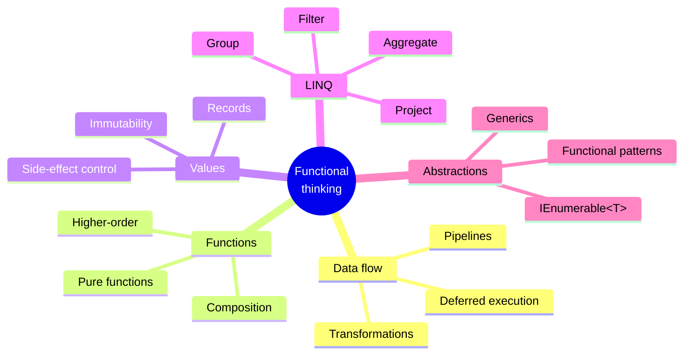

Welcome to **C# LINQ and Functional Patterns**, a course about
*thinking declaratively* about data. It is designed for programmers
who already know basic C# syntax and object-oriented programming, and
who now want to deeply master LINQ, functional pipelines, immutable
data design, and the mental models that make modern C# code small,
composable, and easy to reason about.

<Figure
  slug="csharp-linq-functional-thumbnail-cutout"
  alt="C# LINQ and Functional Patterns, an isometric illustration"
/>

This is not a framework course. We will barely mention ASP.NET, EF
Core, dependency injection containers, or deployment. Those topics
are valuable in their own right, but they live downstream of a much
more important skill: being able to look at a stream of data and
*describe what you want* instead of *micromanaging how to compute it*.

## What this course is about

You will spend most of your time on:

- **Declarative data processing**, saying *what* you want, not *how*
  to loop and accumulate
- **LINQ pipelines**, `Where()`, `Select()`, `SelectMany()`, `GroupBy()`,
  `Aggregate()`, and friends, chained into readable queries
- **Higher-order functions**, passing behavior around as values, and
  composing transformations
- **Immutability**, designing data so it cannot be mutated behind
  your back, and using records to express it ergonomically
- **Deferred execution and lazy evaluation**, understanding what
  happens when (and *when nothing happens at all*)
- **Composability**, building large transformations from small,
  named, reusable steps
- **Side-effect management**, keeping pure logic separate from I/O,
  randomness, and time
- **Functional design patterns**, pipelines, the railway pattern,
  `Option`/`Result`-style modeling inside an OO language

This course intentionally does **not** spend much time on web
frameworks, EF Core, queues, infrastructure, or interview-style
algorithm trivia. Those things matter at work; they are not the
intellectual core of LINQ.

## Why this matters

Most large object-oriented codebases drown in the same handful of
problems: tangled mutable state, deeply nested loops, transformation
logic copy-pasted with small variations, and step-by-step procedures
that no one wants to touch six months later. LINQ and functional
patterns are not a silver bullet, but they directly attack each of
these problems by changing the *unit of expression* from "a statement
that mutates a variable" to "a value that is the result of a
transformation."

You will write less code. The code you do write will say more.

## How to use this site

Every page mixes prose with three kinds of interactive widget:

1. **Executable C# code blocks.** Each block is compiled by **Roslyn**
   on the **.NET WebAssembly runtime** in your browser. Top-level
   statements are supported, so most examples skip the
   `class Program / static void Main` ceremony.
2. **Multi-file challenge cards.** Real pipelines often live across
   several files: a domain model, a helper, a pipeline definition.
   You'll see workspaces with multiple `.cs` files where you fill in
   missing pieces and run tests against `stdout`.
3. **Multiple-choice questions.** Single-answer comprehension checks
   at the end of most pages. Each choice has its own explanation, so
   even a wrong answer teaches you something.

<Callout type="info" title="Each code block is independent">
A variable, type, or method defined in one `<CodeBlock>` is **not**
visible in the next. Every example is self-contained. For a
persistent multi-file C# workspace, open the
[C# Playground](/playground/csharp) in a new tab.
</Callout>

## A tiny taste, run it yourself

This whole course runs in your browser: every code block below is a
live program, compiled by Roslyn the moment you press **Run**. Here
are two programs that solve the same problem: *"From a list of
numbers, keep the even ones, square them, and sum the result."* The
first uses the classic imperative approach. The second uses LINQ.
Run both, then change `n % 2 == 0` to `n % 2 == 1` in each and run
again to see the odd-number version.

<CodeBlock
  adapter="csharp"
  files={[
    {
      filename: "main.cs",
      starterCode: `using System;
using System.Collections.Generic;

var numbers = new List<int> { 1, 2, 3, 4, 5, 6, 7, 8, 9, 10 };

int sum = 0;
foreach (var n in numbers)
{
    if (n % 2 == 0)
    {
        int squared = n * n;
        sum += squared;
    }
}

Console.WriteLine($"Imperative sum of squares of evens: {sum}");
`,
    },
  ]}
/>

That loop works, and every C# programmer can read it. But notice how
much of it is bookkeeping: a running total, an index, a conditional. The
LINQ version says the same thing without any of that:

<CodeBlock
  adapter="csharp"
  files={[
    {
      filename: "main.cs",
      starterCode: `using System;
using System.Linq;
using System.Collections.Generic;

var numbers = new List<int> { 1, 2, 3, 4, 5, 6, 7, 8, 9, 10 };

int sum = numbers.Where(n => n % 2 == 0).Select(n => n * n).Sum();

Console.WriteLine($"Declarative sum of squares of evens: {sum}");
`,
    },
  ]}
/>

Both produce `220`. But the second one reads like the *English
sentence* we wrote above the code: *"From numbers, where it is even,
select its square, then sum."* That alignment between intention and
code is what this entire course is about.

## What you should already know

- Variables, types, methods, classes, and basic generics in C#
- How to read a `for`/`foreach` loop and an `if` statement
- The difference between a class and an instance
- Roughly what an interface is

You do **not** need to know what a lambda is, what `IEnumerable<T>`
really means, what deferred execution is, or what a "pure function"
is. We will build all of those from scratch.

## Where to go next

Start with [Why LINQ Exists](./birth-of-linq) to understand the
historical pressure that made LINQ inevitable. Then proceed through
the menu on the left in order, each section builds on the one
before it.

When you're ready to test yourself, the [capstone](./capstone-data-pipeline)
ties every idea in the course into a single multi-file analytical
pipeline.
