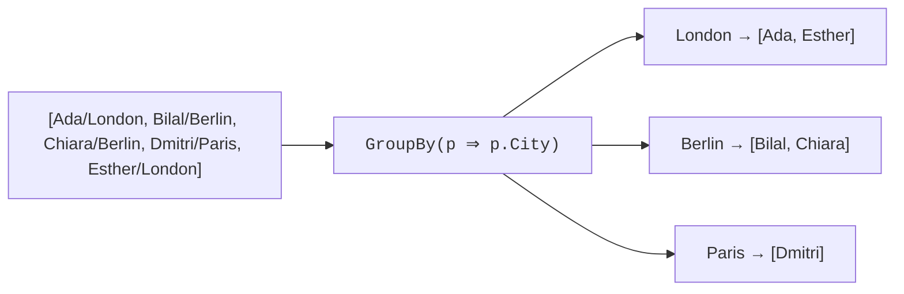

So far our operators preserved the order of the input (`Where`,
`Select`, `SelectMany`). This page is about operators that
*reorganize* the sequence: sort it, or partition it into named
groups.

<Figure
  slug="cs-ordering-and-grouping-cutout"
  alt="Ordering and grouping, an isometric illustration"
/>

## Ordering: `OrderBy`, `OrderByDescending`, `ThenBy`

`OrderBy` produces a new sequence sorted by a *key* that you extract
from each element with a selector lambda.

<CodeBlock
  adapter="csharp"
  files={[
    {
      filename: "main.cs",
      starterCode: `using System;
using System.Linq;

var people = new[] {
    new Person("Ada", 36, "London"),   new Person("Bilal", 41, "Berlin"),  new Person("Chiara", 29, "Berlin"),
    new Person("Dmitri", 52, "Paris"), new Person("Esther", 33, "London"),
};

Console.WriteLine("by age ascending:");
foreach (var p in people.OrderBy(p => p.Age))
    Console.WriteLine($"  {p.Name,-7} {p.Age}");

Console.WriteLine("\\nby name descending:");
foreach (var p in people.OrderByDescending(p => p.Name))
    Console.WriteLine($"  {p.Name,-7} {p.Age}");

record Person(string Name, int Age, string City);
`,
    },
  ]}
/>

A few important details:

- `OrderBy` returns `IOrderedEnumerable<T>`, a special kind of
  enumerable that *remembers* the sort key, so you can layer more
  sorting on top with `ThenBy`.
- It's a **stable sort**: elements with equal keys keep their input
  order.
- It allocates an internal buffer and sorts. It is **not** lazy in
  the same way `Where` is, it has to see all the elements before it
  can produce the first one in sorted order.

### Multiple sort keys with `ThenBy`

When the primary key has ties, `ThenBy` decides them.

<CodeBlock
  adapter="csharp"
  files={[
    {
      filename: "main.cs",
      starterCode: `using System;
using System.Linq;

var people = new[] {
    new Person("Ada", 36, "London"),    new Person("Bilal", 41, "Berlin"),
    new Person("Chiara", 29, "Berlin"), new Person("Dmitri", 52, "Paris"),
    new Person("Esther", 33, "London"), new Person("Farah", 41, "Berlin"), // same age as Bilal
};

// City ascending, then age descending, then name ascending.
var sorted = people.OrderBy(p => p.City).ThenByDescending(p => p.Age).ThenBy(p => p.Name);

foreach (var p in sorted)
    Console.WriteLine($"{p.City,-7} {p.Age,3} {p.Name}");

record Person(string Name, int Age, string City);
`,
    },
  ]}
/>

`ThenBy` is *only* available on `IOrderedEnumerable<T>`, that is,
*after* an `OrderBy`. The compiler will stop you from writing
`xs.ThenBy(...)` without an `OrderBy` first.

### A common mistake: `OrderBy` followed by `OrderBy`

If you write `xs.OrderBy(a).OrderBy(b)`, the second `OrderBy`
**discards** the first one. The result is sorted by `b`, then by `a`
only within tied `b` values, almost always the opposite of what you
wanted. Use `ThenBy` instead.

## Grouping: `GroupBy`

`GroupBy` partitions a sequence into groups by a key. Each group is
itself an `IEnumerable<T>` (plus a `Key` property).

<CodeBlock
  adapter="csharp"
  files={[
    {
      filename: "main.cs",
      starterCode: `using System;
using System.Linq;

var people = new[] {
    new Person("Ada", 36, "London"),   new Person("Bilal", 41, "Berlin"),  new Person("Chiara", 29, "Berlin"),
    new Person("Dmitri", 52, "Paris"), new Person("Esther", 33, "London"),
};

var byCity = people.GroupBy(p => p.City);

foreach (var group in byCity)
{
    Console.WriteLine($"{group.Key} ({group.Count()} people):");
    foreach (var p in group)
        Console.WriteLine($"  - {p.Name}");
}

record Person(string Name, int Age, string City);
`,
    },
  ]}
/>

The result of `GroupBy` is an `IEnumerable<IGrouping<TKey,
TElement>>`. `IGrouping<TKey, TElement>` is *just an `IEnumerable<T>`
that also has a `Key` property*. That's it.

### `GroupBy` with an aggregate

In practice, most of the time you don't iterate the groups, you
project them into summaries.

<CodeBlock
  adapter="csharp"
  files={[
    {
      filename: "main.cs",
      starterCode: `using System;
using System.Linq;

var sales = new[] {
    new Sale("EU", 10m), new Sale("APAC", 15m), new Sale("EU", 30m),
    new Sale("US", 25m), new Sale("EU", 5m),    new Sale("APAC", 20m),
};

var totals = sales.GroupBy(s => s.Region)
                 .Select(g => new { Region = g.Key, Total = g.Sum(s => s.Amount), Count = g.Count() })
                 .OrderByDescending(r => r.Total);

foreach (var r in totals)
    Console.WriteLine($"{r.Region,-5}  total={r.Total,6:C}  ({r.Count} sales)");

record Sale(string Region, decimal Amount);
`,
    },
  ]}
/>

This is one of the most common shapes you'll write in your career:
*group, aggregate, project, sort*. Burn it into muscle memory.

### Grouping by composite keys

The key can be anything, including a tuple or anonymous type.

<CodeBlock
  adapter="csharp"
  files={[
    {
      filename: "main.cs",
      starterCode: `using System;
using System.Linq;

var sales = new[] {
    new Sale("EU", "Widget", 10m),   new Sale("EU", "Widget", 20m),   new Sale("EU", "Gadget", 30m),
    new Sale("APAC", "Widget", 40m), new Sale("APAC", "Gadget", 50m), new Sale("APAC", "Gadget", 60m),
};

var totals = sales.GroupBy(s => new { s.Region, s.Product })
                 .Select(g => new { g.Key.Region, g.Key.Product, Total = g.Sum(s => s.Amount) })
                 .OrderBy(r => r.Region)
                 .ThenBy(r => r.Product);

foreach (var r in totals)
    Console.WriteLine($"{r.Region,-5} {r.Product,-7} {r.Total,6:C}");

record Sale(string Region, string Product, decimal Amount);
`,
    },
  ]}
/>

Anonymous types implement structural equality, so two anonymous
keys with the same field values are treated as equal, exactly what
`GroupBy` needs.

### `GroupBy` vs `ToLookup`

`ToLookup` is the immediate, eagerly-evaluated cousin of `GroupBy`.
It returns a `Lookup<TKey, TElement>` you can index into.

<CodeBlock
  adapter="csharp"
  files={[
    {
      filename: "main.cs",
      starterCode: `using System;
using System.Linq;

var sales = new[] {
    new Sale("EU", 10m), new Sale("APAC", 15m), new Sale("EU", 30m),
    new Sale("US", 25m), new Sale("EU", 5m),    new Sale("APAC", 20m),
};

var lookup = sales.ToLookup(s => s.Region);

// Indexer returns an empty sequence for missing keys, no exception.
Console.WriteLine($"EU count    = {lookup["EU"].Count()}");
Console.WriteLine($"AFRICA count = {lookup["AFRICA"].Count()}");

record Sale(string Region, decimal Amount);
`,
    },
  ]}
/>

When you need to index into groups (especially repeatedly), prefer
`ToLookup`. When you're just iterating once, `GroupBy` is fine.

## A multi-file challenge

<ChallengeCard
  adapter="csharp"
  title="Top region by sales"
  instructions={`Implement \`SalesReport.TopRegion(IEnumerable<Sale> sales)\`
which groups sales by \`Region\`, computes each region's total, and
returns the *name* of the single region with the highest total.

Ties may be broken in any deterministic way (e.g. by region name).

\`Program.cs\` will print the returned region.`}
  entryFilename="Program.cs"
  files={[
    {
      filename: "Program.cs",
      starterCode: `var sales = new[] {
    new Sale("EU", 10m), new Sale("APAC", 15m), new Sale("EU", 30m),
    new Sale("US", 25m), new Sale("EU", 5m),    new Sale("APAC", 20m),
};

System.Console.WriteLine(SalesReport.TopRegion(sales));

public record Sale(string Region, decimal Amount);
`,
    },
    {
      filename: "SalesReport.cs",
      starterCode: `using System.Collections.Generic;

public static class SalesReport
{
    public static string TopRegion(IEnumerable<Sale> sales)
    {
        // your code here
        return "";
    }
}
`,
      solutionCode: `using System.Collections.Generic;
using System.Linq;

public static class SalesReport
{
    public static string TopRegion(IEnumerable<Sale> sales) => sales.GroupBy(s => s.Region)
                                                                   .Select(g => new { Region = g.Key,
                                                                                      Total = g.Sum(s => s.Amount) })
                                                                   .OrderByDescending(r => r.Total)
                                                                   .ThenBy(r => r.Region)
                                                                   .First()
                                                                   .Region;
}
`,
    },
  ]}
  tests={[
    {
      id: "top_region",
      name: "Top region is EU (45)",
      description: "EU=45, APAC=35, US=25",
      expect: { stdoutEquals: "EU" },
    },
  ]}
/>

<MultipleChoice
  markdown={`What does \`xs.OrderBy(x => x.A).OrderBy(x => x.B)\` produce?

- [o] A sequence sorted by B, with ties in B broken by A.
  > The *second* \`OrderBy\` re-sorts everything by B; the first \`OrderBy\`'s ordering survives only within tied B values (because the sort is stable).
- A sequence sorted by A, with ties in A broken by B.
  > That's what \`ThenBy\` does. Two consecutive \`OrderBy\` calls behave differently.
- A sequence in undefined order.
  > The order is well-defined: by B primarily, then by A within equal B's.
- A compile error, because you can't apply \`OrderBy\` twice.
  > It compiles fine, every \`IEnumerable<T>\` has \`OrderBy\` available as an extension. But the *behavior* is usually not what people want.

To sort by multiple keys, you must use \`ThenBy\`/\`ThenByDescending\`
after the first \`OrderBy\`. Stacking \`OrderBy\` calls accidentally
inverts the priorities.`}
/>
