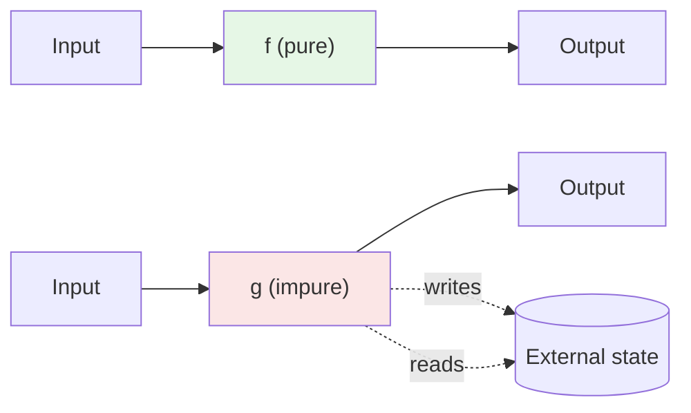
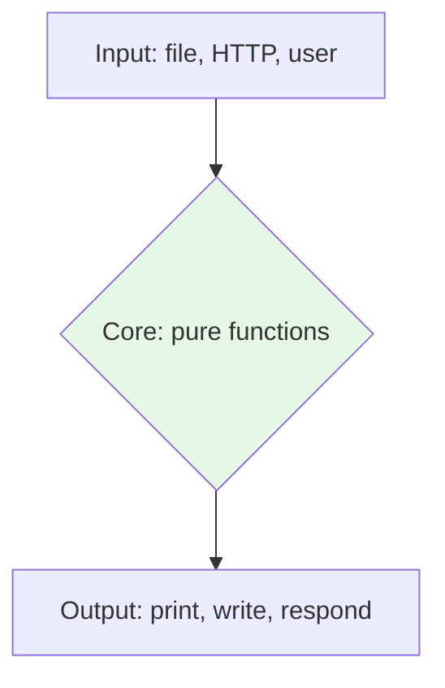

If you remember only one idea from this entire course, make it this
one: **a pure function is a function whose output depends only on its
inputs, and which has no observable side effects.**

<Figure
  slug="cs-pure-functions-cutout"
  alt="Pure functions, an isometric illustration"
/>

That's it. Pure functions are the atom of functional programming.
LINQ, immutability, composition, parallelism, testing, caching,
they all get easier when the building blocks are pure.

## A definition you can hold in your head

A function `f` is **pure** if and only if:

1. **Same input → same output.** Given the same arguments, `f`
   always returns the same value. Forever. Across machines, threads,
   and time of day.
2. **No side effects.** `f` does not write to disk, print, mutate
   shared state, mutate its arguments, throw on the clock, send a
   network request, increment a global counter, read the time, or
   read from a random number generator.

<Figure
  slug="cs-pure-functions-definition-can-hold-inline-cutout"
  alt="A sealed machine with no hoses, wires or taps anywhere on it, one block in and one block out"
  caption="Same inputs, same result, and nothing observed outside changes."
/>

The dashed arrows are what makes `g` impure: it reaches outside the
box.

## Pure vs impure: side by side

<CodeBlock
  adapter="csharp"
  files={[
    {
      filename: "main.cs",
      starterCode: `using System;
using System.Collections.Generic;

// PURE: depends only on x and y, returns a value, touches nothing else.
static int Add(int x, int y) => x + y;

// PURE: builds and returns a new list, never mutates input.
static List<int> Doubled(IEnumerable<int> xs)
{
    var result = new List<int>();
    foreach (var x in xs)
        result.Add(x * 2);
    return result;
}

// IMPURE: reads from "outside", the current time.
static long NowMs() => DateTime.UtcNow.Ticks;

// IMPURE: writes to the console.
static void Greet(string name) => Console.WriteLine($"Hello, {name}");

// IMPURE: mutates the input list, a hidden side effect.
static void AppendOne(List<int> xs) => xs.Add(1);

Console.WriteLine(Add(2, 3));
Console.WriteLine(string.Join(",", Doubled(new[] { 1, 2, 3 })));
Console.WriteLine(NowMs());
Greet("Ada");

var box = new List<int> { 10, 20 };
AppendOne(box);
Console.WriteLine(string.Join(",", box));
`,
    },
  ]}
/>

`Add` and `Doubled` are pure. `NowMs`, `Greet`, and `AppendOne` are
not, and each is impure in a *different* way.

## The four superpowers of pure functions

Pure functions are not just an aesthetic preference. They have
concrete, measurable advantages.

<Figure
  slug="cs-pure-functions-inline-cutout"
  alt="A sealed machine with one input and one output and no pipes, hoses or wires leaving it anywhere, the same block in giving the same block out twice"
  caption="Nothing goes in or out except the argument and the return value."
/>

### 1. They're trivially testable

A pure function's test is just `Assert.Equal(expected,
f(input))`. There's no setup, no mocking, no teardown.

<CodeBlock
  adapter="csharp"
  files={[
    {
      filename: "main.cs",
      starterCode: `using System;

static int Add(int x, int y) => x + y;

// "Tests"
void Check(string label, bool cond) => Console.WriteLine($"{(cond ? "OK  " : "FAIL")} {label}");

Check("0+0=0", Add(0, 0) == 0);
Check("2+3=5", Add(2, 3) == 5);
Check("-1+1=0", Add(-1, 1) == 0);
Check("commutative", Add(3, 4) == Add(4, 3));
`,
    },
  ]}
/>

Contrast with testing an impure method that writes to a database:
you have to spin up a fixture, manage the connection, clean up
between tests, and reason about ordering. Pure tests are free.

### 2. They're safe to run in parallel

Two threads calling a pure function with the same input cannot
interfere, there's nothing shared to interfere with. This is why
`PLINQ` (parallel LINQ) works: the operators are assumed to be pure.

### 3. They're cacheable (memoizable)

`f(x)` always returns the same value, so you can compute it once and
remember it. This is called **memoization**.

<CodeBlock
  adapter="csharp"
  files={[
    {
      filename: "main.cs",
      starterCode: `using System;
using System.Collections.Generic;

static Func<TArg, TRes> Memoize<TArg, TRes>(Func<TArg, TRes> f)
    where TArg : notnull
{
    var cache = new Dictionary<TArg, TRes>();
    return arg => cache.TryGetValue(arg, out var v) ? v : (cache[arg] = f(arg));
}

int callCount = 0;
int Slow(int x)
{
    callCount++;
    return x * x;
}

var fast = Memoize<int, int>(Slow);

Console.WriteLine(fast(5)); // 25, callCount=1
Console.WriteLine(fast(5)); // 25, callCount=1 (cache hit)
Console.WriteLine(fast(6)); // 36, callCount=2
Console.WriteLine($"calls: {callCount}");
`,
    },
  ]}
/>

You can only do this for pure functions. Memoizing an impure
function changes its behavior.

### 4. They're easy to reason about

You can read a pure function top to bottom, and once you understand
it, you understand it *forever*. It doesn't matter who calls it,
when, in what order, or with what state. The function is a
self-contained mathematical mapping.

## Identifying impurity in real code

Most "impurity" in everyday code falls into a small number of
categories. Learn to spot them:

| Pattern | Why it's impure |
| --- | --- |
| `Console.WriteLine(...)` | Writes to stdout |
| `File.ReadAllText(...)` | Reads from disk |
| `DateTime.Now` / `DateTime.UtcNow` | Hidden input (the clock) |
| `Random.Next()` | Hidden input (RNG state) |
| `httpClient.GetAsync(...)` | Network I/O |
| `list.Add(x)` (on a parameter) | Mutates input |
| `static int counter; counter++;` | Mutates global |
| `throw new Exception(...)` on some inputs | Subtle: makes "same input → same output" false |

The last one is interesting. A function that throws for some inputs
is *technically* impure (its output is not a return value for those
inputs), but in practice we tolerate it for argument validation. The
ones above it are the ones that bite.

## "But my program *has* to print things"

Of course. A program that does nothing but compute pure values is
useless. Real programs read input, do I/O, and produce output. The
functional answer is not "no side effects ever". It is:

> **Push side effects to the edges of the program. Keep the core
> pure.**

This is sometimes called the *functional core, imperative shell*
pattern.

In a LINQ pipeline, the *operators* (Where, Select, etc.) are pure.
The materialization at the end (`ToList()`, `foreach`, write to file)
is the impure shell.

## A multi-file challenge

You'll implement two small pure functions and a small impure
"driver" that uses them. The functions are pure; the driver does
I/O. This is the functional-core / imperative-shell pattern in
miniature.

<ChallengeCard
  adapter="csharp"
  title="Pure core, impure shell"
  instructions={`Implement \`MathCore.SumOfSquares(IEnumerable<int> xs)\` and
\`MathCore.MeanOfSquares(IEnumerable<int> xs)\` as **pure** functions
in \`MathCore.cs\`.

- \`SumOfSquares\` returns the sum of the squares of its inputs.
- \`MeanOfSquares\` returns the average of the squares of its inputs,
  or \`0.0\` for an empty input.

Do **not** print, mutate the input, or read external state. The
\`Program.cs\` shell calls them and prints the results.`}
  entryFilename="Program.cs"
  files={[
    {
      filename: "Program.cs",
      starterCode: `var xs = new[] { 1, 2, 3, 4, 5 };
System.Console.WriteLine($"sum={MathCore.SumOfSquares(xs)}");
System.Console.WriteLine($"mean={MathCore.MeanOfSquares(xs)}");
`,
    },
    {
      filename: "MathCore.cs",
      starterCode: `using System.Collections.Generic;

public static class MathCore
{
    public static int SumOfSquares(IEnumerable<int> xs)
    {
        // your code here
        return 0;
    }

    public static double MeanOfSquares(IEnumerable<int> xs)
    {
        // your code here
        return 0.0;
    }
}
`,
      solutionCode: `using System.Collections.Generic;
using System.Linq;

public static class MathCore
{
    public static int SumOfSquares(IEnumerable<int> xs) => xs.Sum(x => x * x);

    public static double MeanOfSquares(IEnumerable<int> xs)
    {
        var squares = xs.Select(x => (double)x * x).ToArray();
        return squares.Length == 0 ? 0.0 : squares.Average();
    }
}
`,
    },
  ]}
  tests={[
    {
      id: "sum_and_mean",
      name: "Prints sum=55 and mean=11",
      description: "1+4+9+16+25=55; mean=55/5=11",
      expect: { stdoutEquals: "sum=55\nmean=11" },
    },
  ]}
/>

<MultipleChoice
  markdown={`Which of these C# methods is **pure**?

- \`static int RollDie() => new Random().Next(1, 7);\`
  > Not pure, it reads from a random number generator (hidden state), so two calls with no arguments can give different results.
- \`static void Add(System.Collections.Generic.List<int> xs, int x) => xs.Add(x);\`
  > Not pure, it mutates its argument and returns void, so it produces effects rather than a value.
- \`static int LogAndReturn(int x) { System.Console.WriteLine(x); return x; }\`
  > Not pure, it has the side effect of writing to standard output, even though the return value depends only on \`x\`.
- [o] \`static int Triple(int x) => x * 3;\`
  > Output depends only on the input, and the method has no side effects.

A pure function must satisfy *both* rules: same inputs → same output,
and no side effects of any kind. The only method here that meets both
is \`Triple\`.`}
/>
