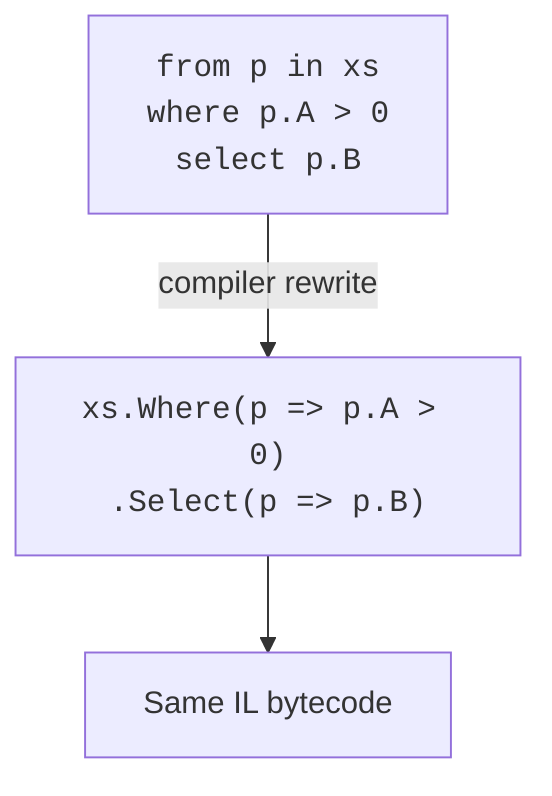

C# offers **two syntactic styles** for writing LINQ. They look very
different, but they compile to the same code and have identical
semantics. Choosing between them is a matter of *readability*.

This page builds an intuition for when each style serves you best —
and shows you what the compiler does behind the scenes so the two
never feel like separate languages.

<svg
  viewBox="0 0 640 220"
  role="img"
  aria-label="Two parallel rails — one of rounded bars, one of chained circles — converge along thin lines on the same yellow diamond station: two syntaxes, one meaning"
  style={{ display: "block", width: "100%", maxWidth: "640px", height: "auto", margin: "2.5rem auto" }}
>
  <g style={{ color: "var(--ds-blue-500)" }} fill="currentColor">
    <rect x="120" y="60" width="90" height="30" rx="15" />
    <rect x="230" y="60" width="110" height="30" rx="15" />
    <rect x="360" y="60" width="80" height="30" rx="15" />
  </g>
  <g
    fill="none"
    stroke="currentColor"
    strokeWidth="2"
    strokeLinecap="round"
    opacity="0.3"
  >
    <path d="M186 160 H 264" />
    <path d="M306 160 H 384" />
    <path d="M444 75 C 472 82, 494 93, 508 102" />
    <path d="M420 160 C 450 152, 478 136, 500 120" />
  </g>
  <g style={{ color: "var(--ds-green-500)" }} fill="currentColor">
    <circle cx="165" cy="160" r="16" />
    <circle cx="285" cy="160" r="16" />
    <circle cx="400" cy="160" r="16" />
  </g>
  <g style={{ color: "var(--ds-yellow-500)" }} fill="currentColor">
    <polygon points="520,82 548,110 520,138 492,110" />
  </g>
</svg>

## A side-by-side tour

The same query, three ways.

<CodeBlock
  adapter="csharp"
  files={[
    {
      filename: "main.cs",
      starterCode: `using System;
using System.Linq;

var people = new[] {
    new { Name = "Ada", Age = 36, City = "London" },
    new { Name = "Linus", Age = 54, City = "Helsinki" },
    new { Name = "Grace", Age = 85, City = "New York" },
    new { Name = "Guido", Age = 67, City = "Amsterdam" },
};

// 1. Method syntax (fluent)
var a = people.Where(p => p.Age > 40).OrderBy(p => p.Name).Select(p => p.Name);

// 2. Query syntax (SQL-like)
var b = from p in people
    where p.Age> 40 orderby p.Name select p.Name;

// 3. Mixed
var c = (from p in people where p.Age > 40 select p)
    .OrderBy(p => p.Name)
    .Select(p => p.Name);

Console.WriteLine(string.Join(", ", a));
Console.WriteLine(string.Join(", ", b));
Console.WriteLine(string.Join(", ", c));
`,
    },
  ]}
/>

All three produce the same result. The compiler treats query syntax
as **syntactic sugar**: it mechanically rewrites it into method
calls.



## The translation rules

Every query clause has a 1-to-1 method counterpart.

| Query clause | Method call |
| --- | --- |
| `from x in xs` | (source) |
| `from y in ys` (second `from`) | `SelectMany` |
| `where p` | `Where(x => p)` |
| `select e` | `Select(x => e)` |
| `orderby k`, `orderby k descending` | `OrderBy` / `OrderByDescending` |
| `orderby k1, k2` | `OrderBy(k1).ThenBy(k2)` |
| `group e by k` | `GroupBy(x => k, x => e)` |
| `join y in ys on a equals b` | `Join` |
| `let v = e` | `Select` into anonymous type |
| `into g` (after group/join) | continues the chain |

Knowing the translation lets you read either dialect fluently.

## When query syntax reads better

Query syntax really *earns its keep* in three scenarios.

### 1. Multiple `from` clauses (cross-product / flattening)

```csharp
var pairs =
    from x in xs
    from y in ys
    where x + y == 10
    select (x, y);
```

The method-syntax equivalent uses `SelectMany` with two lambdas and
is genuinely harder to read:

```csharp
var pairs = xs.SelectMany(x => ys, (x, y) => (x, y))
              .Where(t => t.x + t.y == 10);
```

### 2. `let` bindings

`let` introduces a named intermediate value visible in the rest of
the query.

<CodeBlock
  adapter="csharp"
  files={[
    {
      filename: "main.cs",
      starterCode: `using System;
using System.Linq;

var words = new[] { "functional", "linq", "imperative", "lazy" };

var withLengths = from w in words let len = w.Length
    where len> 4 orderby len descending, w select $"{w} ({len})";

foreach (var line in withLengths)
    Console.WriteLine(line);
`,
    },
  ]}
/>

In method syntax, you'd need a tuple projection just to carry `len`
through the pipeline.

### 3. `join` clauses

```csharp
var labeled =
    from order in orders
    join cust in customers on order.CustomerId equals cust.Id
    select new { order.Id, cust.Name, order.Total };
```

`Join` in method form requires four lambdas and a key selector
dance. Query syntax keeps it visually flat — much closer to SQL.

## When method syntax reads better

Method syntax wins almost everywhere else, particularly when the
query is mostly transformation and aggregation.

```csharp
// method: short and clear
var topRevenue = orders
    .Where(o => o.Status == "completed")
    .Sum(o => o.Total);

// query equivalent is awkward — query syntax cannot end with Sum
var topRevenue2 = (
    from o in orders
    where o.Status == "completed"
    select o.Total
).Sum();
```

Method syntax also wins when you need operators that have no query
keyword: `Take`, `Skip`, `Distinct`, `Count`, `First`, `Aggregate`,
`Zip`, `Concat`, `Reverse`, `Chunk`, and many more.

| Use query syntax when | Use method syntax when |
| --- | --- |
| Multiple `from` / cross joins | Mostly `Where` + `Select` pipelines |
| `let` bindings carry state forward | You need operators query syntax lacks |
| Visually similar to SQL | The query ends with an aggregation |

## What the compiler actually does

Let's see a non-trivial example translated by hand.

```csharp
// query
var q =
    from c in customers
    from o in c.Orders
    where o.Total > 100
    let tax = o.Total * 0.08m
    orderby c.Name
    select new { c.Name, o.Id, tax };
```

The compiler rewrites this in stages:

1. Two `from`s → `SelectMany` with a "carry" tuple.
2. `where` → `Where`.
3. `let` → `Select` that adds `tax` to the carry.
4. `orderby` → `OrderBy`.
5. Final `select` → `Select` projecting only the wanted fields.

The result is a long, deeply-nested method chain. *Nobody writes
that by hand*. Which is exactly the point: query syntax is the
ergonomics layer on top.

## Practice: rewrite both ways

<ChallengeCard
  adapter="csharp"
  title="Rewrite both ways"
  instructions={`Implement **both** \`QueryStyle\` and \`MethodStyle\` so they produce the **same output in the same order**.

Each should return, one per line, the authors whose books total **more than 1500 pages**, **ordered by author name**, formatted as \`"Name: totalPages"\`.

Write \`QueryStyle\` using **query syntax** (the SQL-like \`from … where … select\` form) and \`MethodStyle\` using **method syntax** (the fluent \`.GroupBy().Where()…\` chain). Edit \`QueryStyle.cs\` and \`MethodStyle.cs\` — \`Program.cs\` is already wired up.`}
  entryFilename="Program.cs"
  files={[
    {
      filename: "Program.cs",
      starterCode: `using System;
using System.Linq;

var books = new[] {
    new Book("Knuth", "TAOCP V1", 650), new Book("Knuth", "TAOCP V2", 700),
    new Book("Knuth", "TAOCP V3", 800), new Book("Skiena", "Algo Design Manual", 730),
    new Book("Cormen", "CLRS", 1300),   new Book("Sedgewick", "Algorithms", 950),
};

Console.WriteLine("-- query --");
foreach (var line in QueryStyle.Run(books))
    Console.WriteLine(line);
Console.WriteLine("-- method --");
foreach (var line in MethodStyle.Run(books))
    Console.WriteLine(line);

public record Book(string Author, string Title, int Pages);
`,
      solutionCode: `using System;
using System.Linq;

var books = new[] {
    new Book("Knuth", "TAOCP V1", 650), new Book("Knuth", "TAOCP V2", 700),
    new Book("Knuth", "TAOCP V3", 800), new Book("Skiena", "Algo Design Manual", 730),
    new Book("Cormen", "CLRS", 1300),   new Book("Sedgewick", "Algorithms", 950),
};

Console.WriteLine("-- query --");
foreach (var line in QueryStyle.Run(books))
    Console.WriteLine(line);
Console.WriteLine("-- method --");
foreach (var line in MethodStyle.Run(books))
    Console.WriteLine(line);

public record Book(string Author, string Title, int Pages);
`,
    },
    {
      filename: "QueryStyle.cs",
      starterCode: `using System.Collections.Generic;
using System.Linq;

public static class QueryStyle
{
    public static IEnumerable<string> Run(IEnumerable<Book> books)
    {
        // TODO: rewrite this in QUERY syntax
        return System.Linq.Enumerable.Empty<string>();
    }
}
`,
      solutionCode: `using System.Collections.Generic;
using System.Linq;

public static class QueryStyle
{
    public static IEnumerable<string> Run(IEnumerable<Book> books) =>
        from b in books group b by b.Author into g let total = g.Sum(x => x.Pages)
        where total> 1500 orderby g.Key select $"{g.Key}: {total}";
}
`,
    },
    {
      filename: "MethodStyle.cs",
      starterCode: `using System.Collections.Generic;
using System.Linq;

public static class MethodStyle
{
    public static IEnumerable<string> Run(IEnumerable<Book> books)
    {
        // TODO: rewrite this in METHOD syntax
        return System.Linq.Enumerable.Empty<string>();
    }
}
`,
      solutionCode: `using System.Collections.Generic;
using System.Linq;

public static class MethodStyle
{
    public static IEnumerable<string> Run(IEnumerable<Book> books) =>
        books.GroupBy(b => b.Author)
            .Select(g => new { Author = g.Key, Total = g.Sum(x => x.Pages) })
            .Where(x => x.Total > 1500)
            .OrderBy(x => x.Author)
            .Select(x => $"{x.Author}: {x.Total}");
}
`,
    },
  ]}
  tests={[
    {
      id: "both-styles-equal",
      name: "Both styles produce identical, correct output",
      description: "Author totals over 1500, ordered by author name",
      expect: {
        stdoutEquals: "-- query --\nKnuth: 2150\n-- method --\nKnuth: 2150\n",
      },
    },
  ]}
/>

Both pipelines should now produce the same single line — `Knuth: 2150` —
because Knuth's three volumes (650 + 700 + 800 = 2150) are the only
author group whose total page count exceeds the `1500` threshold.

## A guiding heuristic

> If your query has *multiple sequences*, `let`, or `join`, reach
> for query syntax. Otherwise, prefer method syntax.

There is no winner. They are the same LINQ. Pick whichever makes the
*reader* understand the intent fastest.

<MultipleChoice
  markdown={`Which statement about query vs. method syntax is correct?

- Query syntax can express things method syntax cannot.
  > Untrue. Query syntax is purely syntactic sugar that rewrites to method calls. Anything expressible in query syntax is expressible (sometimes more verbosely) in method syntax.
- Method syntax is faster at runtime because it skips the compiler rewrite step.
  > The rewrite happens at compile time. By runtime, both produce identical IL and identical performance.
- Query syntax always reads better when more than one operator is involved.
  > Often false. Short pipelines (\`Where\` + \`Select\` + \`Sum\`) usually read better in method syntax. Query syntax shines specifically for multiple \`from\`s, \`let\`, and \`join\`.
- [o] They compile to identical method calls; the choice between them is purely about readability.
  > Query syntax is a *sugar* over the same extension methods. Pick whichever conveys intent more clearly for a given query.

This is the right mental model: there is one LINQ, with two faces.`}
/>
