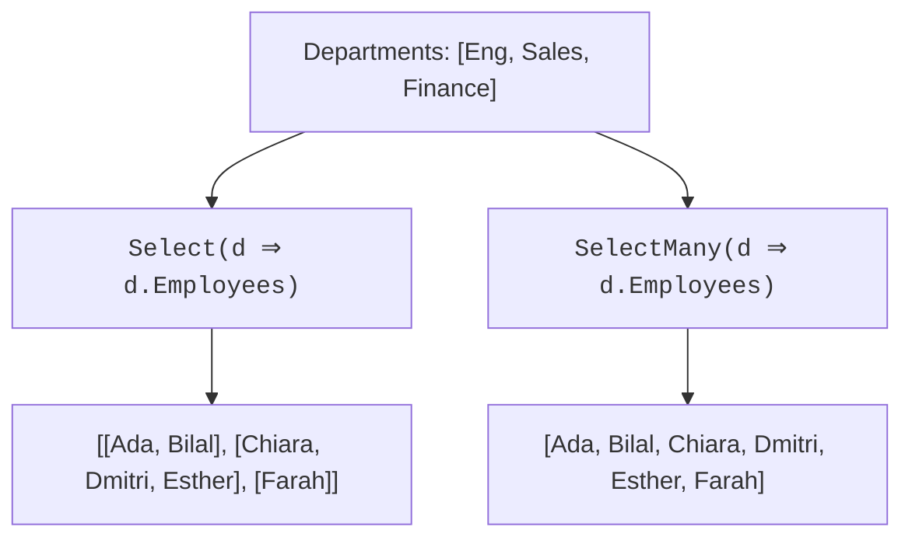

`Select` projects each element to *one* thing. `SelectMany` projects
each element to a *sequence* of things, and then flattens the result
into one sequence. It is the answer to a question that comes up
constantly in real data:

<Figure
  slug="cs-selectmany-flattening-cutout"
  alt="SelectMany and flattening, an isometric illustration"
/>

> *"I have a list of things, each of which has a list inside it.
> How do I get one flat list out?"*

That question is everywhere, orders with line items, blog posts
with tags, departments with employees, files with lines, paragraphs
with words. `SelectMany` is the right tool every single time.

## The problem with `Select` alone

Suppose each `Department` has a list of `Employee` objects, and you
want one flat list of all employees in the company.

<Figure
  slug="cs-selectmany-and-flattening-inline-cutout"
  alt="Three small boxes each holding three blocks, tipped out in turn onto one long rail so the blocks lie in a single line"
/>

<CodeBlock
  adapter="csharp"
  files={[
    {
      filename: "main.cs",
      starterCode: `using System;
using System.Collections.Generic;
using System.Linq;

var company = new[] {
    new Department("Eng", new List<Employee> { new("Ada"), new("Bilal") }),
    new Department("Sales", new List<Employee> { new("Chiara"), new("Dmitri"), new("Esther") }),
    new Department("Finance", new List<Employee> { new("Farah") }),
};

// Wrong: with Select we get IEnumerable<List<Employee>>, a sequence of sequences.
var nested = company.Select(d => d.Employees);
Console.WriteLine($"nested type: {nested.GetType().Name}");
Console.WriteLine($"nested has {nested.Count()} elements (not 6!)");

foreach (var group in nested)
    Console.WriteLine($"  group of {group.Count}");

record Employee(string Name);
record Department(string Name, List<Employee> Employees);
`,
    },
  ]}
/>

`Select` gave us a sequence of *three* groups, not six employees. We
need to flatten.

## Enter `SelectMany`

<CodeBlock
  adapter="csharp"
  files={[
    {
      filename: "main.cs",
      starterCode: `using System;
using System.Collections.Generic;
using System.Linq;

var company = new[] {
    new Department("Eng", new List<Employee> { new("Ada"), new("Bilal") }),
    new Department("Sales", new List<Employee> { new("Chiara"), new("Dmitri"), new("Esther") }),
    new Department("Finance", new List<Employee> { new("Farah") }),
};

// Right: SelectMany flattens.
var allEmployees = company.SelectMany(d => d.Employees);

foreach (var e in allEmployees)
    Console.WriteLine(e.Name);

record Employee(string Name);
record Department(string Name, List<Employee> Employees);
`,
    },
  ]}
/>

The output is six lines, one employee per line. `SelectMany`
visited each department, asked for its `Employees` list, and merged
them all into a single sequence.

## Visual mental model

The picture is *exactly* the difference. Same input, same lambda,
different operator, different shape of result.

## Keeping the parent context

Flattening multiplies rows, which is fine until something downstream sums
a value from the parent side:

<Chart slug="join-fanout-rows" />

A subtle and common case: you want to flatten, *but you also want to
know which parent each child came from*. `SelectMany` has a two-arg
overload for exactly this.

<CodeBlock
  adapter="csharp"
  files={[
    {
      filename: "main.cs",
      starterCode: `using System;
using System.Collections.Generic;
using System.Linq;

var company = new[] {
    new Department("Eng", new List<Employee> { new("Ada"), new("Bilal") }),
    new Department("Sales", new List<Employee> { new("Chiara"), new("Dmitri") }),
};

// The collectionSelector picks the inner sequence; the resultSelector
// builds a result that has access to BOTH parent and child.
var pairs = company.SelectMany(d => d.Employees, // for each department, take its employees
                               (d, e) => new { Dept = d.Name, Emp = e.Name });

foreach (var p in pairs)
    Console.WriteLine($"{p.Emp,-7} ({p.Dept})");

record Employee(string Name);
record Department(string Name, List<Employee> Employees);
`,
    },
  ]}
/>

This is the LINQ equivalent of a SQL `JOIN` between a parent table
and its rows. We will see the same shape again with `Join` and
`GroupJoin` later, but `SelectMany` covers the common case more
naturally.

## Splitting strings, words, characters

`SelectMany` is also the right operator for flattening strings or
arrays.

<CodeBlock
  adapter="csharp"
  files={[
    {
      filename: "main.cs",
      starterCode: `using System;
using System.Linq;

var sentences = new[] {
    "the quick brown fox",
    "jumps over the lazy dog",
    "and runs away",
};

// All words across all sentences.
var words = sentences.SelectMany(s => s.Split(' '));

Console.WriteLine($"total words: {words.Count()}");
Console.WriteLine(string.Join(" | ", words));

// All distinct characters used.
var chars = sentences.SelectMany(s => s).Distinct().OrderBy(c => c);
Console.WriteLine($"chars: {string.Join("", chars)}");
`,
    },
  ]}
/>

Notice that `SelectMany(s => s)` works on strings because `string`
implements `IEnumerable<char>`. Strings *are* sequences of chars in
.NET.

## Multiple-level flattening

For deeply nested structures, you chain `SelectMany` calls.

<CodeBlock
  adapter="csharp"
  files={[
    {
      filename: "main.cs",
      starterCode: `using System;
using System.Collections.Generic;
using System.Linq;

var customers = new[] {
    new Customer("Ada",
                 new List<Order> {
                     new(1, new List<string> { "rush", "vip" }),
                     new(2, new List<string> { "vip" }),
                 }),
    new Customer("Bilal",
                 new List<Order> {
                     new(3, new List<string> { "rush" }),
                 }),
};

// Every tag from every order from every customer, deduplicated.
var allTags = customers.SelectMany(c => c.Orders).SelectMany(o => o.Tags).Distinct().OrderBy(t => t);

Console.WriteLine(string.Join(", ", allTags));

record Order(int Id, List<string> Tags);
record Customer(string Name, List<Order> Orders);
`,
    },
  ]}
/>

Each `SelectMany` peels off one level of nesting. Two levels of
nesting → two `SelectMany` calls. Three levels → three. Simple.

## The functional ancestry

In Haskell and Scala, this operator is called `flatMap`. In
JavaScript, arrays have a `.flatMap()` method that does the same
thing. In LINQ it's `SelectMany`. The idea is the same in all
languages: **map each thing to a sequence, then flatten by one
level**.

This operation has a deeper mathematical structure (it's the "bind"
operation of a monad), but you don't need that vocabulary to use it
well. You only need to recognize the shape: *I have nested data, I
want it flat, the next step needs each leaf paired with its parent.*

## A multi-file challenge

<ChallengeCard
  adapter="csharp"
  title="Flatten and tag"
  instructions={`Implement \`Reports.FlattenOrders\` so that, given a list of
\`Customer\` records (each with a list of \`Order\` records), it
returns a flat \`IEnumerable<string>\` of the form
\`"{customerName}:{orderId}"\` for every order of every customer.

Example: a customer "Ada" with orders [1, 2] should yield
\`"Ada:1"\` and \`"Ada:2"\`.

Order: customers in input order, orders in input order within each
customer.

Use \`SelectMany\` with the two-argument overload.`}
  entryFilename="Program.cs"
  files={[
    {
      filename: "Program.cs",
      starterCode: `var customers = new[] {
    new Customer("Ada", new[] { new Order(1), new Order(2) }),
    new Customer("Bilal", new[] { new Order(3) }),
    new Customer("Chiara", new[] { new Order(4), new Order(5), new Order(6) }),
};

foreach (var line in Reports.FlattenOrders(customers))
    System.Console.WriteLine(line);

public record Order(int Id);
public record Customer(string Name, Order[] Orders);
`,
    },
    {
      filename: "Reports.cs",
      starterCode: `using System.Collections.Generic;

public static class Reports
{
    public static IEnumerable<string> FlattenOrders(IEnumerable<Customer> customers)
    {
        // your code here, use SelectMany with a result selector
        return new string[0];
    }
}
`,
      solutionCode: `using System.Collections.Generic;
using System.Linq;

public static class Reports
{
    public static IEnumerable<string> FlattenOrders(IEnumerable<Customer> customers) =>
        customers.SelectMany(c => c.Orders, (c, o) => $"{c.Name}:{o.Id}");
}
`,
    },
  ]}
  tests={[
    {
      id: "flatten",
      name: "Flattens 6 customer:order pairs",
      description: "Ada has 2, Bilal 1, Chiara 3, total 6 lines",
      expect: { stdoutEquals: "Ada:1\nAda:2\nBilal:3\nChiara:4\nChiara:5\nChiara:6" },
    },
  ]}
/>

<MultipleChoice
  markdown={`Which scenario calls for \`SelectMany\` rather than \`Select\`?

- Counting how many items are in a list.
  > That's an aggregation; \`Count()\` or \`Length\` is the right tool.
- [o] Producing a flat list of every tag across every blog post in a list of posts.
  > Each post has *many* tags, and you want one flat sequence. That's exactly the flattening that \`SelectMany\` performs.
- Filtering a list of orders to only those with \`Total > 100\`.
  > That's a filter, not a flattening, \`Where\` is the right operator.
- Doubling every element of an \`int[]\`.
  > That's a one-to-one transformation, so \`Select\` is the right operator. No nesting is involved.

The rule of thumb: if your lambda returns a single value per element,
use \`Select\`. If it returns a *sequence* per element and you want
one flat sequence at the end, use \`SelectMany\`.`}
/>
