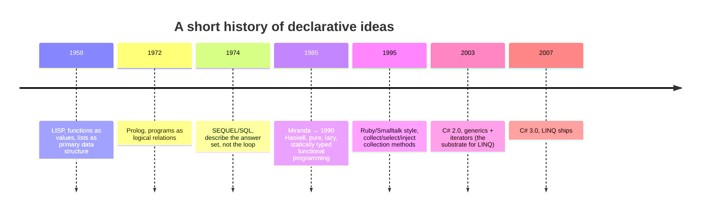
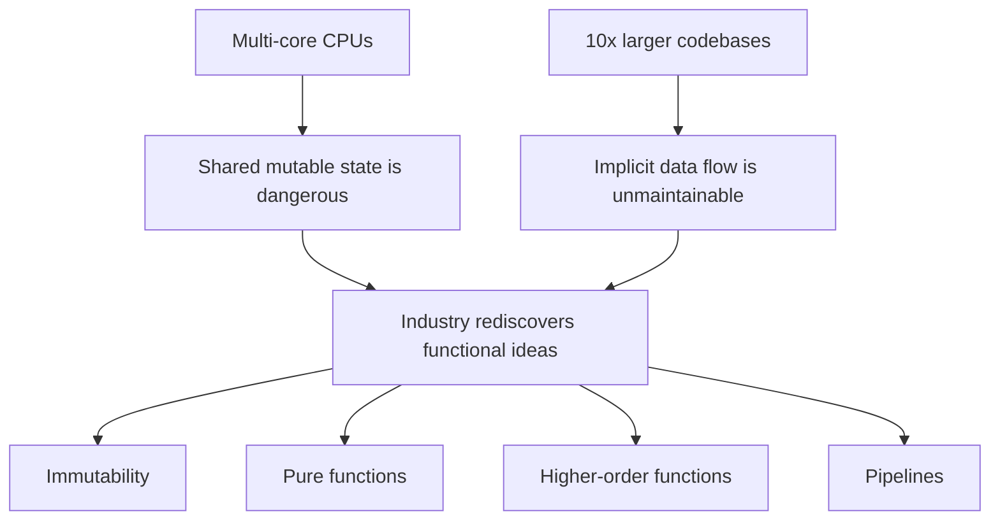

This optional discussion is for readers who finished the course and
want the longer story. The course's opening chapter compressed fifty
years of history into a few paragraphs; here we slow down and give
the ideas their due. Nothing below is required to use LINQ well,
but it explains why the patterns you just learned appear, in nearly
identical form, in every modern language.

<Figure
  slug="cs-why-declarative-won-cutout"
  alt="Half a century of declarative ideas, an isometric illustration"
/>

## The lineage

By the time C# 3.0 shipped in 2007, the idea of *describing results
instead of steps* had been brewing for half a century.

<Figure
  slug="cs-why-declarative-won-lineage-inline-cutout"
  alt="A long hand-built conveyor of many small parts beside one short instruction card doing the same job"
  caption="The same query is a page of machinery or one line, depending on the language."
/>



Each step contributed something specific that you can still point to
in a LINQ pipeline today:

- **LISP** (1958) showed that you can treat functions as ordinary
  values you pass around. That is the engine behind every
  `.Where(predicate)` you will ever write. Lisp programmers were
  mapping and filtering lists with passed-in functions while
  mainstream programmers were still numbering their FORTRAN
  statements.
- **Prolog** (1972) pushed the idea to its extreme: a program is a
  set of logical facts and rules, and the runtime *searches* for
  answers. It never went mainstream, but it proved that "describe,
  don't instruct" could be an entire language.
- **SQL** (mid-1970s, originally called SEQUEL at IBM) was the
  breakthrough that mattered commercially. It showed that ordinary
  working programmers, not just researchers, will happily write
  declarative queries when the syntax is friendly. Hundreds of
  thousands of people who would never touch a research language
  wrote `SELECT ... WHERE ... GROUP BY` every day for decades. LINQ's
  query syntax is a direct homage.
- **Haskell** (1990) showed that an *entire program* can be built
  out of composed pure functions, with laziness as a first-class
  concept, the same laziness you met in this course as deferred
  execution.
- **Smalltalk and Ruby** popularized collection methods like
  `select`, `collect`, and `inject` that take blocks of code as
  arguments, recognizably `Where()`, `Select()`, and `Aggregate()` with
  different names.

Functional programming was never a fringe idea, in other words. It
was a parallel tradition with its own languages and its own
literature, waiting for the mainstream to develop the problems it
had already solved.

## The free lunch ends

So why did the mainstream suddenly start borrowing in the 2000s?
Two pressures arrived at almost the same time.

The first was hardware. For decades, programmers enjoyed what Herb
Sutter, chair of the ISO C++ committee, memorably called the
"free lunch": you wrote your program, waited a year, and the next
generation of CPUs simply ran it faster. In a famous 2005 article,
"The Free Lunch Is Over", Sutter pointed out that single-core clock
speeds had hit a wall; the transistors kept coming, but they were
being spent on *more cores*, not faster ones. From now on, programs
that wanted to get faster would have to run on many cores at once,
and the biggest obstacle to running code on many cores is **shared
mutable state**. Two threads mutating the same object need locks,
and locks breed deadlocks, races, and heisenbugs. Immutable data
needs none of that: a value that cannot change can be read by any
number of threads, forever, safely.

The second pressure was scale. Smartphones, the cloud, and
software-as-a-service meant teams of dozens working on
million-line codebases. The imperative pain points from the
course's opening chapter, mutable state, nesting, copy-paste
drift, stopped being theoretical annoyances and started costing
real money.



Functional programming had spent forty years answering exactly
these problems. The mainstream languages started borrowing the
answers, each in its own accent: Java got streams and lambdas
(2014), JavaScript got arrow functions and a functional standard
library culture, Python leaned harder on comprehensions, C++ got
lambdas and a ranges library, Swift and Kotlin and Rust were
*designed* with the functional toolkit built in. C#, thanks to
LINQ, got there earlier than most.

## The same pipeline, everywhere

A useful way to see the convergence: here is the same query, even
numbers, squared, summed, as you would write it in four languages.

```csharp
// C#
nums.Where(n => n % 2 == 0).Select(n => n * n).Sum()
```

```java
// Java (streams, 2014)
nums.stream().filter(n -> n % 2 == 0).mapToInt(n -> n * n).sum()
```

```javascript
// JavaScript
nums.filter(n => n % 2 === 0).map(n => n * n).reduce((a, b) => a + b, 0)
```

```rust
// Rust
nums.iter().filter(|n| *n % 2 == 0).map(|n| n * n).sum()
```

Four ecosystems, four syntaxes, one idea: a lazy (or lazy-ish)
pipeline of higher-order operators over a sequence. If you ever
switch languages, this part of your C# knowledge travels with you
intact, only the spelling changes.

## And run it once more, for old times' sake

<CodeBlock
  adapter="csharp"
  files={[
    {
      filename: "main.cs",
      starterCode: `using System;
using System.Linq;

var nums = Enumerable.Range(1, 10);

// Fifty years of language design, one line of code.
Console.WriteLine(nums.Where(n => n % 2 == 0).Select(n => n * n).Sum());
`,
    },
  ]}
/>

That `220` is carrying a lot of history: Lisp's functions-as-values,
SQL's describe-the-answer, Haskell's laziness, and a 2005 hardware
crisis, all compiled by Roslyn and executed in your browser tab.

<Figure
  slug="cs-why-declarative-won-inline-cutout"
  alt="A long hand-built conveyor of many small parts on one bench, and a short clear instruction card doing the same job on the next"
  caption="Describing the answer instead of the steps is what LINQ inherited."
/>

<MultipleChoice
  markdown={`What is the defining characteristic of **declarative** code, as discussed on this page?

- It runs faster than imperative code.
  > Declarative code can be faster or slower, depending on the runtime. Performance is not the defining trait.
- It must be written in a functional programming language.
  > Declarative styles exist in many paradigms, including SQL (relational), HTML (markup), and LINQ inside an OO language.
- [o] It describes *what* result is wanted and leaves *how* to compute it to the runtime or library.
  > Declarative code expresses the desired result; an imperative program describes the precise sequence of state changes to reach it.
- It uses fewer lines of code than imperative code.
  > Conciseness is often a side effect, but it is not the definition. A long declarative program is still declarative.

Declarative programming is a question of *what the code says*, not a
question of which language it's written in. SQL inside C#, LINQ inside
C#, and even CSS inside HTML are all declarative.`}
/>
