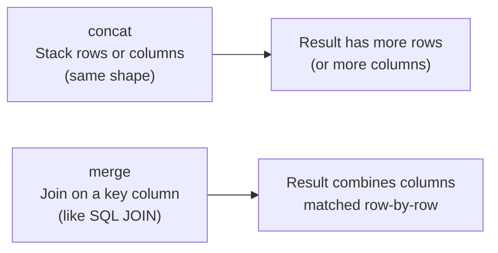

Two datasets rarely live alone. You'll often need to combine
them. Pandas offers two core tools, and beginners often confuse
them.

<Figure
  slug="pandas-concat-vs-merge-cutout"
  alt="Concat vs merge, an isometric illustration"
/>

## The mental model

- **concat** = glue tables together by position. No matching
  happens. "Here are three months of sales, stack them into
  one DataFrame."
- **merge** = bring columns from another table by matching a
  key. "For each employee, look up their department from the
  departments table."

<Figure
  slug="pandas-concat-vs-merge-inline-cutout"
  alt="Two boards stacked one directly under the other on the left, and on the right two boards joined edge to edge through a shared column of notches"
  caption="`concat()` stacks tables by position; `merge()` joins them by matching a key."
/>

## Concat, when shapes match

<CodeBlock
  adapter="python"
  files={[
    {
      filename: "main.py",
      starterCode: `import pandas as pd

jan = pd.DataFrame({"date": ["2024-01-15", "2024-01-20"], "sales": [100, 150]})
feb = pd.DataFrame({"date": ["2024-02-05", "2024-02-18"], "sales": [200, 175]})
mar = pd.DataFrame({"date": ["2024-03-02", "2024-03-25"], "sales": [225, 300]})

q1 = pd.concat([jan, feb, mar], ignore_index=True)
display(q1)
`,
    },
  ]}
/>

`ignore_index=True` resets the integer index so it runs 0, 1, 2,
... instead of repeating each month's 0, 1.

<Figure
  slug="pandas-concat-vs-merge-concat-shapes-match-inline-cutout"
  alt="Two boards of identical width stacked one directly onto the other so their columns line up into one taller board"
  caption="Concat only lines up cleanly when both frames carry the same columns."
/>

You can also concat horizontally:

<CodeBlock
  adapter="python"
  files={[
    {
      filename: "main.py",
      starterCode: `import pandas as pd

ids = pd.DataFrame({"id": [1, 2, 3]})
names = pd.DataFrame({"name": ["Aiko", "Bilal", "Chen"]})

side_by_side = pd.concat([ids, names], axis=1)
display(side_by_side)
`,
    },
  ]}
/>

Horizontal concat is fast but **fragile**, it lines rows up by
*position*, not by any key. If the two frames were sorted
differently, you'd silently mis-pair people with names. Prefer
`merge()` whenever a real key exists.

## Merge, joining on a key

<CodeBlock
  adapter="python"
  files={[
    {
      filename: "main.py",
      starterCode: `import pandas as pd

employees = pd.DataFrame(
    {
        "emp_id": [1, 2, 3, 4],
        "name": ["Aiko", "Bilal", "Chen", "Diego"],
        "dept_id": [10, 20, 10, 30],
    }
)

departments = pd.DataFrame(
    {
        "dept_id": [10, 20, 30],
        "dept_name": ["Engineering", "Sales", "Marketing"],
    }
)

joined = employees.merge(departments, on="dept_id")
display(joined)
`,
    },
  ]}
/>

The result has every employee's row, with `dept_name` filled in
from the other table by matching `dept_id`.

<Figure
  slug="pandas-concat-vs-merge-merge-joining-on-inline-cutout"
  alt="Two boards drawn together by a shared column of notches, matching notches interlocking"
  caption="Merge pairs rows by the key they share, wherever they sit in each table."
/>

## A side-by-side example

<CodeBlock
  adapter="python"
  files={[
    {
      filename: "main.py",
      starterCode: `import pandas as pd

# Two months of orders, concat them
m1 = pd.DataFrame({"order_id": [1, 2], "customer_id": [10, 11], "amount": [50, 75]})
m2 = pd.DataFrame({"order_id": [3, 4], "customer_id": [10, 12], "amount": [40, 90]})

all_orders = pd.concat([m1, m2], ignore_index=True)
print("After concat:")
display(all_orders)
print()

# A customer lookup table, merge it in
customers = pd.DataFrame(
    {
        "customer_id": [10, 11, 12],
        "name": ["Aiko", "Bilal", "Chen"],
    }
)

enriched = all_orders.merge(customers, on="customer_id")
print("After merge:")
display(enriched)
`,
    },
  ]}
/>

Notice the natural workflow: **concat** first (stack the raw
data sources), then **merge** in lookup tables to enrich.

## When to use which

| Situation | Tool |
| --- | --- |
| Same columns, different time periods | concat (axis=0) |
| Same rows in same order, more columns to add | concat (axis=1), but prefer merge if there's a key |
| Same row entities, columns from another table by key | **merge** |
| Combining 12 monthly files into one yearly file | concat |
| Adding customer details to each order | merge |

## A common trap: misaligned indexes in concat

<CodeBlock
  adapter="python"
  files={[
    {
      filename: "main.py",
      starterCode: `import pandas as pd

a = pd.DataFrame({"x": [1, 2, 3]}, index=[0, 1, 2])
b = pd.DataFrame({"y": [10, 20, 30]}, index=[5, 6, 7])  # different index!

print("axis=1 concat (aligns by INDEX):")
display(pd.concat([a, b], axis=1))
`,
    },
  ]}
/>

You get NaNs because the indexes don't overlap. Either reset
indexes first or use `merge()` with an explicit key.

## Check your understanding

<MultipleChoice
  markdown={`You have twelve CSV files, one per month, each with the same columns. What's the right tool to combine them into one DataFrame?

- merge
  > Merge joins tables by matching a key column; stacking twelve files with identical columns needs \`concat()\`, not a key-based join.
- join
  > \`DataFrame.join()\` is an index-based merge operation; it requires a matching index, not a simple stack of rows with the same shape.
- [o] concat with \`axis=0\` (stack rows) and \`ignore_index=True\`
  > Same shape, no key, stacking is the right operation.
- pivot
  > Pivot reshapes an existing table from long to wide form; it does not combine separate files.

This is the canonical concat use case.`}
/>

<MultipleChoice
  markdown={`You have an \`orders\` table with a \`customer_id\` column, and a separate \`customers\` table you want to look up the customer's name from. Which is correct?

- groupby
  > \`groupby()\` aggregates rows within a single table; it cannot bring columns from a separate lookup table.
- concat axis=0
  > \`concat()\` with \`axis=0\` stacks rows from tables with the same columns; it cannot look up a name from a separate table by matching an ID column.
- concat axis=1
  > \`concat()\` with \`axis=1\` joins by position, not by key, if the two tables are in different orders, rows would be silently mismatched.
- [o] \`orders.merge(customers, on="customer_id")\`
  > Merge matches rows by the shared key, exactly what's needed for lookups.

Whenever a *key* relates the two tables, merge.`}
/>

<MultipleChoice
  markdown={`Why is horizontal \`pd.concat([a, b], axis=1)\` considered risky?

- It does not work with strings
  > String columns are fully supported by \`concat()\`; the risk is incorrect row pairing, not a type restriction.
- [o] It pairs rows by index/position rather than by a key, easy to silently mis-align rows if the two frames are in different orders
  > Even if it works today, a future sort or reset on one frame breaks the pairing. Use merge when you have an ID.
- It is slow
  > Horizontal \`concat()\` is not meaningfully slower than merge for typical datasets; the concern is correctness, not performance.
- It is deprecated
  > Horizontal \`pd.concat()\` is not deprecated; it is a supported operation with a well-understood (but potentially dangerous) alignment behavior.

Position-based joins are dangerous in any data tool, not just Pandas.`}
/>
