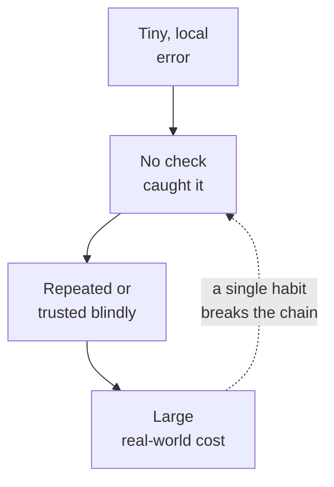

This is an optional digression, the kind of thing you can enjoy now
that you have spent a course thinking carefully about data. Every
story here is true and well-documented, and every one of them traces
a multi-million-dollar (or multi-spacecraft) failure back to a
mistake that would fit in a single cell of a spreadsheet. They are
worth knowing not as trivia but because each one corresponds to a
habit this course tried to build in you.

<Callout type="info" title="Why dwell on disasters?">
Errors are the cheapest teacher when they happen to *someone else*.
A working analyst carries a small museum of cautionary tales and
reaches for the relevant one — "wait, is this the Mars Orbiter
situation?" — at exactly the moment it can save them.
</Callout>

## The Vancouver Stock Exchange index that melted (1982)

When the Vancouver Stock Exchange launched a new index in 1982, it
started, as indices do, at a round 1000.00 points. Over the next 22
months the market broadly rose — and yet the index drifted
steadily *downward*, reaching about 520. The exchange was, by its
own published number, losing nearly half its value while the
underlying stocks gained.

The culprit was rounding. The index was recalculated thousands of
times a day, and each recalculation **truncated** the result to
three decimals instead of rounding it. Truncation always throws
the fraction away in the same direction, so the tiny downward bias
did not cancel out — it *accumulated*, recalculation after
recalculation, into a gap of hundreds of points. When the error was
found and corrected, the index roughly doubled overnight back to
where it should have been.

**The habit:** know how your numbers are rounded, and never assume
a small per-operation error is harmless. Repeated millions of
times, "small" becomes "catastrophic." (We meet the same lesson in
miniature whenever floating-point arithmetic surprises us.)

## The Mars Climate Orbiter and the missing unit (1999)

<IllustrationPrompt subject="the Mars Climate Orbiter spacecraft approaching Mars" />

NASA's Mars Climate Orbiter, a spacecraft that cost roughly $327
million, reached Mars in September 1999 and was never heard from
again. The investigation found a heartbreakingly simple cause: one
piece of ground software produced a thrust figure in **pound-force
seconds** (imperial units), while the spacecraft's navigation
software expected **newton-seconds** (metric). Nobody converted
between them. The numbers were not *wrong* — they were unitless, and
the two teams quietly assumed different units. The orbiter came in
too low and was destroyed by the Martian atmosphere.

**The habit:** a number without a unit is not data, it is a rumor.
When you name a column, the unit belongs in the name or the
documentation — `mass_g`, `price_usd`, `distance_km`. The Palmer
Penguins dataset you have been using does this well: it is
`body_mass_g` and `flipper_length_mm`, never just `mass` and
`length`.

## Excel turns genes into dates (and keeps doing it)

Here is a disaster still happening today. Excel, trying to be
helpful, auto-converts text that *looks* like a date into an actual
date. Several human gene symbols look exactly like dates — the gene
`SEPT2` becomes "2-Sep," `MARCH1` becomes "1-Mar," and so on. A
2016 study found this corruption in roughly **one in five** genetics
papers with Excel supplementary files. The problem was so
persistent and so hard to stamp out that in 2020 the body that names
human genes officially **renamed the affected genes** — it was
easier to rename the biology than to fix the spreadsheets.

**The habit:** type inference is a guess, and a tool guessing on
your behalf is a tool that can silently corrupt your data. This is
exactly why this course nags you to check `df.dtypes` after every
load, and why we read ZIP codes and IDs as strings on purpose.

## The London Whale and the copy-paste model (2012)

<IllustrationPrompt subject="a whale surfacing beside the City of London skyline" />

In 2012 JPMorgan lost billions of dollars in the trading episode
nicknamed the "London Whale." The post-mortem revealed that a key
risk model ran on a chain of spreadsheets in which data was
**manually copied and pasted** from one sheet to another, and at
least one formula divided by a *sum* where it should have divided by
an *average* — understating the apparent risk. No single villain;
just a fragile, undocumented, un-reviewed manual pipeline that
nobody could fully trace.

**The habit:** if an analysis matters, it should be a script, not a
sequence of clicks and copy-pastes that lives in one person's
memory. This is the reproducibility argument from earlier in the
course, paid for in headlines.

## What the museum has in common

Notice the shared shape. None of these were exotic. A truncation, a
missing unit, an autocorrect, a copy-paste — every one is the sort
of thing you will do this week. What separated disaster from
near-miss was whether *some check* stood between the error and the
decision. Building those checks into your reflexes — verify types,
label units, re-run from scratch, look before you trust — is most
of what "being good at this" means.

## Check your understanding

<MultipleChoice
  markdown={`The Vancouver Stock Exchange index drifted from 1000 down to about 520 over 22 months. What caused it?

- The stocks genuinely lost half their value
  > The underlying market rose over the period; the index alone fell, which is what flagged the bug.
- A single mistyped starting value
  > The index started correctly at 1000.00; the error accumulated over time rather than starting wrong.
- [o] Each recalculation truncated (rather than rounded) the result, and the tiny one-directional bias accumulated over thousands of recalculations
  > Truncation always discards the fraction the same way, so the error never cancels — it compounds. Rounding would have been roughly unbiased.
- A network outage corrupted the data feed
  > The failure was a systematic arithmetic bias in the index calculation, not a transmission problem.

A "negligible" per-operation error stops being negligible when you repeat it a few million times.`}
/>

<MultipleChoice
  markdown={`What is the analyst's takeaway from the Mars Climate Orbiter loss?

- Never use the metric system
  > The metric/imperial choice was not the problem; the problem was that two systems assumed *different* units with no conversion or labeling.
- [o] A number without an explicit unit is unsafe; units belong in column names and documentation
  > The two teams' numbers were individually correct but unitless. Naming columns like \`mass_g\` or \`price_usd\` makes the unit travel with the data.
- Spacecraft should not use software
  > All modern spacecraft rely on software; the lesson is about unit discipline, not avoiding code.
- Imperial units are always wrong
  > Either unit system works fine on its own; the failure was the silent mismatch between two systems.

Penguins' \`body_mass_g\` and \`flipper_length_mm\` are good examples of units traveling with the data.`}
/>
