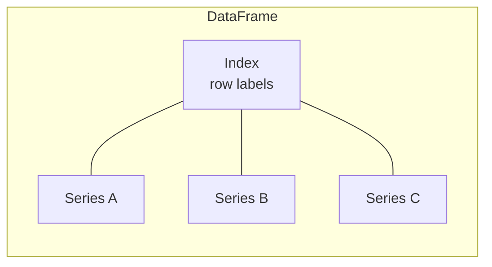

Pandas has two protagonists. Almost every operation in the
library returns one or the other.

- **`DataFrame`** — a 2-D table of rows × columns, with both
  row labels (the **index**) and column labels.
- **`Series`** — a 1-D array of values, with a single set of
  labels (also called an index).

A DataFrame is essentially a dictionary of Series that all share
the same row index.

<svg
  viewBox="0 0 640 220"
  role="img"
  aria-label="A blue column slides out of a faint grid, carrying its little row labels along with it — a DataFrame is a stack of Series that all share one index"
  style={{ display: "block", width: "100%", maxWidth: "640px", height: "auto", margin: "2.5rem auto" }}
>
  <g fill="currentColor" opacity="0.2">
    <rect x="70" y="40" width="28" height="26" rx="5" />
    <rect x="70" y="76" width="28" height="26" rx="5" />
    <rect x="70" y="112" width="28" height="26" rx="5" />
    <rect x="70" y="148" width="28" height="26" rx="5" />
  </g>
  <g fill="currentColor" opacity="0.12">
    <rect x="110" y="40" width="52" height="26" rx="5" />
    <rect x="110" y="76" width="52" height="26" rx="5" />
    <rect x="110" y="112" width="52" height="26" rx="5" />
    <rect x="110" y="148" width="52" height="26" rx="5" />
    <rect x="170" y="40" width="52" height="26" rx="5" />
    <rect x="170" y="76" width="52" height="26" rx="5" />
    <rect x="170" y="112" width="52" height="26" rx="5" />
    <rect x="170" y="148" width="52" height="26" rx="5" />
    <rect x="290" y="40" width="52" height="26" rx="5" />
    <rect x="290" y="76" width="52" height="26" rx="5" />
    <rect x="290" y="112" width="52" height="26" rx="5" />
    <rect x="290" y="148" width="52" height="26" rx="5" />
  </g>
  <g fill="currentColor" opacity="0.04">
    <rect x="230" y="40" width="52" height="26" rx="5" />
    <rect x="230" y="76" width="52" height="26" rx="5" />
    <rect x="230" y="112" width="52" height="26" rx="5" />
    <rect x="230" y="148" width="52" height="26" rx="5" />
  </g>
  <g fill="currentColor" opacity="0.25">
    <circle cx="370" cy="95" r="3" />
    <circle cx="415" cy="85" r="3" />
    <circle cx="460" cy="75" r="3" />
  </g>
  <g style={{ color: "var(--ds-blue-500)" }} fill="currentColor">
    <rect x="500" y="30" width="52" height="26" rx="5" fillOpacity="0.85" />
    <rect x="500" y="66" width="52" height="26" rx="5" fillOpacity="0.85" />
    <rect x="500" y="102" width="52" height="26" rx="5" fillOpacity="0.85" />
    <rect x="500" y="138" width="52" height="26" rx="5" fillOpacity="0.85" />
  </g>
  <g fill="currentColor" opacity="0.35">
    <circle cx="488" cy="43" r="3.5" />
    <circle cx="488" cy="79" r="3.5" />
    <circle cx="488" cy="115" r="3.5" />
    <circle cx="488" cy="151" r="3.5" />
  </g>
</svg>

## Making them by hand

<CodeBlock
  adapter="python"
  files={[
    {
      filename: "main.py",
      starterCode: `import pandas as pd

# A Series — a single labeled column
s = pd.Series(
    [120, 95, 140, 80], index=["Aiko", "Bilal", "Chen", "Diego"], name="salary"
)
print(s)
print()
print("Type:", type(s).__name__)
print("dtype:", s.dtype)
print("index:", list(s.index))
print()

# A DataFrame — a dict of Series with a shared index
df = pd.DataFrame(
    {
        "salary": [120, 95, 140, 80],
        "department": ["Eng", "Sales", "Eng", "Ops"],
    },
    index=["Aiko", "Bilal", "Chen", "Diego"],
)
print(df)
print("Type:", type(df).__name__)
`,
    },
  ]}
/>

The Series remembers its values, its index labels, its dtype,
and its `name`. The DataFrame is the same idea, scaled up.

## Pulling a column out of a DataFrame

When you select a single column from a DataFrame, you get back
a Series.

<CodeBlock
  adapter="python"
  files={[
    {
      filename: "main.py",
      starterCode: `import pandas as pd

df = pd.DataFrame(
    {
        "salary": [120, 95, 140, 80],
        "department": ["Eng", "Sales", "Eng", "Ops"],
    },
    index=["Aiko", "Bilal", "Chen", "Diego"],
)

salaries = df["salary"]
print(salaries)
print("Type:", type(salaries).__name__)
print()

# Selecting *multiple* columns gives you a DataFrame (note the double brackets)
subset = df[["salary"]]
print(subset)
print("Type:", type(subset).__name__)
`,
    },
  ]}
/>

This is one of Pandas's most common gotchas:

| Syntax            | Returns       |
| ----------------- | ------------- |
| `df["x"]`         | Series        |
| `df[["x"]]`       | DataFrame     |
| `df[["x", "y"]]`  | DataFrame     |

The single-bracket form picks one thing; the double-bracket form
selects a list (and even a list of one is still a list).

## Operations are vectorized

The big practical benefit of a Series is that you can do math on
the whole thing at once — no for-loop required.

<CodeBlock
  adapter="python"
  files={[
    {
      filename: "main.py",
      starterCode: `import pandas as pd

salaries = pd.Series([120, 95, 140, 80], index=["Aiko", "Bilal", "Chen", "Diego"])

# Element-wise math
raises = salaries * 0.05
print("Raises:")
print(raises)
print()

# Boolean comparison → Series of booleans (a "mask")
above_100 = salaries > 100
print("Above 100k?")
print(above_100)
print()

# Aggregations
print("Mean:  ", salaries.mean())
print("Median:", salaries.median())
print("Max:   ", salaries.max())
print("Sum:   ", salaries.sum())
`,
    },
  ]}
/>

Read this as: *"Pandas treats a column of numbers like a single
mathematical object."* You can add, multiply, compare, and
aggregate without ever writing a loop.

## Alignment by index

Here is where Pandas earns its reputation. If you add two Series
together, Pandas **aligns them by index** before adding.

<CodeBlock
  adapter="python"
  files={[
    {
      filename: "main.py",
      starterCode: `import pandas as pd

q1 = pd.Series([100, 120, 90], index=["Aiko", "Bilal", "Chen"], name="q1")
q2 = pd.Series([110, 95, 130], index=["Chen", "Aiko", "Diego"], name="q2")

total = q1 + q2
print(total)
`,
    },
  ]}
/>

Notice:

- Aiko is in both → values get added.
- Chen is in both (in different positions in the two Series!) →
  Pandas matches them by *label*, not position, and adds.
- Bilal is only in `q1`, Diego only in `q2` → result is NaN
  for both.

This is the *alignment* behavior Wes McKinney built Pandas
around. Try doing it in plain Python lists and feel the
difference.

## A DataFrame is a dict of aligned Series

You can confirm this by reaching in:

<CodeBlock
  adapter="python"
  files={[
    {
      filename: "main.py",
      starterCode: `import pandas as pd

df = pd.DataFrame(
    {
        "salary": [120, 95, 140],
        "department": ["Eng", "Sales", "Eng"],
    },
    index=["Aiko", "Bilal", "Chen"],
)

# The DataFrame's columns are just Series sharing the same index
print(df["salary"].index.equals(df["department"].index))
print(df["salary"].index)
`,
    },
  ]}
/>

## DataFrame ↔ Series operations

DataFrames support most of the Series operations, applied
column-wise. For example:

<CodeBlock
  adapter="python"
  files={[
    {
      filename: "main.py",
      starterCode: `import pandas as pd

df = pd.DataFrame(
    {
        "salary": [120, 95, 140, 80],
        "bonus": [12, 8, 20, 5],
        "tenure": [3, 6, 7, 2],
    },
    index=["Aiko", "Bilal", "Chen", "Diego"],
)

# .mean() on a DataFrame returns a Series — one mean per column
print(df.mean())
print()

# .sum(axis=1) sums across columns → one per row (handy for totals)
df["total_comp"] = df["salary"] + df["bonus"]
print(df)
`,
    },
  ]}
/>

The `axis` parameter is your friend: `axis=0` (default) means
"down the rows, returning one value per column"; `axis=1` means
"across the columns, returning one value per row."

## Quick reference: when do you get back a Series vs a DataFrame?

| Operation                            | Returns       |
| ------------------------------------ | ------------- |
| `df["col"]`                          | Series        |
| `df[["col1", "col2"]]`               | DataFrame     |
| `df.loc[row_label]`                  | Series        |
| `df.loc[[row_label]]`                | DataFrame     |
| `df.mean()`                          | Series        |
| `df.describe()`                      | DataFrame     |
| `series.unique()`                    | NumPy array   |
| `series.value_counts()`              | Series        |
| `df.groupby("x")["y"].sum()`         | Series        |
| `df.groupby("x").sum()`              | DataFrame     |

Memorize this once and you will stop being surprised.

## Check your understanding

<MultipleChoice
  markdown={`Calling \`df["salary"]\` returns:

- A NumPy array
  > \`series.values\` returns a NumPy array, but \`df["salary"]\` itself returns a Series — a labeled 1-D structure with an index, not a raw array.
- A list
  > A list is a plain Python data structure with no index or dtype; \`df["salary"]\` returns a Pandas Series with full label-awareness.
- [o] A Series
  > Single bracket → single thing → Series. Double brackets always give a DataFrame.
- A new DataFrame
  > \`df[["salary"]]\` with double brackets returns a one-column DataFrame, but \`df["salary"]\` with a single bracket returns a Series.

Single-bracket vs double-bracket is one of the most common surprises in Pandas.`}
/>

<MultipleChoice
  markdown={`When you add two Series with different indexes, what happens?

- It throws an error
  > Pandas does not raise an error when adding Series with different indexes; it silently produces NaN for non-matching labels — which can itself be a silent bug if unexpected.
- The values are added position by position
  > Position-based addition is what NumPy arrays do, not Pandas Series; Pandas's distinctive behavior is to align by index *label* before operating.
- [o] Pandas aligns the two Series by index label, then adds the matching values; non-matching labels produce NaN
  > This *alignment* behavior is the heart of what makes Pandas distinctive. Adding by label, not by position, is the default.
- The shorter Series is zero-padded
  > Pandas uses NaN, not zero, for non-matching index positions; zero-padding would silently corrupt calculations.

Once you have used alignment in anger, you will not want to go back.`}
/>

<MultipleChoice
  markdown={`\`df.mean()\` on a DataFrame with 4 numeric columns returns:

- A single float
  > A single float would result from calling \`.mean()\` on a single-column Series; a DataFrame with 4 columns produces one mean per column.
- A DataFrame of means
  > A reduction like \`.mean()\` collapses one axis into a scalar per column, returning a Series, not a DataFrame.
- [o] A Series with one entry per column
  > A DataFrame reduction (\`mean\`, \`sum\`, \`std\`, ...) collapses one axis. Default \`axis=0\` collapses rows → Series indexed by column name.
- A NumPy array
  > \`df.mean().values\` would give a NumPy array, but \`df.mean()\` itself returns a Pandas Series with the column names as the index.

Knowing the shape of every operation's output is half the battle.`}
/>
