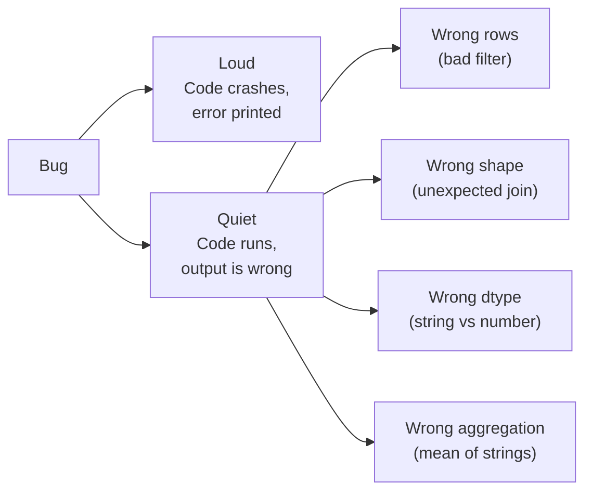
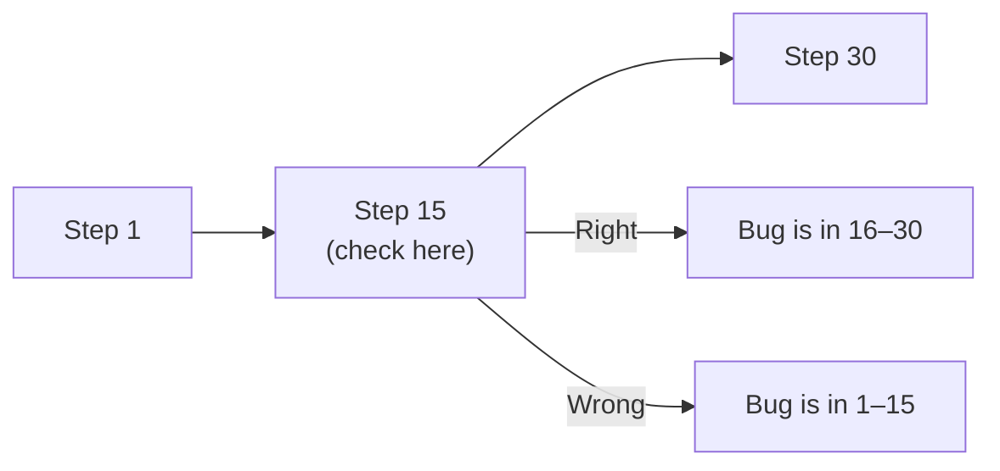

Most analysis bugs are not crashes. They're **silent
mistakes**, numbers that look fine but are subtly wrong. Real
analysts are not "people who never write bugs". They're "people
who catch their own bugs early."

<Figure
  slug="pandas-debugging-cutout"
  alt="Debugging analysis code, an isometric illustration"
/>

## The taxonomy of analysis bugs



Loud bugs are *easy*, you see the traceback. The quiet ones
are what bite you.

<Figure
  slug="pandas-debugging-analysis-code-taxonomy-analysis-bugs-inline-cutout"
  alt="Four labelled specimen jars on a shelf, each holding a differently shaped broken part"
  caption="Analysis bugs come in a handful of recognisable shapes, each with its own tell."
/>

## Habit 1, Look at the data after every step

After any non-trivial line, print and check.

<Figure
  slug="pandas-debugging-analysis-code-habit-1-look-inline-cutout"
  alt="A bench where a small viewing window is fitted after every station, each showing the tray as it passes"
  caption="Put a window after each step and a wrong result never travels far unnoticed."
/>

<CodeBlock
  adapter="python"
  files={[
    {
      filename: "main.py",
      starterCode: `import pandas as pd

df = pd.DataFrame(
    {
        "id": [1, 2, 3, 4, 5],
        "value": [10, 20, 30, 40, 50],
    }
)

# After every step, inspect shape and a few rows
print("Before filter:", df.shape)
filtered = df[df["value"] > 25]
print("After filter:", filtered.shape)
display(filtered)
`,
    },
  ]}
/>

Knowing the row count *before and after* every transformation
is the cheapest bug-detector in Pandas.

## Habit 2, Trust nothing about dtypes

<CodeBlock
  adapter="python"
  files={[
    {
      filename: "main.py",
      starterCode: `import pandas as pd

df = pd.DataFrame({"price": ["10", "20", "30"]})  # strings!

# Looks like it works...
print(df["price"].sum())
# ...but gives '102030' (string concat), not 60.
`,
    },
  ]}
/>

Always check `df.dtypes` after loading. Strings that look like
numbers are one of the most common silent failures.

## Habit 3, Read the assumption, not just the code

When you write:

```python
result = orders.merge(customers, on="customer_id")
```

what you *mean* is:

> Each order has exactly one customer; the result should have
> the same number of rows as `orders`.

Encode that assumption:

```python
before = len(orders)
result = orders.merge(customers, on="customer_id", validate="many_to_one")
assert len(result) == before, f"Row count changed: {before} -> {len(result)}"
```

If reality contradicts the assumption, you find out *now*, not
after the chart is in your boss's deck.

## Habit 4, Use `.shape` and `.info()` as constants

<CodeBlock
  adapter="python"
  datasets={[{ path: "palmer-penguins.csv", stageAs: "penguins.csv" }]}
  files={[
    {
      filename: "main.py",
      initCode: `import pandas as pd
penguins = pd.read_csv("penguins.csv")`,
      starterCode: `print("Shape:", penguins.shape)
print()
penguins.info()
`,
    },
  ]}
/>

A 30-second `.info()` after loading catches almost every "wait,
that column is the wrong type" bug. Here it also quietly reveals
the missing data: the measurement columns report fewer non-null
values than the 344 total rows.

## Habit 5, Pin down weird rows

When something looks off, **find the actual rows** rather than
guessing.

<CodeBlock
  adapter="python"
  files={[
    {
      filename: "main.py",
      starterCode: `import pandas as pd

df = pd.DataFrame(
    {
        "age": [25, 30, 28, 200, 35, -5, 40],
    }
)

display(df[df["age"] > 100])
display(df[df["age"] < 0])
`,
    },
  ]}
/>

Don't reason abstractly, pull up the actual problem rows. Often
they reveal the root cause immediately.

## Habit 6, Bisect the pipeline

When a 30-step pipeline produces the wrong answer, *don't*
re-read all 30 steps. Print the intermediate output halfway.
If it's right at step 15, the bug is in 16–30. If it's wrong at
step 15, the bug is in 1–15. Bisect again.



This $O(\log n)$ approach beats $O(n)$ re-reading every time.

## Habit 7, Reproduce in a minimal example

When stuck, recreate the problem with a tiny DataFrame.

<CodeBlock
  adapter="python"
  files={[
    {
      filename: "main.py",
      starterCode: `import pandas as pd

# Real data has 1M rows, too big to inspect.
# Construct a 4-row mini that triggers the same bug:
mini = pd.DataFrame(
    {
        "k": [1, 1, 2, 2],
        "x": [10, 20, 30, 40],
    }
)

# Now you can step through the buggy operation by hand.
print(mini.groupby("k")["x"].sum())
`,
    },
  ]}
/>

If you can reproduce the bug in a 4-row example, you can
*solve* it in a 4-row example. And when you ask a colleague
for help, the 4-row example is what they need.

## Habit 8, Suspect chained indexing warnings

`SettingWithCopyWarning` is a real warning, not noise.

<CodeBlock
  adapter="python"
  files={[
    {
      filename: "main.py",
      starterCode: `import pandas as pd

df = pd.DataFrame({"x": [1, 2, 3], "y": [10, 20, 30]})

# This MIGHT modify a copy, not df. Don't do this.
sub = df[df["x"] > 1]
sub["y"] = 0  # Risky, may warn or fail silently

# Safer:
df.loc[df["x"] > 1, "y"] = 0
display(df)
`,
    },
  ]}
/>

Use `.loc[..., col] = value` when you really mean to modify the
original.

## Habit 9, Confirm with a different method

If your aggregation says revenue is $1.2M, double-check with a
crude calculation, `df["revenue"].sum()`, to ensure the
groupby didn't drop or duplicate rows.

The act of computing the same number two ways catches an
astonishing number of bugs.

## Habit 10, Slow down

When the result looks wrong:

1. Re-read the question.
2. Re-look at the data shape, dtypes, sample rows.
3. Print the intermediate steps.
4. Reproduce in a mini example.
5. *Then* edit code.

Most bugs come from skipping step 1.

## A debugging checklist

Before you change any code, run through:

- Did you check `.shape` before **and** after?
- Are the dtypes what you expect?
- Did the row count change unexpectedly?
- Are there `NaN`s you didn't account for?
- Can you reproduce it in 5 rows?

*Then* fix it.

<Figure
  slug="pandas-debugging-analysis-code-inline-cutout"
  alt="A result that looks wrong, with a hand walking back along the bench through each earlier tray to find where"
  caption="Debugging is walking back through the steps until the numbers stop matching."
/>

## Check your understanding

<MultipleChoice
  markdown={`Your sum of "price" is 6 digits long even though only a handful of rows exist. Most likely cause:

- [o] The column is a string, and \`.sum()\` concatenated the values instead of adding them, check \`df.dtypes\`
  > String-vs-number is the most common silent bug in Pandas.
- Pandas needs an upgrade
  > A Pandas version issue would not selectively cause string concatenation on a single column; the bug is in the data type, not the library.
- A floating-point bug
  > Floating-point errors produce tiny rounding discrepancies, not a result six digits long from a handful of rows.
- The data is corrupt
  > Corrupt data would more likely cause an error or NaN, not a suspiciously long but coherent string-like result.

Always check dtypes after loading.`}
/>

<MultipleChoice
  markdown={`A merge unexpectedly multiplied your row count by 3. Best diagnostic step?

- Re-run with a different package version
  > A cardinality blow-up is almost never a Pandas bug; it is a data problem that any version would reproduce.
- Add more print statements throughout
  > Scattering prints everywhere is unfocused; the chapter recommends diagnosing the specific cause, key duplication, rather than adding noise.
- [o] Check whether the join key is duplicated on the right-hand table (\`df.duplicated(subset=...).sum()\`), and/or re-run the merge with \`validate="one_to_many"\` or similar
  > Cardinality blow-ups have a clear root cause that the \`validate\` flag would have caught.
- Drop duplicates blindly
  > Blindly dropping duplicates destroys information; the right step is first diagnosing *why* duplicates exist in the key column.

Encode assumptions; let Pandas tell you when reality breaks them.`}
/>

<MultipleChoice
  markdown={`A 30-step pipeline produces a wrong answer. What's the most efficient debugging approach?

- Rewrite the pipeline
  > Rewriting discards working code and adds new bugs; the problem needs to be located first, not replaced.
- [o] Bisect, check the intermediate output halfway through; whichever half is wrong, bisect again
  > Logarithmic search through your pipeline beats linear search.
- Re-read every step
  > Re-reading all 30 steps is $O(n)$ search; bisection reduces the problem to $O(\\log n)$ by splitting the problem in half each time.
- Add more comments
  > Comments explain intent but do not execute or reveal the intermediate state that would expose where the wrong answer originates.

Bisection is one of the most powerful debugging habits, period.`}
/>

<MultipleChoice
  markdown={`Why is reproducing a bug in a 5-row "mini" DataFrame so valuable?

- It is faster than running on big data
  > Speed is a benefit of a mini DataFrame, but the chapter emphasises a deeper advantage: the act of constructing the minimal example often makes the bug obvious.
- It avoids print spam
  > Reducing output noise is a side effect, not the primary value; the main payoff is forced understanding and a shareable reproduction case.
- [o] Both of those, AND a mini-example forces you to truly understand the bug, and is the perfect format to ask someone for help
  > "Can you reproduce it minimally?" is a question that often answers itself in the act of trying.
- It uses less memory
  > Memory savings are trivial for a 5-row DataFrame; the real value is conceptual clarity and shareability of the reproduction.

Minimal reproductions are universal currency in software debugging.`}
/>
