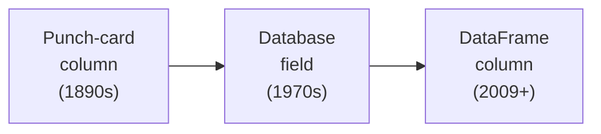
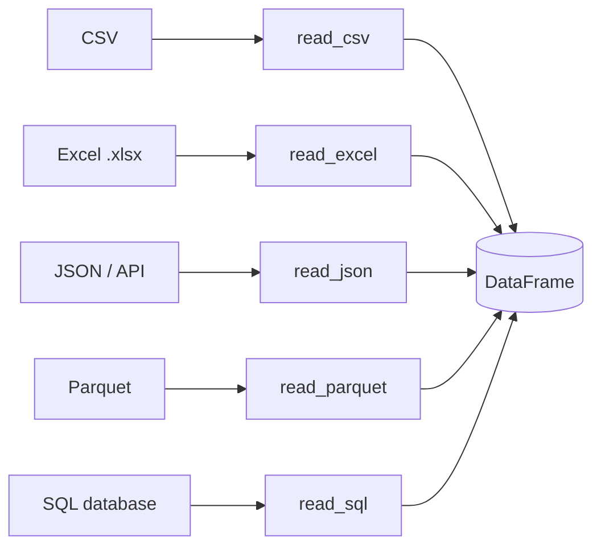

The course opened with a deliberately compressed two-page history,
because the goal was to get you running real code quickly. This
page is the director's cut: the threads we trimmed, for readers who
want the longer version now that the mechanics are behind them.
None of it is required. All of it is true.

<Figure
  slug="pandas-deep-history-cutout"
  alt="The longer history, an isometric illustration"
/>

## The first dataset was a bone

The oldest object that arguably qualifies as a *dataset* is the
**Ishango bone**, found near a volcano in central Africa and dated
to roughly 20,000 years ago. Along three rows of its surface are
deliberate clusters of notches, groups like 11, 13, 17, and 19,
that mathematicians still argue about. Were they prime numbers? A
lunar calendar? A tally of livestock? Nobody knows. But the impulse
is unmistakable and exactly the one that animates every spreadsheet
since: *something happened repeatedly, and someone wanted a durable
record of it.* To externalize counting so you can return to it
later is the seed of every CSV file you will ever open.

## Punch cards, Hollerith, and the column

The 1890 US Census is the hinge between hand-tabulation and
machines. The country had grown so fast that the *previous* census
had taken eight years to count by hand, meaning the next one would
be due before the last one finished. **Herman Hollerith** built an
electromechanical tabulator that read **punched cards**, one card
per person, and the 1890 count came in within roughly a year. The
company Hollerith founded to sell those machines eventually became
**IBM**.

<Figure
  slug="pandas-deep-history-of-data-punch-cards-hollerith-inline-cutout"
  alt="A stiff card punched with holes passing through a reading frame that feels for each hole"
  caption="The punched card made a row of data something a machine could read directly."
/>

Punch cards ruled data for the next seventy years, every payroll,
airline reservation, and scientific simulation of the 1950s and 60s
ate boxes of them. And here is the detail that ties it to your work:
the physical *column* on a punch card became the *field* in a
record, which became the *column* of a database table, which became
the *column* of a DataFrame. When you type `df["age"]`, you are
using a word that has meant "a vertical slice of attributes" since
the 1890s.

## Codd's relational model, in a little more depth

The compressed history mentioned Edgar Codd's 1970 paper, *A
Relational Model of Data for Large Shared Data Banks*. It is worth
saying why it was radical. Before Codd, programmers hand-crafted the
file layout and the *traversal path* for each application, to find
a customer's orders you wrote code that physically walked from one
record to the next. Codd's proposal was to forget the physical
layout entirely: model data as **relations** (sets of typed rows)
and describe *what* you want with an algebra, letting the system
figure out *how* to get it.

That separation of "what" from "how" is the intellectual core of SQL,
and Pandas borrows the "what" vocabulary while keeping you closer
to the "how." When you write `df.groupby("species")["body_mass_g"]
.mean()`, you are describing a relational operation (group, then
aggregate) in a Python idiom. Pandas is not a database, it is an
in-memory library with no persistence or concurrency, but the
*ideas* are fifty years old and battle-tested.

## What "big data" actually means

You will hear "big data" used to mean anything from a thousand-row
survey to a planet-scale log. It helps to keep three honest tiers in
mind:

- **Bigger than a spreadsheet**, hundreds of thousands to tens of
  millions of rows. Comfortable for Pandas on a laptop. *Almost all
  analyst work lives here.*
- **Bigger than memory**, tens of millions to billions of rows.
  Needs chunking, on-disk columnar formats (Parquet), or
  out-of-core engines (Dask, Polars, DuckDB).
- **Bigger than one machine**, petabytes and up. Needs distributed
  systems (Spark, BigQuery, Snowflake).

<Figure
  slug="pandas-deep-history-of-data-first-dataset-was-inline-cutout"
  alt="A notched bone lying on cloth beside a modern tally rack carrying the same notches"
  caption="Counting things and writing the count down is far older than the computer."
/>

The encouraging part: the *concepts* you are learning, DataFrames,
group-bys, joins, missing data, reshaping, carry over to all three
tiers. The diamonds dataset in this course (about 54,000 rows) is
firmly tier one; even at large tech companies, most ad-hoc analyses
run on filtered extracts small enough to fit in memory. Big-data
tooling is usually used to *produce* the small dataset the analyst
actually explores.

<Callout type="info" title="Resist big-data tooling on small data">
A junior analyst who says "we have big data, 40,000 rows" is
making a vocabulary error that costs real money: it tempts teams to
reach for Spark or a distributed warehouse when Pandas would finish
the same job in seconds. Match the tool to the size.
</Callout>

## Where digital data actually lives

Once you leave toy CSVs, you will meet data in many shapes. The
useful thing about Pandas is that, once data is *inside* a
DataFrame, the rest of your analysis no longer cares where it came
from:

You might pull from five sources and join them in one notebook
without changing a line of your downstream logic. That decoupling,
many readers, one in-memory shape, is one of Pandas's quietest but
biggest practical wins.

## Analyst, scientist, engineer: the blurry line

People agonize over these titles; companies define them
inconsistently. A rough map:

- **Data analyst**, answers business questions with existing data.
  Heavy on SQL, Pandas, BI tools, and communication. *This course
  prepares you for this role.*
- **Data scientist**, overlaps with the analyst but adds heavier
  statistical or machine-learning modeling, experimentation, and
  sometimes prototyping production models.
- **ML engineer**, focuses on putting models into production:
  pipelines, latency, scaling, monitoring.

You can build a complete, well-paid career at the analyst level
without ever training a model, many people do, and the skills in
this course are the shared foundation underneath all three. The
ladder is real, but the ground floor is the same for everyone, and
it is the floor we have been standing on the whole time.

## Check your understanding

<MultipleChoice
  markdown={`A teammate says "we have big data, about 40,000 rows." What is the most accurate response?

- [o] 40,000 rows fits comfortably in memory; Pandas handles it instantly, and "big data" usually means data that no longer fits in memory or on one machine
  > Calling small tabular data "big" tends to make teams over-engineer with tools meant for a different scale, adding cost and latency without adding insight.
- They are right; 40,000 rows needs a distributed system
  > 40,000 rows loads in milliseconds on any laptop and sits firmly in the "fits in memory" tier; no distributed system is warranted.
- Big data is anything with more than 1,000 rows
  > A thousand rows is tiny; no working definition places the "big data" threshold that low.
- It depends on the day of the week
  > Dataset size is not time-dependent; 40,000 rows is small by any standard.

The diamonds dataset (~54,000 rows) in this course is itself comfortably in the "fits on a laptop" tier.`}
/>

<MultipleChoice
  markdown={`Why does the word "column" appear in punch cards, databases, and DataFrames alike?

- It is a coincidence of unrelated technologies
  > The lineage is direct: the punch-card column became the database field, which became the DataFrame column.
- Pandas borrowed the term from spreadsheets only
  > Spreadsheets inherited the term too, but the lineage runs all the way back through databases to Hollerith's punch cards.
- Codd coined the word "column" in 1970
  > "Column" predates Codd by decades; the 1890 census machinery already organized data into columns.
- [o] The concept passed down a continuous lineage, punch-card column to database field to DataFrame column, over more than a century
  > Vocabulary in data work is unusually stable because the underlying idea (a vertical slice of one attribute across records) never changed.

Stable vocabulary is part of why learning Pandas indirectly teaches you about databases.`}
/>
