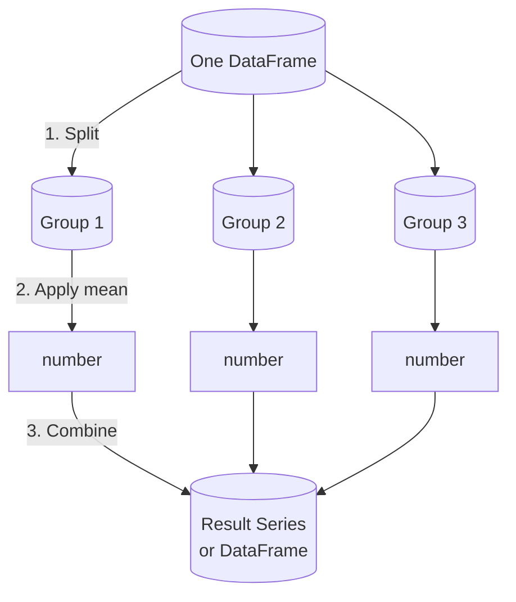

If there is one operation that earns Pandas its keep, it is
`groupby`. Every "by department," "by month," "by user," "by
category" question in data analysis ends up here.

<Figure
  slug="pandas-groupby-cutout"
  alt="GroupBy operations, an isometric illustration"
/>

## Split-apply-combine

The mental model is three steps:

- **Split**, partition rows into groups based on a column's
  values.
- **Apply**, compute something on each group (a mean, a sum, a
  custom function).
- **Combine**, stitch the per-group results back into one
  result.

Hadley Wickham named this pattern *split-apply-combine* in 2011,
and it has been the conceptual backbone of tabular data analysis
ever since.

## The basic shape

<CodeBlock
  adapter="python"
  files={[
    {
      filename: "main.py",
      starterCode: `import pandas as pd

df = pd.DataFrame(
    {
        "dept": ["Eng", "Sales", "Eng", "Ops", "Eng", "Sales", "Ops"],
        "salary": [120, 95, 140, 80, 128, 110, 92],
    }
)

# Group by dept, take the mean of salary
print(df.groupby("dept")["salary"].mean())
`,
    },
  ]}
/>

Read it as: *"From df, group by dept, pull out salary, take the
mean of each group."*

## Multiple aggregations at once

<CodeBlock
  adapter="python"
  files={[
    {
      filename: "main.py",
      initCode: `import pandas as pd
df = pd.DataFrame({
    "dept":   ["Eng","Sales","Eng","Ops","Eng","Sales","Ops"],
    "salary": [120, 95, 140, 80, 128, 110, 92],
})`,
      starterCode: `print(df.groupby("dept")["salary"].agg(["mean", "median", "min", "max", "count"]))
`,
    },
  ]}
/>

Or apply different aggregations to different columns:

<CodeBlock
  adapter="python"
  files={[
    {
      filename: "main.py",
      starterCode: `import pandas as pd

df = pd.DataFrame(
    {
        "dept": ["Eng", "Sales", "Eng", "Ops", "Eng", "Sales", "Ops"],
        "salary": [120, 95, 140, 80, 128, 110, 92],
        "tenure": [3, 6, 7, 2, 4, 5, 6],
    }
)

result = df.groupby("dept").agg(
    {
        "salary": ["mean", "max"],
        "tenure": ["mean", "min"],
    }
)
print(result)
`,
    },
  ]}
/>

## Named aggregations, much cleaner

The `(column, function)` tuple syntax produces flat, well-named
columns. This is the modern recommended style.

<CodeBlock
  adapter="python"
  files={[
    {
      filename: "main.py",
      starterCode: `import pandas as pd

df = pd.DataFrame(
    {
        "dept": ["Eng", "Sales", "Eng", "Ops", "Eng", "Sales", "Ops"],
        "salary": [120, 95, 140, 80, 128, 110, 92],
        "tenure": [3, 6, 7, 2, 4, 5, 6],
    }
)

result = (
    df.groupby("dept")
    .agg(
        avg_salary=("salary", "mean"),
        max_salary=("salary", "max"),
        head_count=("salary", "count"),
        avg_tenure=("tenure", "mean"),
    )
    .round(1)
)

print(result)
`,
    },
  ]}
/>

This pattern, `result_name=(column, function)`, produces flat
column names and self-documents the analysis. Use it.

## Grouping by multiple columns

Pass a list of column names:

<CodeBlock
  adapter="python"
  files={[
    {
      filename: "main.py",
      starterCode: `import pandas as pd

df = pd.DataFrame(
    {
        "dept": ["Eng", "Eng", "Sales", "Sales", "Eng", "Sales"],
        "level": ["jr", "sr", "jr", "sr", "jr", "jr"],
        "salary": [110, 160, 80, 120, 95, 75],
    }
)

print(df.groupby(["dept", "level"])["salary"].mean())
`,
    },
  ]}
/>

The result has a *MultiIndex*. To flatten back to a regular
DataFrame, call `.reset_index()`:

<CodeBlock
  adapter="python"
  files={[
    {
      filename: "main.py",
      initCode: `import pandas as pd
df = pd.DataFrame({
    "dept":   ["Eng","Eng","Sales","Sales","Eng","Sales"],
    "level":  ["jr","sr","jr","sr","jr","jr"],
    "salary": [110, 160, 80, 120, 95, 75],
})`,
      starterCode: `flat = df.groupby(["dept", "level"])["salary"].mean().reset_index()
print(flat)
`,
    },
  ]}
/>

## `transform`, broadcast a group statistic back to rows

Sometimes you do not want a smaller summary table, you want to
add a column to the *original* rows containing a group statistic.

<CodeBlock
  adapter="python"
  files={[
    {
      filename: "main.py",
      starterCode: `import pandas as pd

df = pd.DataFrame(
    {
        "dept": ["Eng", "Sales", "Eng", "Ops", "Eng", "Sales", "Ops"],
        "salary": [120, 95, 140, 80, 128, 110, 92],
    }
)

df["dept_avg"] = df.groupby("dept")["salary"].transform("mean")
df["vs_dept_avg"] = (df["salary"] - df["dept_avg"]).round(1)
print(df)
`,
    },
  ]}
/>

Each row now knows the average of its department, and how far it
sits from that average. This is a hugely useful pattern for
flagging outliers within groups.

## `filter`, keep groups, not rows

A different kind of group operation: keep entire groups that
satisfy a condition.

<CodeBlock
  adapter="python"
  files={[
    {
      filename: "main.py",
      starterCode: `import pandas as pd

df = pd.DataFrame(
    {
        "dept": ["Eng", "Sales", "Eng", "Ops", "Eng", "Sales", "Ops"],
        "salary": [120, 95, 140, 80, 128, 110, 92],
    }
)

# Keep only departments with average salary > 100
big = df.groupby("dept").filter(lambda g: g["salary"].mean() > 100)
print(big)
`,
    },
  ]}
/>

Note: `filter` here takes a function that receives the whole
group as a DataFrame and returns True/False. Different from
boolean-mask filtering of rows.

## `apply`, for anything else

`apply` runs an arbitrary function on each group. Slower than
the named aggregations, but flexible.

<CodeBlock
  adapter="python"
  files={[
    {
      filename: "main.py",
      starterCode: `import pandas as pd

df = pd.DataFrame(
    {
        "dept": ["Eng", "Sales", "Eng", "Ops", "Eng", "Sales", "Ops"],
        "salary": [120, 95, 140, 80, 128, 110, 92],
    }
)

def top_two(g):
    return g.sort_values("salary", ascending=False).head(2)

print(df.groupby("dept").apply(top_two, include_groups=False))
`,
    },
  ]}
/>

Reach for `apply` only when neither `agg` nor `transform` will
do.

## A realistic example, at scale

Split-apply-combine earns its keep on big tables. The diamonds
dataset has 53,940 rows, far too many to eyeball, but a single
`groupby` collapses them into one tidy row per cut. Let us compute,
for each quality of `cut`, the count, the mean price, and the
*median* price.

<CodeBlock
  adapter="python"
  datasets={[{ path: "diamonds.csv", stageAs: "diamonds.csv" }]}
  files={[
    {
      filename: "main.py",
      initCode: `import pandas as pd
diamonds = pd.read_csv("diamonds.csv")`,
      starterCode: `summary = (
    diamonds.groupby("cut")
    .agg(
        count=("price", "size"),
        avg_price=("price", "mean"),
        median_price=("price", "median"),
    )
    .round({"avg_price": 0})
    .sort_values("avg_price", ascending=False)
)
print(summary)
`,
    },
  ]}
/>

This single chained call turns 53,940 rows into a five-row answer.
Look closely at the result and you will spot something strange:
**Ideal** diamonds, the best cut, have the *lowest* average
price, and the mean is well above the median in every group. That
is not a bug. It is a real pattern hiding in plain sight: ideal-cut
diamonds skew toward smaller carats, and a handful of enormous
stones drag every group's *mean* upward while leaving the *median*
alone. A good analyst notices the gap and follows it, which is
exactly the kind of thread groupby is built to pull on.

## A multi-step challenge

<ChallengeCard
  adapter="python"
  title="Price summary by cut"
  instructions={`The diamonds file is staged as \`diamonds.csv\` and loaded into \`diamonds\` for you. Build a DataFrame called \`summary\` indexed by \`cut\` with **exactly** these columns (in this order):

1. \`count\`, number of diamonds of that cut
2. \`avg_price\`, mean of \`price\`, rounded to the nearest integer
3. \`avg_carat\`, mean of \`carat\`, rounded to 2 decimal places

Sort the result by \`avg_price\` descending.`}
  datasets={[{ path: "diamonds.csv", stageAs: "diamonds.csv" }]}
  files={[
    {
      filename: "main.py",
      initCode: `import pandas as pd
diamonds = pd.read_csv("diamonds.csv")`,
      starterCode: `summary = None  # TODO

print(summary)
`,
      solutionCode: `summary = (
    diamonds.groupby("cut")
    .agg(
        count=("price", "size"),
        avg_price=("price", "mean"),
        avg_carat=("carat", "mean"),
    )
    .assign(
        avg_price=lambda x: x["avg_price"].round(0),
        avg_carat=lambda x: x["avg_carat"].round(2),
    )
    .sort_values("avg_price", ascending=False)
)

print(summary)
`,
    },
  ]}
  tests={[
    {
      id: "is_df",
      name: "summary is a DataFrame",
      description: "Type check",
      code: `import pandas as pd
assert isinstance(summary, pd.DataFrame)`,
    },
    {
      id: "index",
      name: "Indexed by cut",
      description: "Index name should be 'cut'",
      code: `assert summary.index.name == "cut"`,
    },
    {
      id: "columns",
      name: "Has the right columns in the right order",
      description: "count, avg_price, avg_carat",
      code: `expected = ["count", "avg_price", "avg_carat"]
assert list(summary.columns) == expected, f"Got {list(summary.columns)}"`,
    },
    {
      id: "sorted",
      name: "Sorted descending by avg_price",
      description: "Most expensive cut first",
      code: `vals = summary["avg_price"].tolist()
assert all(vals[i] >= vals[i+1] for i in range(len(vals)-1))`,
    },
    {
      id: "shape",
      name: "Has 5 cuts",
      description: "Expect 5 rows",
      code: `assert len(summary) == 5`,
    },
  ]}
/>

## Check your understanding

<MultipleChoice
  markdown={`The split-apply-combine pattern describes:

- A coding style for indentation
  > Split-apply-combine is a conceptual framework for grouped computation, not a code formatting convention.
- A way to import data
  > Data import is handled by functions like \`pd.read_csv\`; split-apply-combine describes what happens to data after it is already loaded.
- A method of sorting
  > Sorting arranges rows in order; split-apply-combine aggregates groups of rows, the two operations have different outputs and purposes.
- [o] The three steps of a groupby: partition rows into groups, compute something per group, stitch the results together
  > Once you see groupby through this lens, it stops feeling magical.

The phrase was popularized by Hadley Wickham in 2011 and applies in every tabular-data tool.`}
/>

<MultipleChoice
  markdown={`What is the practical advantage of \`agg(my_name=("col", "mean"))\` over \`agg({"col": ["mean"]})\`?

- It is faster
  > Both syntaxes call the same underlying aggregation engine; the named-tuple form is not meaningfully faster.
- It works on Series only
  > Named aggregations work on a grouped DataFrame, not just a Series; the syntax applies whenever you call \`.agg\` on a \`DataFrameGroupBy\`.
- It supports more functions
  > Both syntaxes support the same set of aggregation functions; the difference is purely in how the output columns are named.
- [o] It produces flat, well-named output columns instead of a MultiIndex of columns, far easier to use downstream
  > Named aggregations are the modern recommended style. The output looks like a normal table.

If you have ever been confused by MultiIndex columns coming out of groupby, switch to named aggregations.`}
/>

<MultipleChoice
  markdown={`When would you use \`groupby(...).transform(...)\` instead of \`.agg(...)\`?

- When sorting
  > Sorting is done with \`.sort_values\` or \`.sort_index\`; neither \`agg\` nor \`transform\` performs a sort.
- They are equivalent
  > \`agg\` returns a smaller DataFrame with one row per group; \`transform\` returns a Series or DataFrame with the same number of rows as the original, the outputs are different shapes.
- When you want fewer rows
  > \`agg\` is the operation that reduces rows (one row per group); \`transform\` keeps the same number of rows as the input.
- [o] When you want a column added back to every original row containing its group's statistic, the result has the same shape as the input
  > \`agg\` collapses to one row per group; \`transform\` broadcasts the group result back to every row in that group.

\`transform\` is the right hammer for "show me each value alongside its group average."`}
/>

<MultipleChoice
  markdown={`In a \`groupby(["a","b"])\` result, what kind of index does the output usually have?

- A DatetimeIndex
  > A DatetimeIndex arises when the index contains timestamps; grouping by string or integer columns like \`a\` and \`b\` produces a MultiIndex of those values.
- A column index
  > A column index refers to the column axis of a DataFrame; the output of a groupby result has the group keys in the *row* index, not the column index.
- A flat RangeIndex
  > A flat RangeIndex (0, 1, 2, …) is what you get after calling \`.reset_index()\`; the default output of a multi-column groupby is a MultiIndex.
- [o] A MultiIndex, one level for column \`a\`, one level for column \`b\`
  > Multi-column groupbys naturally produce hierarchical indexes. Call \`.reset_index()\` if you want a flat DataFrame.

The MultiIndex is powerful but adds a learning curve. \`reset_index()\` is your friend.`}
/>
