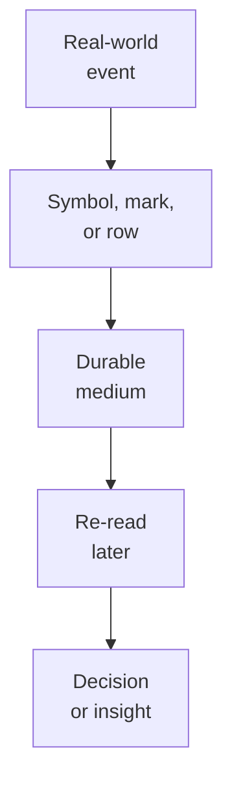
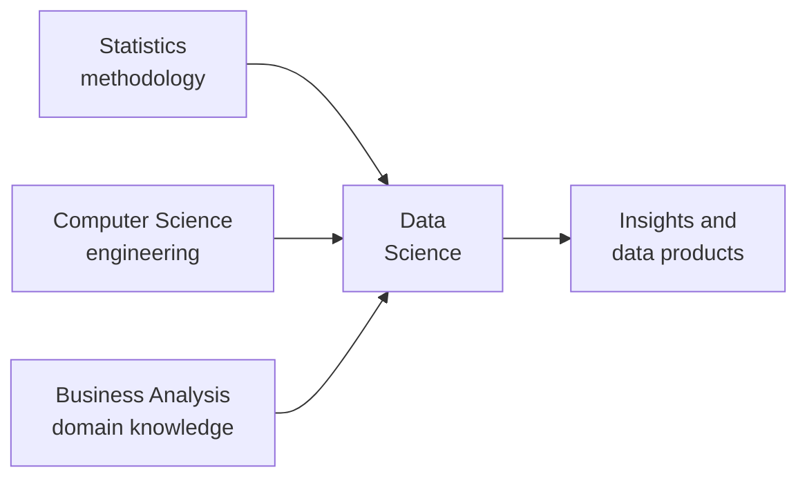
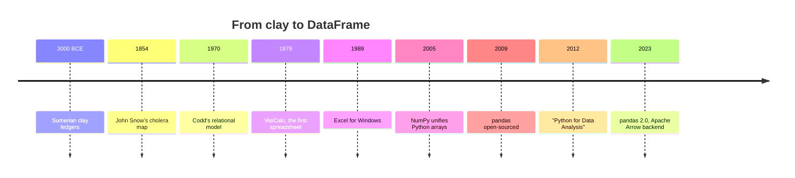

Before we touch a line of Python, here is a strange fact worth
sitting with: *the dataset you will load in a few chapters has the
same shape as a five-thousand-year-old clay receipt.* Rows of
similar things, columns of attributes, a total at the bottom. The
medium changed, clay, paper, silicon, but the shape did not.
This chapter is the two-page story of how that shape traveled from
a Sumerian temple to a library called Pandas. (If you want the
longer version of any thread here, the **Interesting discussions**
section near the end of the course expands several of them.)

<Figure
  slug="pandas-history-of-data-cutout"
  alt="A short history of data, an isometric illustration"
/>

## Rows and columns are older than writing

The oldest records humans kept were not stories, they were
*counts*. About 5,000 years ago the Sumerians of Mesopotamia
pressed wedge-shaped marks into wet clay, and most of those tablets
are not poetry or scripture. They are **receipts**: sheep
delivered, beer rationed, wages owed. A typical temple ledger has a
heading row, repeated rows of transactions, columns that align so a
scribe can scan down, and a total at the bottom.

Tilt your head and it is a spreadsheet. This is the key idea to
carry into the whole course: **tabular data, rows of similar
things, columns of their attributes, is not a Python invention or
an Excel invention.** It is how humans have organized records for
millennia, because it matches how we reason about *categories of
things with properties*. Pandas inherits that shape; it did not
create it.

For most of history the largest datasets in the world were
government records, Roman censuses, the Domesday Book, Qing
household registers. Then two ideas turned counting into a science.
In the 1600s, **probability theory** (Pascal, Fermat, then
Bernoulli and Bayes) gave humans a way to reason about *uncertain*
data. By the 1800s **statistics** was a discipline with real
stakes: Florence Nightingale used a polar-area chart to convince
Parliament that soldiers were dying of bad sanitation, not bullets,
and John Snow mapped London cholera deaths to a single contaminated
water pump. These were not just numbers; they were *analyses with a
conclusion* that changed policy.

One more lineage matters. In 1970 an IBM researcher named **Edgar
F. Codd** proposed the **relational model**: store data as
relations, sets of rows, each a tuple of typed values, and query
them with a mathematical algebra. That model underlies every SQL
database today, and Pandas quietly borrows its vocabulary. When we
reach *joins*, *merges*, and *group-bys* later, you will be using
ideas that have worked for fifty-plus years.

## The spreadsheet won the business world

If the clay tablet is the DataFrame's deep ancestor, the
**spreadsheet** is its parent, and to understand why Pandas
exists, you have to understand why spreadsheets won.

In 1979 the personal computer was a curiosity; companies could not
say why their accounting department needed one. Then two people,
**Dan Bricklin** and **Bob Frankston**, shipped **VisiCalc**, an
"electronic blackboard" where each cell could hold a number or a
formula, and changing one cell rippled automatically through the
rest. Suddenly there was a reason to spend $2,000 on an Apple II:
it turned a week of financial modeling into ten minutes. VisiCalc
was the personal computer's first *killer app*.

**Lotus 1-2-3** (1983) made it faster and added charts; by 1985 it
was the best-selling software on Earth and the tool of corporate
finance. A new job appeared, the **business analyst**, whose
description (*take raw numbers, clean them up, summarize them,
communicate them*) is almost word-for-word the modern data
analyst's. **Microsoft Excel** then inherited the throne in the
1990s and never gave it back. The reasons it won are still the
reasons spreadsheets dominate today: you click a cell and type;
every value is visible at once; edits recalculate instantly;
`.xlsx` is how humans email each other data; and `=SUM(A1:A10)` is
a real program anyone can read without a programming background.

<Callout type="info" title="Spreadsheets are programming">
A spreadsheet formula has inputs, outputs, conditionals (`IF`),
aggregations (`SUM`, `AVERAGE`), even function composition. The
grid is a *visual programming environment*, both data store and
user interface. Most "non-technical" analysts have been programming
for decades; they just were not calling it that. Pandas has to earn
its place against a tool this good.
</Callout>

## Then the data outgrew the grid

The spreadsheet was designed for small, slow, expensive computers
holding small datasets typed in by hand. Within twenty years every
one of those assumptions was demolished. In 1990 the world had
about 300,000 internet hosts; by 2020, over four *billion* people
were producing clicks, posts, searches, purchases, and GPS pings
every second, each one a row in some dataset somewhere. Three
forces drove the flood:

1. **Cheap storage.** A megabyte of disk cost on the order of
   hundreds of thousands of dollars in 1980 and a tiny fraction of
   a cent by 2020. There was no longer a reason to throw data away.
2. **Cheap sensors.** A single smartphone carries a GPS, an
   accelerometer, cameras, a microphone, and more, all producing
   data constantly.
3. **Cheap collection.** One line of JavaScript can send a click
   event to a server in microseconds, with no form to fill in.

Spreadsheets started to creak. The classic Excel format capped a
sheet at 65,536 rows; even modern Excel stops near one million, and
real datasets routinely exceed that. Worse, spreadsheet work leaves
*no reproducible trail*, six months later, when an auditor asks
"show me exactly how this number was computed," the honest answer is
often "we cannot." (The next chapter makes that failure concrete,
with a famous example.) The gap between what businesses needed and
what the grid could do is exactly the gap that code, and Pandas,
was built to close.

## Three trades that became one job

By the late 2000s, three communities discovered they were doing the
same work from different angles. **Statisticians** had rigorous
methods but worked in expensive proprietary tools on small, tidy
datasets. **Computer scientists** could move and store terabytes
but rarely *interpreted* them. **Business analysts** knew the
questions and the domain but hit a ceiling at modest data sizes and
left no audit trail. Their union picked up a name that stuck:
**data science**.

Whatever the title, data analyst, data scientist, the day-to-day
is dominated by four activities: **acquiring** data, **cleaning**
it, **exploring** it, and **communicating** the result. Cleaning is
the big one. It is frequently reported that data scientists spend
most of their time preparing and cleaning data rather than running
the eventual analysis, the 2014 *New York Times* piece "For
Big-Data Scientists, 'Janitor Work' Is Key Hurdle" is the usual
citation. This course gives that "janitor work" several chapters,
because the decisions you make about a bad row quietly shape every
conclusion built on top of it.

## One frustrated researcher, one library

Which brings us to the library this course is named for. By 2007 you
could *technically* do data analysis in Python. **NumPy** (unified
by Travis Oliphant around 2005–2006 from two earlier array
libraries) gave Python a fast, C-backed n-dimensional array;
**Matplotlib** gave it plots; **SciPy** gave it algorithms. But
none of them understood a *labeled column*. Spreadsheets had labels.
R had its `data.frame`. Python had arrays of anonymous numbers plus
a notebook of side-scripts to remember which column meant what.

That year, **Wes McKinney** was a researcher at **AQR Capital
Management**, a quantitative hedge fund, analyzing financial time
series, the kind of cross-sectional, multi-period data
econometricians call **panel data**. His tools each failed him
differently: Excel was hopeless at scale, MATLAB was expensive and
weak at messy tables, R was awkward to wire into the firm's Python
systems, and plain NumPy made him hand-write the logic to align two
time series on a date, pad missing holidays, or compute a rolling
average. He wanted *one* library with Python's general-purpose
power and R's friendly, label-aware data semantics. None existed, so
he wrote one, and named it after **"pan**el **da**ta," with a nod
to **Python data analysis**.

<Callout type="info" title="Where the name comes from">
"Pandas" is a contraction of "panel data", not the bear. The cute
animal coincidence helped it stick, but the name encodes what the
library was built for: labeled, multi-dimensional, tabular data.
</Callout>

McKinney open-sourced pandas in 2009 under a permissive license,
left AQR in 2010 to work on it nearly full-time, and in 2012 wrote
*Python for Data Analysis*, the book that taught a generation. The
library's vocabulary is a quiet museum of everything it borrowed:
**DataFrame** from R, **index** from databases,
**split-apply-combine** (the engine of `groupby`) from a 2011 paper
by Hadley Wickham, and **merge** / **join** straight from SQL. That
magpie instinct, take the best idea from each adjacent tradition,
is a large part of why pandas won.

## Why this story matters to you

A common mistake of new analysts is to think "data" lives inside a
particular tool, an Excel file, a Pandas DataFrame, a Tableau
workbook. It does not. *Data is a record of something that happened
in the world.* The tools come and go (clay → punch cards →
spreadsheets → DataFrames → cloud warehouses); the work, turning
recorded observations into trustworthy decisions, is the same job
humans have done for millennia. Every time you load a CSV in this
course, you are a Sumerian scribe with a faster stylus.

## A first piece of analysis, by hand

Let us do the oldest data operation in the world on a very
Sumerian-looking ledger, no Pandas yet, just plain Python, so you
can feel the underlying *thought process* before we automate it.

<CodeBlock
  adapter="python"
  files={[
    {
      filename: "main.py",
      starterCode: `# A fictional but very Sumerian-looking ledger:
# rows = transactions, columns = (item, quantity, recipient)
ledger = [
    ("barley", 120, "temple kitchen"),
    ("beer", 30, "scribe school"),
    ("sheep", 7, "high priest"),
    ("barley", 80, "temple kitchen"),
    ("oil", 12, "weaving hall"),
    ("sheep", 3, "temple kitchen"),
    ("barley", 45, "scribe school"),
]

# Question: how much barley did each recipient receive?
totals = {}
for item, qty, recipient in ledger:
    if item == "barley":
        totals[recipient] = totals.get(recipient, 0) + qty

for recipient, total in totals.items():
    print(f"{recipient:>18}: {total} units of barley")
`,
    },
  ]}
/>

You just **filtered** by item, **grouped** by recipient, and
**aggregated** by sum, three operations we will spend whole
chapters on in Pandas. The scribe did the same with a reed stylus
on clay; you did it in a dozen lines of Python. The thought process,
pick the rows you care about, split by a category, total
something up, has not changed in five thousand years. The rest of
this course is mostly about doing that thought process *faster,
more reliably, and on far bigger ledgers.*

## Check your understanding

<MultipleChoice
  markdown={`Which of the following is **not** an example of a tabular dataset in the historical sense used in this chapter?

- [o] A handwritten love poem on parchment
  > A poem is unstructured prose, no repeated rows of similar things with aligned columns. Tabular data is defined by its row-and-column structure, where each row is one "thing" and each column one attribute of that thing.
- An Excel sheet of weekly sales by region
  > A sales sheet is rows of records (weeks) with columns of attributes (regions), squarely tabular.
- A Sumerian clay tablet listing daily grain rations
  > A grain-ration ledger has repeated rows of transactions with aligned columns of item, quantity, and recipient, exactly the tabular shape the chapter describes.
- A Roman census enumerating citizens by household
  > A census has repeated rows (one per household) with columns of attributes, a canonical tabular dataset.

Tabular structure, repeated rows of similar entities with aligned columns, is the defining shape of data analysis from clay tablets to Pandas.`}
/>

<MultipleChoice
  markdown={`Where does the name "pandas" come from?

- The initials of its first five contributors
  > The name predates a large contributor base and derives from "panel data," not anyone's initials.
- The animal, because the logo is cute
  > The panda branding is a later coincidence, not the origin.
- [o] "Panel data", an econometrics term for multi-dimensional structured data, with a nod to "Python data analysis"
  > McKinney built the library for panel data at a hedge fund; the name encodes that purpose. The bear coincidence helped it stick.
- A clever acronym for its features
  > "Pandas" is not an acronym; it is a contraction of "panel data," the financial time-series data McKinney worked with at AQR.

Knowing the origin explains why pandas takes labeled, multi-dimensional data so seriously.`}
/>

<MultipleChoice
  markdown={`Why is the relational model (Codd, 1970) relevant to a course about Pandas?

- [o] Pandas borrows the same vocabulary, tables, rows, columns, joins, group-bys, and the same idea of operating on whole sets of rows at once
  > Pandas's operations are deeply inspired by relational algebra. Learning "joins" and "group-bys" in Pandas means learning ideas that have worked for over fifty years.
- Pandas is itself a relational database
  > Pandas is an in-memory analytical library, not a database; it provides no persistent storage or concurrent access.
- Codd invented the CSV format
  > Codd's 1970 paper proposed the relational model and relational algebra; the CSV format is unrelated to that work.
- Pandas requires you to write SQL internally
  > Pandas uses Python method calls; the connection to Codd is conceptual (shared vocabulary), not syntactic.

The continuity between databases and DataFrames is why the same words keep reappearing in this course.`}
/>
