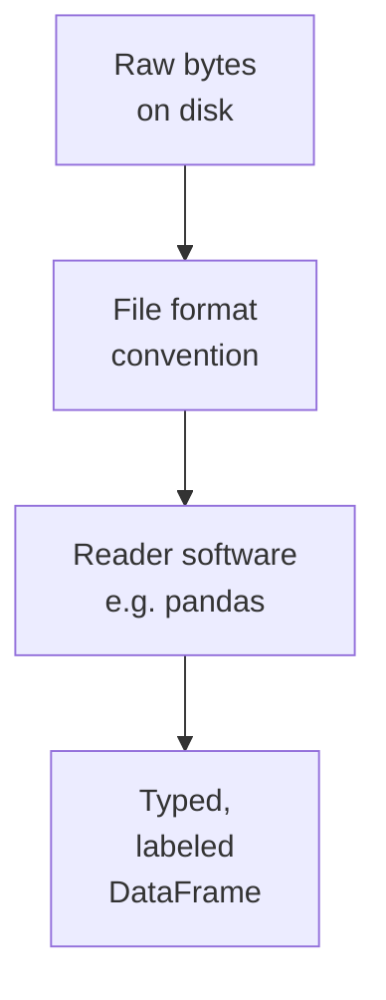

You can use Pandas productively for years without understanding
how the bits get from disk to memory. But a little mental
model of what is going on underneath will save you from
mysterious bugs, *why is this column a string when I expected
a number?*, and it will make the rest of the course feel less
like magic.

<Figure
  slug="pandas-how-computers-see-data-cutout"
  alt="How computers see data, an isometric illustration"
/>

## A computer only knows numbers

At the lowest level, every byte your computer stores is a number
between 0 and 255. There are no strings, no dates, no
booleans, no DataFrames, just bytes.

<Figure
  slug="pandas-how-computers-see-data-inline-cutout"
  alt="A written record on paper being translated into a strip of coded cells beside it"
  caption="Anything you store has to become numbers before a computer can hold it."
/>

The trick is **interpretation**. The same eight bits can mean a
small integer, a character of text, a fraction of a pixel
color, or a step in an audio waveform. The interpretation is
imposed by the program that reads them.

Files on disk are *long sequences of bytes plus a tiny bit of
metadata saying what kind of bytes they are* (the file
extension, sometimes a "magic number" at the start). The
sequence does not know it is a CSV until something reads it as
one.



## A CSV is plain text with commas

The simplest data format in the world, and the one this course leans
on: a CSV file holds **comma-separated values**. Each line is a row,
each value is separated by a comma, the first line is often a header.

<Figure
  slug="pandas-how-computers-see-data-csv-plain-text-inline-cutout"
  alt="A long paper ribbon of blank fields separated by small upright dividers"
  caption="A CSV file is only text plus a separator; the structure is a convention."
/>

```text
name,age,city
Aiko,29,Tokyo
Bilal,42,Karachi
Chen,35,Shanghai
```

That is literally a complete dataset. You could write it in
Notepad. Open it in Excel and it looks like a table. Open it in
Pandas and it looks like a DataFrame. The bytes on disk are
identical.

<Callout type="info" title="Why CSV is everywhere">
CSV's strengths: human-readable, tiny dependency footprint,
portable across every operating system and language since 1972.
Its weaknesses: no type information (everything is text until a
reader guesses), bad with commas inside values (which need
quoting), and no schema. Despite all of that, it is the most
widely exchanged tabular data format in the world.
</Callout>

## Types, what a byte "is"

When Pandas reads the CSV above, it does not just store
characters. It looks at each column and *guesses* a type:

- `name` → text (string).
- `age` → small integer.
- `city` → text.

This is called **type inference**, and it is the single most
common source of frustration for new Pandas users. Pandas
guesses well most of the time, but when it guesses wrong,
silent bugs follow.

<Figure
  slug="pandas-how-computers-see-data-types-byte-inline-cutout"
  alt="One small block shown in cross-section as eight tiny two-position switches"
  caption="A byte is eight switches, and the type is what tells pandas how to read them."
/>

The main types you will encounter:

| Pandas dtype | What it represents             | Example values            |
| ------------ | ------------------------------ | ------------------------- |
| `int64`      | Whole numbers                  | `1`, `42`, `-7`           |
| `float64`    | Decimal numbers (and NaNs)     | `3.14`, `1.5e9`, `NaN`    |
| `bool`       | True/False                     | `True`, `False`           |
| `object`     | Strings, or mixed types        | `"Aiko"`, `"Tokyo"`       |
| `datetime64` | Timestamps                     | `2024-03-18 14:00:00`     |
| `category`   | A fixed set of repeated labels | `"East"`, `"West"`        |

Let us see them in action.

<CodeBlock
  adapter="python"
  files={[
    {
      filename: "main.py",
      starterCode: `import pandas as pd
import io

csv_text = """name,age,city,joined
Aiko,29,Tokyo,2022-01-15
Bilal,42,Karachi,2019-07-03
Chen,35,Shanghai,2023-11-20
"""

# Read from the string as if it were a file
df = pd.read_csv(io.StringIO(csv_text))
display(df)
print()
print("Inferred types:")
print(df.dtypes)
`,
    },
  ]}
/>

Notice that `joined` came in as `object` (a plain string), not
as a date. Pandas is conservative, it does not assume a string
that *looks* like a date *is* a date. You can fix that:

<CodeBlock
  adapter="python"
  files={[
    {
      filename: "main.py",
      initCode: `import pandas as pd, io
csv_text = """name,age,city,joined
Aiko,29,Tokyo,2022-01-15
Bilal,42,Karachi,2019-07-03
Chen,35,Shanghai,2023-11-20
"""`,
      starterCode: `df = pd.read_csv(io.StringIO(csv_text), parse_dates=["joined"])
print(df.dtypes)
print()
display(df)
`,
    },
  ]}
/>

Now `joined` is `datetime64[ns]` and you can do date arithmetic
on it, sort chronologically, filter by year, compute the number
of days since onboarding. We will return to dates and times in
their own chapter.

## Memory layout: rows or columns?

Spreadsheets *display* data in rows and columns, but most
modern analytical systems, including Pandas, store data
**column by column** in memory. Why?

- All values in a column have the same type (all integers, all
  strings, all dates). That means they can be packed tightly
  and processed quickly.
- Most analytical queries touch a few columns of many rows
  (`mean of salary`, `count of department`), not many columns
  of a few rows. Column storage makes those queries fast.

A **row-store** (think: a notebook) keeps each *record* together:

```text
Aiko,  29, Tokyo
Bilal, 42, Karachi
Chen,  35, Shanghai
```

A **column-store** (Pandas, DuckDB, Parquet) keeps each *column* together:

```text
name: Aiko, Bilal, Chen
age:  29, 42, 35
city: Tokyo, Karachi, Shanghai
```

This is one of the reasons Pandas is fast on operations like
`df["age"].mean()`, it can stride through one contiguous
chunk of memory and skip the others entirely.

## The journey of `pd.read_csv("orders.csv")`

Walking through what happens when you call this seemingly
trivial line:

1. **Locate the file.** Pandas asks the operating system for
   the bytes at the given path (or, with a URL, asks the network
   library to fetch them over HTTPS).
2. **Read bytes.** A buffer of raw bytes is loaded into RAM.
3. **Decode text.** The bytes are interpreted as text using an
   encoding (usually UTF-8). If the encoding is wrong, you get
   the famous `'utf-8' codec can't decode byte` errors.
4. **Split into lines and cells.** Pandas's CSV parser walks
   through the buffer, splitting on newlines (rows) and commas
   (cells), respecting quotes.
5. **Infer types.** For each column, it samples values and
   guesses an appropriate dtype.
6. **Allocate columns.** Pandas reserves a contiguous block of
   memory per column, in the inferred type.
7. **Fill columns.** Each parsed value is written into its
   column's memory at the right row index.
8. **Build the DataFrame.** Wrap the columns with an Index
   (the row labels) and a list of column names. Return.

For a 1MB file this takes a few tens of milliseconds. For a 1GB
file it takes a few seconds. Pandas's CSV parser is one of the
most heavily optimized pieces of code in the library because
*everyone* calls it.

## What can go wrong in step 5

Type inference is where almost all Pandas surprises originate:

- A column with mostly numbers and one stray "N/A" gets inferred
  as `object` (string), because one non-number was found.
- A ZIP code column with values like `04210` gets inferred as
  `int64`, stripping the leading zero forever.
- A column of dates in `MM/DD/YYYY` format on a machine that
  expects `DD/MM/YYYY` silently swaps month and day.
- A boolean column written as `"true"`/`"false"` (lowercase)
  becomes `object`, not `bool`.

We will cover defensive reading in the *Loading Datasets*
chapter. For now, the lesson is just: **always check `df.dtypes`
after reading a new dataset.** It is two seconds of work that
saves hours later.

## A quick experiment

Let us deliberately confuse Pandas and watch it happen.

<CodeBlock
  adapter="python"
  files={[
    {
      filename: "main.py",
      starterCode: `import pandas as pd
import io

# Note the leading zero on the second ZIP code:
csv = """name,zip
Alice,04210
Bob,90210
Carol,02134
"""

df = pd.read_csv(io.StringIO(csv))
display(df)
print()
print("zip dtype:", df["zip"].dtype)
print("First zip:", df["zip"].iloc[0], "<-- lost the leading 0!")
`,
    },
  ]}
/>

To prevent this you can tell Pandas the type explicitly:

<CodeBlock
  adapter="python"
  files={[
    {
      filename: "main.py",
      initCode: `import pandas as pd, io
csv = """name,zip
Alice,04210
Bob,90210
Carol,02134
"""`,
      starterCode: `df = pd.read_csv(io.StringIO(csv), dtype={"zip": "string"})
display(df)
print()
print("zip dtype:", df["zip"].dtype)
print("First zip:", df["zip"].iloc[0], "<-- preserved!")
`,
    },
  ]}
/>

This is a real bug pattern in production analytics, the kind of
thing that costs careers when a "data cleaning" step quietly
corrupts the source data.

## Memory and your laptop

A 1-million-row DataFrame with 10 numeric columns is about 80
MB in memory (8 bytes per `float64` × 10 columns × 1M rows). A
typical laptop has 8–32 GB of RAM, so this is small. But:

- A 100M-row × 50-column dataset is ~40 GB, too big.
- Strings (`object` dtype) take *much* more memory per value
  than numbers because each string is a separate Python object.
- Lots of duplication in a string column can be collapsed by
  converting to `category` dtype.

We will look at memory in detail later. For now, just know
that Pandas lives **entirely in RAM**, which is both its
biggest strength (instant access, no I/O) and its biggest
limitation (your dataset must fit).

## Check your understanding

<MultipleChoice
  markdown={`A CSV file on disk is, at the lowest level:

- [o] A sequence of bytes (typically interpreted as text) with rows separated by newlines and values separated by commas
  > CSV is plain text. The "table-ness" is imposed by whatever reader (Excel, Pandas, etc.) interprets the bytes.
- A spreadsheet
  > A spreadsheet is a binary format maintained by application software; a CSV is plain text that any editor can open without special software.
- A binary database table
  > Database tables are stored in proprietary binary formats with type metadata; a CSV is plain text with no type information.
- A proprietary Pandas format
  > Pandas has no proprietary on-disk format for reading; \`pd.read_csv()\` reads the universal plain-text CSV format, not something Pandas invented.

This is why CSV files are portable across every OS, language, and tool.`}
/>

<MultipleChoice
  markdown={`Why might Pandas read a ZIP code column like \`04210\` as the integer \`4210\`?

- Pandas has a bug
  > Type inference that converts digit-only strings to integers is documented and intentional behavior; leading-zero loss is the expected consequence of integer representation.
- The CSV file is corrupted
  > The CSV contains the text \`04210\`; the file is intact. The loss of the leading zero happens during type inference, not during file reading.
- ZIP codes are not real data
  > ZIP codes are valid data; the chapter uses them as an example precisely because they are real and frequently mishandled by automatic type inference.
- [o] Pandas inferred the column as \`int64\` (because all values look like integers) and integers cannot have leading zeros, the \`0\` is dropped silently
  > This is the canonical example of type inference biting you. Fix it by passing \`dtype={"zip": "string"}\` to \`pd.read_csv()\`.

Always check \`df.dtypes\` after loading; it is the cheapest bug-prevention habit you can build.`}
/>

<MultipleChoice
  markdown={`Why does Pandas store data column-by-column rather than row-by-row?

- [o] All values in a column share a type, which allows tight packing and fast operations; analytical queries also tend to scan a few columns of many rows
  > Column-store layouts are the standard for analytical systems (Pandas, Parquet, DuckDB, ClickHouse, BigQuery). Row-stores are better for transactional databases that touch one row at a time.
- Pandas was invented after rows existed
  > The chronology of rows versus columns is irrelevant; Pandas chose column storage for the analytical performance advantage it provides.
- It is required by Python
  > Python itself has no storage-layout requirement; Pandas chose columnar storage for performance reasons.
- It uses less disk space
  > Column-oriented storage has disk-space benefits in some formats (e.g., Parquet), but the chapter's explanation focuses on memory efficiency and query speed, not general disk savings.

Understanding column orientation explains why \`df["age"].mean()\` is fast and why memory usage scales by column rather than by row.`}
/>

<MultipleChoice
  markdown={`A column containing the values \`"true"\`, \`"false"\`, \`"true"\` is loaded by Pandas. What dtype is it most likely to get by default?

- [o] \`object\` (Python strings)
  > Pandas does not auto-recognize lowercase \`"true"\` / \`"false"\` as booleans (it has done so in some versions for \`True\`/\`False\`, but not reliably). You need to convert explicitly with \`df["col"].map({"true": True, "false": False})\` or \`astype("bool")\` after cleaning.
- \`bool\`
  > Pandas does not reliably auto-detect lowercase string values \`"true"\`/\`"false"\` as booleans during CSV reading; they remain plain strings (\`object\` dtype).
- \`int64\`
  > The values are the strings \`"true"\` and \`"false"\`, not digits; there is nothing for integer inference to parse.
- \`category\`
  > Pandas does not automatically infer \`category\` dtype; it requires an explicit \`dtype="category"\` argument or a subsequent \`astype("category")\` call.

Booleans-as-strings are a common surprise; defensive type checking catches them.`}
/>
