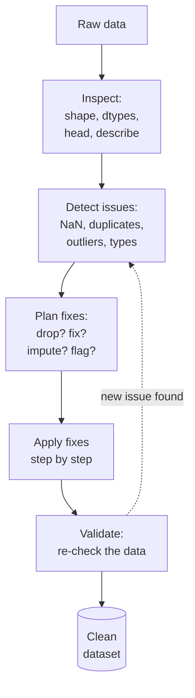

Textbook datasets are clean. Real datasets are not. This
chapter is a map of the messy territory we will spend the next
several pages exploring.

<svg
  viewBox="0 0 640 230"
  role="img"
  aria-label="A data grid showing the classic messes at once — a missing cell haloed in yellow, a glaring red wrong value, and two suspiciously identical rows of green dots"
  style={{ display: "block", width: "100%", maxWidth: "640px", height: "auto", margin: "2.5rem auto" }}
>
  <g fill="currentColor" opacity="0.12">
    <rect x="170" y="50" width="54" height="26" rx="5" />
    <rect x="294" y="50" width="54" height="26" rx="5" />
    <rect x="356" y="50" width="54" height="26" rx="5" />
    <rect x="418" y="50" width="54" height="26" rx="5" />
    <rect x="170" y="86" width="54" height="26" rx="5" />
    <rect x="232" y="86" width="54" height="26" rx="5" />
    <rect x="356" y="86" width="54" height="26" rx="5" />
    <rect x="418" y="86" width="54" height="26" rx="5" />
    <rect x="170" y="122" width="54" height="26" rx="5" />
    <rect x="232" y="122" width="54" height="26" rx="5" />
    <rect x="294" y="122" width="54" height="26" rx="5" />
    <rect x="356" y="122" width="54" height="26" rx="5" />
    <rect x="418" y="122" width="54" height="26" rx="5" />
    <rect x="170" y="158" width="54" height="26" rx="5" />
    <rect x="232" y="158" width="54" height="26" rx="5" />
    <rect x="294" y="158" width="54" height="26" rx="5" />
    <rect x="356" y="158" width="54" height="26" rx="5" />
    <rect x="418" y="158" width="54" height="26" rx="5" />
  </g>
  <g style={{ color: "var(--ds-red-500)" }} fill="currentColor">
    <rect x="232" y="50" width="54" height="26" rx="5" fillOpacity="0.6" />
  </g>
  <g style={{ color: "var(--ds-yellow-500)" }} fill="currentColor">
    <circle cx="321" cy="99" r="20" fillOpacity="0.2" />
    <circle cx="321" cy="99" r="5" fillOpacity="0.9" />
  </g>
  <g style={{ color: "var(--ds-green-500)" }} fill="currentColor">
    <circle cx="197" cy="135" r="4" />
    <circle cx="321" cy="135" r="4" />
    <circle cx="445" cy="135" r="4" />
    <circle cx="197" cy="171" r="4" />
    <circle cx="321" cy="171" r="4" />
    <circle cx="445" cy="171" r="4" />
  </g>
  <g fill="currentColor" opacity="0.3">
    <circle cx="510" cy="142" r="2.5" />
    <circle cx="510" cy="156" r="2.5" />
    <circle cx="510" cy="170" r="2.5" />
  </g>
</svg>

## What "messy" actually means

A messy dataset suffers from one or more of:

| Mess                       | Example                                          |
| -------------------------- | ------------------------------------------------ |
| **Missing values**         | NaN, empty strings, `"N/A"`, `"-"`, `0`-as-null  |
| **Duplicates**             | Same logical row recorded twice                  |
| **Inconsistent categories**| `"USA"`, `"U.S."`, `"United States"`             |
| **Inconsistent casing**    | `"Sales"`, `"sales"`, `"SALES"`                  |
| **Typos**                  | `"Engineering"`, `"Enginering"`                  |
| **Wrong types**            | Numbers stored as strings, ZIPs as ints          |
| **Bad encodings**          | `"Cafe\u00e9"` printing as `"Café"`                 |
| **Outliers / impossibles** | Age of 200; salary of $999,999,999               |
| **Sentinel values**        | `-1`, `0`, or `9999` used to mean "missing"      |
| **Date format chaos**      | `"3/4/24"` (US? UK?), `"2024-03-04"`, etc.       |
| **Trailing whitespace**    | `" Sales "` vs `"Sales"`                         |
| **Inconsistent units**     | Some prices in USD, some in cents, some in EUR   |
| **Grain confusion**        | One-row-per-customer mixed with one-row-per-order|

Almost every real-world dataset has *several* of these. The
analyst's job is to detect them, decide what to do, and document
what you did.

## A canonical workflow

The loop is the important part. *Validation often reveals
issues that detection missed*, so cleaning is iterative.

## Three classes of problem, three classes of response

A useful taxonomy:

### 1. *Wrong* data → fix it

If you can correct the value, do it: parse a date string,
normalize a category, coerce a string-number to a number.

### 2. *Missing* data → decide

You usually have four choices:

- **Drop** rows with missing values.
- **Drop** the whole column if it is mostly missing.
- **Impute** — fill in a plausible value (mean, median, 0, a
  flag, or a predicted value).
- **Keep as NaN** and ensure downstream code handles it.

The right choice depends on *why* the value is missing and
*what* the downstream use is. We will look at this in detail.

### 3. *Suspect* data → flag

When you cannot tell whether a value is wrong but it looks
weird, flag it rather than silently fixing or dropping. A
column like `is_outlier` lets reviewers see what you noticed.

<Callout type="info" title="The most important habit">
**Never modify the raw data file.** Always keep your raw input
untouched and write your cleaning as code that transforms raw →
clean. If your cleaning was wrong, you can re-run it; if you
overwrote the raw file, you cannot.
</Callout>

## A taste of every flavor of mess

The following toy dataset has at least one example of nearly
every problem in the table above. Read it carefully and try to
spot each issue before reading on.

<CodeBlock
  adapter="python"
  files={[
    {
      filename: "main.py",
      starterCode: `import pandas as pd
import numpy as np

messy = pd.DataFrame(
    {
        "customer_id": [1, 2, 3, 4, 5, 5, 6, 7, 8],
        "name": [
            "Aiko",
            "Bilal",
            "chen ",
            "DIEGO",
            "Eve",
            "Eve",
            "Farah",
            None,
            "Hana",
        ],
        "country": [
            "USA",
            "U.S.A.",
            "United States",
            "USA",
            "UK",
            "UK",
            "uk",
            "USA",
            "U.S.",
        ],
        "signup_date": [
            "2024-01-15",
            "2024/02/03",
            "2024-02-29",
            "03/04/2024",
            None,
            None,
            "2024-03-30",
            "2024-04-01",
            "??",
        ],
        "spend": ["100", "200", "300", "abc", "-50", "-50", "9999999", "150", ""],
        "tier": [
            "gold",
            "silver",
            "gold",
            "bronze",
            "silver",
            "silver",
            "gold",
            "silver",
            None,
        ],
    }
)

print(messy)
print()
print(messy.dtypes)
`,
    },
  ]}
/>

What did you spot?

- **Duplicate row** (customer 5 appears twice).
- **Whitespace** ("chen ").
- **Casing** ("DIEGO", "uk").
- **Country inconsistency** (USA / U.S.A. / United States / U.S.).
- **Date format chaos** (ISO, slash, MM/DD).
- **A date worth double-checking** (`2024-02-29` looks like a typo
  but is real — 2024 is a leap year; a value like Feb 30 would be
  the kind that *looks* fine but breaks).
- **`spend` as strings** (because `"abc"` and `""` poison the
  type inference).
- **`spend` outlier** (9,999,999 is probably wrong).
- **`spend` negatives** (refunds? data entry?).
- **Missing `name`** (None).
- **Sentinel `"??"`** in a date column.
- **Missing `tier`** (None).

In other words: a single 9-row dataset already has roughly a
dozen problems.

## Walking through a small clean

A taste — we will not fix everything here, just demonstrate the
pattern.

<CodeBlock
  adapter="python"
  files={[
    {
      filename: "main.py",
      initCode: `import pandas as pd
import numpy as np
messy = pd.DataFrame({
    "customer_id": [1, 2, 3, 4, 5, 5, 6, 7, 8],
    "name":        ["Aiko", "Bilal", "chen ", "DIEGO", "Eve", "Eve", "Farah", None, "Hana"],
    "country":     ["USA", "U.S.A.", "United States", "USA", "UK", "UK", "uk", "USA", "U.S."],
    "signup_date": ["2024-01-15","2024/02/03","2024-02-29","03/04/2024",None,None,"2024-03-30","2024-04-01","??"],
    "spend":       ["100", "200", "300", "abc", "-50", "-50", "9999999", "150", ""],
    "tier":        ["gold","silver","gold","bronze","silver","silver","gold","silver",None],
})`,
      starterCode: `clean = (
    messy
    # 1. Drop duplicates
    .drop_duplicates()
    # 2. Normalize name: strip whitespace, title-case
    .assign(name=lambda x: x["name"].str.strip().str.title())
    # 3. Normalize country: uppercase + map variants
    .assign(
        country=lambda x: (
            x["country"]
            .str.upper()
            .replace({"U.S.A.": "USA", "U.S.": "USA", "UNITED STATES": "USA"})
        )
    )
    # 4. Parse dates — bad values become NaT
    .assign(
        signup_date=lambda x: pd.to_datetime(
            x["signup_date"], errors="coerce", format="mixed"
        )
    )
    # 5. Coerce spend to numeric — bad values become NaN
    .assign(spend=lambda x: pd.to_numeric(x["spend"], errors="coerce"))
    # 6. Flag suspicious spend values
    .assign(spend_suspicious=lambda x: (x["spend"] < 0) | (x["spend"] > 1_000_000))
)

print(clean)
print()
print(clean.dtypes)
`,
    },
  ]}
/>

The remaining mess (missing names, suspicious spends) is now
*flagged* and *typed* — we can decide what to do with each in
later analysis steps.

## The cleaning manifesto

Three principles to internalize:

1. **Preserve the raw.** Never overwrite the source file. Your
   raw → clean pipeline should be a function of the raw input.
2. **Document every decision.** Each cleaning step should have a
   comment explaining *why*. Not for show — for the next
   analyst, who is often you in three months.
3. **Make every step a small testable transformation.** Avoid
   one giant cleaning blob; break it into named steps so you can
   re-run from any point.

## Check your understanding

<MultipleChoice
  markdown={`Why does the chapter recommend **never** overwriting your raw data file with the cleaned version?

- It is a Pandas requirement
  > Pandas imposes no constraint on whether you overwrite files; the recommendation is an analytical best practice, not a library rule.
- Raw files are bigger
  > File size is not the reason; the issue is reversibility — you cannot re-derive the raw data from the cleaned version.
- [o] If your cleaning is wrong, you can re-run from the untouched raw input; if you overwrote it, you cannot recover the original
  > Raw input is sacred; cleaning is code; the clean version is derived. This is the foundation of reproducible analysis.
- Raw files are encrypted
  > Encryption is unrelated to this recommendation; the rationale is reproducibility and recoverability, not security.

This is among the most important professional habits in data work.`}
/>

<MultipleChoice
  markdown={`A column contains \`"USA"\`, \`"U.S.A."\`, \`"United States"\`, and \`"U.S."\` — all meaning the same country. What is the best one-word description?

- Duplicate values
  > Duplicate values are repeated rows; here the values are not repeated — each variant appears in a different row and means the same thing under different spellings.
- Missing values
  > No values are absent; every row has a country entry. The problem is that the same country is spelled four different ways.
- [o] Inconsistent categories
  > The values are *semantically* the same but *syntactically* different. This is one of the most common forms of mess and almost always requires explicit cleanup.
- Wrong types
  > The column is correctly typed as \`object\` (string); the issue is semantic inconsistency within the strings, not a dtype problem.

A canonical mapping (\`"U.S."\` → \`"USA"\`, etc.) is the typical fix.`}
/>

<MultipleChoice
  markdown={`What does the chapter mean by the "flag" approach to suspect data?

- Removing the rows
  > Removing rows discards data that might be valid; the flag approach retains all information and lets the reviewer decide later.
- Replacing the values with NaN
  > Replacing with NaN loses the original value permanently; flagging preserves it while marking the suspicion.
- [o] Keeping the original values but adding a boolean column that marks them as suspicious, so reviewers can see your judgment without losing information
  > Flagging is the least-destructive option — perfect when you are not 100% sure whether a value is wrong.
- Coloring the cells
  > Cell color is a visual formatting trick that does not persist in a CSV or DataFrame and cannot be queried programmatically.

Flagging preserves information while making your suspicions explicit and testable.`}
/>
