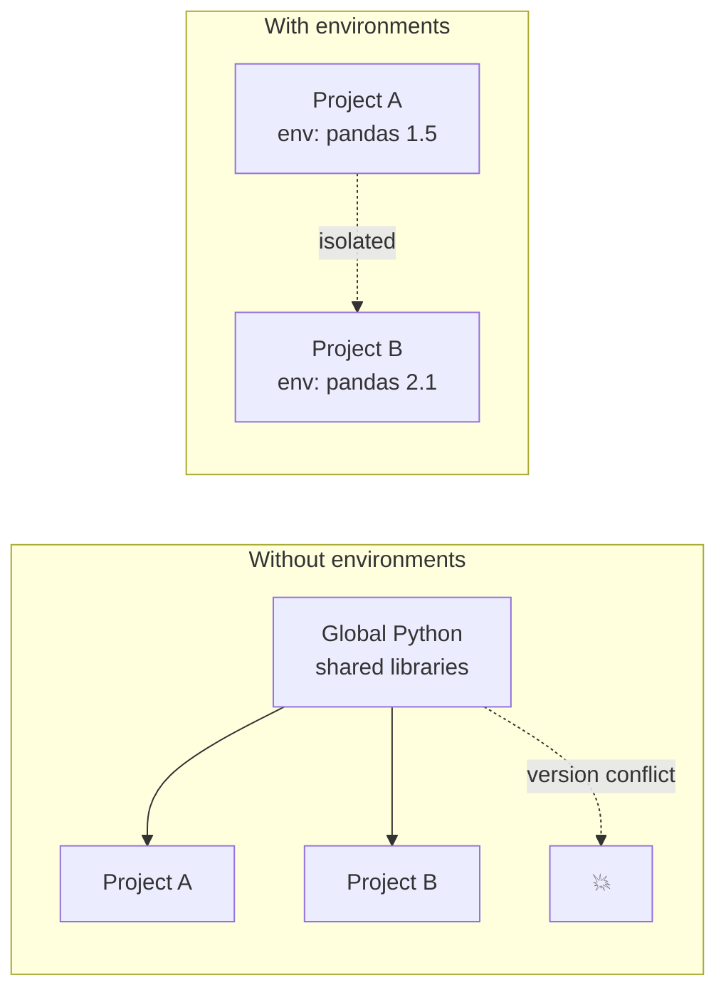
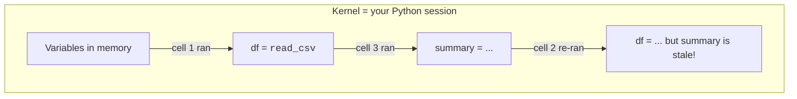

You will write Python code on Dataslope without ever installing
anything. That is wonderful for learning, but in a real job you
will eventually have to deal with **environments**, **packages**,
and **notebooks** on your own machine. This chapter is a
conceptual primer so the vocabulary is not foreign when you meet
it.

<svg
  viewBox="0 0 640 240"
  role="img"
  aria-label="A notebook page of alternating cells, blue code blocks each followed by their green output, one of which is a tiny chart, with small yellow run triangles down the margin"
  style={{ display: "block", width: "100%", maxWidth: "560px", height: "auto", margin: "2.5rem auto" }}
>
  <rect x="180" y="25" width="280" height="195" rx="14" fill="currentColor" opacity="0.07" />
  <g style={{ color: "var(--ds-blue-500)" }} fill="currentColor">
    <rect x="205" y="45" width="230" height="34" rx="8" fillOpacity="0.12" />
    <rect x="218" y="58" width="90" height="8" rx="4" fillOpacity="0.7" />
    <rect x="316" y="58" width="50" height="8" rx="4" fillOpacity="0.45" />
  </g>
  <g style={{ color: "var(--ds-green-500)" }} fill="currentColor">
    <rect x="218" y="90" width="70" height="8" rx="4" fillOpacity="0.7" />
  </g>
  <g style={{ color: "var(--ds-blue-500)" }} fill="currentColor">
    <rect x="205" y="110" width="230" height="34" rx="8" fillOpacity="0.12" />
    <rect x="218" y="123" width="60" height="8" rx="4" fillOpacity="0.7" />
    <rect x="286" y="123" width="80" height="8" rx="4" fillOpacity="0.45" />
  </g>
  <g style={{ color: "var(--ds-green-500)" }} fill="currentColor">
    <rect x="218" y="160" width="10" height="16" rx="2" fillOpacity="0.8" />
    <rect x="232" y="168" width="10" height="8" rx="2" fillOpacity="0.8" />
    <rect x="246" y="154" width="10" height="22" rx="2" fillOpacity="0.8" />
  </g>
  <g style={{ color: "var(--ds-blue-500)" }} fill="currentColor">
    <rect x="205" y="186" width="230" height="24" rx="8" fillOpacity="0.12" />
    <rect x="218" y="194" width="70" height="8" rx="4" fillOpacity="0.5" />
  </g>
  <g style={{ color: "var(--ds-yellow-500)" }} fill="currentColor">
    <polygon points="187,56 187,68 197,62" />
    <polygon points="187,121 187,133 197,127" />
    <polygon points="187,192 187,204 197,198" />
  </g>
</svg>

<Callout type="info" title="What this chapter is not">
This chapter is not a hands-on setup guide. We will not ask you
to install anything. Dataslope already gives you a working Python
environment for every code block. The goal here is just to
explain *what* those environments are and why they exist.
</Callout>

## Scripts vs notebooks

Two main ways to write analytical Python in the real world:

### Scripts (`.py` files)

A single file of Python code that runs top to bottom. You execute
it with `python my_script.py`. Scripts are great for:

- Recurring jobs (a "refresh the weekly report" task).
- Code that other code imports.
- Anything that runs in production.
- Anything you want to version-control cleanly (a `.py` is just
  text, git loves it).

### Notebooks (`.ipynb` files)

A document made of *cells*. Each cell holds either prose
(Markdown) or code. You run cells one at a time, and the output
of each cell, text, tables, plots, is displayed *inline*. The
notebook saves the code, the output, and the prose together.

Notebooks are great for:

- Exploratory analysis where you do not know what step comes
  next.
- Tutorials, walkthroughs, and shareable analyses.
- Anything that produces interesting plots you want to keep next
  to the code that made them.

- A **script** (`my_script.py`) runs top to bottom; output goes to
  the console or to files.
- A **notebook** (`analysis.ipynb`) runs cell by cell,
  interactively, and keeps each output right beside the code that
  produced it.

The dominant notebook tool today is **Jupyter** (formerly IPython
Notebook). Variants include JupyterLab, VS Code's notebook view,
Google Colab, and the playground you are using right now.

### When to use which

| Situation                                  | Prefer    |
| ------------------------------------------ | --------- |
| One-off exploration                        | Notebook  |
| Sharing an analysis with a colleague       | Notebook  |
| Scheduled / production / repeated job      | Script    |
| Importing as a library                     | Script    |
| Polished, reviewed engineering code        | Script    |
| Stepping through a model interactively     | Notebook  |

Mature teams often start in notebooks and *migrate* to scripts
once the analysis stabilizes.

## What a Python "environment" is

When you install Python on your laptop, you get an *interpreter*
(the `python` command) and a *library directory* where third-party
packages live. By default, every project on your machine shares
that one library directory.

This is fine for the first project. Then:

- Project A needs `pandas==1.5` because of a deprecated function
  it depends on.
- Project B needs `pandas==2.1` because of a new feature.
- They cannot coexist in the shared directory.

The solution is a **virtual environment**, a separate, isolated
library directory per project. Tools that create them:

- **`venv`**, built into Python. Standard, no-frills.
- **`virtualenv`**, the original, still widely used.
- **`conda`**, also manages non-Python dependencies (compilers,
  C libraries). Popular in data science because many scientific
  packages need C libraries.
- **`uv`** / **`poetry`** / **`pipenv`**, newer tools that add
  lockfiles and dependency management.



Inside an environment you install packages with `pip install
pandas` (or `conda install pandas` for the conda flavor). The
package and its dependencies go into the environment's local
directory.

## Packages, `pip`, and `requirements.txt`

Python's package ecosystem is on the **PyPI** index, over 500,000
packages, available with one `pip install` command.

A `requirements.txt` file is a plain-text list of the packages a
project needs:

```text
pandas==2.2.0
numpy>=1.26
matplotlib==3.8.2
plotly==5.18.0
scikit-learn==1.4.0
```

Anyone who clones your project can run `pip install -r
requirements.txt` and end up with the same package versions you
used. **This is the most important reproducibility tool you have.**
Without it, "the code works on my machine" becomes a daily
reality.

<Callout type="info" title="Lockfiles are even better">
A `requirements.txt` pins your *direct* dependencies, but those
packages themselves pull in dozens of *transitive* dependencies
whose versions are not pinned. A **lockfile** (`poetry.lock`,
`uv.lock`, `pip-tools` outputs) pins every transitive version,
producing bit-for-bit reproducible installs. For serious work,
prefer lockfiles.
</Callout>

## A notebook anatomy

When you open a Jupyter notebook you see:

- **A toolbar** with run, stop, restart kernel, save.
- **A kernel**, the long-running Python process that holds your
  variables in memory.
- **Cells**, blocks of code or Markdown.

The kernel is the key concept. Every cell you run *modifies the
state of the kernel*. If you define `df` in cell 5 and then run
cell 5 a second time after changing the upstream cells, the value
of `df` may not be what you expect.

A common notebook bug:

1. You write cells in order: 1, 2, 3.
2. You re-run cell 2 after editing it.
3. You forget to re-run cell 3.
4. Cell 3's output is now stale, the variable it shows was
   computed *before* your edit.

The cure is to occasionally **restart the kernel and run all
cells**. If your notebook does not run cleanly top to bottom,
something is wrong.



## Reproducibility, three layers deep

Reproducibility is a layered concept. A truly reproducible
analysis pins:

1. **Code**, version-controlled in git.
2. **Data**, either stored alongside the code or referenced by
   a stable URL.
3. **Environment**, a `requirements.txt` or lockfile capturing
   every package version.
4. **Runtime**, sometimes even the Python version itself
   (`.python-version`) and the OS (Docker).

Most working analysts get layers 1 and 3 right and ignore 2 and
4. That is good enough for many situations but not for regulated
industries (pharma, finance, healthcare).

## What Dataslope handles for you

For the entirety of this course:

- The Python interpreter is **Pyodide**, a build of CPython 3.14
  compiled to WebAssembly. It runs inside your browser.
- The package set is fixed and curated, pandas, NumPy, SciPy,
  matplotlib, plotly, scikit-learn, and others.
- There are no virtual environments to create, no `pip install`
  to run.
- The "kernel" is one short-lived Pyodide instance per code
  block. (That is why variables do not persist across blocks.)

When you graduate to your own laptop, you will recreate the
above with:

- A `venv` or `conda` environment.
- A `pip install pandas numpy matplotlib plotly scikit-learn`.
- A Jupyter notebook (`pip install jupyter && jupyter lab`).

The skills transfer directly.

## Check your understanding

<MultipleChoice
  markdown={`Why do experienced analysts use **virtual environments**?

- To make Python run faster
  > Virtual environments are isolated package directories; they do not affect interpreter speed or CPU performance.
- To use more memory
  > Each virtual environment contains its own copy of installed packages, which can use slightly more disk space, but memory usage is not the motivation.
- [o] To isolate each project's package versions so that incompatible dependencies in different projects do not conflict
  > Without virtual environments, two projects that need different versions of the same package will collide. Environments give each project its own package directory.
- To prevent code from being copied
  > Virtual environments have no access-control or copy-protection features; they are purely an isolation mechanism for package versions.

Once you have been bitten by a version conflict, you become a virtual environment evangelist for life.`}
/>

<MultipleChoice
  markdown={`What is the role of a \`requirements.txt\` file?

- It contains the data for an analysis
  > Data lives in files like CSV or Parquet; \`requirements.txt\` is a plain-text list of Python package names and version pins, not data.
- It lists the columns of a DataFrame
  > DataFrame columns are part of a dataset loaded at runtime; \`requirements.txt\` is a static project file listing installable packages.
- [o] It records the package versions a project depends on, so a collaborator can install the same versions and reproduce the environment
  > It is the simplest form of dependency pinning. Anyone with the repo can run \`pip install -r requirements.txt\` and get a matching environment.
- It is a Pandas configuration file
  > Pandas configuration is done at runtime via \`pd.options\`; \`requirements.txt\` is a pip dependency file that exists outside of Python entirely.

Lockfiles take this one step further by pinning transitive dependencies too.`}
/>

<MultipleChoice
  markdown={`What is the **kernel** in a Jupyter notebook?

- A type of cell
  > Cells are the individual code or Markdown blocks in a notebook; the kernel is the separate Python process that *executes* those code cells.
- A plot
  > Plots are outputs produced by cells; the kernel is the underlying Python process responsible for running the code that generates those outputs.
- [o] The long-running Python process that holds your variables in memory and executes the cells you run
  > Every cell run mutates the kernel's state. Many notebook bugs come from running cells out of order or forgetting to re-run a dependent cell.
- A configuration file
  > Configuration files store settings on disk; the kernel is a live Python process in memory that keeps state across all the cells you run.

Restart-and-run-all is a wonderful habit; if your notebook does not run cleanly top to bottom, something is silently broken.`}
/>

<MultipleChoice
  markdown={`Which combination of artifacts gets you closest to a **reproducible** analysis?

- The DataFrame's column names
  > Column names are part of the data structure, not an artifact that lets someone reproduce an analysis from scratch on a new machine.
- The kernel's memory dump
  > A memory dump captures in-memory state but is not portable or reproducible, the next person cannot simply load a memory dump and re-run the analysis.
- [o] Code in git + data with a stable reference + a pinned environment (\`requirements.txt\` or lockfile)
  > Code, data, and environment together let someone else reproduce your work months or years later.
- A screenshot of the notebook
  > A screenshot shows outputs but not the code that produced them, and it cannot be re-run, it is documentation, not a reproducibility artifact.

Forgetting any of the three usually breaks reproducibility in subtle ways.`}
/>
